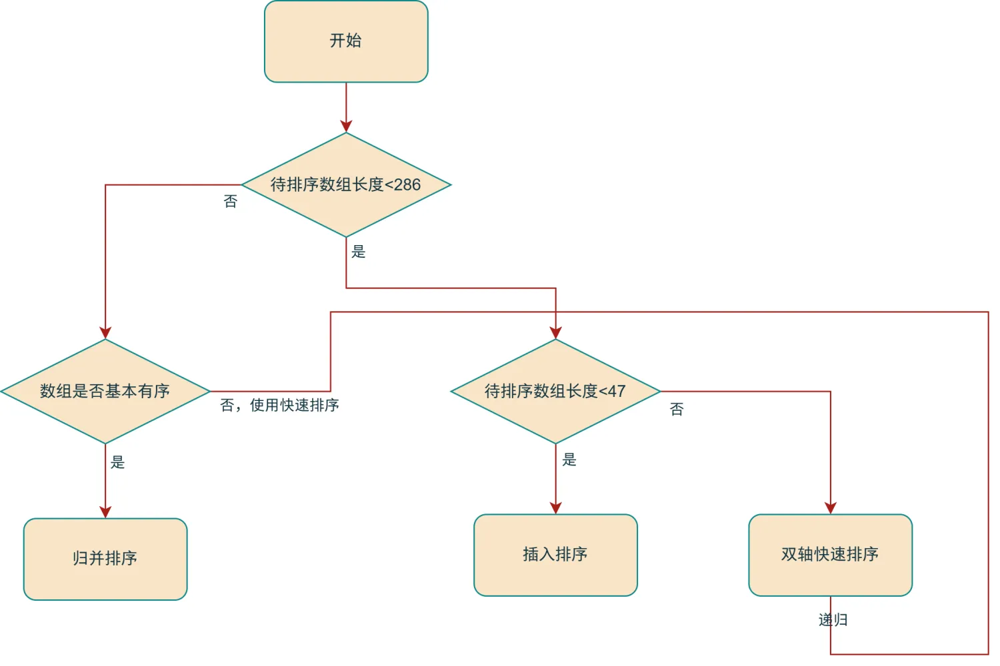

# 探寻快速排序的局限性及其优化策略

## 一. 快速排序之局限

快速排序的平均时间复杂度为O(nlogn)。其核心步骤是：先从待排序数组中选定一个元素作为基准（pivot），通过一趟排序将数组分成两部分，使得左边部分的元素都小于等于基准元素，右边部分的元素都大于等于基准元素；接着对划分后的左右子数组分别递归进行上述操作，即再次选择基准元素划分子数组，持续此过程，直至子数组长度为或，此时整个数组变为有序状态。

然而，快速排序的性能与基准元素的选取策略紧密相关。若始终选取第一个或最后一个元素作为基准，当输入数组恰好有序或逆序时，每次划分都会得到极不均衡的两个子数组，其中一个子数组可能为空，另一个子数组则几乎包含所有剩余元素。这将导致快速排序退化为类似冒泡排序的操作，时间复杂度从平均的恶化为 O(n²)。此时，第三方攻击者可能进行复杂度攻击，他们刻意构造有序或逆序的输入数据，使快速排序算法陷入最坏情况的执行路径，导致算法效率急剧下降。这在对性能要求极高且涉及安全敏感的场景中，可能引发严重问题。

## 二. 优化策略的多维探索

### 2.1 基准优化的关键举措

**随机基准**：随机选择基准元素可以减少最坏情况的发生概率。在快速排序中，基准元素的选择对算法的性能有很大影响。如果每次都选择固定位置的元素作为基准，例如数组的第一个元素，在某些特殊情况下可能会导致算法的时间复杂度退化为 。而随机选择基准元素可以使算法在不同的输入情况下更加均衡，减少出现极端情况的可能性。

例如，在某些极端情况下，如果输入的数组已经是有序的，并且每次都选择第一个元素作为基准，那么快速排序就会退化为冒泡排序，每次只能确定一个元素的位置，时间复杂度为 O(n²)。而通过随机选择基准元素，可以打破这种有序性，使得算法能够更好地发挥分治的优势，平均时间复杂度为 O(n log n)。

**三数取中**：选择数组的第一个元素、最后一个元素和中间元素中的中位数作为基准。这种方法可以避免选择到极端值作为基准，从而提高算法的稳定性。具体实现时，可以先比较第一个元素、最后一个元素和中间元素的大小，然后选择中间值作为基准。

例如，对于数组 [8, 1, 4, 9, 6, 3, 5, 2, 7, 0]，首先确定第一个元素为 8，最后一个元素为 0，中间元素为 6。比较这三个元素的大小，得到 0 < 6 < 8，所以选择 6 作为基准元素。这样可以避免选择到 8 或 0 这样的极端值，使得划分更加均衡。

### 2.2 双轴快排的优势剖析

双轴快速排序（Dual - Pivot Quicksort）是快速排序的一种改进形式。其核心思想仍然是基于分治策略，通过选择两个枢轴（pivot）元素将数组划分为三个部分，使得数组元素的分布更加均匀，从而减少在最坏情况下的时间复杂度退化风险，提高排序效率。

#### 2.2.1 双轴快排的原理与流程

双轴快速排序会从数组中选择两个枢轴元素。一种常见的选择方法是选择数组的第一个元素和最后一个元素作为枢轴。例如，对于数组`int[] arr = {3, 7, 1, 9, 5}`，可能会选择`3`（第一个元素）和`5`（最后一个元素）作为枢轴。这种选择方式简单直观，但也可以采用更复杂的策略来选择枢轴，以更好地适应不同的数据分布。

**第一次划分**：以两个枢轴为基准，将数组中的元素划分为三个部分：小于第一个枢轴的元素集合、介于两个枢轴之间的元素集合、大于第二个枢轴的元素集合。例如，对于数组`{3, 7, 1, 9, 5}`，假设选择`3`和`5`作为枢轴。在划分过程中，通过比较元素与枢轴的大小，可能会得到划分后的结果为`{1} {3, 5} {7, 9}`。具体的划分过程是从数组两端开始向中间扫描，将小于第一个枢轴的元素移到左边，大于第二个枢轴的元素移到右边。

**递归划分**：对划分后的三个部分分别进行递归排序。由于每个部分的元素数量相对原数组可能更均匀，因此可以有效避免像单轴快速排序那样在最坏情况下（如数组已经有序）时间复杂度退化为。对于上面划分后的结果`{1} {3, 5} {7, 9}`，会分别对`{1}`、`{3, 5}`和`{7, 9}`进行递归排序。`{1}`和`{7, 9}`因为只有一个或两个元素，本身已经有序或者很容易排序，而对于`{3, 5}`可以继续进行双轴快速排序或者采用简单的排序方法（如插入排序）来完成排序。

#### 2.2.2 用 Java 实现一个基础的双轴快排

```java
package cn.bigcoder.trpcdemo.provider.domain;

import java.util.Arrays;

public class DualPivotQuickSort {

    public static void dualPivotQuickSort(int[] arr, int left, int right) {
        if (left < right) {
            // 选择两个枢轴，并进行划分操作
            int[] pivots = partition(arr, left, right);
            int pivot1 = pivots[0];
            int pivot2 = pivots[1];

            // 对小于第一个枢轴的子数组进行递归排序
            dualPivotQuickSort(arr, left, pivot1 - 1);
            // 对介于两个枢轴之间的子数组进行递归排序
            dualPivotQuickSort(arr, pivot1 + 1, pivot2 - 1);
            // 对大于第二个枢轴的子数组进行递归排序
            dualPivotQuickSort(arr, pivot2 + 1, right);
        }
    }

   /**
     * 双轴快速排序的分区函数
     * @param arr 待排序的数组
     * @param left 左边界索引
     * @param right 右边界索引
     * @return 返回两个枢轴的最终位置
     */
    private static int[] partition(int[] arr, int left, int right) {
        // 确保左枢轴小于右枢轴
        if (arr[left] > arr[right]) {
            swap(arr, left, right);
        }

        int pivot1 = arr[left];  // 左枢轴
        int pivot2 = arr[right]; // 右枢轴

        int i = left + 1;  // 小于左枢轴的元素的右边界
        int j = right - 1; // 大于右枢轴的元素的左边界
        int k = left + 1;  // 当前遍历的元素索引

        // 遍历数组，将元素分到三个区域
        while (k <= j) {
            if (arr[k] < pivot1) {
                // 当前元素小于左枢轴，移到左侧
                swap(arr, i, k);
                i++;
            } else if (arr[k] >= pivot2) {
                // 当前元素大于等于右枢轴，移到右侧
                while (arr[j] > pivot2 && k < j) {
                    j--;
                }
                swap(arr, k, j);
                j--;
                // 交换后的元素可能小于左枢轴，需要再次检查
                if (arr[k] < pivot1) {
                    swap(arr, i, k);
                    i++;
                }
            }
            k++;
        }

        // 将枢轴放置到正确的位置
        swap(arr, left, i - 1);
        swap(arr, right, j + 1);

        // 返回两个枢轴的最终位置
        return new int[]{i - 1, j + 1};
    }


    private static void swap(int[] arr, int i, int j) {
        int temp = arr[i];
        arr[i] = arr[j];
        arr[j] = temp;
    }

    public static void main(String[] args) {
        int[] arr = {5, 3, 8, 4, 2, 7};
        dualPivotQuickSort(arr, 0, arr.length - 1);
        System.out.println(Arrays.toString(arr));
    }
}
```

#### 2.2.3 双轴快排的效能优势

虽然双轴快速排序在时间复杂度上未超越经典快速排序，但许多语言库仍用其取代经典快排，原因如下：
经典快速排序在处理部分有序或存在大量重复元素的序列时，可能导致划分不均匀。例如，若每次选第一个元素为基准，对于某些序列，每次划分后一个子序列长度可能只减少 1，使递归深度接近序列长度。

双轴快速排序因同时用两个基准元素划分，能更好处理此类序列，将序列划分得更均匀。而且双轴快速排序的递归树是三叉树，相比单轴快速排序的二叉树，在同等数据量下递归深度降低，大大减少了排序过程中栈的使用空间和函数调用开销。

此外，现代计算机存储系统分层，包括高速缓存（Cache）。排序时若数据访问连续或局部性好，能更好利用缓存。双轴快速排序划分成三个区间，处理后续区间时，数据在内存中分布更规律，更容易被缓存命中；而普通快速排序划分方式可能导致数据访问局部性差，缓存未命中情况多，影响排序效率。

关于双轴快速排序为什么比经典快速排序快，有一篇论文 [Why Is Dual-Pivot Quicksort Fast?](https://arxiv.org/pdf/1511.01138.pdf)，有兴趣的可以看一下。

### 2.3 场景适配的算法抉择

不同排序算法各有擅长场景，常见编程语言会根据场景灵活运用不同排序算法，这种混合排序使语言内置排序函数在多数场景性能良好。

以 Java 语言为例，在 JDK8 提供的 `java.util.Arrays#sort(int[])` 的排序方法中根据不同的数据规模以及数组的有序性分别采用快速排序、插入排序、归并排序。



一般场景下，快速排序因为不需要额外的空间，并且平均时间复杂度和归并排序一样，同样是 O(nlogn)，所以相对于归并排序更有优势。

但是当数组基本有序时，快速排序如果基准元素选择不当，很容易退化为时间复杂度为 O(n²) 的情况，例如每次划分可能极不均衡。而归并排序的时间复杂度始终稳定在，不会因为数组的有序状态而出现性能恶化。在操作过程中，归并排序的合并阶段可以很好地利用数组的基本有序性，比较和移动元素的操作更加高效有序，能够顺势借助已有的顺序完成排序；而快速排序可能因划分问题无法有效利用已有顺序，还可能破坏顺序，导致更多的比较和调整操作，所以在此场景下归并排序更具优势。

当数组元素数量较少时，插入排序的优势便凸显出来。由于快速排序存在递归调用的额外开销，每次递归都需保存函数的状态、参数等各类信息，对于元素较少的数组，这些额外开销在整体时间成本中所占比重较大，甚至可能超出排序操作本身的时间耗费。而插入排序采用简单的迭代方式，不存在递归调用带来的额外负担，其主要操作：比较和移动元素，在小数组环境下相对简便直接，实际的时间和空间开销都相对较小，所以在数组元素较少时，插入排序是更为合适的选择。

## 三. 总结

本文深入探讨了快速排序的局限及语言层面的排序优化思路。快速排序平均时间复杂度为O(nlogn)，但基准选取不当会退化为O(n²)，存在被复杂度攻击的风险。优化方面，选择合适基准元素（如随机基准、三数取中）和采用双轴快速排序可改善性能，虽双轴快排在时间复杂度上无提升，但在处理部分有序或大量重复元素序列时，因其三叉树结构能降低递归深度、减少栈空间和函数调用开销，且数据访问更易利用缓存，所以被许多语言库采用。同时，不同编程语言会依场景选择合适排序算法，如 Java 在 JDK8 的排序方法中，一般场景用快速排序，数组基本有序用归并排序，数组元素少用插入排序，通过混合排序策略使内置排序函数在多数场景性能出色。

> 本文参考至：
>
> https://arxiv.org/pdf/1511.01138
>
> https://www.cnblogs.com/gw811/archive/2012/10/04/2711746.html
>
> [https://www.sakuratears.top/blog/%E6%8E%92%E5%BA%8F%E7%AE%97%E6%B3%95%EF%BC%88%E4%B8%83%EF%BC%89-%E5%8F%8C%E8%BD%B4%E5%BF%AB%E9%80%9F%E6%8E%92%E5%BA%8F.html](https://www.sakuratears.top/blog/排序算法（七）-双轴快速排序.html)
>
> https://developer.aliyun.com/article/935327
>
> https://cloud.tencent.com/developer/article/1745880