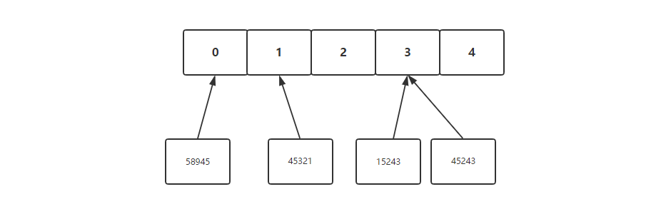
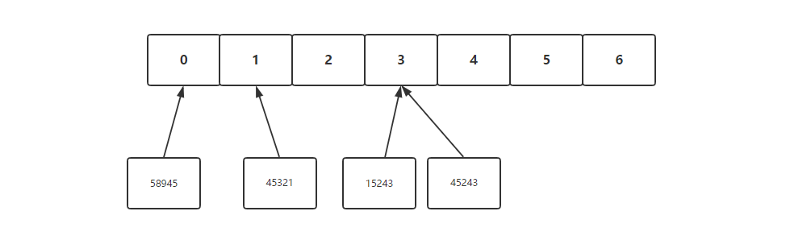
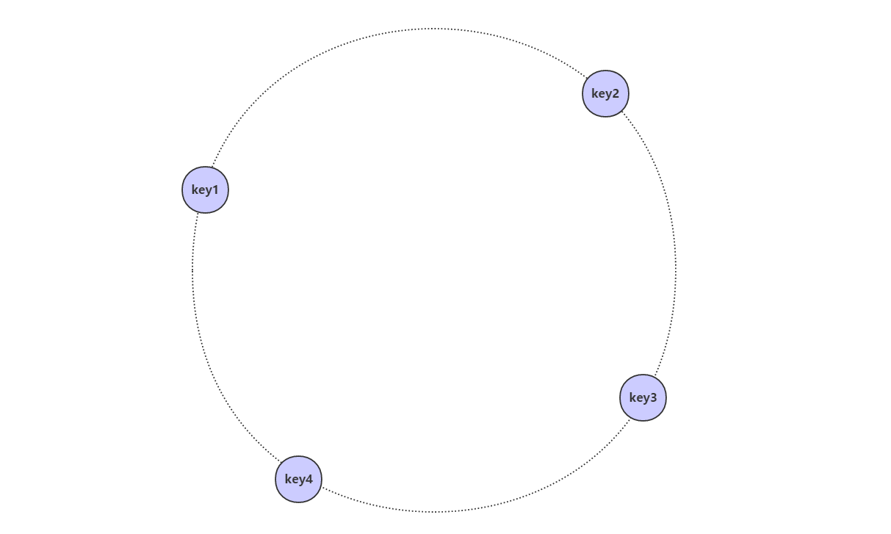
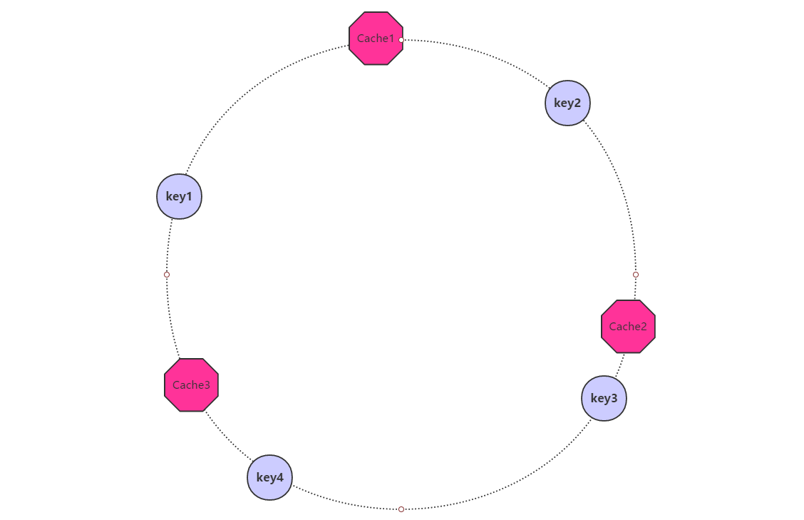
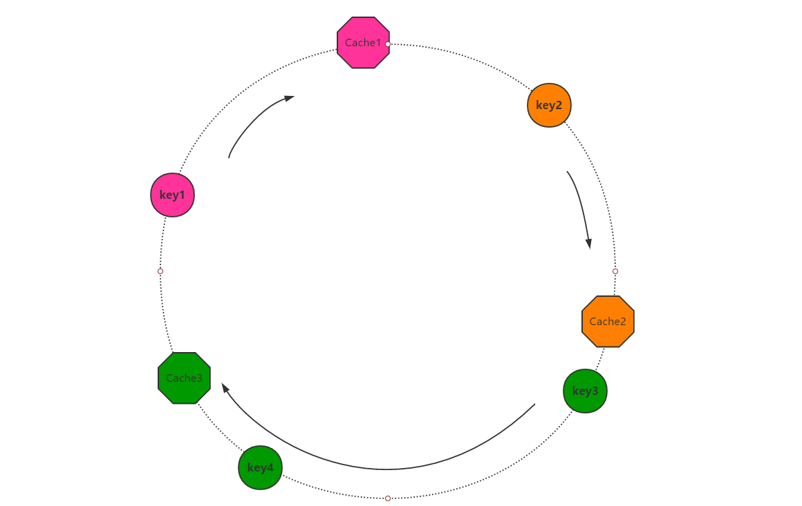
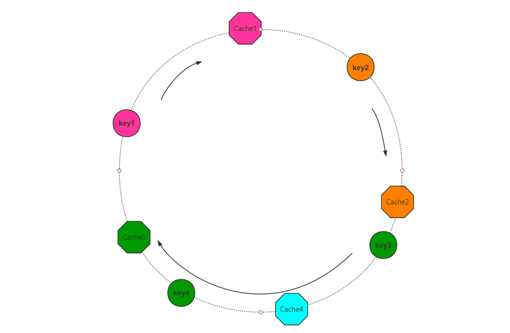
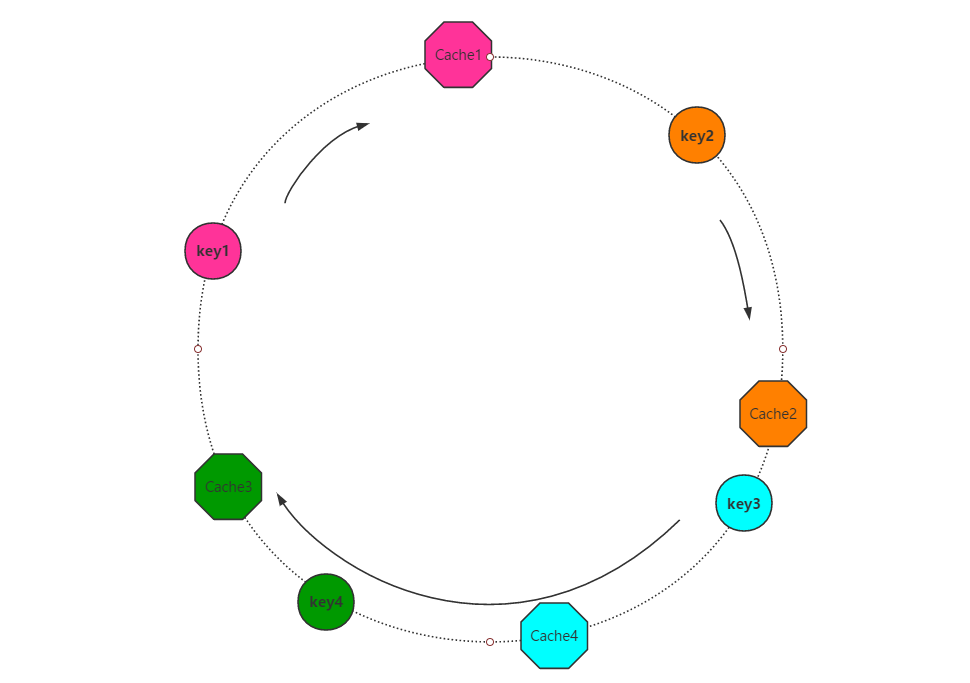
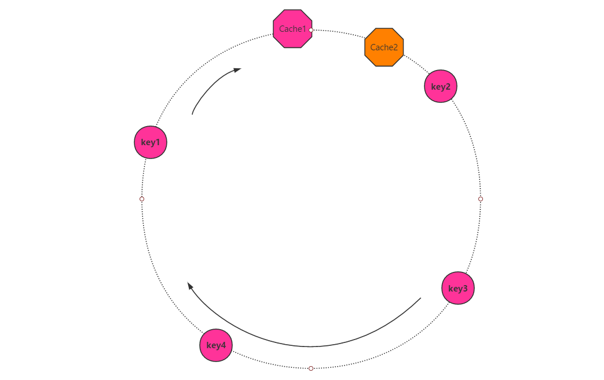
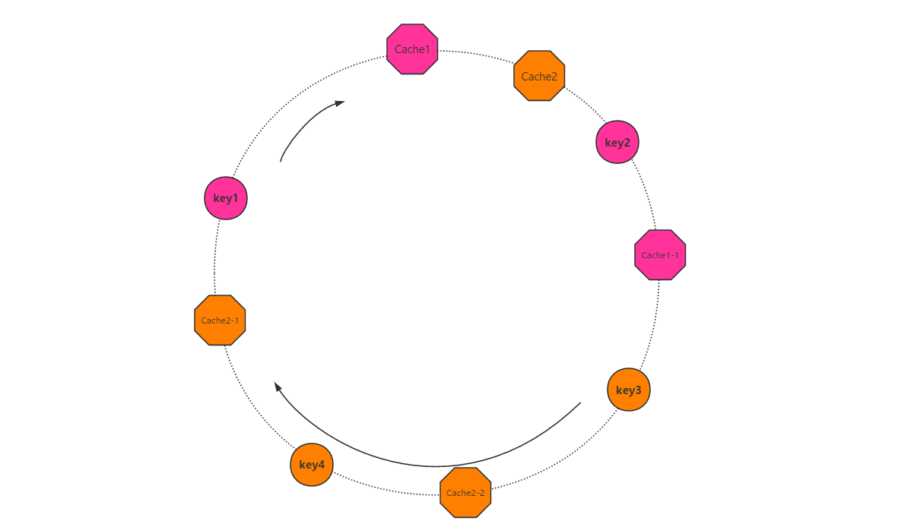

# 一致性Hash算法

​		一致性Hash算法是为了解决分布式缓存中服务器伸缩问题，在传统的取余运算中，普通的余数Hash会存在算法伸缩性差的问题，一旦增加或删除节点，会导致大面积的缓存失效。

## 1. 普通余数Hash代来的问题

假设我们现在有5台缓存服务器：


现在我们下列数据：

```java
{id:45321,value="AAAAAAA"}
{id:58945,value="BBBBBBB"}
{id:45243,value="CCCCCCC"}
{id:15243,value="DDDDDDD"}
```

在分布式缓存下，确定缓存服务器编号最简单的方式就是模运算：

例如：id=45321的数据对应的服务器是：45321%5=1



此时看上去这种算法似乎非常合理，但是由于业务的发展，现有的服务器数量无法满足需求，我们在5台的基础上加了两台服务器：



此时，如果我们想取出刚刚缓存的数据，就会发生找不到缓存的问题。例如此时我们尝试获取id=58945的数据，根据ID我们确定服务器ID：58945%7=5，而在5号服务器中并没有这个数据。

采用传统的余数Hash来确定缓存服务器的算法会带来伸缩性差的问题，一旦服务器集群增加或删除节点就会导致原先缓存的数据大面积失效，`而一致性Hash算法就是用来解决传统余数Hash算法伸缩性差的问题`。

## 2. 一致性Hash算法

### 2.1 什么是一致性Hash算法

首先，我们把全量的缓存空间当做一个环形存储结构。环形空间总共分成2^32个缓存区，


每一个缓存key都可以通过Hash算法转化为一个32位的二进制数，也就对应着环形空间的某一个缓存区。我们把所有的缓存key映射到环形空间的不同位置。



我们将每一个缓存服务器也遵循同样的Hash算法，比如利用IP做Hash，映射到环形空间当中去：



如何让key和节点对应起来呢？很简单，每一个key的顺时针方向最近节点，就是key所归属的存储节点。所以图中key1存储于Cache1，key2存储于Cache2，key3、key4存储于Cache3。



### 2.2 一致性Hash算法的优势

如果我们在3个缓存服务器的基础上增加一个节点（Cache4）：



当缓存集群的节点有所增加的时候，整个环形空间的映射仍然会保持一致性哈希的顺时针规则，所以有一小部分key的归属会受到影响。

有哪些key会受到影响呢？图中加入了新节点Cache4，处于Cache3和Cache2之间，按照顺时针规则，Cache4和Cache2之间的key3不再归属于Cache3，而属于Cache4。可以看到在增加节点后，采用一致性Hash算法的缓存系统只有一小部分缓存数据失效。



### 2.3 虚拟节点

有时候如果节点数量太少，就会发生分布不均匀的情况，这样分布式缓存的压力会大大增加，影响服务器性能:



为了解决因节点太少导致而产生的不均匀情况，一致性Hash算法引入了虚拟节点的概念。所谓虚拟节点，就是基于原来的物理节点，产生N个虚拟节点，最后将虚拟节点映射到环上。



