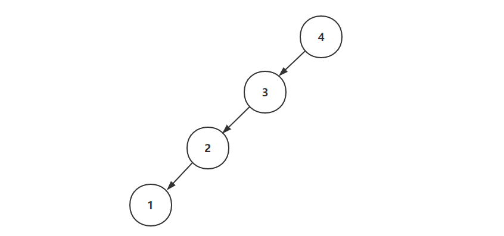
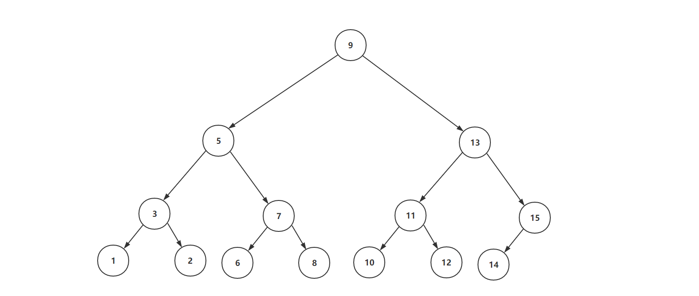
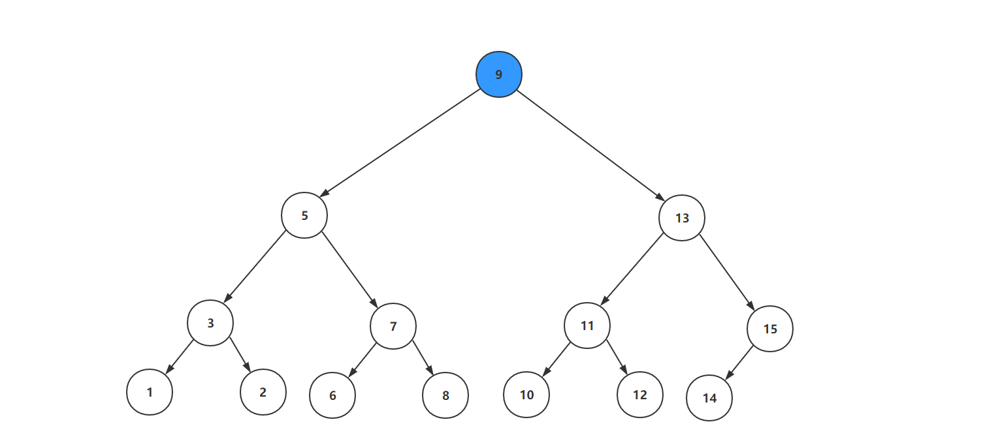
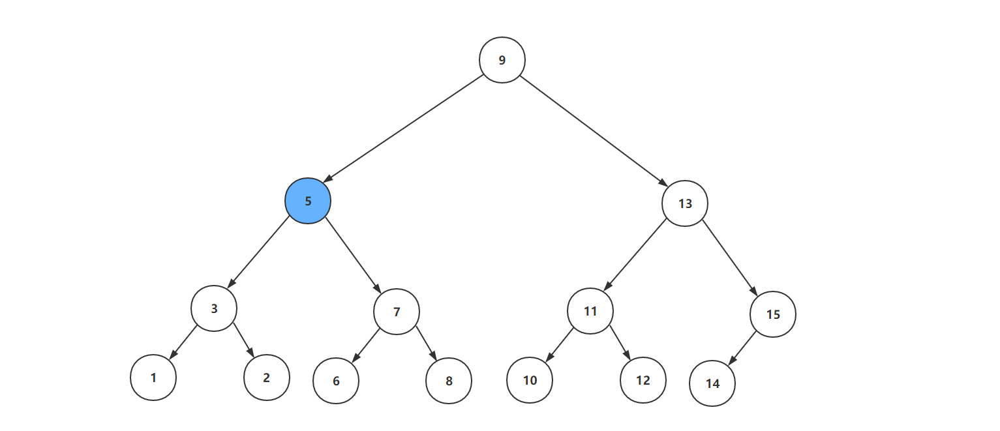
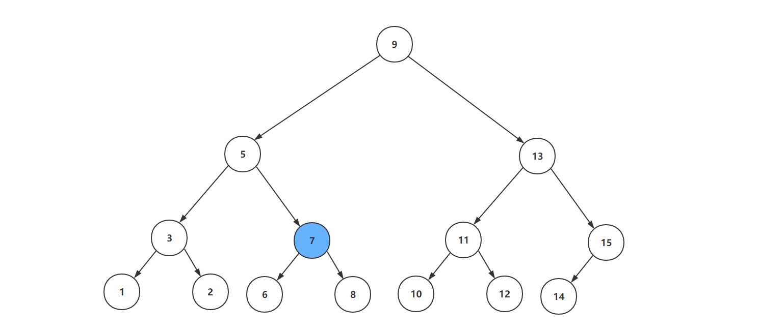
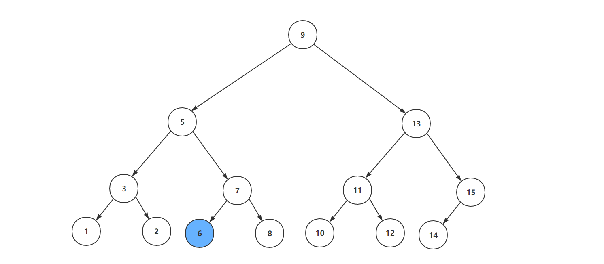
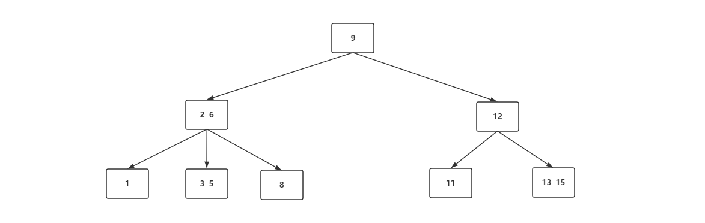

# 什么是B-树

**B-树是一种多路平衡查找树**。需要明确的是，B-Tree完整翻译是Balance Tree，“-”只是一个连接符，而不是读“减”；B-树也并不是很多人以为的二叉树，二叉树的英文名称为Binary Tree，二叉搜索树是Binary Search Tree（BST）。

> In [computer science](https://en.wikipedia.org/wiki/Computer_science), a **B-tree** is a self-balancing [tree data structure](https://en.wikipedia.org/wiki/Tree_data_structure) that maintains sorted data and allows searches, sequential access, insertions, and deletions in [logarithmic time](https://en.wikipedia.org/wiki/Logarithmic_time). The B-tree is a generalization of a [binary search tree](https://en.wikipedia.org/wiki/Binary_search_tree) in that a node can have more than two children.[[1\]](https://en.wikipedia.org/wiki/B-tree#cite_note-Comer-1) Unlike other [self-balancing binary search trees](https://en.wikipedia.org/wiki/Self-balancing_binary_search_tree), the B-tree is well suited for storage systems that read and write relatively large blocks of data, such as discs. It is commonly used in [databases](https://en.wikipedia.org/wiki/Database) and [file systems](https://en.wikipedia.org/wiki/File_system).——维基百科

在计算机科学中，b树是一种自平衡树数据结构，它维护排序的数据，并允许在对数时间内进行搜索、顺序访问、插入和删除。b树是二叉搜索树的泛化，即一个节点可以有两个以上的子节点。与其他自平衡二叉搜索树不同，b -树非常适合于读写相对较大数据块(如磁盘)的存储系统。它通常用于数据库和文件系统。

## 使用B-树的意义

B-树诞生的意义还得从二叉搜索树来说起。在传统的二叉搜索树中，如果在最理想的状态下，二叉搜索树的查找时间复杂度为O(logN)，但是由于插入顺序的不同会导致二叉搜索树变成一个瘸子，最坏的情况下就变成了线性查找，时间复杂度变成了O(N)：

至此，平衡二叉树这个新品种就诞生，平衡二叉树的实现方式分为很多种，例如：AVL、红黑树、替罪羊树等。但这些算法的最终目的就是保住树不会成为一个瘸子，以保证树的查询效率维持一个较高水平。

但是平衡二叉树就真的能保证实际的查询效率吗？答案是否定的。因为我们传统的理解中并没有考虑磁盘的IO性能，如果平衡二叉树存储在内存中，那么平衡二叉树的效率自然非常高，只需要考虑数据的比较次数即可；但是如果一个非常大的平衡二叉树放在磁盘中，我们不可能将整棵树加载进内存，能做的只有逐一加载每一个磁盘页（这里的磁盘页对应着树的节点），那么此时影响查询性能就不是比较次数了，而是磁盘的IO了。

假如我们现在要查找节点为6的元素，就分别需要进行四次磁盘IO操作：

**第一次磁盘IO**：

**第二次磁盘IO**：

**第三次磁盘IO**：

**第四次磁盘IO**：

不难发现，树的高度决定着查询的IO次数，而B-Tree就是为了降低树的高度，减少磁盘IO次数而产生的一种数据。

## B-树的定义

1. 每一个节点最多有 *m* 个子节点
2. 每一个非叶子节点（除根节点）最少有 ⌈*m*/2⌉ 个子节点
3. 如果根节点不是叶子节点，那么它至少有两个子节点
4. 有 *k* 个子节点的非叶子节点拥有 *k* − 1 个键
5. 所有的叶子节点都在同一层

## B-树的意义

B-树在查询过程中比较次数不必二叉搜索树少，尤其是单一节点中元素数量很多时。可是相比磁盘IO的速度，内存中的比较耗时几乎是可以忽略的，所以只要树的高度足够低，IO次数足够少就可以提供查找性能。相比之下节点内部元素多一些也没有关系，`只要不超过磁盘页的大小即可`。这就是B-树的优势之一。

B-树主要用于文件系统以及部分数据库索引，大部分关系型数据库则使用B+树作为索引。