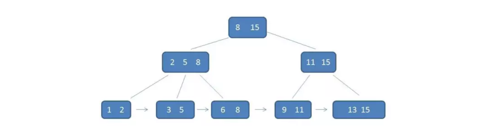
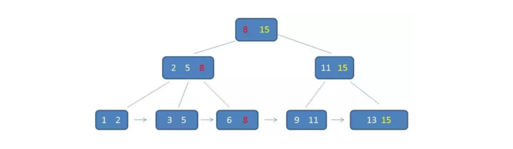
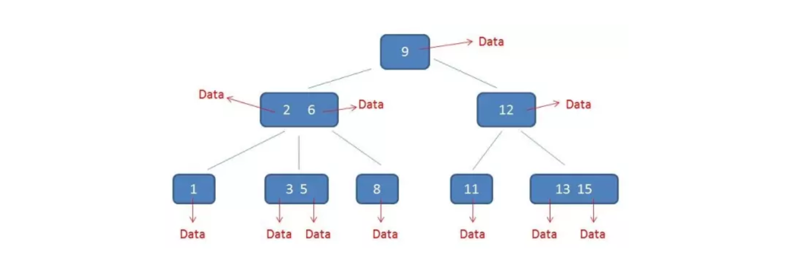
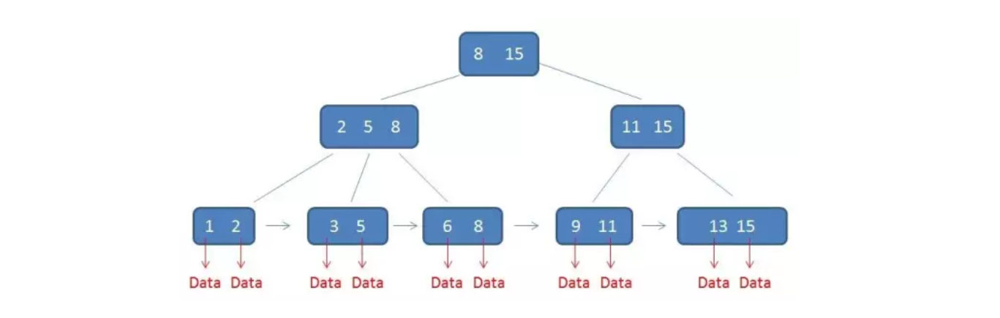
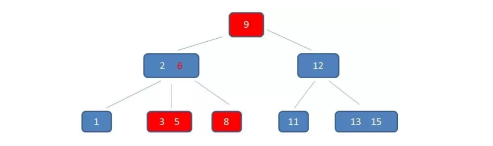
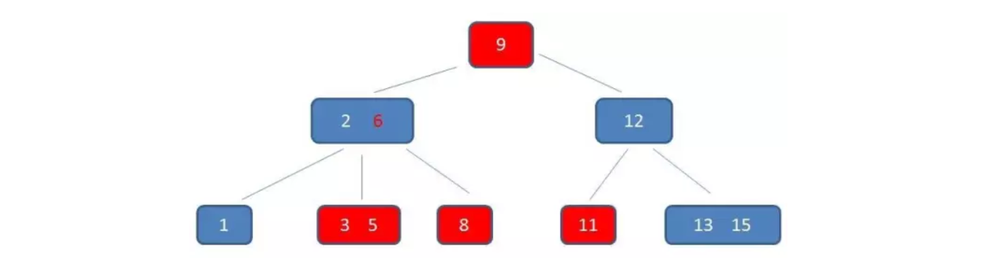
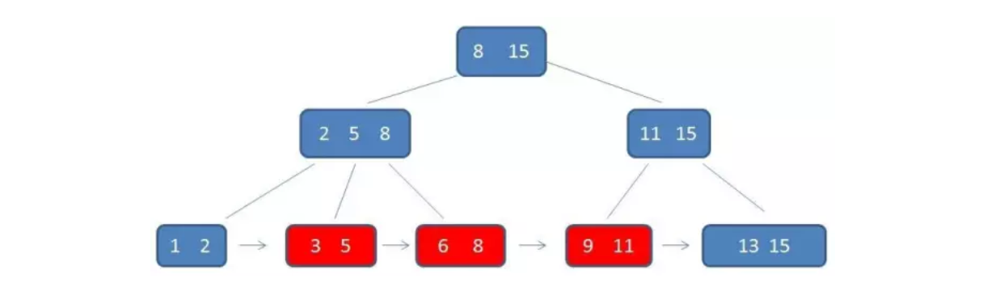

# 什么是B+树

在上文中 [什么是B-树](./_2什么是B-树.md)，我们讲解了B-树的基本原理，而B+树是基于B-树的一种变体，有着比B-树更高的查询性能。在说B+树之前，我们先回顾一下B-树的特点：

**一个M阶B-树有如下特点**：

1. 每一个节点最多有 *m* 个子节点
2. 每一个非叶子节点（除根节点）最少有 ⌈*m*/2⌉ 个子节点
3. 如果根节点不是叶子节点，那么它至少有两个子节点
4. 有 *k* 个子节点的非叶子节点拥有 *k* − 1 个键
5. 所有的叶子节点都在同一层

## B+树的特点

**一个M阶B+树具有一下特点**：

1. k个子树的中间节点包含有k个元素（B树中是k-1个元素），每个元素不保存数据，只用来索引，所有数据都保存在叶子节点。

2. 所有的叶子结点中包含了全部元素的信息，及指向含这些元素记录的指针，且叶子结点本身依关键字的大小自小而大顺序链接。

3. 所有的中间节点元素都同时存在于子节点，在子节点元素中是最大（或最小）元素。

咱们举个例子来看看：

在B+树中每一个父节点的元素都出现在子节点中，是子节点最大的（或最小的）元素。

在上图中，根节点元素8是子节点(2,5,8)的最大元素，也是叶子节点(6,8)的最大元素。根节点15是子节点(11,15)的最大元素，也是(13,15)的最大元素。需要注意的是，`根节点中的最大元素，也就等同于整颗B+树的最大元素`。以后无论插入删除多少元素，始终要保持最大元素在根节点中。

至于叶子节点，由于父节点的元素都出现子节点，因此所有叶子节点包含了全量元素信息，并且每个叶子节点都带着指向下一个节点的指针，形成了一个有序链表：

B+树还具有一个特点，这个特点是在索引之外，确实至关重要的特点，那就是卫星数据的位置。

在B-树中卫星数据：

而在B+树中，只有叶子节点带有卫星数据，其余中间节点仅仅是索引，没有任何数据关联。

需要补充的是，`在数据库的聚集索引（Clustered Index）中，叶子节点直接包含卫星数据。在非聚集索引（NonClustered Index）中，叶子节点带有指向卫星数据的指针`。

## B+树的性能优势

B+树的好处主要体现在查询性能上，下面我们就以单行查询和范围查询来做分析。

### 单行查询

在单行元素查询的时候，B+树会自顶向下逐层查找节点，最终匹配的叶子节点。假如我们要查找节点为3的节点：

看起来与B树一样都需要执行三次磁盘IO，那么实际的性能优化体现在哪里呢？

实际上我们在学习B树时，有一个重要概念：B树的阶数越高，树的高度就越低，查询所执行磁盘IO次数就越少，但是每个节点数据不能超过磁盘页的大小。在B+树中由于中间节点没有卫星数据，所以同样大小的磁盘页可以拥有更多的节点元素，从而降低树的高度。

另外由于B+树的数据每一次查找都必须找到叶子节点才能得到数据，所以相对于B树的查找，B+树每一次查找都是稳定的。

### 范围查询

可能在单行查询时B+树的性能优势并不明显，但是一旦到了范围查询，B+树的性能优势就充分发挥。我们先来看看B-树的范围查找过程。

#### B-树的范围查找

假如我们需要查找[3,11]范围的节点，首先我们需要找到范围的下限3：

中序变量6：

中序遍历到8：

中序遍历到9：

中序遍历到11，遍历结束：

#### B+树的范围查找

现在来看B-树的范围查找确实很繁琐，但是B+树就非常简单了：

B+树我们只需要找到下限节点(3,5)，然后通过链表指针，遍历到(9,11)即可。

## 总结

B+树是对B-树的一种改进，它相对于B-树有如下优势：

1. 它使得单一节点能够存储更过的元素，最终降低了磁盘IO次数。
2. 所有查询都要查找到叶子节点，查询更加稳定。
3. 所有叶子节点形成有序链表，方便范围查询。

本文主体转载至： [漫画：什么是B+树？](https://mp.weixin.qq.com/s?__biz=MzIxMjE5MTE1Nw==&mid=2653191027&idx=1&sn=4ba22e3ec8bd149f69fc0aba72e4347e&chksm=8c9909a9bbee80bfa1d8497ff0525df130414c1731b5aa5287bf16ea1cf86c8d8e6f20782184&mpshare=1&scene=23&srcid=08193O8X6VwDhZd7gi4Kqgpe&sharer_sharetime=1566200072427&sharer_shareid=e81601a95b901aeca142bbe3b957819a#rd)，但对部分细节有所更改。