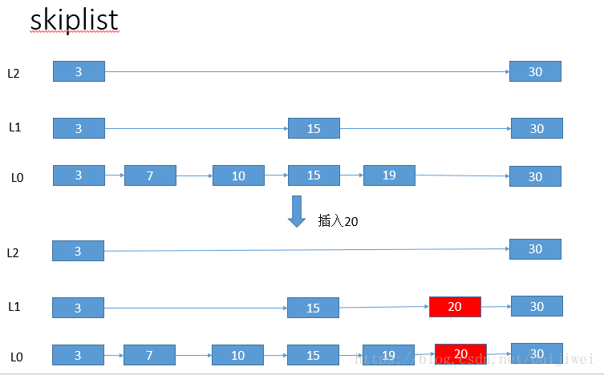
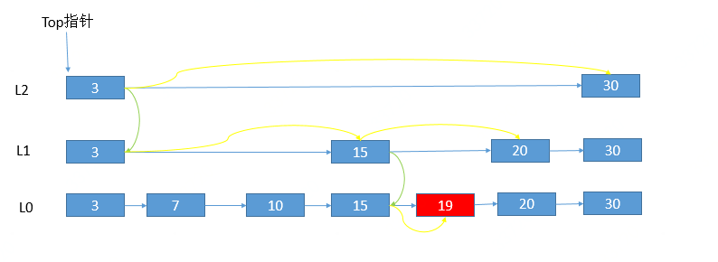

# 跳跃表原理（SkipList）

Skiplist在很多场景下都有应用， 比如redis的有序集合， LevelDB、hbase、Cassandra、Bigtable等的MemTable。它是一个实现比较简单的带跳跃功能的搜索链表， 采用空间换时间的方式来加快链表的查询。 

## Skiplist原理

Skiplist本质上是一种链表， 但是我们知道链表的查询是比较慢的，时间复杂度为O(n)， 为了提升查询的效率， 需要额外的存储一些信息， 使得它可以避免从头到尾一个一个遍历， 常用的做法是有序二叉树的二分查找， 可以做到时间复杂度为O(log(n))， 但是平衡二叉树的实现通常比较复杂，尤其是有添加删除的时候， 二叉树的平衡性可能被破坏， 需要旋转。Skiplist的效率虽然没有平衡二叉树高， 但是它实现起来简单， 并且插入删除操作不需要更多复杂的操作。

Skiplist 的特点：

- Skiplist本身是一个有序链表；
- Skiplist包含多个层级；
- 每一个Node包含了不同层级的不同跨度的链表；
- 越往上层， 链表的跨度越大， 该层链表的节点越少；
- 每个Node拥有链表的层数是随机的， 在 0 ~ MaxHeight之间， 在该Node插入时确定；
- 若某个key在第i层出现， 则0 ~ i-1 层都包含该元素；
- 有一个Top指针， 指向最高层的第一个节点；
Skiplist插入节点：

生成随机的hight；
- 生成新的NewNode；
- 在层0 ~ height-1， 将NewNode插入到正确的位置， 更新next指针；
- 在层height ~ max-1，next指针指向NewNode；

如上图的实例， 我们有一个Skiplist包含3层， 第一层有3、7、10、15、19、30共6个节点， 第二层有3、15、30共3个节点， 第三层3、30共两个节点。
如果我们要插入key 20， 并且随机的height是2， 结果如上图， 新插入的节点会出现在第一、第二层， 在这两层中又想一个一般的链表一样插入到正确的位置。

**Skiplist节点删除**：
删除与插入比较类似， 不过要把各层的节点都删除掉， 如果该节点是最高层的唯一的节点， 需要将链表的实际高度减一。

**Skiplist的查询**：
Skiplist查询的过程， 是从上层向下层逐步推进， 最开始由Top指针指向最高层的第一个节点， 向后找到key小于目标节点的最大的节点， 如果不相等， 向下一层去找， 知道找到结束， 或者在第0层也没有找到。

 如上图实例， 查询的过程，黄色的箭头表明在同一个level进行的遍历， 绿色的箭头代表向下一层转变。

## 总结

跳跃表是典型的以空间换时间的数据结构，它的总体插入查询的时间复杂度是O(logN)， 相比于二叉查找树，跳表维持结构平衡的成本比较低，完全靠随机。而二叉查找树需要Rebalance来重新调整平衡的结构。 它用简单的思想完成了对链表数据结构查询效率低下的问题的改进，在很多场景下都使用到了跳跃表的数据结构。

例如在JDK中ConcurrentSkipListMap就是采用跳跃表的数据结构； Redis当中的**Sorted-set**这种有序的集合，正是对于跳表的改进和应用。

本文转载至： https://blog.csdn.net/baijiwei/article/details/82872334 