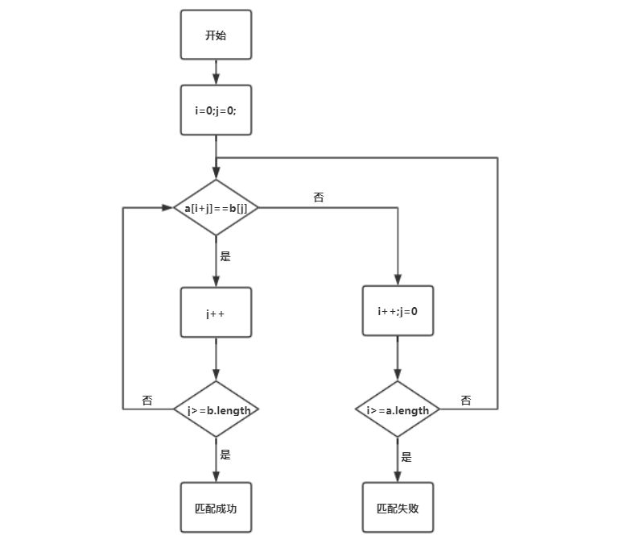
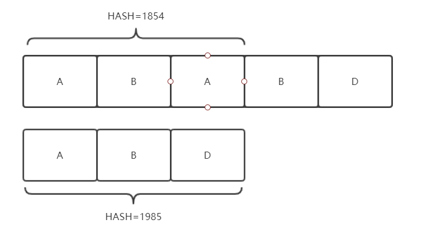
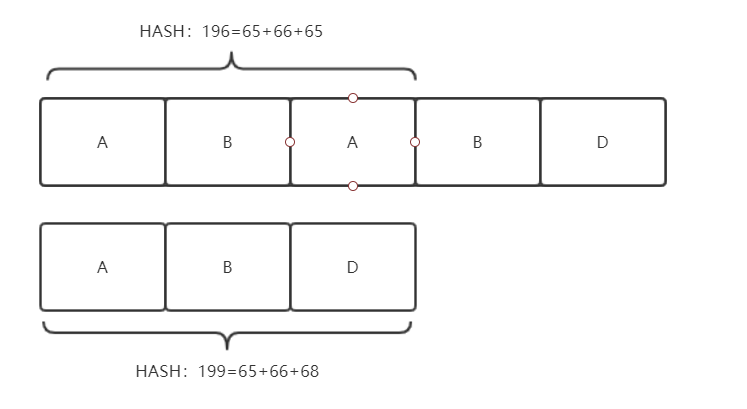
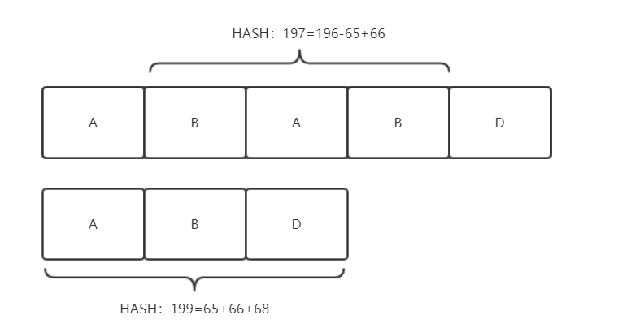

# 字符串匹配算法

字符串匹配算法是一种常用的算法，算法的面向两个字符串，我们暂且将字符串A称为主串，字符串B称为模式串：

```java
String A = "BBC ABCDAB ABCDABCDABDE"；
String B = "ABCDABD"；
```

我们需要编写的一个算法，判断模式串是否是主串的一部分（子串）。

## BF算法

BF算法就是最直观的暴力算法：



采用双重循环，每一次循环匹配从i开始的子串是否与模式串匹配，如果不匹配则i++，从而匹配下一个起始点。

## BF算法改进

由于每一次匹配起始点时，指针j都要从模式串尾移向头部，导致该算法时间复杂度为O(N*M)，实质上我们可以采用Hash算法来优化BF算法。

我们只需要对模式串进行Hash，得到一个Hash值，然后每次匹配子串之前，我们都先计算出子串的Hash，只有与模式串Hash相同的时候我们才进行匹配操作，这样可以大大避免BF算法中匹配长期失败的问题。

计算Hash虽然可以避免大部分不匹配情况，直接进行i++操作，但是我们如果每次都重新计算子串的Hash值，那么计算Hash值的时间开些我们也需要考虑进去，实际上我们在设计Hash算法的时候，我么需要进行特殊的处理，例如我们可以以字符的ASCII码的和作为字符串的Hash值：



这时我们发现子串`ABA`与模式串`ABD`的Hash值不相同，我们就可以计算下一个子串的Hash值了：



需要注意的是，我们在计算新的子串Hash值时就不需要重新计算Hash值，只需要减去移除的`A`，然后再加上新进入的`B`字符的ASCII码。 

## KMP算法

1. 


首先，字符串"BBC ABCDAB ABCDABCDABDE"的第一个字符与搜索词"ABCDABD"的第一个字符，进行比较。因为B与A不匹配，所以搜索词后移一位。

2. 


因为B与A不匹配，搜索词再往后移。

3. 


就这样，直到字符串有一个字符，与搜索词的第一个字符相同为止。

4. 


接着比较字符串和搜索词的下一个字符，还是相同。

5. 


直到字符串有一个字符，与搜索词对应的字符不相同为止。

6. 


这时，最自然的反应是，将搜索词整个后移一位，再从头逐个比较。这样做虽然可行，但是效率很差，因为你要把"搜索位置"移到已经比较过的位置，重比一遍。

7. 


一个基本事实是，当空格与D不匹配时，你其实知道前面六个字符是"ABCDAB"。KMP算法的想法是，设法利用这个已知信息，不要把"搜索位置"移回已经比较过的位置，继续把它向后移，这样就提高了效率。

8. 


怎么做到这一点呢？可以针对搜索词，算出一张《部分匹配表》（Partial Match Table）。这张表是如何产生的，后面再介绍，这里只要会用就可以了。

9. 


已知空格与D不匹配时，前面六个字符"ABCDAB"是匹配的。查表可知，最后一个匹配字符B对应的"部分匹配值"为2，因此按照下面的公式算出向后移动的位数：

```java
移动位数 = 已匹配的字符数 - 对应的部分匹配值
```

因为 6 - 2 等于4，所以将搜索词向后移动4位。

10. 


因为空格与Ｃ不匹配，搜索词还要继续往后移。这时，已匹配的字符数为2（"AB"），对应的"部分匹配值"为0。所以，移动位数 = 2 - 0，结果为 2，于是将搜索词向后移2位。

11. 


因为空格与A不匹配，继续后移一位。

12. 


逐位比较，直到发现C与D不匹配。于是，移动位数 = 6 - 2，继续将搜索词向后移动4位。

13. 


逐位比较，直到搜索词的最后一位，发现完全匹配，于是搜索完成。如果还要继续搜索（即找出全部匹配），移动位数 = 7 - 0，再将搜索词向后移动7位，这里就不再重复了。

14. 


下面介绍《部分匹配表》是如何产生的。

首先，要了解两个概念："前缀"和"后缀"。 "前缀"指除了最后一个字符以外，一个字符串的全部头部组合；"后缀"指除了第一个字符以外，一个字符串的全部尾部组合。

15. 


"部分匹配值"就是"前缀"和"后缀"的最长的共有元素的长度。以"ABCDABD"为例，

```java
　　－　"A"的前缀和后缀都为空集，共有元素的长度为0；

　　－　"AB"的前缀为[A]，后缀为[B]，共有元素的长度为0；

　　－　"ABC"的前缀为[A, AB]，后缀为[BC, C]，共有元素的长度0；

　　－　"ABCD"的前缀为[A, AB, ABC]，后缀为[BCD, CD, D]，共有元素的长度为0；

　　－　"ABCDA"的前缀为[A, AB, ABC, ABCD]，后缀为[BCDA, CDA, DA, A]，共有元素为"A"，长度为1；

　　－　"ABCDAB"的前缀为[A, AB, ABC, ABCD, ABCDA]，后缀为[BCDAB, CDAB, DAB, AB, B]，共有元素为"AB"，长度为2；

　　－　"ABCDABD"的前缀为[A, AB, ABC, ABCD, ABCDA, ABCDAB]，后缀为[BCDABD, CDABD, DABD, ABD, BD, D]，共有元素的长度为0。
```

16. 


"部分匹配"的实质是，有时候，字符串头部和尾部会有重复。比如，"ABCDAB"之中有两个"AB"，那么它的"部分匹配值"就是2（"AB"的长度）。搜索词移动的时候，第一个"AB"向后移动4位（字符串长度-部分匹配值），就可以来到第二个"AB"的位置。

本文部分内容转载至：<http://www.ruanyifeng.com/blog/2013/05/Knuth%E2%80%93Morris%E2%80%93Pratt_algorithm.html>