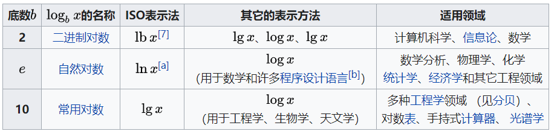
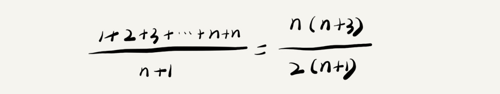
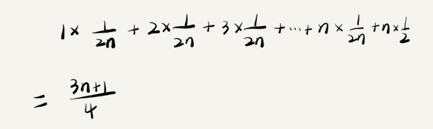

# 时间复杂度

## 一. 为什么需要复杂度分析

你可能会有些疑惑，我把代码跑一遍，通过统计、监控，就能得到算法执行的时间和占用的内存大小。为什么还要做时间、空间复杂度分析呢？这种分析方法能比我实实在在跑一遍得到的数据更准确吗？

**这种评估算法执行效率的方法是正确的**。但是**这种统计方法有非常大的局限性**。

**1. 测试的结果依赖测试的环境**

测试环境中硬件的不同会对测试结果有很大的影响。比如，我们拿同样一段代码，分别用 Intel Core i9 处理器和 Intel Core i3 处理器来运行，不用说，i9 处理器要比 i3 处理器执行的速度快很多。还有，比如原本在这台机器上 a 代码执行的速度比 b 代码要快，等我们换到另一台机器上时，可能会有截然相反的结果。

**2. 测试结果受数据规模的影响很大**

如果测试数据规模太小，测试结果可能无法真实地反映算法的性能。比如，对于小规模的数据排序，插入排序可能反倒会比快速排序要快！

所以，我们需要一个**不用具体的测试数据来测试，就可以粗略地估计算法的执行效率的方法**。这就是我们今天要讲的时间、空间复杂度分析方法。

## 二. T(n) 时间复杂度

[时间复杂度 - 维基百科，自由的百科全书 (wikipedia.org)](https://zh.wikipedia.org/wiki/时间复杂度)

算法的执行效率，粗略地讲，就是算法代码执行的时间。但是，如何在不运行代码的情况下，用“肉眼”得到一段代码的执行时间呢？

这里有段非常简单的代码，求 1,2,3…n 的累加和。现在，我就带你一块来估算一下这段代码的执行时间。

```java
public static int sum(int n) { 
    int sum = 0; 
    int i = 1;
    for (; i <= n; ++i) { 
        sum = sum + i; 
    } 
    return sum; 
}
```

从 CPU 的角度来看，这段代码的每一行都执行着类似的操作：读数据-运算-写数据。

读数据：内存->高速缓存->寄存器->CPU

写数据：CPU->寄存器->高速缓存->内存

每行代码执行所需要的时钟周期并不一样，这也意味着执行时间不一样，但是，我们这里只是粗略估计，所以可以假设每行代码执行的时间都一样，为 unit_time。在这个假设的基础之上，这段代码的总执行时间是:

```shell
T(n) = 3n+2
```

注：第 2、3 行代码分别需要 1 个 unit_time 的执行时间，第 4、5 行都运行了 n 遍，所以需要 3n*unit_time 的执行时间，所以这段代码总的执行时间就是 (2n+2)unit_time。

尽管我们不知道 unit_time 的具体值，但是通过这两段代码执行时间的推导过程，我们可以得到一个非常重要的规律，那就是，**所有代码的执行时间 T(n) 与每行代码的执行次数 n 成比例**。

## 三. O(n)时间复杂度

在上一节T(n)时间复杂度基础上我们试想一种极端情况。当 n 趋近于正无穷的时候，**公式中的低阶、常量、系数三部分并不会左右增长趋势**，所以都可以忽略。在T(n)时间复杂度的基础上去掉低阶、常数、系数后就得到了O(n)时间复杂度。

```shell
T(n) = 10000 => O(1)
T(n) = 2n+1 => O(n)
T(n) = 3n^2+n+100 => O(n^2)
```

大 O 时间复杂度实际上并不具体表示代码真正的执行时间，而是**表示代码执行时间随数据规模增长的变化趋势**，所以，也叫作渐进时间复杂度（asymptotic time complexity），简称时间复杂度。

## 四. 常见的时间复杂度


```shell
O(1) > O(logn) > O(n) >O(nlogn) > O(n^2) > O(n!)
```

在计算机领域中`log n`指以2为底的对数，在不同领域中`log n`底数并不一致（[对数 - 维基百科，自由的百科全书 (wikipedia.org)](https://zh.wikipedia.org/wiki/对数)）：



## 五. 时间复杂度分析案例

```java
public static void sayHello(int n) {
    int i = n + 1;
    System.out.println(i);
}
```

<details> <summary>展开查看</summary> <pre><code> O(n) </code></pre> </details>

```java
public static void sayHello(int n) {
    for (int i = 0; i < 10; i++) {
        System.out.println(n);
    }
}
```

<details> <summary>展开查看</summary> <pre><code> O(n) </code></pre> </details>

```java
public static void sayHello(int n) {
    for (int i = 0; i < n; i++) {
        for (int j = 0; j < n; j++) {
            System.out.println(n);
        }
    }
}
```

<details> <summary>展开查看</summary> <pre><code> O(n^2) </code></pre> </details>

```java
public static void sayHello(int n) {
    for (int i = 0; i < n; i++) {
        for (int j = 0; j < i; j++) {
            System.out.println(n);
        }
    }
}
```

<details> <summary>展开查看</summary> <pre>T(n) = 1+2+3+...+n;
T(n) = (n+1)n/2
</pre> </details>

```java
public static void sayHello(int n) {
    for (int i = 2; i < n; ) {
        i = i * 2;
        System.out.println(i);
    }
}
```

<details> <summary>展开查看</summary> <pre>
循环的时间复杂度就是循环的次数，假设循环次数为 x，则循环条件满足 2^x < n。
可以得出，执行次数x = log(2)(n)，即 T(n) = log(2)(n)，可见时间复杂度为 O(log(2)(n))，即 O(log n)。
</pre> </details>

## 六. 最好、最坏、平均、均摊时间复杂度

- 最好情况时间复杂度（best case time complexity）；
- 最坏情况时间复杂度（worst case time complexity）；
- 平均情况时间复杂度（average case time complexity）；
- 均摊时间复杂度（amortized time complexity）；

先来看一段代码：

```java
public static int find(int[] array, int x) {
    int pos = -1;
    for (int i = 0; i < array.length; ++i) {
        if (array[i] == x) {
            pos = i;
            break;
        }
    }
    return pos;
}
```

这段代码的功能非常简单，就是查找整数x在数组中的位置，找到就直接返回。因为，要查找的变量 x 可能出现在数组的任意位置。如果数组中第一个元素正好是要查找的变量 x，那就不需要继续遍历剩下的 n-1 个数据了，那时间复杂度就是 O(1)。但如果数组中不存在变量 x，那我们就需要把整个数组都遍历一遍，时间复杂度就成了 O(n)。所以，不同的情况下，这段代码的时间复杂度是不一样的。

为了表示代码在不同情况下的不同时间复杂度，我们需要引入三个概念：最好情况时间复杂度、最坏情况时间复杂度和平均情况时间复杂度。

**1.最好情况时间复杂度**

最好情况时间复杂度就是，在最理想的情况下，执行这段代码的时间复杂度。在最理想的情况下，要查找的变量 x 正好是数组的第一个元素，这个时候对应的时间复杂度就是最好情况时间复杂度。

**2.最坏情况时间复杂度**
最坏情况时间复杂度就是，在最糟糕的情况下，执行这段代码的时间复杂度。如果数组中没有要查找的变量 x，我们需要把整个数组都遍历一遍才行，所以这种最糟糕情况下对应的时间复杂度就是最坏情况时间复杂度。

**3. 平均情况时间复杂度**
我们都知道，最好情况时间复杂度和最坏情 况时间复杂度对应的都是极端情况下的代码复杂度，发生的概率其实并不大。为了更好地表示平均情况下的复杂度，我们需要引入另一个概念：平均情况时间复杂度，后面我简称为平均时间复杂度。

要查找的变量 x 在数组中的位置，有 n+1 种情况：在数组的 0～n-1 位置中和不在数组中。我们把每种情况下，查找需要遍历的元素个数累加起来，然后再除以 n+1，就可以得到需要遍历的元素个数的平均值，即：



我们知道，时间复杂度的大 O 标记法中，可以省略掉系数、低阶、常量，所以，咱们把刚刚这个公式简化之后，得到的平均时间复杂度就是 O(n)。

这个结论虽然是正确的，但是计算过程稍微有点儿问题。究竟是什么问题呢？我们刚讲的这 n+1 种情况，出现的概率并不是一样的。

我们知道，要查找的变量 x，要么在数组里，要么就不在数组里。这两种情况对应的概率统计起来很麻烦，为了方便你理解，我们假设在数组中与不在数组中的概率都为 1/2。另外，要查找的数据出现在 0～n-1 这 n 个位置的概率也是一样的，为 1/n。所以，根据概率乘法法则，要查找的数据出现在 0～n-1 中任意位置的概率就是 1/(2n)。

因此，前面的推导过程中存在的最大问题就是，没有将各种情况发生的概率考虑进去。如果我们把每种情况发生的概率也考虑进去，那平均时间复杂度的计算过程就变成了这样：



这个值就是概率论中的加权平均值，也叫作期望值，所以平均时间复杂度的全称应该叫加权平均时间复杂度或者期望时间复杂度。

引入概率之后，前面那段代码的加权平均值为 (3n+1)/4。用大 O 表示法来表示，去掉系数和常量，这段代码的加权平均时间复杂度仍然是 O(n)。

**实际上，在大多数情况下，我们并不需要区分最好、最坏、平均情况时间复杂度三种情况。像我们上一节课举的那些例子那样，很多时候，我们使用一个复杂度就可以满足需求了。只有同一块代码在不同的情况下，时间复杂度有量级的差距，我们才会使用这三种复杂度表示法来区分。**

本文参考至：

[复杂度分析：时间复杂度和空间复杂度 - 程序员自由之路 - 博客园 (cnblogs.com)](https://www.cnblogs.com/54chensongxia/p/14012838.html)

[时间复杂度 - 维基百科，自由的百科全书 (wikipedia.org)](https://zh.wikipedia.org/wiki/时间复杂度)

[（数据结构）十分钟搞定时间复杂度（算法的时间复杂度） - 简书 (jianshu.com)](https://www.jianshu.com/p/f4cca5ce055a)