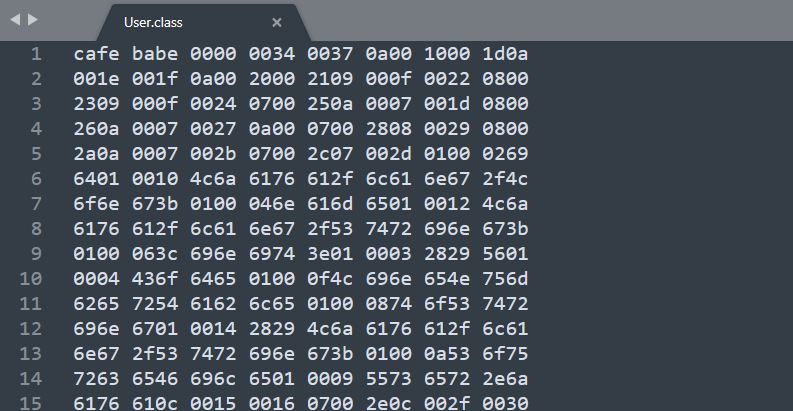
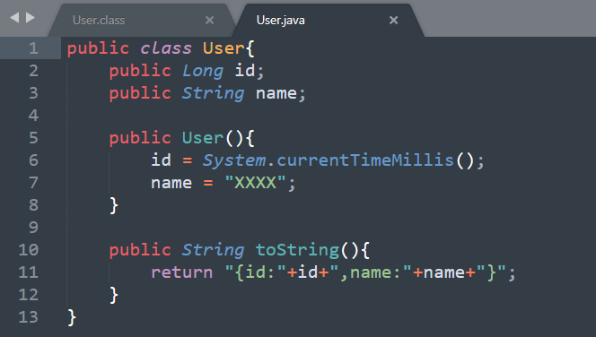
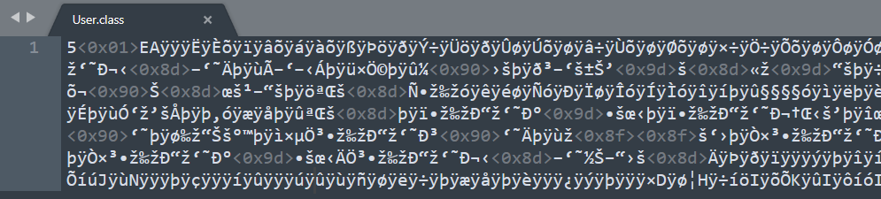
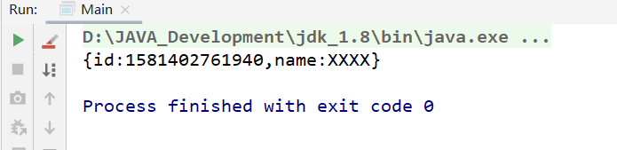

# 自定义类加载器实现字节码文件的加密

标准的字节码文件是可以被反编译：





但我们可以对`User.class`文件进行加密：

```java
package _day05._01自定义类加载器;


import java.io.*;

/**
 * 加密工具类，对文件进行加密（对每个字节进行异或运算）。
 * 异或运算的性质：一个数与一个基数异或两次后保持不变
 * 例：
 * a2 = a1^base
 * a3 = a2^base
 * 在执行两次异或后 a1和a3是一样的
 *
 * @Auther: TJD
 * @Date: 2020-02-11
 * @DESCRIPTION:
 **/
public class EncryptUtils {
    public static void main(String[] args) throws FileNotFoundException{
        File file = new File("C:\\Users\\Lenovo\\Desktop\\User.class");
        encrypt(file);
    }
    /**
     * 对指定文件进行编码（伪加密，Base64实际上是一个编码算法，并不是加密算法）
     *
     * @param file
     */
    public static void encrypt(File file) throws FileNotFoundException {
        InputStream input = null;
        OutputStream output = null;
        String originalPath = file.getPath();
        File targetFile = new File(originalPath + ".enc");
        try {
            input = new FileInputStream(file);
            output = new FileOutputStream(targetFile);
            transfer(input, output);
        } catch (IOException e) {
            e.printStackTrace();
        } finally {
            if (input != null) {
                try {
                    input.close();
                } catch (IOException e) {
                    e.printStackTrace();
                }
            }
            if (output != null) {
                try {
                    output.close();
                } catch (IOException e) {
                    e.printStackTrace();
                }
            }
        }
        //删除原文件
        file.delete();
        //将暂存文件，重命名为原来的文件名
        targetFile.renameTo(new File(originalPath));
    }

    /**
     * 将每个字节与11111111进行异或运算，模拟加密过程
     *
     * @param input
     * @param output
     * @throws IOException
     */
    public static void transfer(InputStream input, OutputStream output) throws IOException {
        int ch;
        while (-1 != (ch = input.read())) {
            //将每个字节和1111 1111 进行异或（模拟加密过程）
            ch = ch ^ 0xff;
            output.write(ch);
        }
    }
}

```

上述代码中我们对`C:\\Users\\Lenovo\\Desktop\\User.class`文件进行了加密，可以看到加密后的文件，变成了一个无法识别的文件：



也就是说，这个class文件已经不能被JDK自带的`ClassLoader`所加载了，我们需要自定义一个类加载器去加载它：

```java
package _day05._01自定义类加载器;

import java.io.*;

/**
 * 自定义类加载器，在加载字节流的时候会先进行解密得到一个字节数组，然后在将其交由JDK底层代码进行类加载的后序操作
 *
 * @Auther: TJD
 * @Date: 2020-02-11
 * @DESCRIPTION:
 **/
public class MyClassLoader extends ClassLoader {

    /**
     * 类加载器加载的基本路径
     */
    private String basePath;
    /**
     * 类加载器的名称
     */
    private String name;

    public MyClassLoader(String name, String basePath) {
        this.name = name;
        this.basePath = basePath;
    }

    /**
     * 对指定的文件进行解密，然后返回解密后的字节数组
     * @param name 类的全限定名
     * @return
     */
    private byte[] decodeFile(String name) {
        byte[] data = new byte[0];
        InputStream input = null;
        ByteArrayOutputStream output = null;
        try {
            input = new FileInputStream(getClassFilePath(name));
            output = new ByteArrayOutputStream();
            //将读入的文件流进行解密，并写入缓存中
            EncryptUtils.transfer(input, output);
            data = output.toByteArray();
        } catch (IOException e) {
            e.printStackTrace();
        } finally {
            if (input != null) {
                try {
                    input.close();
                } catch (IOException e) {
                    e.printStackTrace();
                }
            }
            if (output != null) {
                try {
                    output.close();
                } catch (IOException e) {
                    e.printStackTrace();
                }
            }
        }
        return data;
    }

    /**
     * 根据权限定名称获取，字节码文件的路径
     *
     * @param name
     * @return
     */
    private String getClassFilePath(String name) {
        String fileName = name.replaceAll("\\.", "\\\\");
        return basePath + fileName + ".class";
    }


    @Override
    protected Class<?> findClass(String name) throws ClassNotFoundException {
        byte[] data = decodeFile(name);
        return super.defineClass(name, data, 0, data.length);
    }
}

```

使用自定义类加载器加载加密后的`User.class`文件：

```java
package _day05._01自定义类加载器;

/**
 * @Auther: TJD
 * @Date: 2020-02-11
 * @DESCRIPTION:
 **/
public class Main {
    public static void main(String[] args) throws ClassNotFoundException, IllegalAccessException, InstantiationException {
        MyClassLoader classLoader = new MyClassLoader("My ClassLoader", "C:\\Users\\Lenovo\\Desktop\\");
        Class<?> clazz = classLoader.findClass("User");
        Object o = clazz.newInstance();
        System.out.println(o);
    }
}

```

