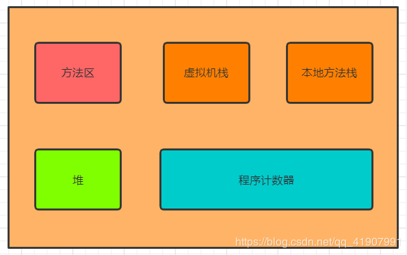
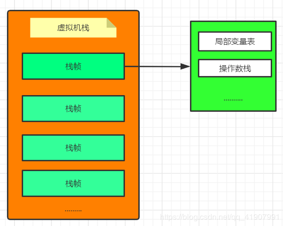
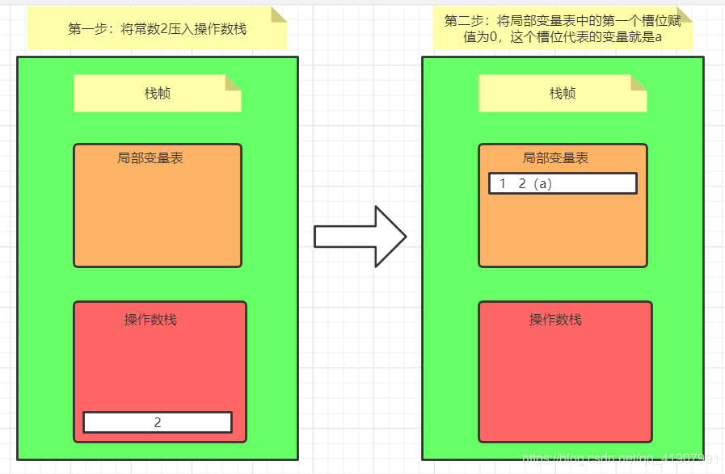
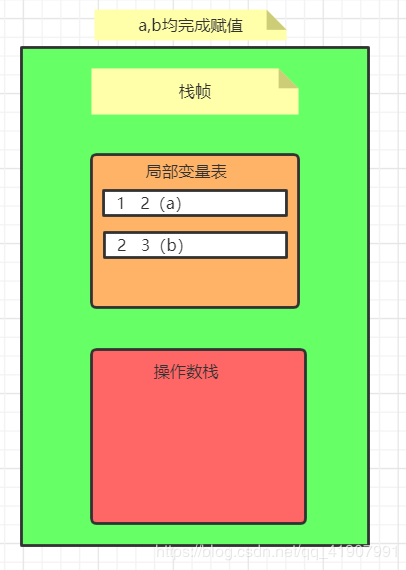
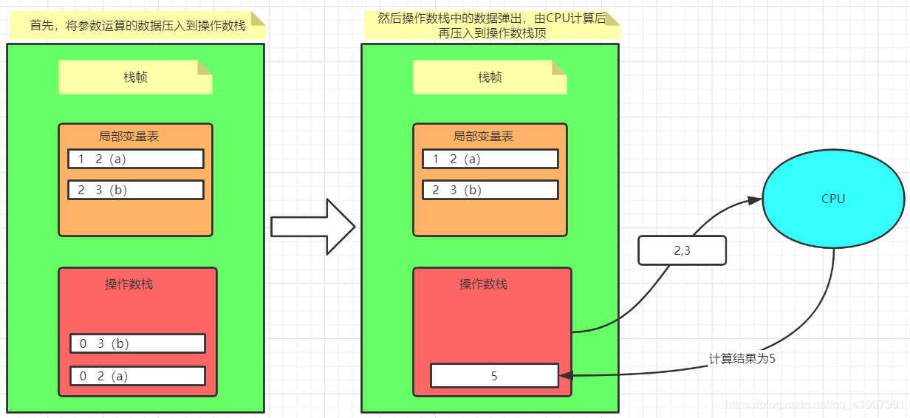
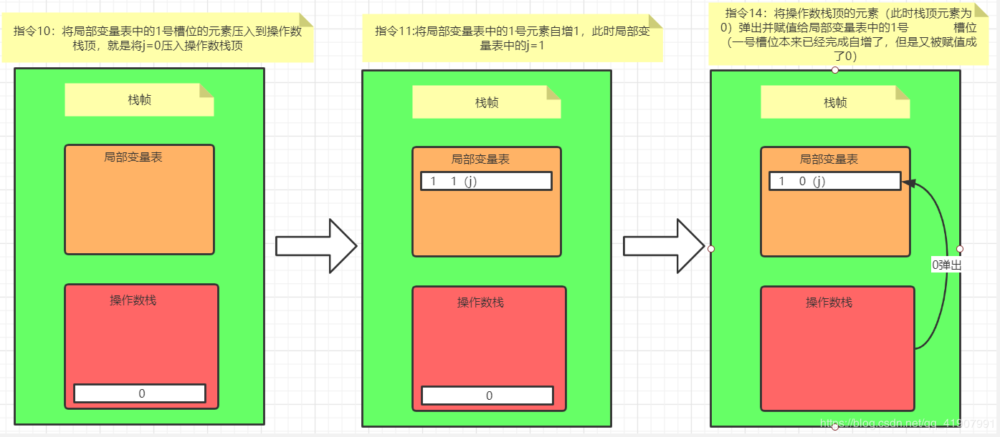

# 从虚拟机的角度看i++和++i

> 说明：本文转载至<https://blog.csdn.net/qq_41907991/article/details/105337049?utm_source=app>

**面试官：你说你懂i++跟++i的区别，那你知道下面这段代码的运行结果吗?**

面试官：“说一说i++跟++i的区别”

我：“i++是先把i的值拿出来使用，然后再对i+1，++i是先对i+1，然后再去使用i”

面试官：“那你看看下面这段代码，运行结果是什么？”

```java
public static void main(String[] args) {
    int j = 0;
    for (int i = 0; i < 10; i++) {
        j = (j++);
    }
    System.out.println(j);
}
```

“以我多年的开发经验来看，它必然不会是10”

面试官：


我：“哈哈…，开个玩笑，结果为0啦”

面试官：“你能说说为什么吗？”

我：“因为j++这个表达式每次返回的都是0，所以最终结果就是0”

面试官：“小伙子不错，那你能从JVM的角度讲一讲为什么嘛？”

我心想：这货明显是在搞事情啊，这么快就到JVM了？还好我有准备。

首先我们知道，JVM的运行时数据区域是分为好几块的，具体分布如下图所示：

在这里插入图片描述



现在我们主要关注其中的虚拟机栈，关于虚拟机栈，我们知道它有以下几个特点：

1. Java虚拟机栈是线程私有的，它的生命周期和线程相同
2. Java虚拟机栈是由一个个栈帧组成，线程在执行一个方法时，便会向栈中放入一个栈帧。
3. 每一个方法所对应的栈帧又包含了以下几个部分
   - 局部变量表
   - 操作数栈
   - 方法出口
   - …

那么现在虚拟机栈就可以表示成下面这个样子：



其中的**局部变量表**存放了编译期可知的各种基本数据类型（boolean、byte、char、short、int、float、long、double）、对象引用。局部变量表所需的内存空间在编译期间完成分配，当进入一个方法时，这个方法需要在帧中分配多大的局部变量空间是完全确定的，在方法运行期间不会改变局部变量表的大小。

> 局部变量表的最小存储单元为Slot（槽），其中**64位长度的long和double类型的数据会占用2个Slot**，其余的数据类型只占用1个。所以我们可以将局部变量表分为一个个的存储单元，每个存储单元有自己的下标位置，在对数据进行访问时可以直接通过下标来访问
>
> 需要注意的是局部变量表的容量以变量槽为最小单位，《Java虚拟机规范》中并没有明确指出一个变量槽应占用的内存空间大小，只是有导向性的说到每个变量槽都应该能存放boolean、byte、char、short、int、float、reference、returnAddress类型的数据。这种描述与明确指出“每个变量槽应占用32位长度的内存空间”有着本质区别。

**操作数栈**对于数据的存储跟局部变量表是一样的，**但是跟局部变量表不同的是，操作数栈对于数据的访问不是通过下标而是通过标准的栈操作来进行的（压入与弹出）**，之后在分析字节码指令时我们会很明显的感觉到这一点。另外还有，**对于数据的计算是由CPU完成的**，所以CPU在执行指令时每次会从操作数栈中弹出所需的操作数经过计算后再压入到操作数栈顶。

以执行下面这段代码为例：

```java
public static  void mian(String[] args){
    int a = 2;
    int b = 3;
    int c = a + b;
}
```

这个过程如下所示：



这两步完成了局部变量a的赋值，同理b的赋值也一样，a,b完成赋值后此时的状态如下图所示



此时要执行a+b的运算了，所以首先要将需要的操作数加载到操作数栈，执行运算时再将操作数从栈中弹出，由CPU完成计算后再将结果压入到栈中，整个过程如下：



到这里还没有完哦，还剩最后一步，需要将计算后的结果赋值给c，也就是要将操作数栈的数据弹出并赋值给局部变量表中的第三个槽位


OK，到这一步整个过程就完成了。

面试官：“嗯，说的不错，但是你还是没解释为什么最开始的那个问题，为什么j=j++的结果会是0呢？”

我：“面试官您好，要解释这个问题上面的知识都是基础，真正要说明白这个问题我们需要从字节码入手。”

我们进入到这段代码编译好的.class文件目录下执行：`javap -c xxx.class`,得到其字节码如下：

```java
// 为方便阅读将对应代码也放到这里
public static void main(String[] args) {
    int j = 0;
    for (int i = 0; i < 10; i++) {
        j = (j++);
    }
    System.out.println(j);
}
```

```java
  public static void main(java.lang.String[]);
    Code:
       0: iconst_0    // 将常数0压入到操作数栈顶
       1: istore_1    // 将操作数栈顶元素弹出并压入到局部变量表中1号槽位，也就是j=0
       2: iconst_0    // 将常数0压入到操作数栈顶
       3: istore_2	  // 将操作数栈顶元素弹出并压入到局部变量表中2号槽位，也就是i=0
       4: iload_2     // 将2号槽位的元素压入操作数栈顶
       5: bipush        10   // 将常数10压入到操作数栈顶，此时操作数栈中有两个数（常数10，以及i）
       7: if_icmpge     21	 // 比较操作数栈中的两个数，如果i>=10,跳转到第21行
      10: iload_1			 // 将局部变量表中的1号槽位的元素压入到操作数栈顶，就是将j=0压入操作数栈顶
      11: iinc          1, 1 // 将局部变量表中的1号元素自增1，此时局部变量表中的j=1

      14: istore_1			 // 将操作数栈顶的元素（此时栈顶元素为0）弹出并赋值给局部变量表中的1号							      槽位（一号槽位本来已经完成自增了，但是又被赋值成了0）
      
      15: iinc          2, 1 // 将局部变量表中的2号槽位的元素自增1，此时局部变量表中的2号元素值为1，也就是i=1
      
      18: goto          4	 // 第一次循环结束，跳转到第四行继续循环
      21: getstatic     #2                  // Field java/lang/System.out:Ljava/io/PrintStream;
      24: iload_1
      25: invokevirtual #3                  // Method java/io/PrintStream.println:(I)V
      28: return
```

我们着重关注第10，11，14行字节码指令，用图表示如下：



可以看到本来局部变量表中的j已经完成了自增（**iinc指令是直接对局部变量进行自增**），但是在进行赋值时是将操作数栈中的数据弹出，但是操作数栈的数据并没有经过计算，所以每次自增的结果都被覆盖了。最终结果就是0。

我们平常说的i++是先拿去用，然后再自增，而++i是先自增再拿去用。这个到底怎么理解呢？如果站在JVM的层次来讲的话，应该这样说：

1. i++是先被操作数栈拿去用了（先执行的load指令），然后再在局部变量表中完成了自增，但是操作数栈中还是自增前的值
2. 而++1是先在局部变量表中完成了自增（先执行innc指令），然后再被load进了操作数栈，所以操作数栈中保存的是自增后的值

这就是它们的根本区别。

最后我这里放出一段代码及其字节码，我相信看完这篇文章你对于i++及++i的理解绝对跟原来不一样了

```java
public static void main(String[] args) {
    int i = 4;
    int b = i++;
    int a = ++i;
}

public static void main(java.lang.String[]);
Code:
	   0: iconst_4
       1: istore_1
       2: iload_1
       3: iinc          1, 1
           6: istore_2
       7: iinc          1, 1
           10: iload_1
      11: istore_3
      12: return
```

