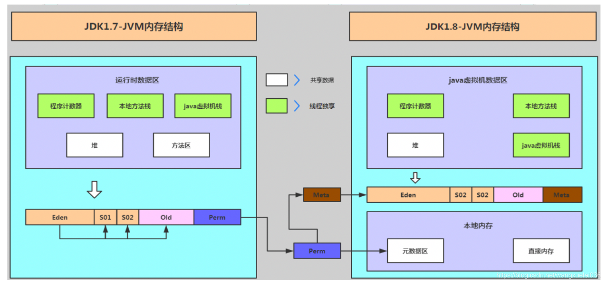
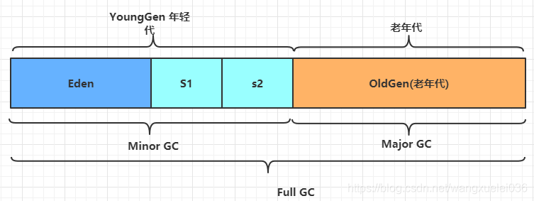

# JVM Minor GC 与 FullGC 的触发时机

> 本文转载至：[JVM Minor GC 与 FullGC 的触发时机_wangxuelei036的博客-CSDN博客](https://blog.csdn.net/wangxuelei036/article/details/108180150)

## 介绍

GC，即就是Java垃圾回收机制。目前主流的JVM（HotSpot）采用的是分代收集算法。与C++不同的是，Java采用的是类似于树形结构的可达性分析法来判断对象是否还存在引用。即：从GC ROOT开始，把所有可以搜索得到的对象标记为存活对象。

## GC机制

要准确理解Java的垃圾回收机制，就要从：“什么时候”，“对什么东西”，“做了什么”三个方面来具体分析。本文主要是分析下什么时候触发 GC（Minor GC 与 Full GC）

“什么时候”即就是GC触发的条件？

GC触发的条件有两种

1. 程序调用System.gc时可以触发，这不是本文想讨论的内容。

2. 系统自身来决定GC触发的时机。（划重点）

在分析 GC 触发机制的时候，我们再先回顾以下 JVM 内存模型（简单展示以下，回顾以下结构，这并不是本文的重点）

## JVM 的内存模型

- jdk1.7之前：方法区位于永久代(PermGen)，永久代和堆相互隔离，永久代的大小在启动JVM时可以设置一个固定值，不可变；
- jdk1.7：存储在永久代的部分数据就已经转移到Java Heap或者Native memory。但永久代仍存在于JDK 1.7中，并没有完全移除，譬如符号引用(Symbols)转移到了native memory；字符串常量池(interned strings)转移到了Java heap；类的静态变量(class statics variables )转移到了Java heap；
- jdk1.8：JVM不再有PermGen。但类的元数据信息（metadata）还在，只不过不再是存储在连续的堆空间上，而是移动到叫做“Metaspace”的本地内存（Native memory）中。仍然保留方法区的概念，只不过实现方式不同。方法存放于元空(Metaspace)，元空间仍然与堆不相连，但与堆共享物理内存，逻辑上可认为在堆中。

注：元空间并不在虚拟机中，而是使用本地内存 

## 堆空间介绍

- Eden：这是对象最初诞生的区域，并且对大多数对象来说，这里是它们唯一存在过的区域。
- Survivor区： 存活区，每次Minor GC 完后，将仍然被引用的对象存放的区域，有两个同样大小的区域。
  JVM 默认 Eden:S1:S2 = 8:1:1

## Minor GC Major GC Full GC 介绍

### Minor GC 清理年轻代

Minor GC指新生代GC，即发生在新生代（包括Eden区和Survivor区）的垃圾回收操作，当新生代无法为新生对象分配内存空间的时候，会触发Minor GC。因为新生代中大多数对象的生命周期都很短，所以发生Minor GC的频率很高，虽然它会触发stop-the-world，但是它的回收速度很快。

### Major GC 清理老年代

Major GC清理Tenured区，用于回收老年代，出现Major GC通常会出现至少一次Minor GC。

### Full GC 清理整个堆空间（包括年轻代、老年代、元空间）

Full GC是针对整个新生代、老生代、元空间（metaspace，java8以上版本取代perm gen）的全局范围的GC。Full GC不等于Major GC，也不等于Minor GC+Major GC，发生Full GC需要看使用了什么垃圾收集器组合，才能解释是什么样的垃圾回收。

Major GC通常是跟full GC是等价的，收集整个GC堆。但因为HotSpot VM发展了这么多年，外界对各种名词的解读已经完全混乱了，当有人说“major GC”的时候一定要问清楚他想要指的是上面的full GC还是old gen。

## Minor GC 与 Full GC 的触发条件

### Minor GC 

Minor GC 的触发和回收相对来说要简单很多，年轻代采用的回收算法是 复制算法，这里我们就不多说了。

系统自动触发的机制只有一个 就是 Eden 区没有足够的空间分配给新创建的对象.

注：只是Eden 区。对于S区，一个存放着存活对象，一个空值等待下一次Minor GC 完成后，存活对象的转移，并不用于分配给新生对象。

### Full GC

Full GC 系统触发条件相对来说要复杂一点

1. 老年代空间不足，这个很简单，就是字面上的不足，例如：大对象不停的直接进入老年代，最终造成空间不足。
2. 方法区空间不足。
3. Minor GC 引发 Full GC 这个才是本文想重点介绍的。

### 为什么Minor GC 会引发 Full GC 呢？引发条件是什么？

引发的原因主要是由于 年轻代的对象在经历Minor GC 过后，部分对象存活对象或全部存活对象会进入老年代。

#### 引发条件

JVM 老年代 空间担保机制

**在发生Minor GC之前，虚拟机会检查老年代最大可用的连续空间是否大于新生代所有对象的总空间（注：是所有对象，并不仅仅是存活对象，为什么？因为使用全部对象总和，相对来说资源消耗小很多，而且很快）**。

1.6之后 之判断和  历次晋升到老年代对象的平均大小比较，所以，情况2  情况3 才是最主要的

- 情况1：老年代剩余连续内存空间 > 新生代对象总空间>历次晋升到老年代的对象的平均大小，万事大吉，Minor GC 直接运行。

> 参数介绍：HandlePromotionFailure设置值是否允许担保失败。如果HandlePromotionFailure=true，那么会继续检查老年代最大可用连续空间是否大于历次晋升到老年代的对象的平均大小，如果大于，则尝试进行一次Minor GC，但这次Minor GC依然是有风险的；如果小于或者HandlePromotionFailure=false，则改为进行一次Full GC。JDK1.6之后就废除了。

- 情况2：历次晋升到老年代的对象的平均大小<老年代剩余连续内存空间 < 新生代对象总空间,这下又要分情况了，主要是看是否设置了 HandlePromotionFailure 参数,JDK1.6之后该参数废弃了，但是机制仍在。执行Minor GC，

> 第一种可能，Minor GC过后，剩余的存活对象的大小，是小于Survivor区的大小的，那么此时存活对象进入Survivor 区域即可。
>
> 第二种可能，Minor GC过后，剩余的存活对象的大小，是大于 Survivor区域的大小，但是是小于老年代可用内存大小 的，此时就直接进入老年代即可。
>
> 第三种可能，很不幸，Minor GC过后，剩余的存活对象的大小，大于了Survivor区域的大小，也大于了老年代可用内 存的大小。此时老年代都放不下这些存活对象了，就会发生“Handle Promotion Failure”的情况，这个时候就会触 发一次“Full GC”。 如果Full GC 仍空间不够 就会 OOM

- 情况3：老年代剩余连续内存空间 < 历次晋升到老年代的对象的平均大小< 新生代对象总空间

则不会触发young GC而是转为触发full GC（因为HotSpot VM的GC里，除了CMS的concurrent collection之外，其它能收集old gen的GC都会同时收集整个GC堆，包括young gen，所以不需要事先触发一次单独的young GC）；

到这，基本上也就了解Minor GC 和 Full GC 的触发机制。