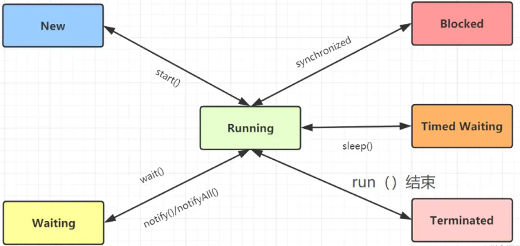
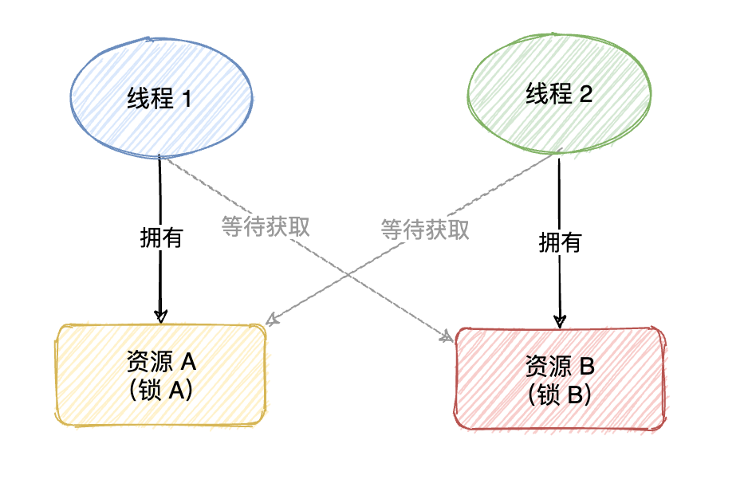
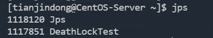
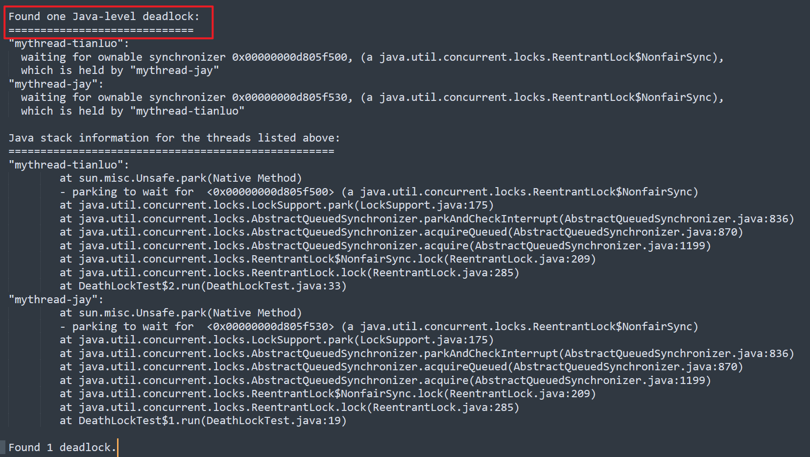
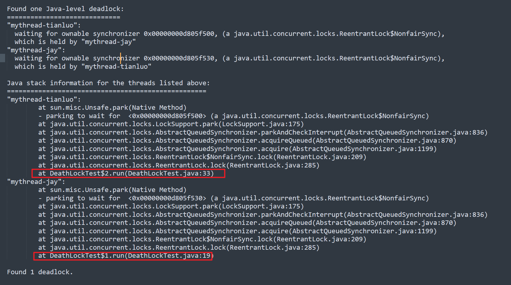
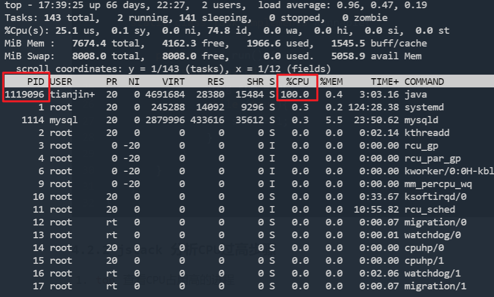
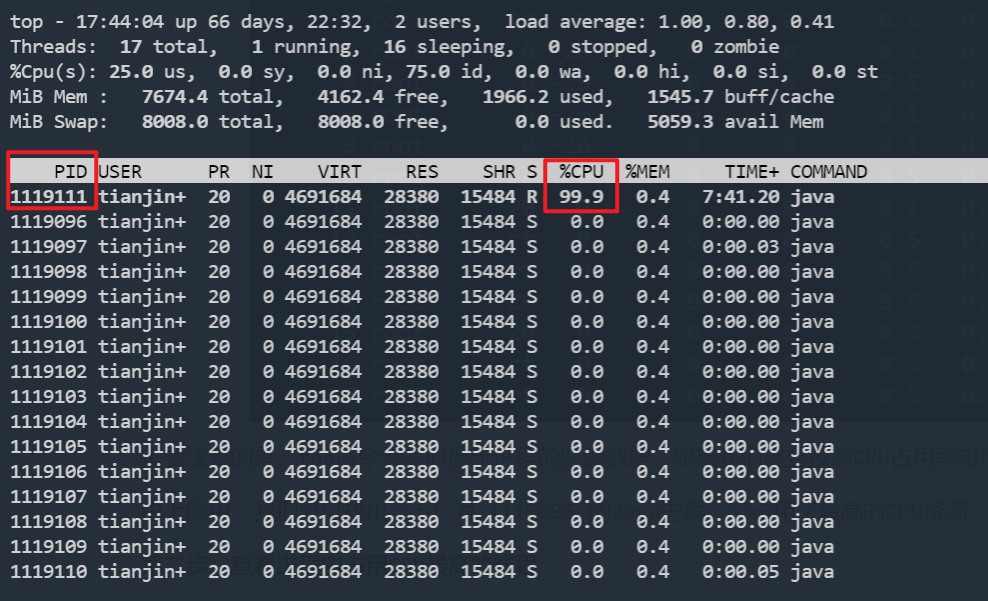
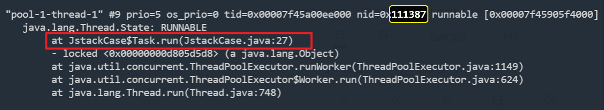

# jstack命令详解

## 一. 前言

如果有一天，你的Java程序长时间停顿，也许是它病了，需要用jstack拍个片子分析分析，才能诊断具体什么病症，是死锁综合征，还是死循环等其他病症，本文我们一起来学习jstack命令~

- jstack 的功能
- jstack用法
- 线程状态等基础回顾
- 实战案例1：jstack 分析死锁
- 实战案例2：jstack 分析CPU 过高

## 二. jstack 用法

jstack是JVM自带的Java堆栈跟踪工具，它用于打印出给定的java进程ID、core file、远程调试服务的Java堆栈信息。

语法格式：

```shell
jstack [ option ] pid 
jstack [ option ] executable core 
jstack [ option ] [server-id@]remote-hostname-or-IP 
```

option参数说明如下：

| 选项 | 作用                                                         |
| ---- | ------------------------------------------------------------ |
| -F   | 当正常输出的请求不被响应时，强制输出线程堆栈                 |
| -m   | 如果调用到本地方法的话，可以显示C/C++的堆栈                  |
| -l   | 除堆栈外，显示关于锁的附加信息，在发生死锁时可以用jstack -l pid来观察锁持有情况 |

## 三. 线程状态

jstack 用于生成线程快照的，我们分析线程的情况，需要复习一下线程状态吧，拿小凳子坐好，复习一下啦~



**Java语言定义了6种线程池状态：**

- New：创建后尚未启动的线程处于这种状态，不会出现在Dump中。
- RUNNABLE：包括Running和Ready。线程开启start（）方法，会进入该状态，在虚拟机内执行的。
- Waiting：无限的等待另一个线程的特定操作。
- Timed Waiting：有时限的等待另一个线程的特定操作。
- 阻塞（Blocked）：在程序等待进入同步区域的时候，线程将进入这种状态，在等待监视器锁。
- 结束（Terminated）：已终止线程的线程状态，线程已经结束执行。

**Dump文件的线程状态一般其实就以下3种：**

- RUNNABLE，线程处于执行中
- BLOCKED，线程被阻塞，在等待获取锁
- WAITING，线程正在等待

**Dump 文件分析关注重点**：

- runnable，线程处于执行中
- deadlock，死锁（重点关注）
- blocked，线程被阻塞 （重点关注）
- Parked，停止
- locked，对象加锁
- waiting，线程正在等待
- waiting to lock 等待上锁
- Object.wait()，对象等待中
- waiting for monitor entry 等待获取监视器（重点关注）
- Waiting on condition，等待资源（重点关注），最常见的情况是线程在等待网络的读写

## 四. 实战分析

### 4.1 死锁分析

#### 4.1.1 什么是死锁



死锁是指两个或两个以上的线程在执行过程中，因争夺资源而造成的一种互相等待的现象，若无外力作用，它们都将无法进行下去。

#### 4.1.2 模拟死锁发生

生产中我们如何察觉到死锁的发生呢？我们先看一段代码:

```java
import java.util.concurrent.locks.Lock;
import java.util.concurrent.locks.ReentrantLock;

/**
 * Java 死锁demo
 */
public class DeathLockTest {
    private static Lock lock1 = new ReentrantLock();
    private static Lock lock2 = new ReentrantLock();

    public static void deathLock() {
        Thread t1 = new Thread() {
            @Override
            public void run() {
                try {
                    lock1.lock();
                    System.out.println(Thread.currentThread().getName() + " get the lock1");
                    Thread.sleep(1000);
                    lock2.lock();
                    System.out.println(Thread.currentThread().getName() + " get the lock2");
                } catch (InterruptedException e) {
                    e.printStackTrace();
                }
            }
        };
        Thread t2 = new Thread() {
            @Override
            public void run() {
                try {
                    lock2.lock();
                    System.out.println(Thread.currentThread().getName() + " get the lock2");
                    Thread.sleep(1000);
                    lock1.lock();
                    System.out.println(Thread.currentThread().getName() + " get the lock1");
                } catch (InterruptedException e) {
                    e.printStackTrace();
                }
            }
        };
        //设置线程名字，方便分析堆栈信息
        t1.setName("mythread-jay");
        t2.setName("mythread-tianluo");
        t1.start();
        t2.start();
    }
    public static void main(String[] args) {
        deathLock();
    }
}
```

运行结果是：


显然，线程jay和线程tianluo都是只执行到一半，就陷入了阻塞等待状态~

#### 4.1.3 排查死锁的步骤

- 在终端中输入jsp查看当前运行的java程序
- 使用 jstack -l pid 查看线程堆栈信息
- 分析堆栈信息

**第一步：利用jps 命令，查看当前正在运行的Java进程PID**

```shell
jps
```



通过使用 jps 命令获取需要监控的进程的pid，我们找到了`1118120 DeathLockTest`

**第二步：使用 `jstack -l pid` 查看线程堆栈信息**

```shell
jstack -l 1117851
# 也可以使用管道命令，将命令的标准输出，输出至指定文件
jstack -l 1117851 > DeathLockTestJstack.txt
```

在 jstack 内容尾部，发现了死锁的关键字：



由上图，可以清晰看到**死锁**信息：

- mythread-tianluo 线程等待这个锁 “0x00000000d805f500”，这个锁是由于mythread-jay线程持有。
- mythread-jay 线程等待这个锁“0x00000000d805f530”，这个锁是由mythread-tianluo 线程持有。

**还原死锁真相**



通过死锁的堆栈信息，可以定位到死锁产生的具体代码行数，这样排查问题就易如反掌了。

### 4.2 CPU占用过高问题分析

#### 4.2.1 模拟CPU占用过高

来个导致CPU过高的demo程序，一个死循环，哈哈~

```java
import java.util.concurrent.ExecutorService;
import java.util.concurrent.Executors;

/**
 * 有个导致CPU过高程序的demo，死循环
 */
public class JstackCase {

    private static ExecutorService executorService = Executors.newFixedThreadPool(5);

    public static void main(String[] args) {

        Task task1 = new Task();
        Task task2 = new Task();
        executorService.execute(task1);
        executorService.execute(task2);
    }

    public static Object lock = new Object();

    static class Task implements Runnable{

        public void run() {
            synchronized (lock){
                long sum = 0L;
                while (true){
                    sum += 1;
                }
            }
        }
    }
}
```

#### 4.2.2 jstack 分析CPU过高步骤

1. `top` 查看CPU占用高的进程
2. `top -Hp pid` 查看指定进程中，线程对应的CPU占用情况
3. `jstack pid` 查看对应进程的堆栈 
4. 分析堆栈信息

**第一步：使用top命令查看CPU占用最高的进程PID**



需要注意的是，top命令会实时展示进程的监测数据，如果我们需要按照CPU占用率排序，只需要按一下 `Shift+C`

由上图中，我们可以找出 pid 为 1119096 的Java进程，它占用了最高的CPU资源，凶手就是它，哈哈！

**第二步：查看进程中占用CPU最高的线程**

```shell
top -Hp [pid]
```

通过 `top -Hp 1119096` 可以查看该进程下，各个线程的CPU使用情况，如下：



可以发现 PID 为 1119111 的线程，CPU资源占用最高，嘻嘻，小本本把它记下来，接下来拿 `jstack` 给它拍片子~

**第三步：通过 jstack 分析指定线程正在做啥**

```shell
jstack [PID]
# 输出到指定文件
jstack [PID] > xxxx.txt
```

我们将 jstack 输出到文件备用。然后把占用CPU资源较高的线程PID（本例子是1119111），将该PID转成16进制的值（0x111387）：


在thread dump中，每个线程都有一个nid，我们找到对应的nid（111387），发现一直在跑（27行）:



这个时候，可以去检查代码是否有问题啦~ 当然，也建议隔段时间再执行一次 `jstack` 命令，再一份获取thread dump，毕竟两次拍片结果（jstack）对比，更准确嘛~

