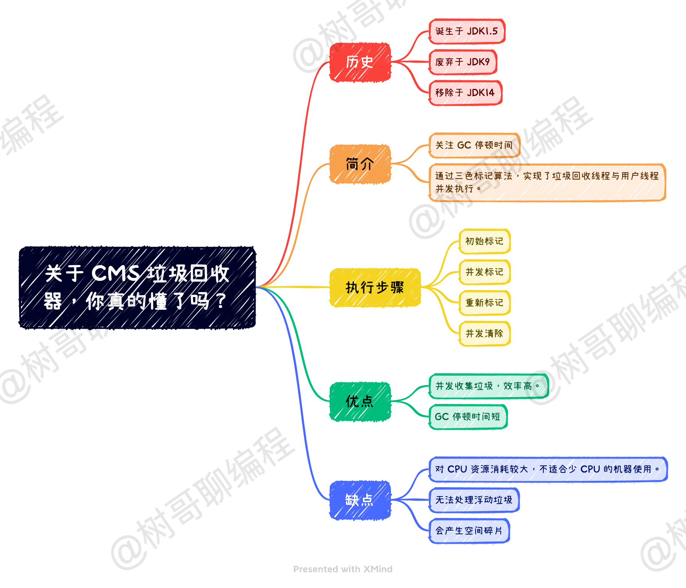
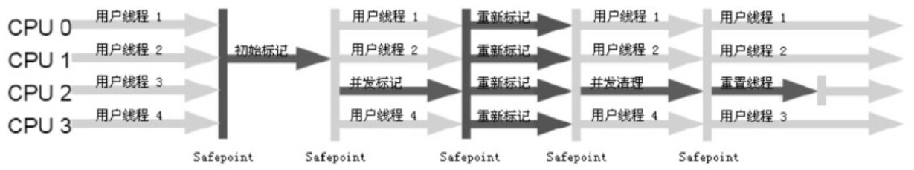

# CMS垃圾回收器

> 本文转载至：[关于 CMS 垃圾回收器，你真的懂了吗？ - 陈树义 - 博客园 (cnblogs.com)](https://www.cnblogs.com/chanshuyi/p/head-first-of-cms-gc.html)

## 一. CMS 回收器的历史

如果你是一个比较资深的 Java 开发者，那你或许会对 CMS 垃圾回收器嗤之以鼻，然后说一句：**CMS 垃圾回收器早就过时了，现在都流行 G1、ZGC 垃圾回收器了！学这个东西一点用都没有！**

确实如资深开发者所说，现在 CMS 垃圾回收器是比较过时的配置了。**CMS 垃圾回收器于 JDK1.5 时期推出，在 JDK9 中被废弃，在 JDK14 中被移除。** 而用来替换 CMS 垃圾回收器的便是我们常说的 G1 垃圾回收器。

但 G1 垃圾回收器也是在 CMS 的基础上进行改进的，因此简单了解下 CMS 垃圾回收器也是有必要的。

## 二. CMS 回收器简介

**CMS（Concurrent Mark Sweep）垃圾回收器是第一个关注 GC 停顿时间的垃圾收集器。** 在这之前的垃圾回收器，要么就是串行垃圾回收方式，要么就是关注系统吞吐量。这样的垃圾回收器对于强交互的程序很不友好，而 CMS 垃圾回收器的出现，则打破了这个尴尬的局面。因此，CMS 垃圾回收器诞生之后就受到了大家的欢迎，导致现在还有非常多的应用还在继续使用它。

CMS 垃圾回收器之所以能够实现对 GC 停顿时间的控制，其本质来源于对「根可达算法」的改进，即三色标记算法。在 CMS 垃圾回收器出现之前，无论是 Serious 垃圾回收器，还是 ParNew 垃圾回收器，亦或是 Parallel Scavenge 垃圾回收器，他们在进行垃圾回收的时候都需要 Stop the World，即无法实现垃圾回收线程与用户线程并发执行。**而 CMS 垃圾回收器通过三色标记算法，实现了垃圾回收线程与用户线程并发执行，从而极大地降低了系统响应时间，提高了强交互应用程序的体验。**

对于 CMS 垃圾回收器来说，其实通过「标记-清除」算法实现的，它的运行过程分为 4 个步骤，包括：

- 初始标记
- 并发标记
- 重新标记
- 并发清除

**初始标记，指的是寻找所有被 GCRoots 引用的对象，该阶段需要「Stop the World」。** 这个步骤仅仅只是标记一下 GC Roots 能直接关联到的对象，并不需要做整个引用的扫描，因此速度很快。

**并发标记，指的是对「初始标记阶段」标记的对象进行整个引用链的扫描，该阶段不需要「Stop the World」。** 对整个引用链做扫描需要花费非常多的时间，因此通过垃圾回收线程与用户线程并发执行，可以降低垃圾回收的时间，从而降低系统响应时间。这也是 CMS 垃圾回收器能极大降低 GC 停顿时间的核心原因，但这也带来了一些问题，即：并发标记的时候，引用可能发生变化，因此可能发生漏标（本应该被标记的对象，没有被正确地标记颜色，导致不应该回收的对象被回收）和多标（本不该被标记的对象，被错误地标记颜色，导致应该被回收的对象没有被回收）了。

**重新标记，指的是对「并发标记」阶段出现的问题进行校正，该阶段需要「Stop the World」。** 正如并发标记阶段说到的，由于垃圾回收算法和用户线程并发执行，虽然能降低响应时间，但是会发生漏标和多标的问题。所以对于 CMS 回收器来说，它需要这个阶段来做一些校验，解决并发标记阶段发生的问题。

**并发清除，指的是将标记为垃圾的对象进行清除，该阶段不需要「Stop the World」。** 在这个阶段，垃圾回收线程与用户线程可以并发执行，因此并不影响用户的响应时间。

从上面的描述步骤中我们可以看出：**CMS 之所以能极大地降低 GC 停顿时间，本质上是将原本冗长的引用链扫描进行切分。通过 GC 线程与用户线程并发执行，加上重新标记校正的方式，减少了垃圾回收的时间**。

## 三. CMS 回收器优缺点

从上面的描述我们可以知道，CMS 回收器的优点是：并发收集垃圾、低停顿。但其也有下面几个明显的缺点：

**对 CPU 资源消耗较大。** CMS 回收器在并发标记和并发清理阶段，是需要启用多个线程进行处理的，这就意味着它需要占用一部分线程资源，即 CPU 资源。默认情况下 CMS 启用的垃圾回收线程数是`（CPU数量 + 3)/4`，当 CPU 数量越大时，启用的垃圾回收线程数占比就越小。

但如果 CPU 数量越小，例如只有 2 个 CPU 时，垃圾回收线程占用就达到了 50%，也就是说需要拿 50% 的 CPU 时间来进行垃圾回收。这就会极大地降低系统的吞吐量，这是让人无法接受的情况。

**无法处理浮动垃圾。** 由于 CMS 并发标记阶段会发生漏标的情况，因此会有一些本该回收的垃圾对象无法被回收。此外，在 CMS 进行并发清理的时候，用户线程同时在运行，也会产生一些浮动垃圾。因此对于 CMS 回收器来说，其需要留出一些空间给这些浮动垃圾存储。

在 JDK1.5 的默认设置中，当老年代空间已用空间大于 68% 之后，CMS 垃圾回收器便会开始进行垃圾清理。这个数值相对比较保守一些，我们可以通过 `-XX:CMSInitiatingOccupancyFraction` 参数自行调节。在 JDK1.6 种，该阈值被提升至 92%。

如果在 CMS 运行期间发现预留的内存无法满足程序需要，就会提示「Concurrent Mode Failure」错误。此时虚拟机采用后备方案：临时启用 Serial Old 回收器来重新进行老年代的垃圾回收，这时候 Stop the World 的时间可能就会很长了。

**产生空间碎片。** 由于 CMS 是基于「标记-清除」算法实现的回收器，因此其会产生很多空间碎片，这会导致给大对象分配的时候很麻烦，会提前触发 Full GC。为了解决这个问题，CMS 回收器提供了 `-XX:+UseCMSCompactAtFullCollection` 参数来解决这个问题，意思是在空间不够的时候进行空间整理，这个参数默认是打开的。

该参数通常和 `-XX:CMSFullGCsBeforeCompaction` 一起使用，后者用于设置执行多少次不压缩的 Full GC 之后，跟着来一次带压缩的 Full GC（默认值是 0，表示每次进入 Full GC 时都进行碎片整理）。

## 四. 总结

CMS 回收器，诞生于 JDK1.5，失落于 JDK9，卒于 JDK14。它的诞生，开启了垃圾回收器专注于优化 GC 停顿时间的历史，随后的 G1、ZGC 都在 CMS 的基础之上改进、优化而来。

而 CMS 回收器之所以能实现对 GC 停顿时间的强力控制，全都归功于对于「根可达算法」的优化。其将串行的引用链扫描，拆分成了「初始标记」和「并发标记」两个阶段，从而极大地降低了 GC 停顿时间，最后再通过「重新标记」解决了并发执行产生的问题。