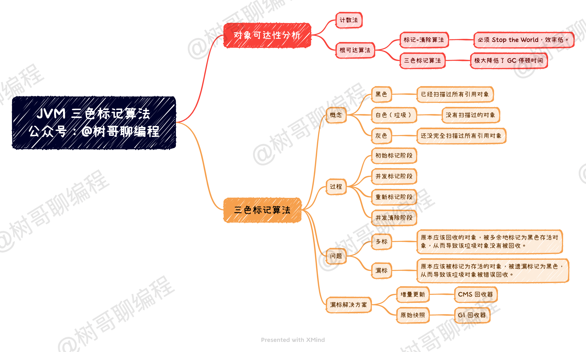
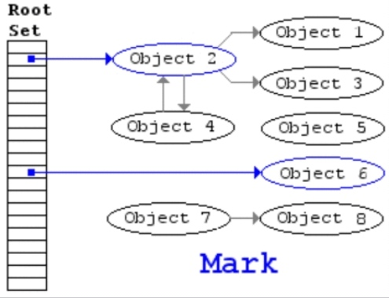
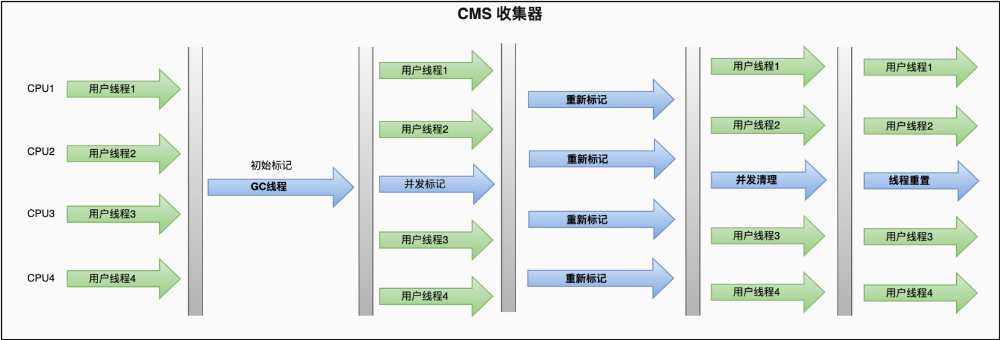
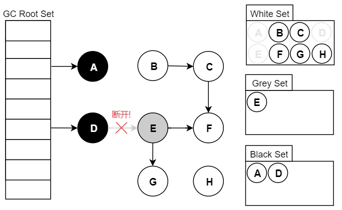
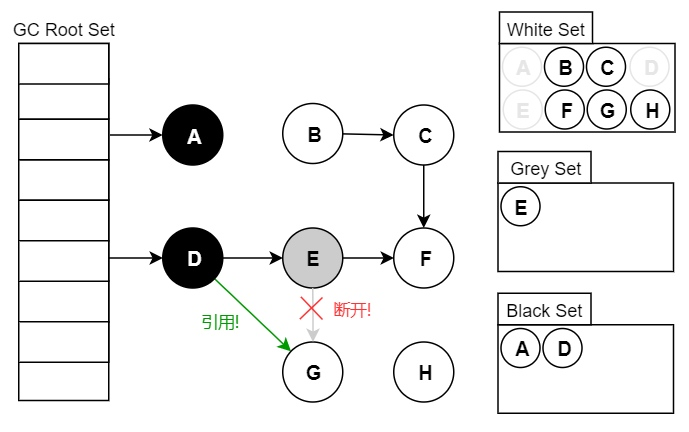

# 三色标记算法



## 一. 根可达算法

我们要进行垃圾回收，就需要弄明白哪些对象是需要回收的，哪些对象是不需要回收的。针对这个问题，其实业界已经有几种常见的解决方法了。

第一种是计数法，就是每个对象都有一个计数器，被引用了加一，移除引用减一。但这种方法比较麻烦，而且也会有循环依赖的问题，因此并不被广泛使用。第二种是根可达算法，即以 GCRoots 为基础去扫描整个引用链，从而找到所有的可达对象，那剩下的其他对象就是不可达的垃圾对象了。

**现在被广泛使用的是第二种算法，即根可达算法**。

那怎么去实现根可达算法呢？

**最简单的一种实现方案是：从　GCRoots 节点开始，使用「标记-清除」算法去实现**。

这种实现方案分为两个阶段，分别是：标记阶段、清除阶段。在标记阶段，它从 GCRoots 节点开始扫描整个引用链，找到所有可达的对象。在清除阶段，扫描整个引用链的不可达对象，然后将垃圾对象清除掉。整个算法实现过程如下图所示。



**但这种方式有一个很大的缺点：整个过程必须「Stop the World」。这就导致整个应用程序必须停止，不能做任何改变，这是非常不友好的。** CMS 回收器出现之前的所有回收器，都是用这种方式实现的，因此 GC 停顿时间都比轿长。

## 二. 三色标记法

为了解决上面「标记-清除」算法的问题，于是就出现了「三色标记算法」！

**三色标记算法指的是将所有对象分为白色、黑色和灰色三种类型**。

- 黑色: 表示对象已经被垃圾收集器访问过，且这个对象的所有引用都已经扫描过。黑色的对象代表已经扫描过，它是安全存活的对象， 如果有其他对象引用指向了黑色对象，无须重新扫描一遍。黑色对象不可能直接(不经过 灰色对象) 指向某个白色对象。
- 灰色: 表示对象已经被垃圾收集器访问过，但这个对象上至少存在一个引用还没有被扫描过。
- 白色: 表示对象尚未被垃圾收集器访问过。显然在可达性分析刚刚开始的阶段，所有的对象都是白色的，若在分析结束的阶段，仍然是白色的对象，即代表不可达，将被视为垃圾。

具体的标记过程如下：


1. 开始的时候，会任务所有的对象都是白色的；
2. 利用根可达算法将根下的引用对象都标记为灰色
3. 移动到灰色对象中，将本对象标记为黑色；
4. 将灰色对象中所有引用对象标记为灰色；
5. 重复第3第4步，直至扫完所有灰色对象；
6. 没有被标记位黑色的对象，就为mark sweep出来的垃圾对象可以进行回收。
   

但仅仅将对象划分成三个颜色还不够，真正关键的是：**实现根可达算法的时候，将整个过程拆分成了初始标记、并发标记、重新标记、并发清除四个阶段**。



- 初始标记阶段，指的是标记 GCRoots 直接引用的节点，将它们标记为灰色，这个阶段需要 「Stop the World」。
- 并发标记阶段，指的是从灰色节点开始，去扫描整个引用链，然后将它们标记为黑色，这个阶段不需要「Stop the World」。
- 重新标记阶段，指的是去校正并发标记阶段的错误，这个阶段需要「Stop the World」。
- 并发清除，指的是将已经确定为垃圾的对象清除掉，这个阶段不需要「Stop the World」。

对比一下「四阶段拆分」和「一段式」的实现方式，我们可以看出：**通过将最耗时的引用链扫描剥离出来作为并发标记阶段，将其与用户线程并发执行，从而极大地降低了 GC 停顿时间**。 但 GC 线程与用户线程并发执行，会带来新的问题：对象引用关系可能会发生变化，有可能发生多标和漏标问题。

## 三. 多标和漏标问题

**多标问题指的是原本应该回收的对象，被多余地标记为黑色存活对象，从而导致该垃圾对象没有被回收**。 多标问题会出现，是因为在并发标记阶段，有可能之前已经被标记为存活的对象，其引用被删除，从而变成了不可达对象。例如下图中，假设我们现在遍历到了节点 E，此时应用执行了 `objD.fieldE = null;`。那么此刻之后，对象 E、F、G 应该是被回收的。但因为节点 E 已经是灰色的，那么 E、F、G 节点都会被标记为存活的黑色状态，并不会被回收。



多标问题会导致内存产生浮动垃圾，但好在其可以再下次 GC 的时候被回收，因此问题还不算很严重。

**漏标问题指的是原本应该被标记为存活的对象，被遗漏标记为黑色，从而导致该垃圾对象被错误回收**。 例如下图中，假设我们现在遍历到了节点 E，此时应用执行如下代码。这时候因为 E 对象没有引用了 G 对象，因此扫描 E 对象的时候并不会将 G 对象标记为黑色存活状态。但由于用户线程的 D 对象引用了 G 对象，这时候 G 对象应该是存活的，应该标记为黑色。但由于 D 对象已经被扫描过了，不会再次扫描，因此 G 对象就被漏标了。

```java
var G = objE.fieldG; 
objE.fieldG = null;  // 灰色E 断开引用 白色G 
objD.fieldG = G;  // 黑色D 引用 白色G
```



漏标问题就非常严重了，其会导致存活对象被回收，会严重影响程序功能。

那么我们的垃圾回收器是怎么解决这个问题的呢？

答案是：**增加一个「重新标记」阶段。无论是在 CMS 回收器还是 G1 回收器，它们都在并发标记阶段之后，新增了一个「重新标记」阶段来校正「并发标记」阶段出现的问题**。 只是对于 CMS 回收器和 G1 回收器来说，它们解决的原理不同罢了。

## 四. 漏标解决方案

正如前面所说，三色标记算法会造成漏标和多标问题。但多标问题相对不是那么严重，而漏标问题才是最严重的。我们经过分析可以知道，漏标问题要发生需要满足如下两个充要条件：

1. 有至少一个黑色对象在自己被标记之后指向了这个白色对象
2. 所有的灰色对象在自己引用扫描完成之前删除了对白色对象的引用

只有当上面两个条件都满足，三色标记算法才会发生漏标的问题。换言之，如果我们破坏任何一个条件，这个白色对象就不会被漏标。**这其实就产生了两种方式，分别是：增量更新、原始快照。CMS 回收器使用的增量更新方案，G1 采用的是原始快照方案**。

### 4.1 CMS 解决方案

**CMS 回收器采用的是增量更新方案，即破坏第一个条件：「有至少一个黑色对象在自己被标记之后指向了这个白色对象」**。

既然有黑色对象在自己标记后，又重新指向了白色对象。那么我就把这个黑色对象的引用记录下来，在后续「重新标记」阶段再以这个黑色对象为根，对其引用进行重新扫描。通过这种方式，被黑色对象引用的白色对象就会变成灰色，从而变为存活状态。

这种方式有个缺点，就是会重新扫描新增的这部分黑色对象，会浪费多一些时间。但是这段时间相对于并发标记整个链路的扫描，还是小巫见大巫，毕竟真正发生引用变化的黑色对象是比较少的。

### 4.2 G1 解决方案

**G1 回收器采用的是原始快照的方案，即破坏第二个条件：「所有的灰色对象在自己引用扫描完成之前删除了对白色对象的引用」**。

既然灰色对象在扫描完成前删除了对白色对象的引用，那么我是否能在灰色对象取消引用之前，先将灰色对象引用的白色对象记录下来。随后在「重新标记」阶段再以白色对象为根，对它的引用进行扫描，从而避免了漏标的问题。通过这种方式，原本漏标的对象就会被重新扫描变成灰色，从而变为存活状态。

**这种方式有个缺点，就是会产生浮动垃圾**。 因为当用户线程取消引用的时候，有可能是真的取消引用，对应的对象是真的要回收掉的。这时候我们通过这种方式，就会把本该回收的对象又复活了，从而导致出现浮动垃圾。但相对于本该存活的对象被回收，这个代价还是可以接受的，毕竟在下次 GC 的时候就可以回收了。

**对于 CMS 和 G1 这两种处理方案哪种更好，很多资料说的是 G1 这种解决方案更好**。 原因是其觉得 G1 这种方式产生了一些浮动垃圾，但节省了一些时间。但我对比了一下发现：CMS 和 G1 都需要重新对某些元素进行引用链扫描。从这点看来，好像差别不大。有弄懂的朋友可以评论区留言讨论讨论。

## 五. 总结

看完了整篇文章，我们试图来回答一些问题。

**三色标记算法是什么**？ 三色标记算法是根可达算法的一种实现方案，其目的是为了找出所有可达对象。

**为什么要有三色标记算法**？ 因为传统的「标记-清除」算法效率太低，于是采用三色标记算法通过将对象分成白色、黑色、灰色，以及将整个过程拆分成「初始标记、并发标记、重新标记、并发清除」4 个过程，从而降低 GC 停顿时间。

**三色标记算法有什么缺陷**？ 三色标记算法会产生多标和漏标问题，其中漏标问题最严重。漏标问题会导致本该存活的对象被回收，从而导致严重的程序问题。

**漏标有什么解决方案**？ 漏标有两种解决方案，分别是：增量更新和原始快照方式。CMS 回收器采用了增量更新方式，G1 回收器采用了原始快照方式。

**漏标哪种解决方案最好**？ 江湖传闻 G1 回收器的原始快照方式效率高，但没有确切的理论证明，且听且珍惜。


> 本文参考至：
>
> - [一文带你弄懂 JVM 三色标记算法！ - 陈树义 - 博客园 (cnblogs.com)](https://www.cnblogs.com/chanshuyi/p/head-first-of-triple-color-marking-algorithm.html)
> - [12.垃圾收集底层算法--三色标记详解 - 腾讯云开发者社区-腾讯云 (tencent.com)](https://cloud.tencent.com/developer/article/1899143)