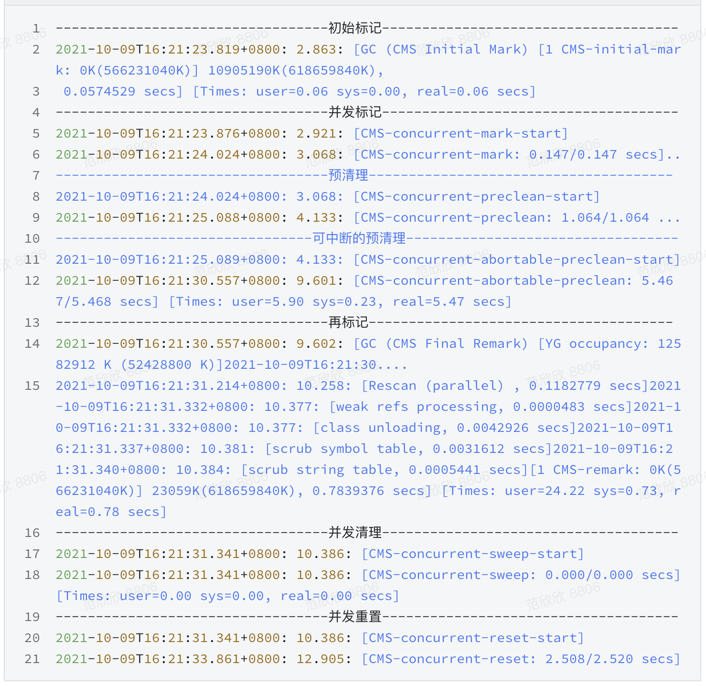
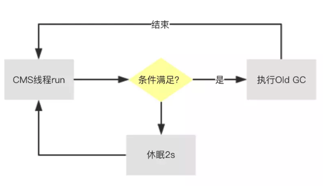
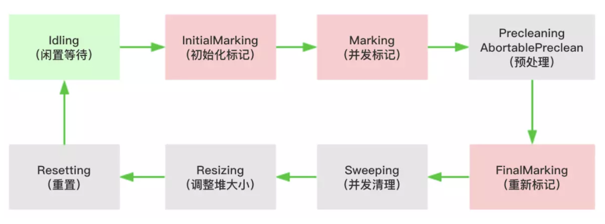

# 关于ParNew+CMS垃圾回收器的一些疑惑

## 一. 新生代GC（Minor GC）触发条件是什么？

应用程序在Eden区生成新对象，一旦Eden区满了之后就会触发新生代GC，新生代GC算法使用复制算法。复制算法对Eden区以及S0区的对象进行标记，标记出活跃对象，然后将活跃对象复制到S1区。复制算法不会产生内存碎片。对于标记算法中如何判断一个对象是活跃的还是不活跃的（垃圾对象），现在一般使用可达性分析算法。

## 二. 哪些对象会从新生代晋升到老年代

1. 躲过15次新生代GC后晋升到老年代（15是默认情况）。
2. 大对象直接进入老年代。
3. 动态对象年龄判断机制：假如当Survivor区中，相同年龄的对象总大小大于这Survivor区域总大小的50%，那么大于等于这批对象年龄的对象，在下次YGC后就会晋升到老年代。
4. YGC后存活对象太多超过Survivor区大小，通过分配担保机制晋升到老年代。（空间担保机制）

## 三. 什么是空间担保机制

JVM使用分代收集算法，将堆内存划分为年轻代和老年代，两块内存分别采用不同的垃圾回收算法，空间担保指的是老年代进行空间分配担保

在发生**Minor GC**之前，虚拟机会检查**老年代最大可用的连续空间**是否**大于新生代所有对象的总空间**，

如果大于，则此次**Minor GC是安全的**

如果小于，则虚拟机会查看 `HandlePromotionFailure` 设置值是否允许担保失败。如果 `HandlePromotionFailure=true`，那么会继续检查老年代最大可用连续空间是否大于**历次晋升到老年代的对象的平均大小**，如果大于，则尝试进行一次Minor GC，但这次Minor GC依然是有风险的；如果小于或者`HandlePromotionFailure=false`，则改为进行一次Full GC。

为什么要进行空间担保？

是因为新生代采用**复制收集算法**，假如大量对象在Minor GC后仍然存活（最极端情况为内存回收后新生代中所有对象均存活），而Survivor空间是比较小的，这时就需要老年代进行分配担保，把Survivor无法容纳的对象放到老年代。**老年代要进行空间分配担保，前提是老年代得有足够空间来容纳这些对象**，但一共有多少对象在内存回收后存活下来是不可预知的，**因此只好取之前每次垃圾回收后晋升到老年代的对象大小的平均值作为参考**。使用这个平均值与老年代剩余空间进行比较，来决定是否进行Full GC来让老年代腾出更多空间。

## 三. 老年代GC触发条件是什么

CMS GC存在两种模式，两种模式的触发时机并不一样，我们经常谈到CMS GC是指 CMS 中的 Background Collect 模式。

配置CMS垃圾回收的话，有两个重要参数：我们都知道`-XX:CMSInitiatingOccupancyFraction=75`、`-XX:+UseCMSInitiatingOccupancyOnly`，这两个参数表示只有在Old区占了75%的内存时才**满足触发CMS的条件**。注意这只是满足触发CMS GC的条件。至于什么时候真正触发CMS GC，由一个后台扫描线程决定。CMS Thread默认2秒钟扫描一次，判断是否需要触发CMS，这个参数可以更改这个扫描时间间隔，例如`-XX:CMSWaitDuration=5000`，此外可以通过jstack日志看到这个线程：

```csharp
"Concurrent Mark-Sweep GC Thread" os_prio=2 tid=0x000000001870f800 nid=0x0f4 waiting on condition
```



## 四. CMS GC的两种模式

> 参考：[CMS几种GC模式解读-感谢你假笨的指正 - 简书 (jianshu.com)](https://www.jianshu.com/p/be5389ca93f7)

CMS分为两种模式，background和foreground，background采用concurrent remark模式，可以和用户进程并行，而foreground则必须要stop the world（STW）。周期性的CMS采用的是background的方式，而主动的GC则采用foreground方式。

根据GC的触发机制分为：周期性Old GC（被动）和主动Old GC、个人理解，实在不知道怎么分才好。

### 4.1 Background Collect

周期性Old GC，执行的逻辑也叫Background Collect，对老年代进行回收，在GC日志中比较常见，由后台线程ConcurrentMarkSweepThread循环判断（默认2s）是否需要触发。



触发条件

1. 如果没有设置`-XX:+UseCMSInitiatingOccupancyOnly`，虚拟机会根据收集的数据决定是否触发（建议线上环境带上这个参数，不然会加大问题排查的难度）
2. 老年代使用率达到阈值 `-XX:CMSInitiatingOccupancyFraction`，默认92%
3. 永久代的使用率达到阈值 `-XX:CMSInitiatingPermOccupancyFraction`，默认92%，前提是开启 `CMSClassUnloadingEnabled`
4. 新生代的晋升担保失败(晋升担保失败触发Full GC)

### 4.2 Foreground Collect

这个名词第一次听笨神说的（公众号：**你假笨**）。当然笨神也不是随便自己捏造一个名词出来，这个名词来自于openjdk源码，参考`concurrentMarkSweepGeneration.cpp`：

```cpp
void CMSCollector::collect_in_foreground(bool clear_all_soft_refs, GCCause::Cause cause) {
    case Resizing: {
        // nothing to be done in this state. 即这个阶段啥都没做
        _collectorState = Resetting;
        break;
    }  
    case Precleaning:
        // 预清理啥都没干
    case AbortablePreclean:
        // Elide(省略，取消的意思，相当于这个阶段也啥都没做) the preclean phase
        _collectorState = FinalMarking;
        break;
    default:
        ShouldNotReachHere();
}
```

源码比较多，我就不全部贴出来的，有兴趣的同学可以自己下载源码查看。

它发生在请求Old区分配内存，但是内存不够了，于是就会触发一次 CMS Foreground Collect，这个过程就必须要等待内存分配成功后业务线程才能继续往下面走，因此整个过程必须STW，所以这种CMS Foreground Collect整个过程都是STW，但是为了提高效率，它并不是每个阶段都会走的，只走其中一些阶段，通过上面的源码可知，这些省下来的阶段主要是并行阶段：Precleaning、AbortablePreclean，Resizing。但不管怎么说如果走了类似foreground这种CMS GC，那么整个过程业务线程都是不可用的，效率会影响挺大。

触发时机：

- foreground collector 触发条件比较简单，一般是遇到对象分配但空间不够，就会直接触发 GC，来立即进行空间回收。采用的算法是 mark sweep，不压缩。

### 4.3 MSC

MSC的全称是**Mark Sweep Compact**，即标记-清理-压缩，**MSC是一种算法**，请注意Compact，即它会压缩整理堆，这一点很重要。

这是foreground CMS在特定情况下才会采用的一种垃圾回收算法。为什么这么说了，这里需要介绍两个参数，这两个参数表示多少次Full GC后采用MSC算法压缩堆内存，0表示每次Full GC后都会压缩，同时0也是默认值：

```objectivec
-XX:+UseCMSCompactAtFullCollection 
-XX:CMSFullGCsBeforeCompaction=0
```

配置`-XX:+UseCMSCompactAtFullCollection`（默认）前提下，如果`CMSFullGCsBeforeCompaction=0`，那么每次foreground CMS后都会采用MSC算法压缩堆内存；如果`CMSFullGCsBeforeCompaction=3`，那么每3次foreground CMS后才会有1次采用MSC算法压缩堆内存。

碎片问题也是CMS采用的标记清理算法最让人诟病的地方：**Backgroud CMS采用的标记清理算法会导致内存碎片问题，从而埋下发生FullGC导致长时间STW的隐患**。

所以如果触发了FullGC，无论是否会采用MSC算法压缩堆，那都是ParNew+CMS组合非常糟糕的情况。因为这个时候并发模式已经搞不定了，而且整个过程单线程，完全STW，可能会压缩堆（是否压缩堆通过上面两个参数控制），真的不能再糟糕了！想象如果这时候业务量比较大，由于FullGC导致服务完全暂停几秒钟，甚至上10秒，对用户体验影响得多大。

## 五. promotion failed & concurrent mode failure

### 5.1 promotion failed

从字面意思来看是晋升失败，是一次Minor GC进行时部分对象要晋升到老年代，但是老年代没有足够内存容纳这些对象导致FGC。

老年代空间不足可能是因为：

1. `XX:CMSInitiatingOccupancyFraction`设置的过大，导致老年代可用空间确实很小，导致晋升失败。
2. CMS是标记整理算法，会产生碎片，如果老年代存在大量的内存碎片，没有可用的连续空间容纳晋升对象就会导致晋升失败。

下面是一个promotion failed的一条gc日志：

```txt
106.641: [GC 106.641: [ParNew (promotion failed): 14784K->14784K(14784K), 0.0370328 secs]106.678: [CMS106.715: [CMS-concurrent-mark: 0.065/0.103 secs] [Times: user=0.17 sys=0.00, real=0.11 secs]
(concurrent mode failure): 41568K->27787K(49152K), 0.2128504 secs] 52402K->27787K(63936K), [CMS Perm : 2086K->2086K(12288K)], 0.2499776 secs] [Times: user=0.28 sys=0.00, real=0.25 secs]
```

发生 `promotion failed` 就证明老年代内存不足无法分配内存，就会立即触发Full GC (foreground collector)，导致整个回收过程都是STW。

### 5.2 concurrent mode failure

在CMS中，full gc 也叫 `The foreground collector`，对应的 cms gc 叫 `The background collector`。

当触发 cms gc 对老年代进行垃圾收集时，算法中会使用 `_collectorState` 变量记录执行状态，整个周期分成以下几个状态



- Idling: 一次 cms gc 生命周期的初始化状态。
- InitialMarking: 根据 gc roots，标记出直接可达的活跃对象，这个过程需要stw的。
- Marking: 根据 InitialMarking 阶段标记出的活跃对象，并发迭代遍历所有的活跃对象，这个过程可以和用户线程并发执行。
- Precleaning: 并发预清理。
- AbortablePreclean: 因为某些原因终止预清理。
- FinalMarking: 由于marking阶段是和用户线程并发执行的，该过程中可能有用户线程修改某些活跃对象的字段，指向了一个非标记过的对象，在这个阶段需要重新标记出这些遗漏的对象，防止在下一阶段被清理掉，这个过程也是需要stw的。
- Sweeping: 并发清理掉未标记的对象。
- Resizing: 如果有需要，重新调整堆大小。
- Resetting: 重置数据，为下一次的 cms gc 做准备。

在真正执行 Full GC 之前会判断一下 cms gc 的执行状态，如果 cms gc 正处于执行状态，调用`report_concurrent_mode_interruption()`方法，通知事件 `concurrent mode failure`，具体实现如下：

```c++
CollectorState first_state = _collectorState;
if (first_state > Idling) {
    report_concurrent_mode_interruption();
}
// 
void CMSCollector::report_concurrent_mode_interruption() {
  if (is_external_interruption()) {
    if (PrintGCDetails) {
      gclog_or_tty->print(" (concurrent mode interrupted)");
    }
  } else {
    if (PrintGCDetails) {
      gclog_or_tty->print(" (concurrent mode failure)");
    }
    _gc_tracer_cm->report_concurrent_mode_failure();
  }
}
```

**这里可以发现是 Full GC 导致了`concurrent mode failure`，而不是因为`concurrent mode failure` 错误导致触发 Full GC，真正触发 Full GC 的原因可能是 ygc 时发生的`promotion failure`**。

其实这里还有`concurrent mode interrupted`，这是由于外部因素触发了 Full GC，比如执行了`System.gc()`，导致了这个原因。


>[【大内存服务GC实践】- 一文看懂”ParNew+CMS”垃圾回收器 – 有态度的HBase/Spark/BigData (hbasefly.com)](http://hbasefly.com/2021/12/31/parnewcms1/)
>
>[CMS几种GC模式解读-感谢你假笨的指正 - 简书 (jianshu.com)](https://www.jianshu.com/p/be5389ca93f7)
>
>[图解CMS垃圾回收机制，你值得拥有 - 简书 (jianshu.com)](https://www.jianshu.com/p/2a1b2f17d3e4)
>
>[关于CMS垃圾收集算法的一些疑惑 - 简书 (jianshu.com)](https://www.jianshu.com/p/55670407fdb9)
>
>[Java中9种常见的CMS GC问题分析与解决 - 美团技术团队 (meituan.com)](https://tech.meituan.com/2020/11/12/java-9-cms-gc.html)
>
>[【JVM】空间分配担保机制 - 老杨的博客。 - 博客园 (cnblogs.com)](https://www.cnblogs.com/july-sunny/p/12618054.html)

