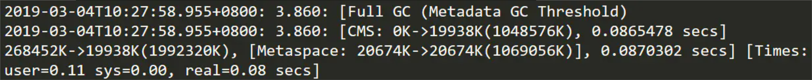
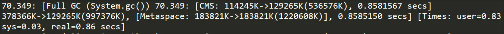

# ParNew+CMS GC日志详解

## 一. GC日志参数

JVM提供的几个主要的GC日志参数如下：

- **-verbose:gc**
   在虚拟机发生内存回收时在输出设备显示信息，格式如下：[Full GC 268K->168K(1984K), 0.0187390 secs]该参数用来监视虚拟机内存回收的情况。

- **-XX:+PrintGC**
   发生垃圾收集时打印简单的内存回收日志

- **-XX:+PrintGCDetails**
   发生垃圾收集时打印详细的内存回收日志

- **-XX:+PrintGCTimeStamps**
   输出GC的时间戳（以基准时间的形式，如49.459，默认就是这个输出形式，可以不写）

- **-XX:+PrintGCDateStamps**
   输出GC的时间戳（以以日期的形式，如2019-03-01T12:57:54.486+0800）

- **-XX:+PrintHeapAtGC**
   在进行GC的前后打印出堆的信息，经过个人实验，这个参数开启后只会在Minor GC的前后打印堆信息，而老年代CMS的Major GC前后则不会打印，不知道是什么原因。

- **-XX:+PrintGCApplicationStoppedTime**

  打印应用由于GC而产生的停顿时间

- **-Xloggc:../logs/gc.log**
   日志文件的输出路径

- **-XX:+UseGCLogFileRotation**

   此参数主要定义GC Log 的滚动功能，需要进行开启或关闭，其通常基于第3条的    

- **-XX:NumberOfGCLogFiles=10**

  此参数主要定义滚动日志文件的个数，此参数值必须大于等于1，对应的日志文件命名策略为：`<filename>.0`、`<filename>.1`、 ... 、 `<filename>.n-1`等，其中 n 是该参数的值。

- **-XX:GCLogFileSize=512k**

   此参数主要定义滚动日志文件的大小，必须大于 8k，当前写日志文件大小超过该参数值时，日志将写入下一个文件，依次类推。`UseGCLogFileRotation`、`NumberOfGCLogFiles`、`GCLogFileSize` 三个参数需配合使用。

  > `UseGCLogFileRotation`、`NumberOfGCLogFiles`、`GCLogFileSize` 三个参数分割日志文件看似很美好，几行配置就搞定了输出文件的问题。但是这种方式有一些问题：
  >
  > 1. -Xloggc 方式指定的日志文件，是覆盖写的方式，每次启动都会覆盖，历史日志会丢失
  > 2. 当超过最大分割数后，会从第0个文件开始重新写入，而且是覆盖
  > 3. -XX:NumberOfGCLogFiles 并不能设置为无限
  >
  > 这个覆盖的问题就有点恶心了，每次启动覆盖之前的历史日志……这谁能忍？
  >
  > 于是有另一种解决方案。不使用 JVM 提供的日志分割功能，而是每次启动用时间戳命名日志文件，这样可以每次启动都使用不同的文件，就不会出现覆盖的问题了。
  >
  > ```txt
  > # 使用-%t作为日志文件名
  > -XX:+PrintGCDetails -XX:+PrintGCDateStamps -Xloggc:/path/to/gc-%t.log
  > 
  > # 生成的文件名是这种：gc-2021-03-29_20-41-47.log
  > ```
  >
  > 虽然没有覆盖的问题，但由于没有日志分割的功能，每次启动后只有一个GC日志文件，单个日志文件可能会非常巨大。过大的日志文件分析起来是很麻烦的，必须得分割。
  >
  > 这里只需要稍微调整一下策略，将 JVM 分割和时间戳命名两种方案结合，就可以得到**最优的方式**了。
  >
  > ```txt
  > # GC日志输出的文件路径
  > -Xloggc:/path/to/gc-%t.log
  > # 开启日志文件分割
  > -XX:+UseGCLogFileRotation 
  > # 最多分割几个文件，超过之后从头开始写
  > -XX:NumberOfGCLogFiles=14
  > # 每个文件上限大小，超过就触发分割
  > -XX:GCLogFileSize=100M
  > ```
  >
  > 配置时间戳作文 GC 日志文件名的同时，也配置JVM的GC日志分割策略。这样一来，既保证了 GC 文件不会被覆盖，又保证了单个 GC 文件的大小不会过大，完美！
  >
  > 最终得到的日志文件名会像这个样子：
  >
  > 1. gc-2021-03-29_20-41-47.log.0
  > 2. gc-2021-03-29_20-41-47.log.1
  > 3. gc-2021-03-29_20-41-47.log.2
  > 4. gc-2021-03-29_20-41-47.log.3
  > 5. ....

GC日志参数推荐：

```shell
-XX:+PrintGCDetails
-XX:+PrintGCDateStamps 
-XX:+PrintGCTimeStamps
-Xloggc: /path/to/gc-%t.log
-XX:+UseGCLogFileRotation
-XX:NumberOfGCLogFiles=15 
-XX:GCLogFileSize=32M 
```

## 二. GC日志内容解读

由于日志内容过长，一下子全展示出来太乱而不方便阅读，这里对日志中每个不用的现象输出分别做出讲解。

首先文件的最开头的信息如下：

```txt
Java HotSpot(TM) 64-Bit Server VM (25.201-b09) for linux-amd64 JRE (1.8.0_201-b09), built on Dec 15 2018 11:35:59 by "java_re" with gcc 7.3.0
```

这个很好理解，就是显示了当前程序运行的环境，当前的jdk版本为1.8。

接下来的输出信息如下：

```txt
CommandLine flags: -XX:GCLogFileSize=33554432 -XX:InitialHeapSize=4294967296 -XX:InitialRAMPercentage=50.000000 -XX:MaxHeapSize=6442450944 -XX:MaxNewSize=1073741824 -XX:MaxRAMPercentage=75.000000 -XX:MaxTenuringThreshold=6 -XX:NewSize=1073741824 -XX:NumberOfGCLogFiles=15 -XX:OldPLABSize=16 -XX:+PrintCommandLineFlags -XX:+PrintGC -XX:+PrintGCDateStamps -XX:+PrintGCDetails -XX:+PrintGCTimeStamps -XX:+UseCompressedClassPointers -XX:+UseCompressedOops -XX:+UseConcMarkSweepGC -XX:+UseGCLogFileRotation -XX:+UseParNewGC
```

这部分显示了这次JVM的启动参数配置。

再下面就是应用的GC信息了，不同的内存区域（新生代和老年代）发生的GC日志信息有所不同，下面一一举例。

### 2.1 Minor GC日志信息

```txt
2022-11-22T11:33:54.602+0800: 6.931: [GC (Allocation Failure) 2022-11-22T11:33:54.602+0800: 6.931: [ParNew: 838912K->28433K(943744K), 0.0432742 secs] 838912K->28433K(4089472K), 0.0433754 secs] [Times: user=0.09 sys=0.01, real=0.04 secs]
```

最前面的 `2022-11-22T11:33:54.602+0800: 6.931:` 是固定的，`2022-11-22T11:33:54.602+0800` 表示GC发生的日期花间，`6.931`表示本次GC与JVM启动时的相对时间，单位为秒。

`[GC (Allocation Failure)`这里的`GC`表示这是一次垃圾回收，但并不能单凭这个就判断这是依次Minor GC，下文会说到CMS的标识为`[GC (CMS Initial Mark)`和`[GC (CMS Final Remark)`，同样是GC，CMS的却是是Major GC；括号中的`Allocation Failure`表示GC的原因（GC Cause），新生代内存不足而导致新对象内存分配失败。

再后面的 `[ParNew:` 表示本次GC使用的垃圾收集器为 `ParNew`，我们知道 `ParNew` 是针对新生代的垃圾收集器，从这可以看出本次GC是Minor GC。后面紧跟着的`838912K->28433K(943744K)`的含义是 “GC前该内存区域已使用容量 -> GC后该内存区域已使用容量（该内存区域总容量）”，再后面的`0.0432742 secs`表示该内存区域GC所占用的时间，单位为秒。

再后面的`838912K->28433K(4089472K), 0.0433754 secs`表示收集前后整个堆的使用情况，` 0.0433754 secs`表示本次GC的总耗时，包括把年轻代的对象转移到老年代的时间。

最后的`[Times: user=0.09 sys=0.01, real=0.04 secs]`表示GC事件在不同维度的耗时，单位为秒。这里面的user、sys和real与Linux的time命令所输出的时间含义一致，分别表示用户态消耗的CPU时间、内核态消耗的CPU时间和操作从开始到结束所经过的等待耗时，例如等待磁盘I/O、等待线程阻塞，而CPU时间不包括这些耗时，但当系统有多CPU或者多核的话，多线程操作会叠加这些CPU时间，所以有时候user或sys时间超过real时间也是完全正确的。

### 2.2 Major GC日志信息

这里先要明确Minor GC、Major GC和Full GC的区别：

- **Minor GC：**针对年轻代的垃圾回收
- **Major GC：**针对老年代的垃圾回收。
- **Full GC：**针对整个堆（包括年轻代和老年代）的垃圾回收，而且会将年轻代存活的对象全部转移到老年代。

老年代由CMS收集器执行的Major GC相对比较复杂，包括初始标记、并发标记、重新标记和并发清除4个阶段，下面的GC日志也详细地描述了各个阶段的信息。

> 由于换行展示的原因，我将每一行GC日志后都增加了一个空行，方便查看

```txt
# 初始标记阶段
2022-11-22T11:34:48.135+0800: 60.464: [GC (CMS Initial Mark) [1 CMS-initial-mark: 40734K(3145728K)] 817970K(4089472K), 0.1438277 secs] [Times: user=0.57 sys=0.00, real=0.14 secs]

# 并发标记阶段
2022-11-22T11:34:48.279+0800: 60.608: [CMS-concurrent-mark-start]

2022-11-22T11:34:48.472+0800: 60.800: [CMS-concurrent-mark: 0.192/0.193 secs] [Times: user=0.48 sys=0.00, real=0.19 secs]

2022-11-22T11:34:48.472+0800: 60.800: [CMS-concurrent-preclean-start]

2022-11-22T11:34:48.481+0800: 60.810: [CMS-concurrent-preclean: 0.010/0.010 secs] [Times: user=0.03 sys=0.00, real=0.01 secs]

2022-11-22T11:34:48.482+0800: 60.810: [CMS-concurrent-abortable-preclean-start]

# 这里发生了一次Minor GC
2022-11-22T11:34:49.474+0800: 61.803: [GC (Allocation Failure) 2022-11-22T11:34:49.474+0800: 61.803: [ParNew: 898603K->48097K(943744K), 0.0980646 secs] 939338K->90840K(4089472K), 0.0982206 secs] [Times: user=0.30 sys=0.00, real=0.10 secs]
 CMS: abort preclean due to time 2022-11-22T11:34:53.572+0800: 65.900: [CMS-concurrent-abortable-preclean: 4.536/5.090 secs] [Times: user=12.49 sys=0.21, real=5.10 secs]
 
# 重标记阶段（重标记阶段这一块日志，在GC日志中是一行，为了方便查看，我做了换行展示）
2022-11-22T11:34:53.572+0800: 65.901: [GC (CMS Final Remark) [YG occupancy: 474194 K (943744 K)]
2022-11-22T11:34:53.572+0800: 65.901: [Rescan (parallel) , 0.1845676 secs]
2022-11-22T11:34:53.757+0800: 66.086: [weak refs processing, 0.0000607 secs]
2022-11-22T11:34:53.757+0800: 66.086: [class unloading, 0.0760438 secs]
2022-11-22T11:34:53.833+0800: 66.162: [scrub symbol table, 0.0206200 secs]
2022-11-22T11:34:53.854+0800: 66.182: [scrub string table, 0.0025696 secs]
[1 CMS-remark: 42742K(3145728K)] 516937K(4089472K), 0.2866598 secs] [Times: user=0.36 sys=0.00, real=0.28 secs]

#并发清除阶段
2022-11-22T11:34:53.859+0800: 66.188: [CMS-concurrent-sweep-start]

2022-11-22T11:34:53.882+0800: 66.211: [CMS-concurrent-sweep: 0.023/0.023 secs] [Times: user=0.09 sys=0.00, real=0.03 secs]

2022-11-22T11:34:53.882+0800: 66.211: [CMS-concurrent-reset-start]

2022-11-22T11:34:53.895+0800: 66.224: [CMS-concurrent-reset: 0.013/0.013 secs] [Times: user=0.06 sys=0.00, real=0.01 secs]
```

#### 2.2.1 初始标记阶段（CMS initial mark）

```txt
2022-11-22T11:34:48.135+0800: 60.464: [GC (CMS Initial Mark) [1 CMS-initial-mark: 40734K(3145728K)] 817970K(4089472K), 0.1438277 secs] [Times: user=0.57 sys=0.00, real=0.14 secs]
```

`[GC (CMS Initial Mark)`表示这是CMS开始对老年代进行垃圾圾收集的初始标记阶段，该阶段从垃圾回收的“根对象”开始，且只扫描直接与“根对象”直接关联的对象，并做标记，需要暂停用户线程（Stop The Word，下面统称为STW），速度很快。`40734K(3145728K)`表示当前老年代的容量为3145728K，在使用了40734K时开始进行CMS垃圾回收。

后面的`817970K(4089472K), 0.1438277 secs`表示当前整个堆的内存使用情况和本次初始标记耗费的时间，最后的`[Times: user=0.00 sys=0.00, real=0.00 secs]`上文已经讲过，下文将不再重复。

#### 2.2.2 并发标记阶段（CMS concurrent mark）

```txt
# 并发标记阶段
2022-11-22T11:34:48.279+0800: 60.608: [CMS-concurrent-mark-start]

2022-11-22T11:34:48.472+0800: 60.800: [CMS-concurrent-mark: 0.192/0.193 secs] [Times: user=0.48 sys=0.00, real=0.19 secs]

2022-11-22T11:34:48.472+0800: 60.800: [CMS-concurrent-preclean-start]

2022-11-22T11:34:48.481+0800: 60.810: [CMS-concurrent-preclean: 0.010/0.010 secs] [Times: user=0.03 sys=0.00, real=0.01 secs]

2022-11-22T11:34:48.482+0800: 60.810: [CMS-concurrent-abortable-preclean-start]

# 这里发生了一次Minor GC
2022-11-22T11:34:49.474+0800: 61.803: [GC (Allocation Failure) 2022-11-22T11:34:49.474+0800: 61.803: [ParNew: 898603K->48097K(943744K), 0.0980646 secs] 939338K->90840K(4089472K), 0.0982206 secs] [Times: user=0.30 sys=0.00, real=0.10 secs]
 CMS: abort preclean due to time 2022-11-22T11:34:53.572+0800: 65.900: [CMS-concurrent-abortable-preclean: 4.536/5.090 secs] [Times: user=12.49 sys=0.21, real=5.10 secs]
```

该阶段进行了细分，但都是和用户线程并发进行的

- `[CMS-concurrent-mark`表示并发标记阶段，会遍历整个年老代并且标记活着的对象，后面的`0.192/0.193 secs`表示该阶段持续的时间和时钟时间，耗时0.19秒，可见耗时是比较长的。由于该阶运行的过程中用户线程也在运行，这就可能会发生这样的情况，已经被遍历过的对象的引用被用户线程改变，如果发生了这样的情况，JVM就会标记这个区域为Dirty Card。

- `[CMS-concurrent-preclean`阶段会把上一个阶段被标记为Dirty Card的对象以及可达的对象重新遍历标记，完成后清楚Dirty Card标记。另外，一些必要的清扫工作也会做，还会做一些final remark阶段需要的准备工作。

- `[CMS-concurrent-abortable-preclean`并发预清理，这个阶段尝试着去承担接下来STW的Final Remark阶段足够多的工作，由于这个阶段是重复的做相同的事情直到发生aboart的条件（比如：重复的次数、多少量的工作、持续的时间等等）之一才会停止。这个阶段很大程度的影响着即将来临的Final Remark的停顿。从后面的`4.536/5.090 sec`显示这个阶段持续了5秒多的时间，相当的长。

#### 2.2.3 重新标记阶段（CMS remark）

```txt
# 重标记阶段（重标记阶段这一块日志，在GC日志中是一行，为了方便查看，我做了换行展示）
2022-11-22T11:34:53.572+0800: 65.901: [GC (CMS Final Remark) [YG occupancy: 474194 K (943744 K)]
2022-11-22T11:34:53.572+0800: 65.901: [Rescan (parallel) , 0.1845676 secs]
2022-11-22T11:34:53.757+0800: 66.086: [weak refs processing, 0.0000607 secs]
2022-11-22T11:34:53.757+0800: 66.086: [class unloading, 0.0760438 secs]
2022-11-22T11:34:53.833+0800: 66.162: [scrub symbol table, 0.0206200 secs]
2022-11-22T11:34:53.854+0800: 66.182: [scrub string table, 0.0025696 secs]
[1 CMS-remark: 42742K(3145728K)] 516937K(4089472K), 0.2866598 secs] [Times: user=0.36 sys=0.00, real=0.28 secs]
```

该阶段同样被细分为多个子阶段：

- `[GC (CMS Final Remark)`表示这是CMS的重新标记阶段，会STW，该阶段的任务是完成标记整个年老代的所有的存活对象，尽管先前的pre clean阶段尽量应对处理了并发运行时用户线程改变的对象应用的标记，但是不可能跟上对象改变的速度，只是为final remark阶段尽量减少了负担。
-  `[YG occupancy: 474194 K (943744 K)]`表示年轻代当前的内存占用情况，通常Final Remark阶段要尽量运行在年轻代是足够干净的时候，这样可以消除紧接着的连续的几个STW阶段。
- `[Rescan (parallel) , 0.1845676 secs]`这是整个final remark阶段扫描对象的用时总计，该阶段会重新扫描CMS堆中剩余的对象，重新从“根对象”开始扫描，并且也会处理对象关联。本次扫描共耗时 0.1845676s。
- `[weak refs processing, 0.0000607 secs]`第一个子阶段，表示对弱引用的处理耗时为0.0000607s。
- `[class unloading, 0.0368915 secs]`第二个子阶段，表示卸载无用的类的耗时为0.0368915s。
- `[scrub symbol table, 0.0486196 secs]`最后一个子阶段，表示清理分别包含类级元数据和内部化字符串的符号和字符串表的耗时。
- `[1 CMS-remark: 42742K(3145728K)]`表示经历了上面的阶段后老年代的内存使用情况。再后面的`516937K(4089472K), 0.2866598 secs`表示final remark后整个堆的内存使用情况和整个final remark的耗时。

#### 2.2.4 并发清除阶段（CMS concurrent sweep）

```txt
#并发清除阶段
2022-11-22T11:34:53.859+0800: 66.188: [CMS-concurrent-sweep-start]

2022-11-22T11:34:53.882+0800: 66.211: [CMS-concurrent-sweep: 0.023/0.023 secs] [Times: user=0.09 sys=0.00, real=0.03 secs]

2022-11-22T11:34:53.882+0800: 66.211: [CMS-concurrent-reset-start]

2022-11-22T11:34:53.895+0800: 66.224: [CMS-concurrent-reset: 0.013/0.013 secs] [Times: user=0.06 sys=0.00, real=0.01 secs]
```

该阶段和用户线程并发执行，不会STW，作用是清除之前标记阶段没有被标记的无用对象并回收内存。整个过程分为两个子阶段。

`CMS-concurrent-sweep`第一个子阶段，任务是清除那些没有标记的无用对象并回收内存。后面的参数是耗时，不再多提。

`CMS-concurrent-reset`第二个子阶段，作用是重新设置CMS算法内部的数据结构，准备下一个CMS生命周期的使用。

这里再讲一个小知识点，我们上面提到CMS收集器会在老年代内存使用到一定程度时就触发垃圾回收，这是因为CMS收集器的一个缺陷导致的这种设定，也就是无法处理“浮动垃圾”，“浮动垃圾”就是指标记清除阶段用户线程运行产生的垃圾，而这部分对象由于没有做标记处理所以在本次CMS收集中是无法处理的。如果CMS是在老年代空间快用完时才启动垃圾回收，那很可能会导致在并发阶段由于用户线程持续产生垃圾而导致老年代内存不够用而导致“Concurrent Mode Failure”失败，那这时候虚拟机就会启用后备预案，临时启用Serial Old收集器来重新进行老年代的垃圾收集，Serial Old是基于“标记-整理”算法的单线程收集器，这样停顿时间就会很长。这个CMS启动的内存使用阈值可以通过参数`-XX:CMSInitiatiingOccupancyFranction`来设置。

## 2.3 Full GC日志信息

#### 2.3.1 由于元空间内存不足而引发的Full GC

这里还有一种Full GC日志也比较容易出现，如下：



通过`[Full GC (Metadata GC Threshold)`我们知道这是一次针对整个堆（包括年轻代和老年代）的Full GC，括号中的`Metadata GC Threshold`说明了gc发生的原因，是因为元空间内存不足够而产生扩容导致的GC，同样的我们还可以通过后面的`[CMS: 0K->19938K(1048576K)`看出在老年代内存使用为0的时候就发生了Full GC，所以可以确定不是因为老年代内存不够用而发生的gc。

再后面的`[Metaspace: 20674K->20674K(1069056K)]`表示这次gc前后的元空间（Metaspace）内存变化，元空间的最大容量为1069056K，约等于1G，疑问便来了，最大容量为1G，已使用才20670K，为什么会不够用？

从JDK8开始，方法区采用元空间（Metaspace）的概念来实现，原来的永久代(PermGen)实现被废弃。元空间并不在虚拟机中，而是使用本地内存，默认情况下，元空间的大小仅受本地内存限制。可以通过下面的参数来指定元空间的大小：

- **-XX:MetaspaceSize：**初始空间大小，达到该值就会触发垃圾收集进行类型卸载，同时GC会对该值进行调整：如果释放了大量的空间，就适当降低该值；如果释放了很少的空间，那么在不超过MaxMetaspaceSize时，适当提高该值。
   可以通过在命令行输入`java -XX:+PrintFlagsInitial`命令查看到默认初始值为21810376B（约为20.8M）。
- **-XX:MaxMetaspaceSize：**最大空间，默认是没有限制的，根据机器实际内存而定。

还有几个参数也值得我们关注：

- **-XX:MinMetaspaceFreeRatio：**在GC之后，会计算当前Metaspace的空闲空间比，空闲内存小于该值时就会为其扩容，默认为40，即40%。
- **-XX:MaxMetaspaceFreeRatio：**在GC之后，会计算当前Metaspace的空闲空间，空闲空间大于该值时就会缩小Metaspace的空间，默认为70，即70%。
- **-XX:MinMetaspaceExpansion：**元空间每次扩容的最小幅度，默认为340784B（约为332.8K）。
- **-XX:MaxMetaspaceExpansion：**元空间每次扩容的最大幅度，默认为5452592B（大约为5MB）。

所以我们只要根据实际情况将元空间的初始值设置的大一点就可以避免这种Full GC。

#### 2.3.2 程序中调用System.gc()而引发的Full GC

还有一种gc日志，虽然不多见，但也在我这次启动中出现了，如下:



`[Full GC (System.gc())`说明这是一次Full GC，是由于调用System.gc()触发的。
 后面的`[CMS: 114245K->129265K(536576K)`表示这次gc后老年代内存占用由114245K上涨到了**129265K**，注意，这并不能说明没有对老年代进行回收；再后面的`378366K->129265K(997376K)`表示这次gc后整个堆空间大小缩小到了**129265K**，正好等于老年代的使用量，所以可以推断这次Full GC回收了年轻代的内存，并将存活的对象全部移到了老年代。


> [理解CMS GC日志 - 简书 (jianshu.com)](https://www.jianshu.com/p/ba768d8e9fec)
>
> [GC之详解CMS收集过程和日志分析 - 凌渡冰 - 博客园 (cnblogs.com)](https://www.cnblogs.com/zhangxiaoguang/p/5792468.html)
>
> [GC 日志打印的最佳实践 - 掘金 (juejin.cn)](https://juejin.cn/post/6949885566536138783)
>
> [JVM入门教程第14讲：JVM参数之GC日志配置 - 陈树义 - 博客园 (cnblogs.com)](https://www.cnblogs.com/chanshuyi/p/jvm_serial_14_jvm_param_gc_log.html)

