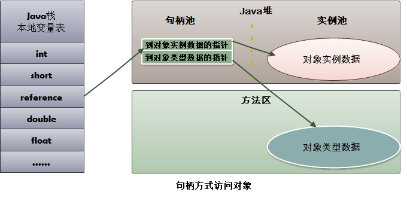
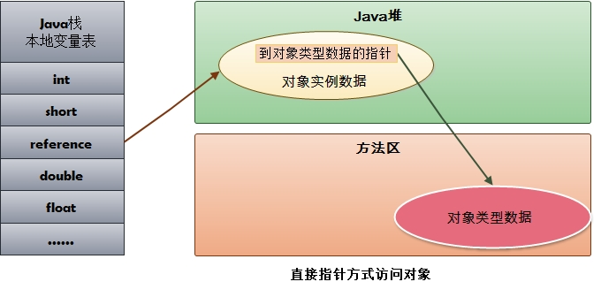

# Java虚拟机的内存区域划分

Java虚拟机在执行Java程序的过程中会把它所管理的内存划分为若干个不同的数据区域：

## 一. 基本划分

### 1.1 程序计数器（Program Counter Register）

程序计数器是一块较小的内存空间，它的作用可以看做是当前线程所执行的字节码的行号指示器。

由于Java虚拟机的多线程是通过线程轮流切换并分配处理时间的方式来实现的，在任何一个确定的时刻，一个处理器（对于多核处理器是一个内核）只会执行一条线程的指令。因此为了线程切换后能恢复到正确的执行位置，**每条线程都需要一个独立的程序计数器**。

如果线程正在执行的是一个Java方法，这个计数器记录的是正在执行的字节码的指令的地址；如果正在执行的是一个Native方法，这个计数器则为空（Undefined）。

**此内存区域是唯一一个在Java虚拟机规范中没有规定任何`OutOfMemoryError`情况的区域**。

### 1.2 虚拟机栈（Java Virtual Machine Stacks）

**线程私有**，生命周期和线程，每个方法在执行的时候都会同时创建一个**栈帧**（Stack Frame）用于存储**局部变量表**，**操作数栈**，**动态链接**，**方法出口**等信息。方法的执行就对应着栈帧在虚拟机栈中入栈和出栈的过程；栈里面存放着各种基本数据类型和对象的引用（-Xss） 

#### 1.2.1局部变量表

局部变量存放了编译期可知的各种数据类型（boolean、byte、char、short、int、float、long、double）、对象引用（reference类型，它不同于对象本身，根据不同的虚拟机实现，它可能是指向对象起始地址的引用指针，也可能指向一个代表对象的句柄）和returnAddress类型（指向了一条字节码指令的地址）。

其中64为长度的long和double的数据会占用两个局部变量空间（Slot），其余的数据类型只会占用一个。局部变量表所需的内存空间在编译时就会完全确定，在方法运行期间不会改变局部变量表的大小。

在Java虚拟机规范中，对这个区域规定了两种异常情况；如果线程请求的栈深度大于虚拟机允许的深度，将会抛出`StackOverflowError`异常；如果虚拟机栈可以动态扩展（当前大部分的Java虚拟机都是可以动态扩展的，只不过Java虚拟机规范中也允许固定长度的虚拟机栈），当扩展时无法申请到足够的内存空间时就会抛出`OutOfMemoryError`异常。

### 1.3 本地方法栈

　本地方法栈与虚拟机栈所发挥的作用非常相似，他们之间的区别不过是虚拟机栈为虚拟机执行Java方法（字节码）服务，而本地方法栈则为虚拟机中使用到的native方法服务。在虚拟机规范中对本地方法栈中方法使用的语言、使用方式与数据结构并没有强制规定，因此具体的虚拟机可以自由实现它。甚至有的虚拟机直接把本地方法栈和虚拟机栈合二为一（譬如Sun HotSpot虚拟机），与虚拟机栈一样也会抛出`StackOverflowError`异常和`OutOfMemoryError`异常。

### 1.4 堆

对于大多数应用来说，堆空间是jvm内存中最大的一块。Java堆是被所有线程共享，虚拟机启动时创建，此内存区域唯一的目的就是存放对象实例，几乎所有的对象实例都在这里分配内存。这一点在Java虚拟机规范中的描述是：所有的对象实例以及数组都要在堆上分配，但是随着JIT编译器的发展和逃逸分析技术逐渐成熟，**栈上分配**，**标量替换**优化技术将会导致一些微妙的变化发生，所有的对象都分配在堆上也就变得不那么绝对了。

Java堆是Javaer需要重点关注的一块区域，因为涉及到内存的分配(new关键字，反射等)与回收(回收算法，收集器等) （-Xms、-Xmx、-Xmn、-XX:NewSize、-XX:MaxNewSize）

- `-Xms`：堆的最小值
- `-Xmx`：堆的最大值
- `-Xmn`：新生代大小
- `-XX:NewSize`：新生代最小值
- `-XX:MaxNewSize`：新生代最大值

### 1.5 方法区

也叫永久区，用于存储已经被虚拟机加载的**类信息**，**常量**，**静态变量**，**即时编译后的代码**等数据

- JDK1.7及以前：`-XX:PermSize`、`- XX:MaxPermSize`
- JDK1.8及以后：`-XX:MetaspaceSize`、` - XX:MaxMetaspaceSize`

#### 1.5.1 运行时常量池

**运行时常量池是方法区的一部分（JDK1.6）**，用于存放编译期生成的各种字面量("zdy","123"等)和符号引用。

## 二. 各版本JDK内存区域的区别

### JDK6：

### JDK7：

在JDK7中，运行时常量池由方法区移至堆中。

### JDK8：

在JDK8中方法区的概念被移除，取而代之的是元空间（metaspace）的概念。

注意：元空间不处于“运行时数据区”，而是处于本地内存中，所以在JDK8中的元空间可以说内存大小不取决于JVM，而是取决于本地内存大小。

**直接内存：**不是虚拟机运行时数据区的一部分，也不是java虚拟机规范中定义的内存区域；这块内存不受java堆大小限制，但受本机总内存的限制，可以通过MaxDirectMemorySize来设置（默认与堆内存最大值一样），所以也会出现OOM异常；

## 三. 对象的创建

### 3.1 当虚拟机遇到一条New指令时：会进行如下步骤

1. 检查指令的参数（即工作中我们New的对象），能否在常量池中找到它的符号引用。
2. 如果存在，检查符号引用代表的类是否被加载、解析、初始化过。（如果没有则执行类的加载-----相关加载过程参考《[Jvm类的加载机制](https://www.cnblogs.com/chenpt/p/9777367.html)》）。
3. 加载通过后，虚拟机将为新生对象分配内存。（所需内存大小在类加载完成后便可确定）

### 3.2 两种内存分配的方式

**指针碰撞**：假设Java堆中的内存是绝对规整的，所有用过的内存都放在一边，空闲的内存放在另一边。中间放着一个指针作为分界点的指示器，分配内存就仅仅是把指针往空闲空间那边挪动一段与对象大小相等的距离。这种方式则属于指针碰撞。

**空闲列表**：如果堆中的内存并不是规整的，已使用的内存和空闲内存相互交错，显然无法使用指针碰撞。虚拟机就必须维护一个列表，记录哪些内存是可用的，在分配的时候从列表中找到一块足够大的空间划分给对象实例，并更新记录表上的数据。这种方式属于空闲列表。

具体选择哪种分配方式由Java堆决定，而Java堆是否规整，则有GC收集器决定。因此使用Serial、ParNew等带Compact过程的收集器时，系统采用的分配算法是指针碰撞。而使用CMS这种基于Mark-Sweep算法的收集器时，通常采用的空闲列表。

### 3.3 如何保证分配内存时线程的安全性

1. 对分配内存的动作进行同步处理（实际上虚拟机采用CAS配上失败重试的机制保证了更新操作的原子性）
2. 把分配内存的动作按照线程划分在不同的空间之中进行（即每个线程在Java堆中预先分配一小块内存（称为本地线程分配缓冲））。

## 四. 对象的内存布局 

在HotSpot虚拟机中对象的内存布局可以分为3块区域：对象头（Header）、实例数据（Instance Data）、对齐填充（Padding）

**对象头包括两部分信息：**

1. 存储对象自身的运行时数据（如：哈希码、GC分代年龄、锁 等）
2. 类型指针（即对象指向他的类元数据的指针，虚拟机根据此指针来确认对象属于哪个类的实例）

**实例数据：**

实例数据才是对象真正存贮的有效信息（即程序中所定义的各种类型的字段内容）。

**对齐填充：**

不是必然存在的，仅仅起到占位符的作用。

## 五. 对象的访问

创建对象就是为了在程序中使用，我们的Java程序需要通过栈上的reference数据来操作堆上的具体对象。

对象的访问方式：

### 5.1 句柄访问

Java堆中划分出一块内存来作为句柄池，reference中存储的就是对象的句柄地址，句柄中包含了对象实例数据与类型数据各自的具体地址信息。

**优点**：reference中存储句柄地址是稳定的。在对象被移动时只会改变句柄中的实例数据指针，而reference本身不需要修改。

### 5.2 指针访问

reference中存储的直接就是对象地址。(HotSpot虚拟机采用指针访问)

**优点**：速度快，节省了指针定位的时间成本。

