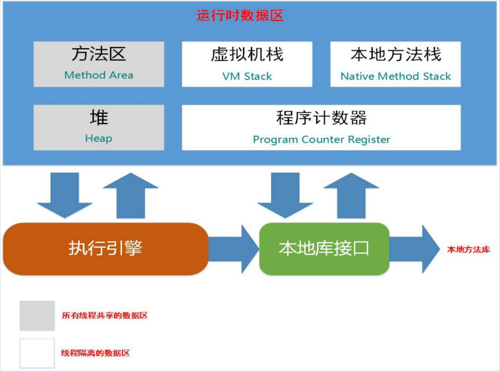
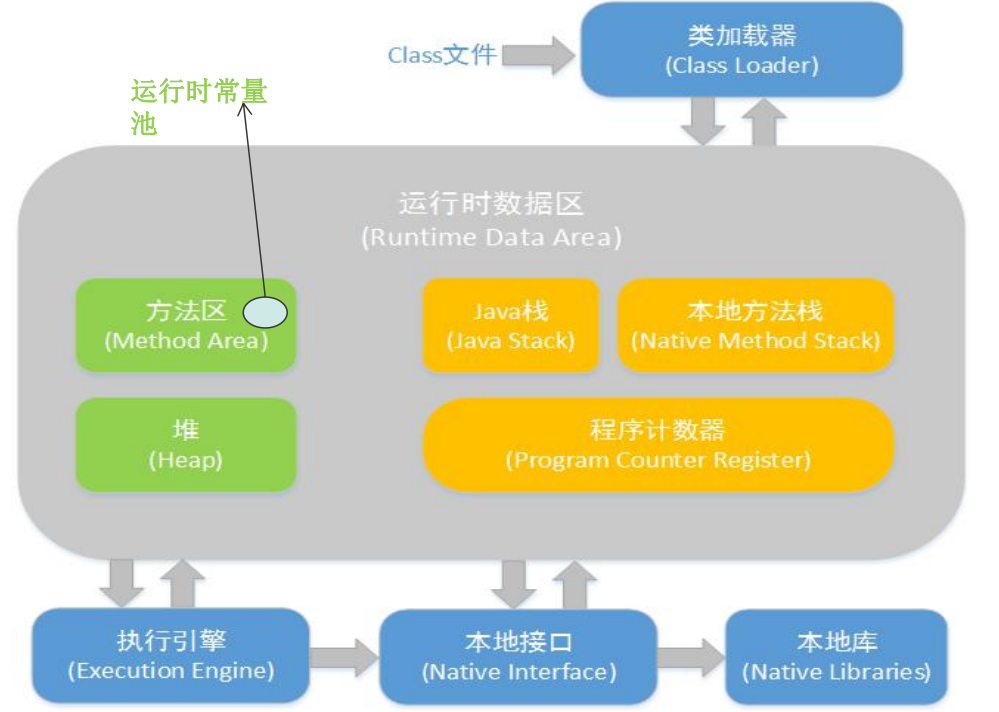
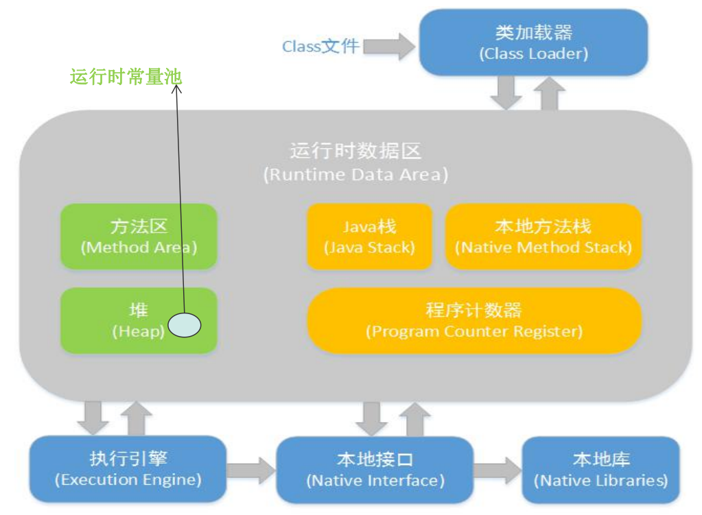
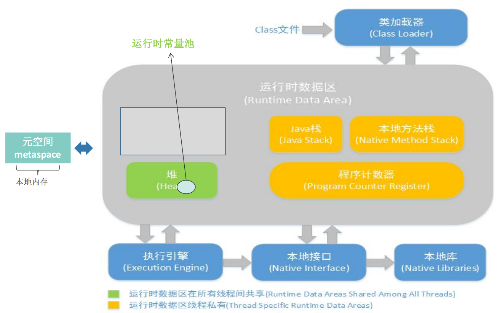

# Java虚拟机的内存区域划分

Java虚拟机在执行Java程序的过程中会把它所管理的内存划分为若干个不同的数据区域：

## 1. 基本划分

### 1.1 程序计数器

较小的内存空间，当前线程执行的字节码的行号指示器；**各线程之间独立存储**，互不影响。

### 1.2 虚拟机栈

**线程私有**，生命周期和线程，每个方法在执行的同时都会创建一个**栈帧**用于存储局部变量表，操作数栈，动态链接，方法出口等信息。方法的执行就对应着栈帧在虚拟机栈中入栈和出栈的过程；栈里面存放着各种基本数据类型和对象的引用（-Xss） 

### 1.3 本地方法栈

本地方法栈保存的是native方法的信息，当一个JVM创建的线程调用native方法后，JVM不再为其在虚拟机栈中创建栈帧，JVM只是简单地动态链接并直接调用native方法；

### 1.4 堆

Java堆是Javaer需要重点关注的一块区域，因为涉及到内存的分配(new关键字，反射等)与回收(回收算法，收集器等) （-Xms、-Xmx、-Xmn、-XX:NewSize、-XX:MaxNewSize）

- `-Xms`：堆的最小值
- `-Xmx`：堆的最大值
- `-Xmn`：新生代大小
- `-XX:NewSize`：新生代最小值
- `-XX:MaxNewSize`：新生代最大值

### 1.5 方法区

也叫永久区，用于存储已经被虚拟机加载的类信息，**常量**("zdy","123"等)，**静态变量**等数据

- JDK1.7及以前：`-XX:PermSize`、`- XX:MaxPermSize`
- JDK1.8及以后：`-XX:MetaspaceSize`、` - XX:MaxMetaspaceSize`

#### 1.5.1 运行时常量池

**运行时常量池是方法区的一部分（JDK1.6）**，用于存放编译期生成的各种字面量("zdy","123"等)和符号引用。

## 2. 各版本JDK内存区域的区别

### JDK6：

### JDK7：

在JDK7中，运行时常量池由方法区移至堆中。

### JDK8：

在JDK8中方法区的概念被移除，取而代之的是元空间（metaspace）的概念。

