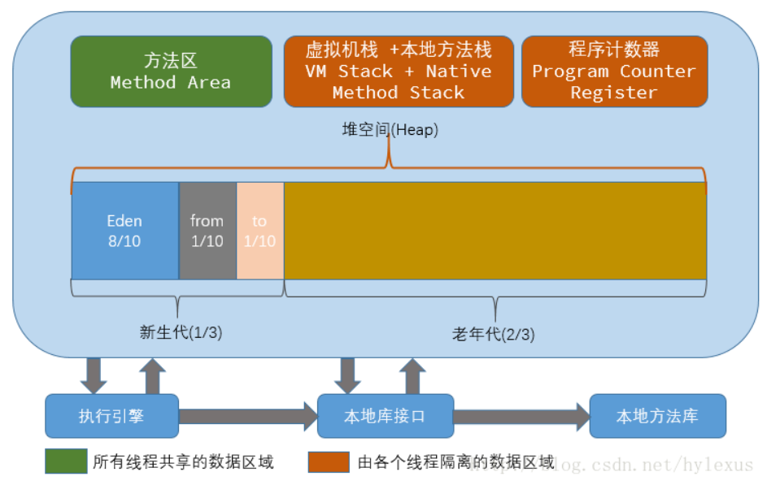
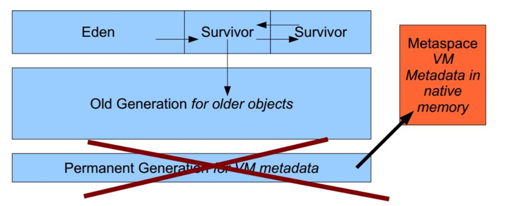
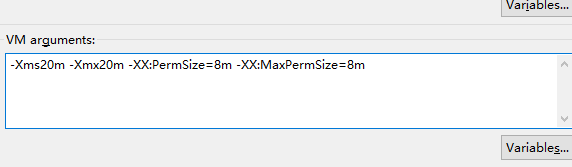
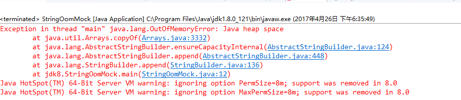
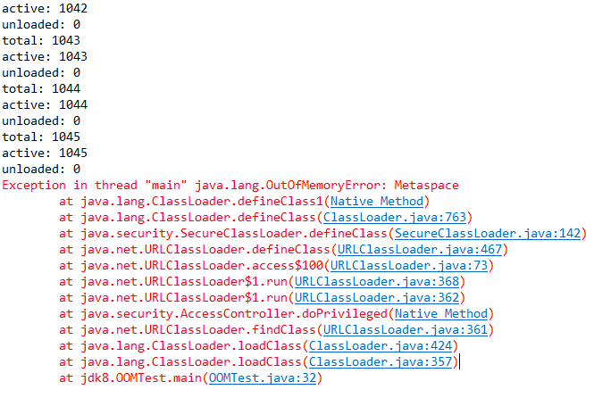

# JDK8废弃永久代（PermGen）迎来元空间（Metaspace）

## 一. 背景

### 1.1 永久代（PermGen）在哪里？

根据，hotspot jvm结构如下(虚拟机栈和本地方法栈合一起了)：



**关于方法区和永久代：**在HotSpot JVM中，这次讨论的**永久代**，就是上图的方法区（JVM规范中称为方法区）。《Java虚拟机规范》只是规定了有方法区这么个概念和它的作用，并没有规定如何去实现它。在其他JVM上不存在永久代。

### 1.2 JDK8永久代的废弃

JDK8 永久代变化如下图：



1. 新生代：Eden+From Survivor+To Survivor

2. 老年代：OldGen

3. 永久代（方法区的实现） : PermGen----->替换为Metaspace(本地内存中)


## 二. 为什么会废弃永久代（PermGen）

### 2.1 官方说明

This is part of the JRockit and Hotspot convergence effort. JRockit customers do not need to configure the permanent generation (since JRockit does not have a permanent generation) and are accustomed to not configuring the permanent generation.

译：这是JRockit和Hotspot聚合工作的一部分。JRockit客户不需要配置永久生成(因为JRockit没有永久生成)，并且习惯于不配置永久生成。

### 2.2 现实使用中易出问题

由于永久代内存经常不够用或发生内存泄露，爆出异常`java.lang.OutOfMemoryError: PermGen`


## 三. 深入理解元空间

### 3.1元空间的内存大小

元空间是方法区的在HotSpot JVM 中的实现，方法区主要用于存储类的信息、常量池、方法数据、方法代码等。方法区逻辑上属于堆的一部分，但是为了与堆进行区分，通常又叫“非堆”。

元空间的本质和永久代类似，都是对JVM规范中方法区的实现。不过**元空间与永久代之间最大的区别在于：元空间并不在虚拟机中，而是使用本地内存。**，理论上取决于32位/64位系统可虚拟的内存大小。可见也不是无限制的，需要配置参数。

### 3.2常用配置参数

#### 3.2.1 MetaspaceSize

初始化的Metaspace大小，控制元空间发生GC的阈值。GC后，动态增加或降低MetaspaceSize。在默认情况下，这个值大小根据不同的平台在12M到20M浮动。使用[Java](http://lib.csdn.net/base/javase) -XX:+PrintFlagsInitial命令查看本机的初始化参数

#### 3.2.2 MaxMetaspaceSize

限制Metaspace增长的上限，防止因为某些情况导致Metaspace无限的使用本地内存，影响到其他程序。在本机上该参数的默认值为4294967295B（大约4096MB）。

#### 3.2.3 MinMetaspaceFreeRatio

当进行过Metaspace GC之后，会计算当前Metaspace的空闲空间比，如果空闲比小于这个参数（即实际非空闲占比过大，内存不够用），那么虚拟机将增长Metaspace的大小。默认值为40，也就是40%。设置该参数可以控制Metaspace的增长的速度，太小的值会导致Metaspace增长的缓慢，Metaspace的使用逐渐趋于饱和，可能会影响之后类的加载。而太大的值会导致Metaspace增长的过快，浪费内存。

#### 3.2.4 MaxMetasaceFreeRatio

当进行过Metaspace GC之后， 会计算当前Metaspace的空闲空间比，如果空闲比大于这个参数，那么虚拟机会释放Metaspace的部分空间。默认值为70，也就是70%。

#### 3.2.5 MaxMetaspaceExpansion

Metaspace增长时的最大幅度。在本机上该参数的默认值为5452592B（大约为5MB）。

#### 3.2.6 MinMetaspaceExpansion

Metaspace增长时的最小幅度。在本机上该参数的默认值为340784B（大约330KB为）。


### 3.3 测试并追踪元空间大小

####  3.3.1.测试常量池导致堆内存溢出

```java
public class StringOomMock {
    static String  base = "string";
    
    public static void main(String[] args) {
        List<String> list = new ArrayList<String>();
        for (int i=0;i< Integer.MAX_VALUE;i++){
            String str = base + base;
            base = str;
            list.add(str.intern());
        }
    }
}
```

在eclipse中选中类--》run configuration-->java application--》new 参数如下：



 由于设定了最大堆内存20M，很快就溢出，如下图：



**从JDK7开始，运行时常量池就由方法区移至堆中了**。

#### 3.3.2.测试元空间溢出

根据定义，我们以加载类来测试元空间溢出，代码如下：

```java
package jdk8;

import java.io.File;
import java.lang.management.ClassLoadingMXBean;
import java.lang.management.ManagementFactory;
import java.net.URL;
import java.net.URLClassLoader;
import java.util.ArrayList;
import java.util.List;

/**
 * 
 * @ClassName:OOMTest
 * @Description:模拟类加载溢出（元空间oom）
 * @author diandian.zhang
 * @date 2017年4月27日上午9:45:40
 */
public class OOMTest {  
    public static void main(String[] args) {  
        try {  
            //准备url  
            URL url = new File("D:/58workplace/11study/src/main/java/jdk8").toURI().toURL();  
            URL[] urls = {url};  
            //获取有关类型加载的JMX接口  
            ClassLoadingMXBean loadingBean = ManagementFactory.getClassLoadingMXBean();  
            //用于缓存类加载器  
            List<ClassLoader> classLoaders = new ArrayList<ClassLoader>();  
            while (true) {  
                //加载类型并缓存类加载器实例  
                ClassLoader classLoader = new URLClassLoader(urls);  
                classLoaders.add(classLoader);  
                classLoader.loadClass("ClassA");  
                //显示数量信息（共加载过的类型数目，当前还有效的类型数目，已经被卸载的类型数目）  
                System.out.println("total: " + loadingBean.getTotalLoadedClassCount());  
                System.out.println("active: " + loadingBean.getLoadedClassCount());  
                System.out.println("unloaded: " + loadingBean.getUnloadedClassCount());  
            }  
        } catch (Exception e) {  
            e.printStackTrace();  
        }  
    }  
}
```

为了快速溢出，设置参数：-XX:MetaspaceSize=8m -XX:MaxMetaspaceSize=80m，运行结果如下：



本文转载至：<https://www.cnblogs.com/dennyzhangdd/p/6770188.html>