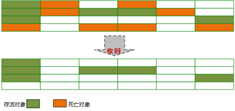

# JVM垃圾回收器（算法篇）

在《[Jvm垃圾回收器（基础篇）](./_3JVM垃圾回收器（基础篇）.md)》中我们主要学习了判断对象是否存活还是死亡？两种基础的垃圾回收算法：引用计数法、可达性分析算法。以及Java引用的4种分类：强引用、软引用、弱引用、虚引用。和方法区的回收介绍。

那么接下来我们重点研究下虚拟机的几种常见的垃圾回收算法：标记-清除算法、复制算法、标记-整理算法、分代收集算法。

## 一. 标记清除法（Mark-Sweep）

最基础的收集算法，总共分为‘ 标记 ’和‘ 清除 ’两个阶段

### 1.1 标记

标记出所有需要回收的对象。

在《[Jvm垃圾回收器（基础篇）](./_3JVM垃圾回收器（基础篇）.md)》中说明了判断对象是否回收需要两次标记，现在我们再来回顾一下：

**一次标记**：在经过可达性分析算法后，对象没有与GC Root相关的引用链，那么则被第一次标记。并且进行一次筛选：当对象有必要执行finalize()方法时，则把该对象放入F-Queue队列中。

**二次标记**：对F-Queue队列中的对象进行二次标记。在执行finalize()方法时，如果对象重新与GC Root引用链上的任意对象建立了关联，则把他移除出“ 即将回收 ”集合。否则就等着被回收吧！！！

对被第一次标记切被第二次标记的，就可以判定位可回收对象了。

### 1.2 清除

两次标记后，还在“ 即将回收 ”集合的对象进行回收。

执行过程如下：

**优点**：基础最基础的可达性算法，后续的收集算法都是基于这种思想实现的

**缺点**：标记和清除效率不高，产生大量不连续的内存碎片，导致创建大对象时找不到连续的空间，不得不提前触发另一次的垃圾回收

## 二. 复制算法

将可用内存按容量分为大小相等的两块，每次只使用其中一块，当这一块的内存用完了，就将还存活的对象复制到另外一块内存上，然后再把已使用过的内存空间一次清理掉。

复制算法执行过程如下：

**优点**：实现简单，效率高。解决了标记-清除算法导致的内存碎片问题。

**缺点**：代价太大，将内存缩小了一半。效率随对象的存活率升高而降低。

现在的商业虚拟机都采用这种算法（需要改良1:1的缺点）来回收新生代。

### 2.1 HotSpot虚拟机的改良算法　

#### 2.1.1 弱代理论　

分代垃圾收集基于弱代理论。具体描述如下：

- 大多说分配了内存的对象并不会存活太长时间，在处于年轻时代就会死掉。
- 很少有对象会从老年代变成年轻代。

其中IBM研究表明：新生代中98%的对象都是"朝生夕死"； 所以并不需要按1:1比例来划分内存（解决了缺点1）；

#### 2.1.2 Hotspot虚拟机新生代内存布局及算法

新生代内存分配**一块较大的Eden空间和两块较小的Survivor空间**，每次使用Eden和其中一块Survivor空间，回收时将Eden和Survivor空间中存活的对象一次性复制到另一块Survivor空间上，最后清理掉Eden和使用过的Survivor空间。

Hotspot虚拟机默认Eden和Survivor的大小比例是8:1。**如果另一块Survivor空间没有足够内存来存放上一次新生代收集下来的存活对象，那么这些对象则直接通过担保机制进入老年代**。

## 三. 标记整理法

标记-整理算法是根据老年代的特点应运而生。

### 3.1 标记

标记过程和标记-清理算法一致（也是基于可达性分析算法）。

### 3.2 整理

和标记-清理不同的是，该算法不是针对可回收对象进行清理，而是根据存活对象进行整理。让存活对象都向一端移动，然后直接清理掉边界以外的内存。

标记-整理算法示意图：

**优点**：不会像复制算法那样随着存活对象的升高而降低效率，不像标记-清除算法那样产生不连续的内存碎片

**缺点**：效率问题，除了像标记-清除算法的标记过程外，还多了一步整理过程，效率更低。

## 四. 分代收集法

当前商业虚拟机的垃圾收集都是采用“ 分代收集 ”算法。

根据对象存活周期的不同将内存划分为几块。一般把java堆分为新生代和老年代。**JVM根据各个年代的特点采用不同的收集算法**。

新生代中，每次进行垃圾回收都会发现大量对象死去，只有少量存活，因此比较适合复制算法。只需要付出少量存活对象的复制成本就可以完成收集。

老年代中，因为对象存活率较高，没有额外的空间进行分配担保，所以适合标记-清理、标记-整理算法来进行回收。

本文转载至：<https://www.cnblogs.com/chenpt/p/9799095.html>