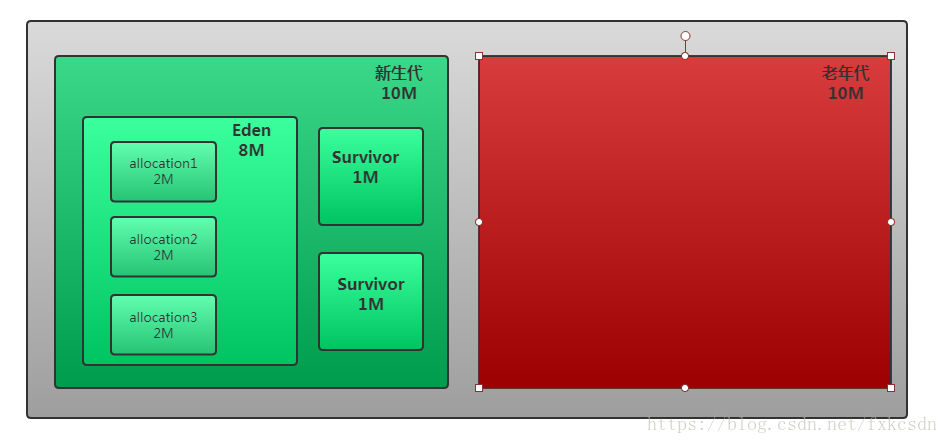

# 内存分配和回收策略

Java技术体系中所提倡的自动内存管理最终可以归结为自动化地解决两个问题：给对象分配内存以及回收分配给对象的内存。

对象的内存分配，往大方向讲就是在堆上分配，对象主要分配在新生代的Eden区上，当然分配的规则并不是固定的，其细节取决于使用的是哪一种收集器组合，还有虚拟机中与内存相关的参数的设置。垃圾收集器组合一般就是Serial+Serial Old和Parallel+Serial Old，前者是Client模式下的默认垃圾收集器组合，后者是Server模式下的默认垃圾收集器组合。

## Minor GC和Full GC的区别

- **新生代Minor GC**：指发生在新生代的垃圾收集动作，因为Java对象大多数都具有朝生夕灭的特性，多以Minor GC非常频繁，一般回收速度也比较快。
- **老年代GC（Major GC/Full GC）**:指发生在老年代的GC,出现了Major GC,经常都伴随着至少一次的`Minor GC`(但并非绝对的，在`ParallelScavenge`收集器的收集策略里就有直接进行Major GC的策略选择过程)。`Major GC`的速度一般会比`Minor GC`慢10倍以上。


## 对象优先在Eden区分配

在大多数情况下，对象在新生代Eden区中分配。当Eden区没有足够的空间进行分配时，虚拟机将发起一次Minor GC。

如下代码中，尝试分配3个2MB大小和1个4MB大小的对象。在运行通过`-Xms20M`、`-Xmx20M`和`-Xmn10M`这三个参数限制Java堆大小为20MB,切不可扩展，其中10MB分配给新生代剩下的10MB分配给老年代。`-XX:SurvivorRatio=8`决定了新生代中Eden区与一个Survivor区的空间比例是8比1，新生代总可用空间为9216KB（Eden区+1个Survivor区的总容量）。



执行testAllocation()中分配allocation4对象的语句会发生一次Minor GC,这次GC发生的原因是给allocation4分配内存的时候，发现Eden已经被占用了6MB剩下的空间已经不足够分配allocation4所需要的4MB内存，因此发生Minor GC.GC期间虚拟机又发生已有的3个2MB大小全部无法放入Survivor空间（Survivor空间只有1MB大小），所以只好通过分配担保机制提前转移到老年代中去。

这次GC结束后，4MB的allocation4对象被顺利分配在Eden,因此程序执行完的结果是Eden占用4MB（被alloction4占用），Survivor空闲，老年代被占用6MB(被alloction1、2、3占用)。

```java
/**
 * 运行参数：-Xmx20M -Xms20M -Xmn10M -XX:SurvivorRatio=8 -XX:+PrintGCDetails
 * @Auther: TJD
 * @Date: 2020-02-08
 * @DESCRIPTION:
 **/
public class EdenAllocationTest
{
    private static final int _1MB = 1024 * 1024;
    
    public static void testAllocation()
    {
        byte[] allocation1 = new byte[2 * _1MB];
        byte[] allocation2 = new byte[2 * _1MB];
        byte[] allocation3 = new byte[2 * _1MB];
        byte[] allocation4 = new byte[4 * _1MB];
    }
}
```


## 大对象直接进入老年代

大对象就是需要大量连续空间的Java对象，最典型的大对象就是那种很长的字符串及数组。虚拟机提供了一个

`-XX:PretenureSizeThreshold`参数，令大于这些设置值的对象直接在老年代中分配。这样做的目的是在避免Eden区及两个Survivor区之间发生大量的内存拷贝（复习一下：新生代采用复制算法收集内存）。

执行下面代码后，可以看到Eden空间几乎没有被使用，而老年代10MB的空间被使用了40%，也就是4MB的allocation对象直接就分配在老年代中，这是因为`PretenureSizeThreshold`被设置为3MB，因此超过3MB的对象都会直接在老年代中进行分配。（注意：`PretenureSizeThreshold`参数只对Serial和Parnew两款收集器有效，Parallel Scavenge收集器不认识这个参数）

```java
/**
* 测试所需要的参数：
* -XX:+UseSerialGC 使用Serial/Serial Old收集器
* -Xmx20M 堆空间最大值
* -Xms20M 堆空间最小值
* -Xmn10M 新生代空间为10M（可以算出，老年代也为10M）
* -XX:SurvivorRatio=8 新生代中Edon区和一个Suvivor区的比例是8:1
* -XX:PretenureSizeThreshold=3145728 大于3*1024*1024个字节的对象直接进入老年代
* -XX:+PrintGCDetails 打印GC详细信息
*/
public class EdenAllocationTest
{
    private static final int _1MB = 1024 * 1024;
    
    public static void main(Stringp[] args){
        byte[] allocation = new byte[4 * _1MB];
    }
}
```


## 长期存活的对象将进入老年代

虚拟机既然采用分代收集的思想来管理内存，那么内存回收时就必须能够识别哪些对象应当放在新生代，哪些对象应该放在老年代。为了做到这一点，虚拟机给每个对象定义了一个对象年龄计数器。如果对象在Eden出生并经过第一次Minor GC后仍然存活，并且能够被Survivor容纳的话，将被移动到Survivor空间中，并将对象年龄设置为1.对象在Survivor区每熬过一次Minor GC,年龄就增加一岁，当它的年龄增加到一定程度（默认15岁）时，就会被晋升到老年代中。对象晋升老年代的年龄阈值，可以通过参数 `-XX:MaxTenuringThreshold`来设置。


## 动态对象年龄判定

为了能更好地适应不同程序的内存状况，虚拟机并不总是要求对象的年龄必须达到MaxTenuringThreshold才能晋升老年代，如果在Survivor空间的一半，年龄大于或等于该年龄的对象就可以直接进入老年代，无须等到MaxTenuringThreshold中要求的年龄。


## 空间分配担保

在发生Minor GC时，虚拟机就会检测之前每次晋升到老年代的平均大小是否大于老年代的剩余空间，如果大于，则改为直接进行一次Full GC。如果小于，则查看`HandlePromotionFailure`设置是否允许担保失败；如果允许，那只会进行Minor GC:如果不允许，则也要改为进行一次Full GC。

前面提到过，新生代使用复制收集算法，但为了内存利用率，只使用了其中一个Survivor空间来作为轮换备份，因此当出现大量对象在Minor GC后仍然存活的情况下，就需要老年代进行分配担保，让Survivor无法容纳的对象直接进入老年代。但是前提老年代本身还有足够空间容纳这些对象。但是实际完成内存回收前是无法知道多少对象存活，所以只好取之前每一次回收晋升到老年代对象容量的平均值作为经验值，与老年代的剩余空间进行比较，决定是否进行Full GC来让老年代腾出更多的空间。

取平均值进行比较其实仍然是一种动态概率手段，也就是说如果某次Minor GC存活后的对象突增，远远高于平均值的话，依然会导致担保失败（HandlePronotion Failuer）。如果出现担保失败，那就只好在失败后重新发起一次Full GC。