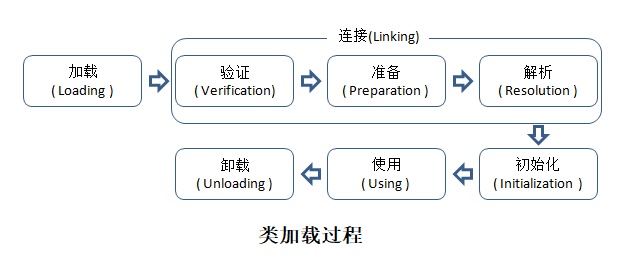

# 类的加载时机

运行在Java虚拟机之上的语言，比如Java、Scala、Groovy、JRuby等，会被各自的编辑器编译为Class文件，这些Class文件需要被加载进Java虚拟机才能运行。

类从被加载到虚拟机内存开始，到卸载出内存为止，它的整个生命周期包括：加载、验证、准备、解析、初始化、使用、卸载7个阶段。其中验证、准备、解析3个部分统称为连接。



加载、验证、准备、初始化和卸载这5个阶段的顺序是确定的，类的加载过程必须按照这种顺序按部就班地开始，而解析阶段则不一定：它在某些情况下可以在初始化阶段之后再开始，这是为了支持Java语言的运行时绑定（也称为动态绑定或晚期绑定）。以下陈述的内容都已HotSpot为基准。特别需要注意的是，类的加载过程必须按照这种顺序按部就班地“开始”，而不是按部就班的“进行”或“完成”，因为这些阶段通常都是相互交叉地混合式进行的，也就是说通常会在一个阶段执行的过程中调用或激活另外一个阶段。

## 类的加载时机

什么情况下虚拟机需要开始加载一个类呢？虚拟机规范中并没有对此进行强制约束，这点可以交给虚拟机的具体实现来自由把握。

## 类的初始化时机

那么，什么情况下虚拟机需要开始初始化一个类呢？这在虚拟机规范中是有严格规定的，虚拟机规范指明 **有且只有** 五种情况必须立即对类进行初始化（而这一过程自然发生在加载、验证、准备之后）：

- 遇到`new`、`getstatic`、`putstatic`或`invokestatic`这四条字节码指令（注意，newarray指令触发的只是数组类型本身的初始化，而不会导致其相关类型的初始化，比如，new String[]只会直接触发String[]类的初始化，也就是触发对类[Ljava.lang.String的初始化，而直接不会触发String类的初始化）时，如果类没有进行过初始化，则需要先对其进行初始化。生成这四条指令的最常见的Java代码场景是：
  - 使用new关键字实例化对象时。
  - 读取或设置一个类的静态变量时（被final修饰的静态字段除外，因为它在编译时就将结果放入自己类的常量池中）
  - 调用一个类的静态方法时
- 使用java.lang.reflect包的方法对类进行反射调用的时候，如果类没有进行过初始化，则需要先触发其初始化。
- 当初始化一个类的时候，如果发现其父类还没有进行过初始化，则需要先触发其父类的初始化。
- 当虚拟机启动时，用户需要指定一个要执行的主类（包含main()方法的那个类），虚拟机会先初始化这个主类。

注意，对于这四种会触发类进行初始化的场景，虚拟机规范中使用了一个很强烈的限定语：“有且只有”，这四种场景中的行为称为对一个类进行 **主动引用**。除此之外，所有引用类的方式，都不会触发初始化，称为 **被动引用**。下面举三个例子来说明被动引用：

**例一**：

```java
package cn.tjd;

/**
 * @Auther: TJD
 * @Date: 2020-02-13
 * @DESCRIPTION:
 **/
public class SuperClass {
    static {
        System.out.println("SuperClass Init!");
    }

    public static int value = 123;
}

class SubClass extends SuperClass {
    static {
        System.out.println("SubClass Init!");
    }
}

```

```java
public class ClassLoadTest {
    @Test
    public void test1(){
        System.out.println(SubClass.value);
    }
}
```

上述代码运行之后，只会输出"SuperClass Init!"，而不会输出"SubClass Init!"。对于静态字段，只有直接定义这个字段的类才会被初始化，因此通过其子类来引用父类中定义的静态字段，只会触发父类的初始化而不会触发子类的初始化。至于是否要触发子类的加载和验证，在虚拟机规范中并未明确规定，这点取决于虚拟机的具体实现。对于Sun HotSpot虚拟机来说，可通过`-XX:+TraceClassLoading`参数看到此操作会导致子类的加载。


**例二**：

```java
package cn.tjd;

import org.junit.Test;

/**
 * @Auther: TJD
 * @Date: 2020-02-13
 * @DESCRIPTION:
 **/
public class ClassLoadTest {
    @Test
    public void test2(){
        SuperClass[] arr=new SuperClass[10];
    }
}

```

这段代码为了节省版面，复用了例一种的SuperClass类，运行之后发现没有输出"SuperClass Init!"，说明并没有触发类`cn.tjd.SuperClass`的初始化阶段。但是这段代码里面触发了另外一个名为`[Lcn.tjd.SuperClass`的类初始化阶段，对于用户代码来说，这并不是一个合法的类名称，它是一个有虚拟机自动生成、直接继承于`java.lang.Object`的子类，创建动作由字节码指令`newarray`触发。

这个类代表了一个元素类型为`cn.tjd.SuperClass`的一维数组，数组中应有的属性和方法（用户可直接使用的只有被修饰为public的length属性和clone()方法）都实现在这个类中。

**例三**：

```java
package cn.tjd;

/**
 * @Auther: TJD
 * @Date: 2020-02-13
 * @DESCRIPTION:
 **/
public class ConstClass {
    static {
        System.out.println("ConstClass Init!");
    }
    public static final String HELLO_WORLD = "hello world";
}

```

```java
package cn.tjd;

import org.junit.Test;

/**
 * @Auther: TJD
 * @Date: 2020-02-13
 * @DESCRIPTION:
 **/
public class ClassLoadTest {
    @Test
    public void test3(){
        System.out.println(ConstClass.HELLO_WORLD);
    }
}

```

上述代码运行之后，也没有输出"ConstClass Init!"，这是因为虽然在Java源码中引用了ConstClass类中的常量HELLO_WORLD，但是编译阶段将此常量的值"hello world"的引用实际都转换为ClassLoadTest类的常量池中，对常量ConstClass.HELLO_WORLD的引用实际上都被转化为了ClassLoadTest类对自身常量池的引用。也就是说实际上ClassLoadTest的Class文件中并没有ConstClass类的符号引用入口，这两个类在编译成Class后就不存在任何联系了。