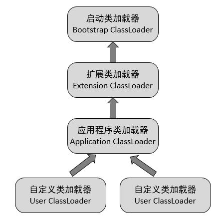
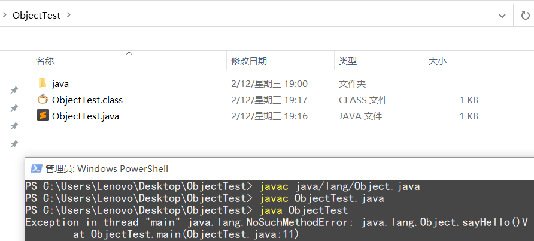

# 深入理解类加载器

## 一. 到底什么是类加载器

首先我们要明确一点，"类加载"、"加载"以及"类加载器"三个名词概念的区别：首先需要明确的是**“加载”（Loading）阶段是“类加载”（Class Loading）过程的一个阶段**。


而加载阶段主要完成下面两个工作：

1. 通过一个类的全限定名称来获取定义此类的二进制字节流。
2. 将这个字节流所代表的的静态存储结构转化为方法区的运行时数据结构。

虚拟机设计团队把类加载阶段中的”**通过一个类的全限定名来获取描述此类的二进制字节流**“**这个动作放到Java虚拟机外部去实现**，以便让**应用程序自己决定如何去获取所需要的类**。实现这个动作的**代码模块称为“类加载器”**。

类加载器虽然只用于实现类的加载动作，但它在Java程序中起到的作用却远远不限于类加载阶段。**对于任意一个类，都需要由加载它的类加载器和这个类本身一同确立其在Java虚拟机中的唯一性**，每一个类，都拥有一个独立的类名称空间。这句话可以表达得更通俗一些：**比较两个类是否“相等”，只有在这两个类是由同一个类加载器加载的前提下才有意义**。否则，即使这两个类来源于同一个Class文件，被同一个虚拟机加载，只要加载它们的**类加载器不同，那这两个类就必定不相等**。


## 二. 类加载器的分类

### 2.1 从虚拟机视角分类

从Java虚拟机的角度来讲，只存在两种不同的类加载器：一种是**启动类加载器**（Bootstrap ClassLoader），这个类加载器使用C++语言实现，是虚拟机自身的一部分；另一种就是所有**其他的类加载器**，这些类加载器都由Java语言实现，独立于虚拟机外部，并且全都继承自抽象类java.lang.ClassLoader。

### 2.2 从开发人员视角分类

从Java开发人员的角度来看， 类加载器还可以划分得更细致一些， 绝大部分Java程序都会使用到以下3种系统提供的类加载器。

- **启动类加载器**（Bootstrap ClassLoader）：前面已经介绍过，这个类加载器负责将存放在＜JAVA_HOME＞\lib目录中的，或者被-Xbootclasspath参数所指定的路径中的，并且是虚拟机识别的（仅按照文件名识别，如rt.jar，名字不符合的类库即使放在lib目录中也不会被加载）类库加载到虚拟机内存中。**启动类加载器无法被Java程序直接引用**。

- **扩展类加载器**（Extension ClassLoader）：这个加载器由`sun.misc.Launcher.ExtClassLoader`实现，它负责加载＜JAVA_HOME＞\lib\ext目录中的，或者被java.ext.dirs系统变量所指定的路径中的所有类库，开发者可以直接使用扩展类加载器。
- **应用程序类加载器**（Application ClassLoader）：这个类加载器由`sun.misc.Launcher.AppClassLoader`实现。由于这个类加载器是ClassLoader中的`getSystemClassLoader()`方法的返回值，所以一般也称它为系统类加载器。它负责加载用户类路径（Class Path）上所指定的类库，开发者可以直接使用这个类加载器，如果应用程序中没有自定义过自己的类加载器，一般情况下这个就是程序中默认的类加载器。

注意：AppClassLoader和ExtClassLoader都是Launcher的静态内部类。

我们的**应用程序都是由这3种类加载器互相配合进行加载的**，如果有必要，还可以加入自己定义的类加载器。这些类加载器之间的关系一般如下图所示。




## 三.双亲委派模型

双亲委派模型要求除了顶层的启动类加载器（Bootstrap ClassLoader）外，其余的类加载器都应当有自己的父级加载器（注意这里的描述，是父级而不是父类）。**如果一个类加载器收到了类加载的请求，它首先不会自己去尝试加载这个类，而是把这个请求委派给父级加载器去完成**，每一个层次的类加载器都是如此，因此所有的加载请求最终都应该传送到顶层的启动类加载器中，只有当父加载器反馈自己无法完成这个加载请求（它的搜索范围中没有找到所需的类）时，子加载器才会尝试自己去加载。

这里类加载器之间的父子关系一般不会以继承（Inheritance）的关系来实现，而是都使用组合（Composition）关系来复用父加载器的代码。

### 3.1 双亲委派模型的优势

使用双亲委派模型来组织类加载器之间的关系，有一个显而易见的好处就**是Java类随着它的类加载器一起具备了一种带有优先级的层次关系**。例如类java.lang.Object，它存放在rt.jar之中，无论哪一个类加载器要加载这个类，最终都是委派给处于模型最顶端的启动类加载器进行加载，因此Object类在程序的各种类加载器环境中都是同一个类。

如果我们自身去定义`java.lang.Object`类会发现采用默认的类加载器，我们会发现自己项目中定义的Object类永远都用不了：

```java
package java.lang;

public class Object {
    public void sayHello(){
        System.out.println("hello");
    }
}
```

然后在另一个包里面使用Object对象:

```java
package top.test;

import java.lang.Object;

public class ObjectTest {

    public static void main(String[] args) {
        Object o = new Object();
        System.out.println(o.toString());
        o.sayHello();
    }
}
```

使用javac编译是可以通过的，如果运行ObjectTest.main会报出会报`java.lang.NoSuchMethodError`异常，说没有找到这个方法。注意以上编译和运行都是采用命令行进行的，如果采用IDE工具的，工具会在运行之前就智能的报出找不到`sayHello`方法。



### 为什么会出现这种情况呢

由于类加载器加载类时是通过全限定名来加载的，当我们加载自己写的java.lang.Object时,会默认调用Appliation ClassLoader，这是系统提供的类加载器，肯定支持”双亲委派模型”，所以我们的请求会一步步提交到Bootstrap ClassLoader那里，这个类默认加载的类位于`$JAVA_HOME/jre/lib`下面的`rt.jar`包,可以找到我们需要的`java.lang.Object`类,所以加载的自然就不是我们自己写的Object类了。


## 四. Java类加载器源码剖析

### 4.1 ClassLoader类

首先双亲委派模型的核心方法是`java.lang.ClassLoader`的`loadClass()`方法中：

```java
protected Class<?> loadClass(String name, boolean resolve)
        throws ClassNotFoundException
    {
        synchronized (getClassLoadingLock(name)) {
            //首先，检查请求的类是否已经被加载过了
            Class<?> c = findLoadedClass(name);
            if (c == null) {
                long t0 = System.nanoTime();
                try {
                    if (parent != null) {
                    	//使用父级加载器加载类
                        c = parent.loadClass(name, false);
                    } else {
                    	//返回由引导类加载器加载的类; 如果返回NULL则表示没有找到
                        c = findBootstrapClassOrNull(name);
                    }
                } catch (ClassNotFoundException e) {
                    // 如果父级加载器抛出了ClassNotFoundException则说明父级加载器无法完成加载请求
                    // from the non-null parent class loader
                }

                if (c == null) {
                    //在父级加载器无法完成加载请求的时候，才调用findClass方法来进行类加载。
                    c = findClass(name);
                }
            }
            if (resolve) {
                resolveClass(c);
            }
            return c;
        }
    }
```

在JDK1.2以后，**如果我们自己实现类加载器，建议重写ClassLoader中的findClass()方法**，因为这样就可以保证新写出来的类是符合双亲委派模型的。

**拓展**：由于双亲委派模型在JDK1.2之后才被引入，而类加载的抽象类ClassLoader则在JDK1.0时代就已经存在，面对已经存在的用户自定义类加载器的实现代码，Java设计者们引入双亲委派模型时不得不做出一些妥协。为了向前兼容，JDK1.2之后的ClassLoader类添加了一个新的的protected方法findClass()，在此之前，用户继承ClassLoader类的唯一目的就是重写loadClass()方法，因为虚拟机在进行类加载的时候会调用加载器的私有方法loadClassInternal()，而这个方法的唯一逻辑就是去调用自己的loadClass()。

### 4.2 Launcher类

`sun.misc.Launcher`是一个java虚拟机的入口应用。

```java
public class Launcher {
    private static Launcher launcher = new Launcher();
    private static String bootClassPath =
        System.getProperty("sun.boot.class.path");

    public static Launcher getLauncher() {
        return launcher;
    }

    private ClassLoader loader;

    public Launcher() {
        // Create the extension class loader
        ClassLoader extcl;
        try {
            extcl = ExtClassLoader.getExtClassLoader();
        } catch (IOException e) {
            throw new InternalError(
                "Could not create extension class loader", e);
        }

        // Now create the class loader to use to launch the application
        try {
        	//这里将ExtClassLoader的实例传给AppClassLoader，
        	//这也证明了双亲委派模型是采用组合方式实现的，而不是通过继承实现的
            loader = AppClassLoader.getAppClassLoader(extcl);
        } catch (IOException e) {
            throw new InternalError(
                "Could not create application class loader", e);
        }

        //设置AppClassLoader为线程上下文类加载器，这个文章后面部分讲解
        Thread.currentThread().setContextClassLoader(loader);
    }

    /*
     * Returns the class loader used to launch the main application.
     */
    public ClassLoader getClassLoader() {
        return loader;
    }
    /*
     * The class loader used for loading installed extensions.
     */
    static class ExtClassLoader extends URLClassLoader {}

/**
     * The class loader used for loading from java.class.path.
     * runs in a restricted security context.
     */
    static class AppClassLoader extends URLClassLoader {}

```

源码有精简，我们可以得到相关的信息。

1. Launcher初始化了ExtClassLoader和AppClassLoader。

2. Launcher中并没有看见BootstrapClassLoader，但通过`System.getProperty("sun.boot.class.path")`得到了字符串`bootClassPath`,这个应该就是BootstrapClassLoader加载的jar包路径。

   我们可以先代码测试一下`System.getProperty("sun.boot.class.path")`是什么内容：

   ```java
   System.out.println(System.getProperty("sun.boot.class.path"));
   ```

   得到的结果是：

   ```java
   D:\JAVA_Development\jdk_1.8\jre\lib\resources.jar;
   D:\JAVA_Development\jdk_1.8\jre\lib\rt.jar;
   D:\JAVA_Development\jdk_1.8\jre\lib\sunrsasign.jar;
   D:\JAVA_Development\jdk_1.8\jre\lib\jsse.jar;
   D:\JAVA_Development\jdk_1.8\jre\lib\jce.jar;
   D:\JAVA_Development\jdk_1.8\jre\lib\charsets.jar;
   D:\JAVA_Development\jdk_1.8\jre\lib\jfr.jar;
   D:\JAVA_Development\jdk_1.8\jre\classes
   ```

可以看到，这些全是JRE目录下的jar包或者是class文件。

### 4.3 ExtClassLoader源码

如果你有足够的好奇心，你应该会对它的源码感兴趣：

```java
/*
     * The class loader used for loading installed extensions.
     */
    static class ExtClassLoader extends URLClassLoader {

        static {
            ClassLoader.registerAsParallelCapable();
        }

        /**
         * create an ExtClassLoader. The ExtClassLoader is created
         * within a context that limits which files it can read
         */
        public static ExtClassLoader getExtClassLoader() throws IOException
        {
            final File[] dirs = getExtDirs();

            try {
                // Prior implementations of this doPrivileged() block supplied
                // aa synthesized ACC via a call to the private method
                // ExtClassLoader.getContext().

                return AccessController.doPrivileged(
                    new PrivilegedExceptionAction<ExtClassLoader>() {
                        public ExtClassLoader run() throws IOException {
                            int len = dirs.length;
                            for (int i = 0; i < len; i++) {
                                MetaIndex.registerDirectory(dirs[i]);
                            }
                            return new ExtClassLoader(dirs);
                        }
                    });
            } catch (java.security.PrivilegedActionException e) {
                throw (IOException) e.getException();
            }
        }

        private static File[] getExtDirs() {
        	//获取java.ext.dirs属性
            String s = System.getProperty("java.ext.dirs");
            File[] dirs;
            if (s != null) {
                StringTokenizer st =
                    new StringTokenizer(s, File.pathSeparator);
                int count = st.countTokens();
                dirs = new File[count];
                for (int i = 0; i < count; i++) {
                    dirs[i] = new File(st.nextToken());
                }
            } else {
                dirs = new File[0];
            }
            return dirs;
        }
 
......
    }
```

我们先前的内容有说过，可以指定`-D java.ext.dirs`参数来添加和改变ExtClassLoader的加载路径。这里我们通过可以编写测试代码：

```java
System.out.println(System.getProperty("sun.boot.class.path"));
```

得到的结果是：

```java
D:\JAVA_Development\jdk_1.8\jre\lib\ext;
C:\WINDOWS\Sun\Java\lib\ext
```

### 4.4 AppClassLoader源码

```java
/**
     * The class loader used for loading from java.class.path.
     * runs in a restricted security context.
     */
    static class AppClassLoader extends URLClassLoader {


        public static ClassLoader getAppClassLoader(final ClassLoader extcl)
            throws IOException
        {
            final String s = System.getProperty("java.class.path");
            final File[] path = (s == null) ? new File[0] : getClassPath(s);

     
            return AccessController.doPrivileged(
                new PrivilegedAction<AppClassLoader>() {
                    public AppClassLoader run() {
                    URL[] urls =
                        (s == null) ? new URL[0] : pathToURLs(path);
                    return new AppClassLoader(urls, extcl);
                }
            });
        }

        ......
    }

```

可以看到AppClassLoader加载的就是`java.class.path`下的路径。我们同样打印它的值：

```java
F:\Java\IDEA工作区\jvm-study\target\classes;
D:\JAVA_Development\jdk_1.8\jre\lib\charsets.jar;
D:\JAVA_Development\jdk_1.8\jre\lib\deploy.jar;
D:\JAVA_Development\jdk_1.8\jre\lib\ext\access-bridge-64.jar;
D:\JAVA_Development\jdk_1.8\jre\lib\ext\cldrdata.jar;
D:\JAVA_Development\jdk_1.8\jre\lib\ext\dnsns.jar;
D:\JAVA_Development\jdk_1.8\jre\lib\ext\jaccess.jar;
D:\JAVA_Development\jdk_1.8\jre\lib\ext\jfxrt.jar;
D:\JAVA_Development\jdk_1.8\jre\lib\ext\localedata.jar;
D:\JAVA_Development\jdk_1.8\jre\lib\ext\nashorn.jar;
D:\JAVA_Development\jdk_1.8\jre\lib\ext\sunec.jar;
D:\JAVA_Development\jdk_1.8\jre\lib\ext\sunjce_provider.jar;
D:\JAVA_Development\jdk_1.8\jre\lib\ext\sunmscapi.jar;
D:\JAVA_Development\jdk_1.8\jre\lib\ext\sunpkcs11.jar;
D:\JAVA_Development\jdk_1.8\jre\lib\ext\zipfs.jar;
D:\JAVA_Development\jdk_1.8\jre\lib\javaws.jar;
D:\JAVA_Development\jdk_1.8\jre\lib\jce.jar;
D:\JAVA_Development\jdk_1.8\jre\lib\jfr.jar;
D:\JAVA_Development\jdk_1.8\jre\lib\jfxswt.jar;
D:\JAVA_Development\jdk_1.8\jre\lib\jsse.jar;
D:\JAVA_Development\jdk_1.8\jre\lib\management-agent.jar;
D:\JAVA_Development\jdk_1.8\jre\lib\plugin.jar;
D:\JAVA_Development\jdk_1.8\jre\lib\resources.jar;
D:\JAVA_Development\jdk_1.8\jre\lib\rt.jar;
E:\JAVA_Development\maven\repository\junit\junit\4.12\junit-4.12.jar;
E:\JAVA_Development\maven\repository\org\hamcrest\hamcrest-core\1.3\hamcrest-core-1.3.jar;
D:\JAVA_Development\IDEA\IntelliJ IDEA 2019.2\lib\idea_rt.jar
```

好了，自此我们已经知道了BootstrapClassLoader、ExtClassLoader、AppClassLoader实际是查阅相应的环境属性`sun.boot.class.path`、`java.ext.dirs`和`java.class.path`来加载资源文件的。


**文章参考至**：

- <https://blog.csdn.net/gaopu12345/article/details/49944255>
- <https://blog.csdn.net/briblue/article/details/54973413>
- <https://blog.csdn.net/fuzhongmin05/article/details/57404890/>
- <https://blog.csdn.net/u013412772/article/details/80837735>

