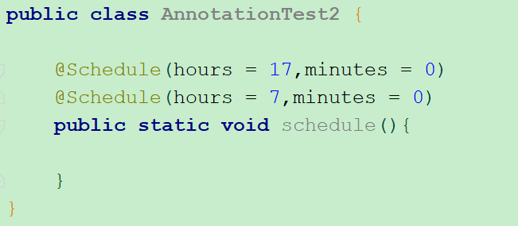

# Java注解

## 一. 注解的声明

声明一个注解，其实和创建一个类差不多，只不过声明一个类是用关键字`class`，声明一个接口是用关键字`@interface`：

```shell
public @interface MyAn{
    int a() default 1;
    String b() default "java";
}
```

简单吧，但是里面有一点需要和类、接口的声明有点不同。**注解是没有方法的，只有属性。而且我们可以自己定义默认值**。但是**形式上和方法一样**。

### 1.1 属性的分类

需要注意的是，注解的属性的类型只支持`基本数据类型`、`String类型`、`Class类型`、`枚举类型`、`注解类型`、`以及上述类型的数组形式`。

### 1.2 为注解增加属性

#### 1.2.1 声明属性的语法

```java
属性类型 属性名称() [default 属性缺省值] ;
```

#### 1.2.1 value属性的特殊性

在注解中`value`是一个特殊的属性，若在使用该注解时，**若在设置值时只有一个value属性需要设置或者其他属性都采用默认值时** ，可以忽略`@MyAnnotation(value=xxx)`中的`value=`写法，而写成`@MyAnnotation(xxx)`

例如我们定义`MyAnnotation`注解：

```java
@Target(ElementType.FIELD)
public @interface MyAnnotation {
    String value();
}
```

我们在使用该注解时，可以省略`value=`：

```java
public class AnnotationTest {
    @MyAnnotation("dsa")//不会报错
    private String name;
}
```

只要是属性名称为`value`的，在调用时都可以省略，例如我们将`value`声明成`Class`的数组：

```java
@Target(ElementType.FIELD)
public @interface MyAnnotation {
    Class[] value();
}
```

```java
public class AnnotationTest {
    @MyAnnotation({Integer.class,Double.class})//同样可以省略value
    private String name;
}
```

但是你如果属性名不是`value`：

```java
@Target(ElementType.FIELD)
public @interface MyAnnotation {
    String aaa();
}
```

你再调用该注解，就必须指明属性名称了：

```java
public class AnnotationTest {
    @MyAnnotation(aaa = "dsa")
    private String name;
}
```


## 二. 元注解

元注解用于标识自定义注解的属性，例如自定义注解能加到什么类型上面？

- @Retention ：标识这个注解怎么保存，是只在代码中，还是编入class文件中，或者是在运行时可以通过反射访问。

  - SOURCE：注释将由编译器丢弃。
  - CLASS：注释由编译器记录在类文件中，但是在运行时不需要由VM保留。（默认）
  - RUNTIME：注释由编译器记录在类文件中，并由VM在运行时保留，因此反射时可以获取到该注解。

  注：自定义注解，如果想要在运行时通过反射获取，那么一定要将该注解设置为`@Retention(RetentionPolicy.RUNTIME)`。

- @Documented： 标记这些注解是否包含在用户文档中。

- @Target：标记这个注解应该是哪种 Java 成员。

  - ElementType.TYPE：用于标识该注可以放在类、接口（包括注释类型）或枚举声明。

  - ElementType.FIELD：用于标识该注可以放在字段声明（包括枚举常量）。

  - ElementType.METHOD：用于标识该注可以放在方法声明。

  - ElementType.PARAMETER：用于标识该注可以放在参数声明。

  - ElementType.CONSTRUCTOR：用于标识该注可以放在构造方法声明。

  - ElementType.LOCAL_VARIABLE：用于标识该注可以放在**局部变量**声明。

  - ElementType.ANNOTATION_TYPE：用于标识该注可以放在注解类型声明上。

  - ElementType.PACKAGE：包声明。

- @Inherited ：标记这个注解是继承于哪个注解类(默认 注解并没有继承于任何子类)。


## 三. JDK8扩展元注解

### 3.1 类型扩展

JDK8为`ElementType`枚举类（用于@Target注解中）添加了两个属性：

- **TYPE_PARAMETER**：用于指明当前注解在类型参数声明的地方可以用

```java
@Target({ElementType.TYPE_PARAMETER})
public @interface MyAnnotation {
    String[] value() default "";
}
```

```java
//在JDK8以前，注解是不能加在类型声明上的
public <@MyAnnotation("xxx") T> void testTypeAnnotation(T t) {
    System.out.println("test Type annotation" + t);
}
```

- **TYPE_USE**：用于指明当前注解在使用了类型的地方都可以使用

```java
@Target({ElementType.TYPE_USE})
public @interface MyAnnotation {
    String[] value() default "";
}
```

```java
/**
 * 加了@Target({ElementType.TYPE_USE})后，下面用法都是允许的
 */
@MyAnnotation
public class AnnotationTest {

    @MyAnnotation private static String xx;
                                        
    @MyAnnotation private String name;
                                        
    public <@MyAnnotation("T type") T> void testTypeAnnotation(@MyAnnotation T t) {
        System.out.println("test Type annotation" + t);
    }

    public @MyAnnotation Integer test2(@MyAnnotation Integer i){
        @MyAnnotation Integer a = i;
        return i;
    }
}
```


### 3.2 重复注解

在JDK以前定义的注解，是无法在同一个位置使用多次的，例如我们定义一个`ScheduleAnnotation`注解用于表示该方法在每天某个时间点执行一次：

```java
@Target({ElementType.METHOD})
public @interface ScheduleAnnotation {
    int month();
    int day_of_month();
}
```

```java
public class AnnotationTest2 {

    //表示该方法每天下午5点整执行一次
    @ScheduleAnnotation(hours = 17,minutes = 0)
    public static void schedule(){

    }
}
```

但是如果我们需要指定多个时间点，则没有办法在这个方法上加第二个注解了：

```java
//在JDK8之前，同一个注解无法使用多次
@ScheduleAnnotation(hours = 17,minutes = 0)
@ScheduleAnnotation(hours = 7,minutes = 0)
public static void schedule(){

}
```

但是JDK8为我们提供了`@Repeatable`注解：

```java
@Target({ElementType.METHOD})
@Retention(RetentionPolicy.RUNTIME)
@Repeatable(Schedule.Schedules.class)
public @interface Schedule {
    int hours();
    int minutes();

    @Retention(RetentionPolicy.RUNTIME)
    @Target({ElementType.METHOD})
    @interface Schedules{
        Schedule[] value();
    }
}
```

