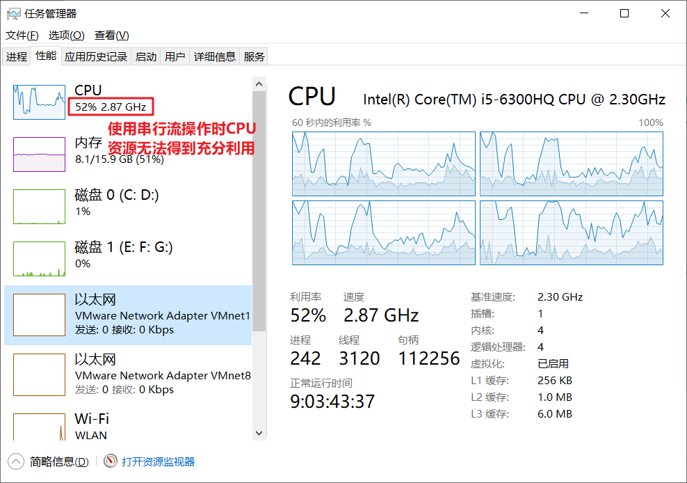

# Stream API

Java8的两个重大改变，一个是Lambda表达式，另一个就是本节要讲的Stream API表达式。Stream 是Java8中处理集合的关键抽象概念，它可以对集合进行非常复杂的查找、过滤、筛选等操作，在新版的JPA中，也已经加入了Stream。

## 一. Stream操作步骤

### 1.1 Stream有如下三个操作步骤：

**第一步：创建流**

从一个数据源，如集合、数组中获取流。

**第二步：进行中间操作**

一个流后面可以跟0个或多个中间操作，多个中间操作可以连接起来形成一条流水线，除非流水线上触发终止操作，否则中间操作不会执行任何的处理。而在终止操作时一次性全部处理。

**第三步：终止操作**

一个流只能有一个结束操作，当这个操作执行后，前面的中间操作会被触发，此时流就再无法被使用。

### 1.2 Stream的特征

- 流不会存储值，通过管道的方式获取值。
- 对流的操作会生成一个结果，不过并不会修改底层的数据源
- 一个流只能使用一次

### 1.3 入门小案例

假设有一个Person类和一个Person列表，现在有两个需求：1）找到年龄大于18岁的人并输出；2）找出所有中国人的数量。

```java
@Data
class Person {
    private String name;
    private Integer age;
    private String country;
    private char sex;

    public Person(String name, Integer age, String country, char sex) {
        this.name = name;
        this.age = age;
        this.country = country;
        this.sex = sex;
    }
}
```

```java
List<Person> personList = new ArrayList<>();
personList.add(new Person("欧阳雪",18,"中国",'F'));
personList.add(new Person("Tom",24,"美国",'M'));
personList.add(new Person("Harley",22,"英国",'F'));
    personList.add(new Person("向天笑",20,"中国",'M'));
personList.add(new Person("李康",22,"中国",'M'));
personList.add(new Person("小梅",20,"中国",'F'));
personList.add(new Person("何雪",21,"中国",'F'));
personList.add(new Person("李康",22,"中国",'M'));
```

在JDK8以前，我们可以通过遍历列表来完成。但是在有了Stream API后，可以这样来实现：

```java
public static void main(String[] args) {

    // 1）找到年龄大于18岁的人并输出；
    personList.stream().filter((p) -> p.getAge() > 18).forEach(System.out::println);

    System.out.println("-------------------------------------------");

    // 2）找出所有中国人的数量
    long chinaPersonNum = personList.stream().filter((p) -> p.getCountry().equals("中国")).count();
    System.out.println("中国人有：" + chinaPersonNum + "个");
}
```

输出结果：

```java
在这个例子中，personList.stream()是创建流，filter()属于中间操作，forEach、count()是终止操作。
```


## 二. 创建流

### 2.1 创建有限流

有限流的意思就是创建出来的流是基于一个已经存在的数据源，也就是说流在创建的时候数据源的个数已经基本确定了。

- `Stream.of()`：Stream类的静态方法。
- `Collection实例.stream()`：返回此集合作为数据源的流。
- `Collection实例.parallelStream()`：返回此集合作为数据源的并行流。
- `Arrays.stream()`：数组转换为流。

```java
List<String> list = new ArrayList<>();
Stream<String> stream1 = list.stream();

String[] arr=new String[15];
Stream<String> stream2 = Arrays.stream(arr);

Stream<String> stream3 = Stream.of("a", "b", "c");
```

### 2.2 创建无限流

无限流相对于有限流，并没有一个特定定的数据源，它是通过循环执行"元素生成器"来不断产生新元素的。这种方式在日常开发中相对少见。

- `Stream.iterate(T seed, UnaryOperator<T> f) `：创建一个无限但有序的流 ，seed传入的是迭代器的种子（起始值），f传入的是迭代函数。

```java
//这个流从0开始，每一个元素加3
Stream<Integer> stream4 = Stream.iterate(0, i -> i + 3);
//循环打印流中的元素（如果不停止运行，程序会无限输出下去）
stream4.forEach(System.out::println);

//----------上述Lambda表达式实际上是下列语法的一个简化写法，后文不再提供Lambda表达式转换，如果看不懂的话可以先去熟悉Lambda表达式的用法------
Stream.iterate(0, new UnaryOperator<Integer>() {
    @Override
    public Integer apply(Integer i) {
        return i + 3;
    }
});
```

- `Stream.generate(Supplier<T> s) `：传入的是一个“元素生成器”，Supplier是一个函数式接口，它用于在无输入参数的情况下，返回一个结果值。

```java
//创建一个无限流，这个流中每一个元素都是Math.random()方法生成的
Stream<Double> stream5 = Stream.generate(() -> Math.random());
stream5.forEach(System.out::println);

//----------上述Lambda表达式由于只调用了一个 Math.random()方法，实际上能够更加精简----
Stream<Double> stream5 = Stream.generate(Math::random);  
```


## 二. Stream中间操作

### 2.1 筛选与切片

- filter：从流中排除某些操作；
- limit(n)：截断流，使其元素不超过给定对象
- skip(n)：跳过元素，返回一个扔掉了前n个元素的流，若流中元素不足n个，则返回一个空流，与limit(n)互补
- distinct：筛选，通过流所生成元素的hashCode()和equals()去除重复元素。

#### 2.1.1 filter

```java
//保留流中person.getAge()==20的元素
personList.stream().filter(person -> person.getAge() == 20).forEach(System.out::println);
```

输出结果为：

```java
Person(name=向天笑, age=20, country=中国, sex=M)
Person(name=小梅, age=20, country=中国, sex=F)
```

#### 2.1.2 limit

```java
personList.stream().limit(2).forEach(System.out::println);
```

输出结果为：

```java
Person(name=欧阳雪, age=18, country=中国, sex=F)
Person(name=Tom, age=24, country=美国, sex=M)
```

#### 2.1.3 skip

```java
personList.stream().skip(1).forEach(System.out::println);
```

输出结果为：

```java
Person(name=Harley, age=22, country=英国, sex=F)
Person(name=向天笑, age=20, country=中国, sex=M)
Person(name=李康, age=22, country=中国, sex=M)
Person(name=小梅, age=20, country=中国, sex=F)
Person(name=何雪, age=21, country=中国, sex=F)
Person(name=李康, age=22, country=中国, sex=M)
```

#### 2.1.4 distinct

```java
personList.stream().distinct().forEach(System.out::println);
```

输出结果为：

```java
Person(name=欧阳雪, age=18, country=中国, sex=F)
Person(name=Tom, age=24, country=美国, sex=M)
Person(name=Harley, age=22, country=英国, sex=F)
Person(name=向天笑, age=20, country=中国, sex=M)
Person(name=李康, age=22, country=中国, sex=M)
Person(name=小梅, age=20, country=中国, sex=F)
Person(name=何雪, age=21, country=中国, sex=F)
```


### 2.2 映射

#### 2.2.1 map

map映射是接收一个Function接口的实例，它将Stream中的所有元素依次传入进去，`Function.apply`方法**将原数据转换成其他形式的数据**。

**例一：**

假如，我们需要将`List<String>`所有元素转化为大写，我们可以这么做：

```java
Stream<String> stream = Stream.of("aaa", "bbb", "ccc", "ddd");
stream.map(new Function<String, String>() {
    @Override
    public String apply(String s) {
        return s.toUpperCase();
    }
}).forEach(System.out::println);

//上面的匿名内部类可以精简为Lambda表达式形式
stream.map(s -> s.toUpperCase()).forEach(System.out::println);

//采用方法引用，更进一步精简Lambda表达式
stream.map(String::toUpperCase).forEach(System.out::println);
```

流中的每一个元素都经过了`Function`实例`apply`方法的处理，将其转换为了大写。

**例二：**

假如我们需要取出`List<Person>`中每一个Person中的姓名取出来并打印出来：

```java
List<Person> personList = new ArrayList<>();
personList.add(new Person("欧阳雪", 18, "中国", 'F'));
personList.add(new Person("Tom", 24, "美国", 'M'));
personList.add(new Person("Harley", 22, "英国", 'F'));
personList.add(new Person("向天笑", 20, "中国", 'M'));
personList.add(new Person("李康", 22, "中国", 'M'));
personList.add(new Person("小梅", 20, "中国", 'F'));
personList.add(new Person("何雪", 21, "中国", 'F'));
personList.add(new Person("李康", 22, "中国", 'M'));

personList.stream().map(new Function<Person, String>() {
            @Override
            public String apply(Person person) {
                return person.getName();
            }
        }).forEach(System.out::println);

//上面的匿名内部类可以精简为Lambda表达式形式
personList.stream().map(person -> person.getName()).forEach(System.out::println);

//采用方法引用，更进一步精简Lambda表达式
stream.map(Person::getName).forEach(System.out::println);
```

#### 2.2.2 flatMap

**flatMap接收一个函数作为参数，将流中的每一个值转换成另一个流，然后把所有流合并在一起**。

**例一**：

我们需要将`List<String>`中的每一个字符按顺序打印出来。我们先试着用map映射达到需求：

```java
//使用map也能实现这个需求
@Test
public void testFlatMap() {
    Stream<String> stream = Stream.of("aaa", "bbb", "ccc", "ddd");
    Stream<Stream<Character>> streamStream = stream.map(s -> toCharacterStream(s));
    streamStream.forEach(s->s.forEach(System.out::println));
}

public static Stream<Character> toCharacterStream(String str) {
    List<Character> list = new ArrayList<>();
    for (char c : str.toCharArray()) {
        list.add(c);
    }
    return list.stream();
}
```

我们通过`map()`将原先流中每一个`String`映射为`Stream<Character>`然后重新放入原先的流中，此时流中的每一个元素都是一个`Stream<Character>`，然后我们遍历外层流得到每一个子流，然后子流forEach输出每一个字符。

**可以看到使用`map`映射的时候，如果返回`Stream`，那这些Stream仍然是相互独立的；但是`flatMap`映射会将返回的流合并为一个流**。

```java
@Test
public void testFlatMap2() {
    Stream<String> stream = Stream.of("aaa", "bbb", "ccc", "ddd");
    //重点对比这一行，map返回的是Stream<Stream<Character>>，flatMap返回的是Stream<Character>
    Stream<Character> characterStream = stream.flatMap(s -> toCharacterStream(s));
    characterStream.forEach(System.out::println);
}

public static Stream<Character> toCharacterStream(String str) {
    List<Character> list = new ArrayList<>();
    for (char c : str.toCharArray()) {
        list.add(c);
    }
    return list.stream();
}
```

你品，你细细的品！！


### 2.3 排序

#### 2.3.1 自然排序

自然排序需要流中的实例实现了`Comparable`接口。

```java
personList.stream().sorted().forEach(System.out::println);
```

#### 2.3.2 定制排序

定制排序，需要传入一个`Comparator`

```java
personList.stream().sorted((o1, o2) -> o1.getAge()-o2.getAge()).forEach(System.out::println);
```


## 三. 终止操作

### 3.1 查找与匹配

- allMatch：检查是否匹配所有元素，返回boolean
- anyMatch：检查是否至少匹配一个元素，返回boolean
- noneMatch：检查是否没有匹配所有元素,返回boolean

- findFirst：返回第一个元素
- findAny：返回当前流中任意元素
- count：返回元素中元素的总个数
- max：返回流中的最大值
- min：返回流中的最小值

### 3.2 规约（reduce）

reduce是将流中的元素反复结合起来，得到一个最终值：

```java
//没有初始值的规约
Optional<T> reduce(BinaryOperator<T> accumulator);

//identity是初始值，accumulator是一个二元运算
T reduce(T identity, BinaryOperator<T> accumulator);
```

**例一**

数组中所有元素的求和：

```java
Stream<Integer> stream = Stream.of(1, 2, 3, 4, 5, 6);
Integer sum = stream.reduce(0, (integer, integer2) -> integer + integer2);
//Integer sum = stream.reduce(0, Integer::sum);   与上面具有想用意义
System.out.println(sum);
```

**例二**

计算所有人的年龄总和：

```java
Optional<Integer> reduce = personList.stream().map(person -> person.getAge()).reduce(Integer::sum);
System.out.println(reduce.get());
```

### 3.3 收集（collect）

`collect()`将流转化为其他形式。接收一个`Collector`（收集器）接口的实现，用于收集流中的元素。`Collector`接口中的方法决定了如何对流进行收集操作，`Collectors`类提供了很多静态方法，可以方便地创建常用的收集器：

#### 3.3.1 收集成集合

- `Collectors.toList()`：将所有元素收集到一个List中

```java
List<Person> persons = personList.stream().collect(Collectors.toList());
```

- `Collectors.toSet()`：将所有元素收集到一个Set中

```java
Set<Person> persons = personList.stream().collect(Collectors.toSet());
```

- `Collectors.toMap()`：将所有元素收集到一个Map中

```java
//将Person实例的name属性作为Key，person对象作为value放入Map中
Map<String, Person> collect = personList.stream().distinct().collect(Collectors.toMap(person -> person.getName(),o -> o));
```

- `Collectors.toCollection()`：将所有元素放入集合

```java
HashSet<Person> collect = personList.stream().collect(Collectors.toCollection(HashSet::new));
```

#### 3.3.2 收集聚合信息（类似于SQL中的聚合函数）

- `Collectors.averagingInt()`：收集所有元素求平均值。

```java
//获取所有Person的平均年龄
Double average = personList.stream().collect(Collectors.averagingInt(Person::getAge));
```

- `Collectors.counting()`：计算元素总数量

```java
Long count = personList.stream().collect(Collectors.counting());
```

- `Collectors.summing()`：计算元素总和

```java
//求出年龄的总和
Integer sum = personList.stream().collect(Collectors.summingInt(Person::getAge));
```

- `Collectors.maxBy()`：最大值（与max()方法效果一样）
- `Collectors.minBy()`：最小值

```java
//求出年龄最大的人
Optional<Person> max = personList.stream().collect(Collectors.maxBy((o1, o2) -> o1.getAge() - o2.getAge()));
```

- `Collectors.summarizingInt`：可以获取所有的聚合信息。

```java
//获取年龄的所有聚合信息
IntSummaryStatistics summary = personList.stream().collect(Collectors.summarizingInt(Person::getAge));
System.out.println(summary.getMax());
System.out.println(summary.getAverage());
System.out.println(summary.getCount());
System.out.println(summary.getMin());
```


#### 3.3.3 分组收集  （类似于SQL中的group by语句）

```java
//分类器函数将输入元素映射到键(单级分组)
groupingBy(Function<? super T, ? extends K> classifier)
    
//多级分组。downstream实现下级分组
groupingBy(Function<? super T, ? extends K> classifier,Collector<? super T, A, D> downstream)
```

例如我们需要按照年龄进行分组：

```java
//按照年龄进行分组
Map<Integer, List<Person>> collect = personList.stream().collect(Collectors.groupingBy(person -> person.getAge()));
```

```json
{
	18: [{
		"age": 18,
		"country": "中国",
		"name": "欧阳雪",
		"sex": "F"
	}],
	20: [{
		"age": 20,
		"country": "中国",
		"name": "向天笑",
		"sex": "M"
	}, {
		"age": 20,
		"country": "中国",
		"name": "小梅",
		"sex": "F"
	}],
	...
}
```

**多级分组**

我们可以通过传入下级分组器，来实现多级分组。例如我们需要先按照年龄进行分组，然后再按照国籍进行分组：

```java
Map<Integer, Map<String, List<Person>>> collect = personList.stream().collect(
                Collectors.groupingBy(person -> person.getAge(), Collectors.groupingBy(o -> o.getCountry())));
```

```json
{
	18: {
		"中国": [{
			"age": 18,
			"country": "中国",
			"name": "欧阳雪",
			"sex": "F"
		}]
	},
	22: {
		"中国": [{
			"age": 22,
			"country": "中国",
			"name": "李康",
			"sex": "M"
		}, {
			"age": 22,
			"country": "中国",
			"name": "李康",
			"sex": "M"
		}],
		"英国": [{
			"age": 22,
			"country": "英国",
			"name": "Harley",
			"sex": "F"
		}]
	}
}
```

#### 3.3.4 分区收集

分区收集能将符合条件的放在一个集合中，不符合条件的放在另一个集合中

```java
//将年龄大于等于20的分为一组，将年龄小于20的分为一组（实际上用groupBy也能实现）
Map<Boolean, List<Person>> collect = personList.stream().collect(Collectors.partitioningBy(person -> person.getAge() >= 20));
```

#### 3.3.5 拼接字符串

`Collectors.joining`收集器按顺序将输入元素连接到一个字符串中：

```java
//将姓名拼成字符串中间用逗号隔开，首尾用大括号括起来
String str = personList.stream().map(Person::getName).collect(Collectors.joining(",","{","}"));
```

```java
{欧阳雪,Tom,Harley,向天笑,李康,小梅,何雪,李康}
```


## 四. 并行流

前面我么所将的流的操作都建立在串行流的基础上，在数据量小的情况下没有任何问题，但是一旦数据量多起来，单线程的效率问题就会凸显。

不同于串行流，并行流底层使用了Fork-Join框架，将任务分派到多个线程上执行，这样可以大大提高CPU资源的利用率。

### 4.1 如何创建并行流

 **在创建时直接创建并行流**：

```java
Collection实例.parallelStream();
```

**将串行流转化为并行流**：

```java
Stream实例.parallel();
```

**将并行流转化为串行流**：

```java
Stream实例.sequential();
```


### 4.2 串行流和并行流的对比

我们分别使用串行流和并行流进行一百亿个数的累加：

**串行流**：

```
long start = System.currentTimeMillis();
LongStream stream = LongStream.rangeClosed(0, 10000000000L);
long reduce = stream.reduce(0, (left, right) -> left + right);
long end = System.currentTimeMillis();
System.out.println("付费:" + (end - start) );
```

通过测试我们发现，串行流需要55s，通过任务管理器也能发现CPU资源并没有充分利用。



**并行流**：

```java
long start = System.currentTimeMillis();
LongStream stream = LongStream.rangeClosed(0, 100000000000L);
long reduce = stream.parallel().reduce(0, (left, right) -> left + right);
long end = System.currentTimeMillis();
System.out.println("付费:" + (end - start) );
```

并行流花费：20S，并行流在执行时能够充分利用CPU资源。


