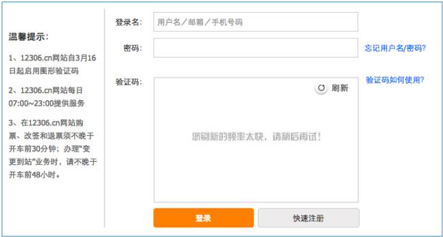
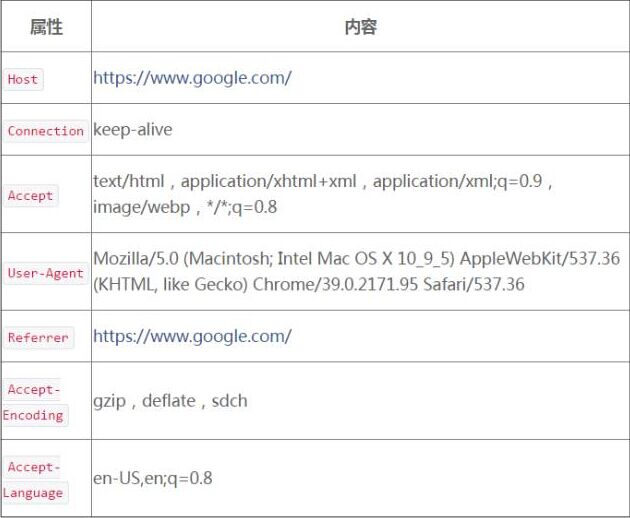
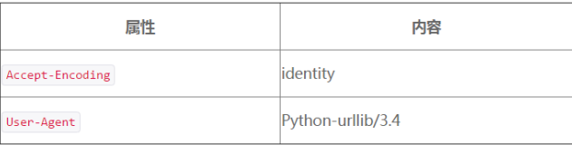
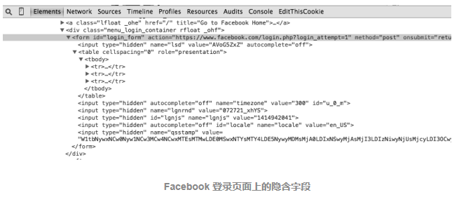

# 为何大量网站不能抓取?爬虫突破封禁的6种常见方法

> 本文转载至：<https://www.cnblogs.com/junrong624/p/5533655.html>

在互联网上进行自动数据采集（抓取）这件事和互联网存在的时间差不多一样长。今天大众好像更倾向于用“网络数据采集”，有时会把网络数据采集程序称为网络机器人（bots）。最常用的方法是写一个自动化程序向网络服务器请求数据（通常是用 HTML 表单或其他网页文件），然后对数据进行解析，提取需要的信息。

本文假定读者已经了解如何用代码来抓取一个远程的 URL，并具备表单如何提交及 JavaScript 在浏览器如何运行的机制。想更多了解网络数据采集基础知识，可以参考文后的资料。

在采集网站的时会遇到一些比数据显示在浏览器上却抓取不出来更令人沮丧的事情。也许是向服务器提交自认为已经处理得很好的表单却被拒绝，也许是自己的 IP 地址不知道什么原因直接被网站封杀，无法继续访问。

 

原因可能是一些最复杂的 bug，也可能是这些 bug 让人意想不到（程序在一个网站上可以正常使用，但在另一个看起来完全一样的网站上却用不了）。最有可能出现的情况是：对方**有意不让爬虫抓取信息。网站已经把你定性为一个网络机器人直接拒绝了**，你无法找出原因。

接下来就介绍一些网络采集的黑魔法（HTTP headers、CSS 和 HTML 表单等），以克服网站阻止自动采集。不过，先让我们聊聊道德问题。

## 一. 网络爬虫的道德与礼仪

说实话，从道德角度讲，写作以下文字不易。我自己的网站被网络机器人、垃圾邮件生成器、网络爬虫和其他各种不受欢迎的虚拟访问者骚扰过很多次了，你的网站可能也一样。既然如此，为什么还要介绍那些更强大的网络机器人呢？有几个很重要的理由。

- **白帽子工作**。在采集那些不想被采集的网站时，其实存在一些非常符合道德和法律规范的理由。比如我之前的工作就是做网络爬虫，我曾做过一个自动信息收集器，从未经许可的网站上自动收集客户的名称、地址、电话号码和其他个人信息，然后把采集的信息提交到网站上，让服务器删除这些客户信息。为了避免竞争，这些网站都会对网络爬虫严防死守。但是，我的工作要确保公司的客户们都匿名（这些人都是家庭暴力受害者，或者因其他正当理由想保持低调的人），这为网络数据采集工作创造了极其合理的条件，我很高兴自己有能力从事这项工作。
- 虽然不太可能建立一个完全“防爬虫”的网站（最起码得让合法的用户可以方便地访问网站），但我还是希望以下内容可以帮助人们保护自己的网站不被恶意攻击。**下文将指出每一种网络数据采集技术的缺点，你可以利用这些缺点保护自己的网站。**其实，大多数网络机器人一开始都只能做一些宽泛的信息和漏洞扫描，接下来介绍的几个简单技术就可以挡住 99% 的机器人。但是，它们进化的速度非常快，最好时刻准备迎接新的攻击。
- 和大多数程序员一样，我从来不相信**禁止某一类信息的传播就可以让世界变得更和谐**。

阅读之前，请牢记：**这里演示的许多程序和介绍的技术都不应该在网站上使用。**

## 二. 爬虫黑科技：网络机器人看起来像人类用户的一些方法

网站防采集的前提就是要正确地区分人类访问用户和网络机器人。虽然网站可以使用很多识别技术（比如验证码）来防止爬虫，但还是有一些十分简单的方法，可以让你的网络机器人看起来更像人类访问用户。

### 2.1 构造合理的 HTTP 请求头

除了处理网站表单，requests 模块还是一个设置请求头的利器。HTTP 的请求头是在你每次向网络服务器发送请求时，传递的一组属性和配置信息。HTTP 定义了十几种古怪的请求头类型，不过大多数都不常用。只有下面的七个字段被大多数浏览器用来初始化所有网络请求（表中信息是我自己浏览器的数据）。



经典的 Python 爬虫在使用 urllib 标准库时，都会发送如下的请求头：



如果你是一个防范爬虫的网站管理员，你会让哪个请求头访问你的网站呢？

虽然网站可能会对 HTTP 请求头的每个属性进行“是否具有人性”的检查，但是我发现通常真正重要的参数就是 User-Agent。无论做什么项目，一定要记得把 User-Agent 属性设置成不容易引起怀疑的内容，**不要用 Python-urllib/3.4**。另外，如果你正在处理一个警觉性非常高的网站，就要注意那些经常用却很少检查的请求头，比如 Accept-Language 属性，也许它正是那个网站判断你是个人类访问者的关键。

#### 请求头会改变你观看网络世界的方式

假设你想为一个机器学习的研究项目写一个语言翻译机，却没有大量的翻译文本来测试它的效果。很多大型网站都会为同样的内容提供不同的语言翻译，根据请求头的参数响应网站不同的语言版本。因此，你只要简单地把请求头属性从 *Accept-Language:en-US* 修改成 *Accept-Language:fr*，就可以从网站上获得“Bonjour”（法语，你好）这些数据来改善翻译机的翻译效果了（大型跨国企业通常都是好的采集对象）。

请求头还可以让网站改变内容的布局样式。例如，用移动设备浏览网站时，通常会看到一个没有广告、Flash 以及其他干扰的简化的网站版本。因此，把你的请求头 User-Agent 改成下面这样，就可以看到一个更容易采集的网站了！

```js
User-Agent:Mozilla/5.0 (iPhone; CPU iPhone OS 7_1_2 like Mac OS X) App leWebKit/537.51.2 (KHTML, like Gecko) Version/7.0 Mobile/11D257 Safari/9537.53
```

### 2.2 设置 cookie 的学问

虽然 cookie 是一把双刃剑，但正确地处理 cookie 可以避免许多采集问题。网站会用 cookie 跟踪你的访问过程，如果发现了爬虫异常行为就会中断你的访问，比如特别快速地填写表单，或者浏览大量页面。虽然这些行为可以通过关闭并重新连接或者改变 IP 地址来伪装，但是如果 cookie 暴露了你的身份，再多努力也是白费。

在采集一些网站时 cookie 是不可或缺的。要在一个网站上持续保持登录状态，需要在多个页面中保存一个 cookie。有些网站不要求在每次登录时都获得一个新 cookie，只要保存一个旧的“已登录”的 cookie 就可以访问。

如果你在采集一个或者几个目标网站，建议你检查这些网站生成的 cookie，然后想想哪一个 cookie 是爬虫需要处理的。有一些浏览器插件可以为你显示访问网站和离开网站时 cookie 是如何设置的。EditThisCookie（http://www.editthiscookie.com/）是我最喜欢的 Chrome 浏览器插件之一。

因为 requests 模块不能执行 JavaScript，所以它不能处理很多新式的跟踪软件生成的 cookie，比如 Google Analytics，只有当客户端脚本执行后才设置 cookie（或者在用户浏览页面时基于网页事件产生 cookie，比如点击按钮）。要处理这些动作，需要用 Selenium 和 PhantomJS 包。

### 2.3 正常的时间访问路径

有一些防护措施完备的网站可能会阻止你快速地提交表单，或者快速地与网站进行交互。即使没有这些安全措施，用一个比普通人快很多的速度从一个网站下载大量信息也可能让自己被网站封杀。

因此，虽然多线程程序可能是一个快速加载页面的好办法——在一个线程中处理数据，另一个线程中加载页面——但是这对编写好的爬虫来说是恐怖的策略。还是应该尽量保证一次加载页面加载且数据请求最小化。如果条件允许，尽量为每个页面访问增加一点儿时间间隔，即使你要增加一行代码：

```
time.sleep(3)
```

(小编：3 + 随机数 是不是更好一些？)

合理控制速度是你不应该破坏的规则。过度消耗别人的服务器资源会让你置身于非法境地，更严重的是这么做可能会把一个小型网站拖垮甚至下线。拖垮网站是不道德的，是彻头彻尾的错误。所以请控制采集速度！

## 三. 常见表单反爬虫安全措施解密

许多像 Litmus 之类的测试工具已经用了很多年了，现在仍用于区分网络爬虫和使用浏览器的人类访问者，这类手段都取得了不同程度的效果。虽然网络机器人下载一些公开的文章和博文并不是什么大事，但是如果网络机器人在你的网站上创造了几千个账号并开始向所有用户发送垃圾邮件，就是一个大问题了。网络表单，尤其是那些用于账号创建和登录的网站，如果被机器人肆意地滥用，网站的安全和流量费用就会面临严重威胁，因此努力限制网站的接入是最符合许多网站所有者的利益的（至少他们这么认为）。

这些集中在表单和登录环节上的反机器人安全措施，对网络爬虫来说确实是严重的挑战。

### 3.1 注意隐含输入字段值

在 HTML 表单中，“隐含”字段可以让字段的值对浏览器可见，但是对用户不可见（除非看网页源代码）。随着越来越多的网站开始用 cookie 存储状态变量来管理用户状态，在找到另一个最佳用途之前，隐含字段主要用于阻止爬虫自动提交表单。

下图显示的例子就是 Facebook 登录页面上的隐含字段。虽然表单里只有三个可见字段（username、password 和一个确认按钮），但是在源代码里表单会向服务器传送大量的信息。



用隐含字段阻止网络数据采集的方式主要有两种。第一种是表单页面上的一个字段可以用服务器生成的随机变量表示。如果提交时这个值不在表单处理页面上，服务器就有理由认为这个提交不是从原始表单页面上提交的，而是由一个网络机器人直接提交到表单处理页面的。绕开这个问题的最佳方法就是，首先采集表单所在页面上生成的随机变量，然后再提交到表单处理页面。

**第二种方式是“蜜罐”（honey pot）**。如果表单里包含一个具有普通名称的隐含字段（设置蜜罐圈套），比如“用户名”（username）或“邮箱地址”（email address），设计不太好的网络机器人往往不管这个字段是不是对用户可见，直接填写这个字段并向服务器提交，这样就会中服务器的蜜罐圈套。服务器会把所有隐含字段的真实值（或者与表单提交页面的默认值不同的值）都忽略，而且填写隐含字段的访问用户也可能被网站封杀。

总之，有时检查表单所在的页面十分必要，看看有没有遗漏或弄错一些服务器预先设定好的隐含字段（蜜罐圈套）。如果你看到一些隐含字段，通常带有较大的随机字符串变量，那么很可能网络服务器会在表单提交的时候检查它们。另外，还有其他一些检查，用来保证这些当前生成的表单变量只被使用一次或是最近生成的（这样可以避免变量被简单地存储到一个程序中反复使用）。

## 四. 使用远程服务器来避免 IP 封锁

启用远程平台的人通常有两个目的：对更大计算能力和灵活性的需求，**以及对可变 IP 地址的需求**。

### 4.1 使用可变的远程 IP 地址

建立网络爬虫的第一原则是：所有信息都可以伪造。你可以用非本人的邮箱发送邮件，通过命令行自动化鼠标的行为，或者通过 IE 5.0 浏览器耗费网站流量来吓唬网管。

但是有一件事情是不能作假的，那就是你的 IP 地址。任何人都可以用这个地址给你写信：“美国华盛顿特区宾夕法尼亚大道西北 1600 号，总统，邮编 20500。”但是，如果这封信是从新墨西哥州的阿尔伯克基市发来的，那么你肯定可以确信给你写信的不是美国总统。

> 从技术上说，IP 地址是可以通过发送数据包进行伪装的，就是分布式拒绝服务攻击技术（Distributed Denial of Service，DDoS），攻击者不需要关心接收的数据包（这样发送请求的时候就可以使用假 IP 地址）。但是网络数据采集是一种需要关心服务器响应的行为，所以我们认为 IP 地址是不能造假的。

阻止网站被采集的注意力主要集中在识别人类与机器人的行为差异上面。封杀 IP 地址这种矫枉过正的行为，就好像是农民不靠喷农药给庄稼杀虫，而是直接用火烧彻底解决问题。它是最后一步棋，不过是一种非常有效的方法，只要忽略危险 IP 地址发来的数据包就可以了。但是，使用这种方法会遇到以下几个问题。

- IP 地址访问列表很难维护。虽然大多数大型网站都会用自己的程序自动管理 IP 地址访问列表（机器人封杀机器人），但是至少需要人偶尔检查一下列表，或者至少要监控问题的增长。
- 因为服务器需要根据 IP 地址访问列表去检查每个准备接收的数据包，所以检查接收数据包时会额外增加一些处理时间。多个 IP 地址乘以海量的数据包更会使检查时间指数级增长。为了降低处理时间和处理复杂度，管理员通常会对 IP 地址进行分组管理并制定相应的规则，比如如果这组 IP 中有一些危险分子就“把这个区间的所有 256 个地址全部封杀”。于是产生了下一个问题。
- 封杀 IP 地址可能会导致意外后果。例如，当我还在美国麻省欧林工程学院读本科的时候，有个同学写了一个可以在 http://digg.com/ 网站（在 Reddit 流行之前大家都用 Digg）上对热门内容进行投票的软件。这个软件的服务器 IP 地址被 Digg 封杀，导致整个网站都不能访问。于是这个同学就把软件移到了另一个服务器上，而 Digg 自己却失去了许多主要目标用户的访问量。

虽然有这些缺点，但封杀 IP 地址依然是一种十分常用的手段，服务器管理员用它来阻止可疑的网络爬虫入侵服务器。

## 五. Tor 代理服务器

洋葱路由（The Onion Router）网络，常用缩写为 Tor，是一种 IP 地址匿名手段。由网络志愿者服务器构建的洋葱路由器网络，通过不同服务器构成多个层（就像洋葱）把客户端包在最里面。数据进入网络之前会被加密，因此任何服务器都不能偷取通信数据。另外，虽然每一个服务器的入站和出站通信都可以被查到，但是要想查出通信的真正起点和终点，必须知道整个通信链路上所有服务器的入站和出站通信细节，而这基本是不可能实现的。

**Tor 匿名的局限性**

虽然我们在本文中用 Tor 的目的是改变 IP 地址，而不是实现完全匿名，但有必要关注一下 Tor 匿名方法的能力和不足。

虽然 Tor 网络可以让你访问网站时显示的 IP 地址是一个不能跟踪到你的 IP 地址，但是你在网站上留给服务器的任何信息都会暴露你的身份。例如，你登录 Gmail 账号后再用 Google 搜索，那些搜索历史就会和你的身份绑定在一起。

另外，登录 Tor 的行为也可能让你的匿名状态处于危险之中。2013 年 12 月，一个哈佛大学本科生想逃避期末考试，就用一个匿名邮箱账号通过 Tor 网络给学校发了一封炸弹威胁信。结果哈佛大学的 IT 部门通过日志查到，在炸弹威胁信发来的时候，Tor 网络的流量只来自一台机器，而且是一个在校学生注册的。虽然他们不能确定流量的最初源头（只知道是通过 Tor 发送的），但是作案时间和注册信息证据充分，而且那个时间段内只有一台机器是登录状态，这就有充分理由起诉那个学生了。

登录 Tor 网络不是一个自动的匿名措施，也不能让你进入互联网上任何区域。虽然它是一个实用的工具，但是用它的时候一定要谨慎、清醒，并且遵守道德规范。

在 Python 里使用 Tor，需要先安装运行 Tor，下一节将介绍。Tor 服务很容易安装和开启。只要去 Tor 下载页面下载并安装，打开后连接就可以。不过要注意，当你用 Tor 的时候网速会变慢。这是因为代理有可能要先在全世界网络上转几次才到目的地！

 **总结**

## **爬虫被封禁常见原因列表**

如果你一直被网站封杀却找不到原因，那么这里有个检查列表，可以帮你诊断一下问题出在哪里。

- **首先，检查 JavaScript** 。如果你从网络服务器收到的页面是空白的，缺少信息，或其遇到他不符合你预期的情况（或者不是你在浏览器上看到的内容），有可能是因为网站创建页面的 **JavaScript 执行有问题**。

- **检查正常浏览器提交的参数。**如果你准备向网站提交表单或发出 `POST` 请求，记得检查一下页面的内容，看看你想提交的每个字段是不是都已经填好，而且格式也正确。用 Chrome 浏览器的网络面板（快捷键 F12 打开开发者控制台，然后点击“Network”即可看到）查看发送到网站的 `POST` 命令，确认你的每个参数都是正确的。

- **是否有合法的 Cookie？**如果你已经登录网站却不能保持登录状态，或者网站上出现了其他的“登录状态”异常，请检查你的 cookie。确认在加载每个页面时 cookie 都被正确调用，而且你的 cookie 在每次发起请求时都发送到了网站上。

- **IP 被封禁？**如果你在客户端遇到了 HTTP 错误，尤其是 403 禁止访问错误，这可能说明网站已经把你的 IP 当作机器人了，不再接受你的任何请求。你要么等待你的 IP 地址从网站黑名单里移除，要么就换个 IP 地址（可以去星巴克上网）。如果你确定自己并没有被封杀，那么再检查下面的内容。

- - 确认你的爬虫在网站上的速度不是特别快。快速采集是一种恶习，会对网管的服务器造成沉重的负担，还会让你陷入违法境地，也是 IP 被网站列入黑名单的首要原因。给你的爬虫增加延迟，让它们在夜深人静的时候运行。切记：匆匆忙忙写程序或收集数据都是拙劣项目管理的表现；应该提前做好计划，避免临阵慌乱。
  - 还有一件必须做的事情：修改你的请求头！有些网站会封杀任何声称自己是爬虫的访问者。如果你不确定请求头的值怎样才算合适，就用你自己浏览器的请求头吧。
  - 确认你没有点击或访问任何人类用户通常不能点击或接入的信息。
  - 如果你用了一大堆复杂的手段才接入网站，考虑联系一下网管吧，告诉他们你的目的。试试发邮件到 webmaster@< 域名 > 或 admin@< 域名 >，请求网管允许你使用爬虫采集数据。管理员也是人嘛！