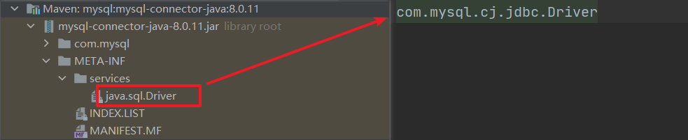
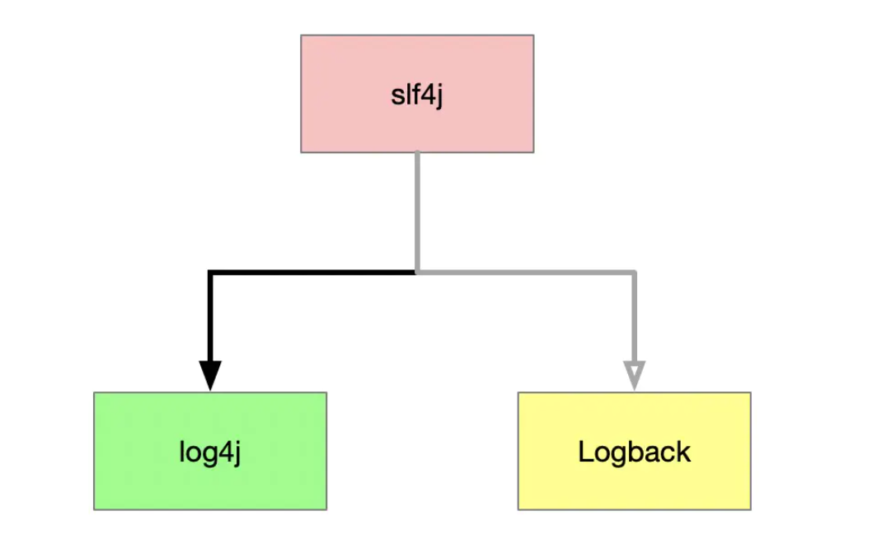
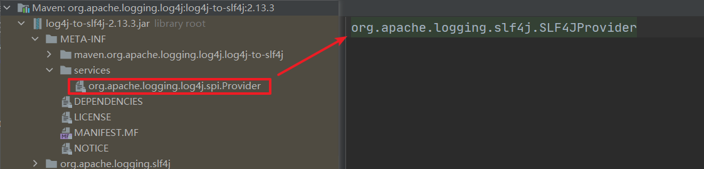
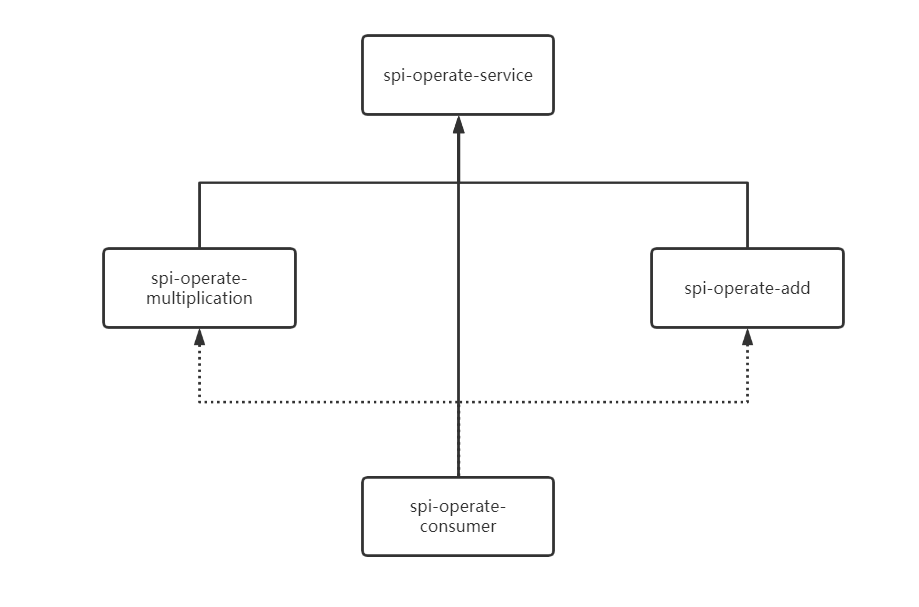

# Java SPI

SPI的英文全称为Service Provider Interface，字面意思为服务提供者接口，它是jdk提供给“服务提供厂商”或者“插件开发者”使用的接口。

在面向对象的设计中，模块之间我们一般会采取面向接口编程的方式，而在实际编程过程过程中，API的实现是封装在jar中，当我们想要换一种实现方法时，还要生成新的jar替换以前的实现类。而通过jdk的SPI机制就可以实现，首先不需要修改原来作为接口的jar的情况下，将原来实现的那个jar替换为另外一种实现的jar即可。

总结一下SPI的思想：在系统的各个模块中，往往有不同的实现方案，例如日志模块的方案、xml解析的方案等，为了在装载模块的时候不具体指明实现类，我们需要一种服务发现机制，java spi就提供这样一种机制。有点类似于IoC的思想，将服务装配的控制权移到程序之外，在模块化设计时尤其重要。

顺便提一下，Java SPI机制在很多大型中间件吗，例如Dubbo中均有采用，属于高级Java开发的进阶必备知识点，务必要求掌握。

## 一. SPI规范

定义服务的通用接口，针对通用的服务接口，提供具体的实现类。

1. 在jar包（服务提供者）的META-INF/services/目录中，新建一个文件，文件名为SPI接口的"全限定名"。 文件内容为该接口的具体实现类的"全限定名"

2. 将spi所在jar放在主程序的classpath中

3. 服务调用方使用`java.util.ServiceLoader`去动态加载具体的实现类到JVM中

## 二. SPI应用案例

### 2.1 数据库驱动

java.sql.Driver的spi实现，有mysql驱动、oracle驱动等。以mysql为例，实现类是com.mysql.jdbc.Driver，在mysql-connector-java-5.1.6.jar中，我们可以看到有一个META-INF/services目录，目录下有一个文件名为java.sql.Driver的文件，其中的内容是com.mysql.jdbc.Driver。



在我们使用JDBC获取连接时，我们通常会调用`DriverManager.getConnection()`方法获取连接对象，而在Driver类初始化时会使用`ServiceLoader`动态获取classpath下“注册”的驱动实现：

```java
static {
        loadInitialDrivers();
        println("JDBC DriverManager initialized");
}

private static void loadInitialDrivers() {
        .....
        AccessController.doPrivileged(new PrivilegedAction<Void>() {
            public Void run() {
				//使用ServiceLoader动态加载具体的驱动实现类
                ServiceLoader<Driver> loadedDrivers = ServiceLoader.load(Driver.class);
                Iterator<Driver> driversIterator = loadedDrivers.iterator();
                try{
                    while(driversIterator.hasNext()) {
                        driversIterator.next();
                    }
                } catch(Throwable t) {
                // Do nothing
                }
                return null;
            }
        });
		.....
    }
```

### 2.2 Slf4j



slf4j是一个典型的门面接口，早起我们使用log4j作为日记记录框架，我们需要同时引入slf4j和log4j的依赖。后面比较流行logback，我们也想要把项目切换到logback上来，此时利用SPI的机制，我们只需要把log4j的jar包替换为logback的jar包就可以了。

在`log4j-to-slf4j.jar`中我们可以看到前面提到的**服务提供方的SPI接口声明**：



这样我们只需要将`log4j-to-slf4j.jar`引入classpath，slf4j就能够获取到`org.apache.logging.slf4j.SLF4JProvider`作为实现类。

## 三. SPI示例


模块依赖关系：



### 3.1 spi-operate-service模块

在`spi-operate-service`中定义`INumOperate`接口：

```java
package cn.bigcoder.spi.operate.service;

/**
 * @author: Jindong.Tian
 * @date: 2020-11-29
 * @description:
 **/
public interface INumOperate {

    int exec(int num1, int num2);
}
```

### 3.2 spi-operate-add模块

在`spi-operate-add`中定义加法实现：

```java
package cn.bigcoder.spi.operate.add;


import cn.bigcoder.spi.operate.service.INumOperate;

/**
 * @author: Jindong.Tian
 * @date: 2020-11-29
 * @description:
 **/
public class NumAddOperateImpl implements INumOperate {

    public int exec(int num1, int num2) {
        return num1 + num2;
    }
}
```

在`resource/METAINF/resoures`目录下创建`cn.bigcoder.spi.operate.service.INumOperate`文件：

```java
cn.bigcoder.spi.operate.add.NumAddOperateImpl
```

### 3.3 spi-operate-multiplication模块

在`spi-operate-multiplication`模块中定义乘法的实现：

```java
package cn.bigcoder.spi.operate.multiplication;

import cn.bigcoder.spi.operate.service.INumOperate;

/**
 * @author: Jindong.Tian
 * @date: 2020-11-29
 * @description:
 **/
public class NumMultiOperateImpl implements INumOperate {
    
    public int exec(int num1, int num2) {
        return num1 * num2;
    }
}
```

同样的在`resource/METAINF/resoures`目录下创建`cn.bigcoder.spi.operate.service.INumOperate`文件：

```java
cn.bigcoder.spi.operate.multiplication.NumMultiOperateImpl
```

### 3.4 spi-operate-consumer模块

在`spi-operate-consumer`模块中，我们编写测试类获取classpath中`INumOperate`实现类：

```java
package cn.bigcoder.spi.operate;

import cn.bigcoder.spi.operate.service.INumOperate;
import org.junit.Test;

import java.util.Iterator;
import java.util.ServiceLoader;

/**
 * @author: Jindong.Tian
 * @date: 2020-11-29
 * @description:
 **/
public class INumOperateTest {
    @Test
    public void test() {
        // SPI机制，寻找所有的实现类，顺序执行
        ServiceLoader<INumOperate> loader = ServiceLoader.load(INumOperate.class);
        Iterator<INumOperate> iterator = loader.iterator();
        if (iterator.hasNext()) {
            INumOperate numOperate = iterator.next();
            System.out.println(numOperate.exec(1, 2));
        } else {
            throw new RuntimeException("classpath中未找到cn.bigcoder.spi.operate.INumOperate实现类");
        }
    }
}
```

此时如果我们在`spi-operate-consumer`中引入`spi-operate-add`，则测试方法执行求和操作；如果引入`spi-operate-multiplication`，则测试方法执行乘法操作。

本文涉及的源码：[java-spi-demo](https://github.com/tianjindong/java-spi-demo)

## 四. 声明

本文参考至：

[JAVA SPI机制详解 - 简书 (jianshu.com)](https://www.jianshu.com/p/25b3559ecc47)

[Java SPI 的原理与应用 | crossoverJie's Blog](https://crossoverjie.top/2020/02/24/wheel/cicada8-spi/)