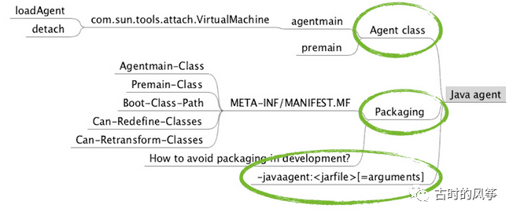
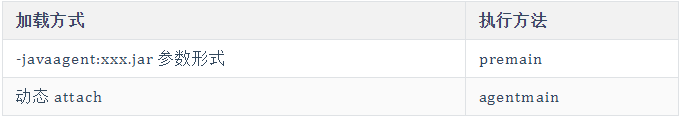
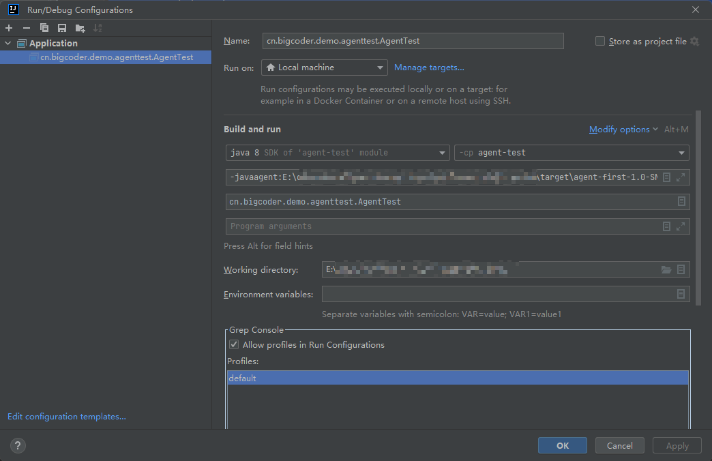
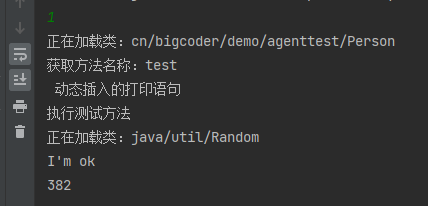

# Java Agent使用详解

我们平时写 Java Agent 的机会确实不多，也可以说几乎用不着。但其实我们一直在用它，而且接触的机会非常多。下面这些技术都使用了 Java Agent 技术，看一下你就知道为什么了。

- 各个 Java IDE 的调试功能，例如 eclipse、IntelliJ ；
- 热部署功能，例如 JRebel、XRebel、 spring-loaded；
- 各种线上诊断工具，例如 Btrace、Greys，还有阿里的 Arthas；
- 各种性能分析工具，例如 Visual VM、JConsole 等；

Java Agent 直译过来叫做 Java 代理，还有另一种称呼叫做 Java 探针。首先说 Java Agent 是一个 jar 包，只不过这个 jar 包不能独立运行，它需要依附到我们的目标 JVM 进程中。我们来理解一下这两种叫法。

**代理：**比方说我们需要了解目标 JVM 的一些运行指标，我们可以通过 Java Agent 来实现，这样看来它就是一个代理的效果，我们最后拿到的指标是目标 JVM ,但是我们是通过 Java Agent 来获取的，对于目标 JVM 来说，它就像是一个代理；

**探针：**这个说法我感觉非常形象，JVM 一旦跑起来，对于外界来说，它就是一个黑盒。而 Java Agent 可以像一支针一样插到 JVM 内部，探到我们想要的东西，并且可以注入东西进去。

拿上面的几个我们平时会用到的技术举例子。拿 IDEA 调试器来说吧，当开启调试功能后，在 debugger 面板中可以看到当前上下文变量的结构和内容，还可以在 watches 面板中运行一些简单的代码，比如取值赋值等操作。还有 Btrace、Arthas 这些线上排查问题的工具，比方说有接口没有按预期的返回结果，但日志又没有错误，这时，我们只要清楚方法的所在包名、类名、方法名等，不用修改部署服务，就能查到调用的参数、返回值、异常等信息。

上面只是说到了探测的功能，而热部署功能那就不仅仅是探测这么简单了。热部署的意思就是说再不重启服务的情况下，保证最新的代码逻辑在服务生效。当我们修改某个类后，通过 Java Agent 的 instrument 机制，把之前的字节码替换为新代码所对应的字节码。

## 一. Java Agent结构



Java Agent 最终以 jar 包的形式存在。主要包含两个部分，一部分是实现代码，一部分是配置文件。

**配置文件**放在 META-INF 目录下，文件名为 MANIFEST.MF 。包括以下配置项：

Manifest-Version: 版本号 Created-By: 创作者 Agent-Class: agentmain 方法所在类 Can-Redefine-Classes: 是否可以实现类的重定义 Can-Retransform-Classes: 是否可以实现字节码替换 Premain-Class: premain 方法所在类

**入口类**实现 agentmain 和 premain 两个方法即可，方法要实现什么功能就由你的需求决定了。

## 二. Java Agent 实现和使用

接下来就来实现一个简单的 Java Agent，基于 Java 1.8，主要实现两点简单的功能：

1. 打印当前加载的所有类的名称；
2. 监控一个特定的方法，在方法中动态插入简单的代码并计算方法执行耗时，并打印出来；

在方法中插入代码主要是用到了字节码修改技术，字节码修改技术主要有 javassist、ASM，已经 ASM 的高级封装可扩展 cglib，这个例子中用的是 javassist。所以需要引入相关的 maven 包。

 ```xml
 <dependency>
    <groupId>javassist</groupId>
    <artifactId>javassist</artifactId>
    <version>3.12.1.GA</version>
 </dependency>
 ```

## 三. 实现入口类和功能逻辑

入口类上面也说了，要实现 agentmain 和 premain 两个方法。这两个方法的运行时机不一样。这要从 Java Agent 的使用方式来说了，Java Agent 有两种启动方式，一种是以 JVM 启动参数 -javaagent:xxx.jar 的形式随着 JVM 一起启动，这种情况下，会调用 premain方法，并且是在主进程的 main方法之前执行。另外一种是以 loadAgent 方法动态 attach 到目标 JVM 上，这种情况下，会执行 agentmain方法。



```java
package cn.bigcoder.demo.agentfirst;

import java.lang.instrument.Instrumentation;

public class MyCustomAgent {

    /**
     * jvm 参数形式启动，运行此方法
     *
     * @param agentArgs agentArgs 是我们启动 Java Agent 时带进来的参数，比如-javaagent:xxx.jar agentArgs
     * @param inst
     */
    public static void premain(String agentArgs, Instrumentation inst) {
        System.out.println("premain");
        customLogic(inst);
    }

    /**
     * 动态 attach 方式启动，运行此方法
     *
     * @param agentArgs
     * @param inst
     */
    public static void agentmain(String agentArgs, Instrumentation inst) {
        System.out.println("agentmain");
        customLogic(inst);
    }

    /**
     * 打印所有已加载的类名称 修改字节码
     *
     * @param inst
     */
    private static void customLogic(Instrumentation inst) {
        inst.addTransformer(new MyTransformer(), true);
        Class[] classes = inst.getAllLoadedClasses();
        for (Class cls : classes) {
            System.out.println(cls.getName());
        }
    }
}
```

我们看到这两个方法都有参数 agentArgs 和 inst，其中 agentArgs 是我们启动 Java Agent 时带进来的参数，比如`-javaagent:xxx.jar agentArgs`。Instrumentation Java 开放出来的专门用于字节码修改和程序监控的实现。我们要实现的打印已加载类和修改字节码也就是基于它来实现的。其中 inst.getAllLoadedClasses()一个方法就实现了获取所以已加载类的功能。

inst.addTransformer方法则是实现字节码修改的关键，后面的参数就是实现字节码修改的实现类，代码如下：

```java
package cn.bigcoder.demo.agentfirst;

import java.io.ByteArrayInputStream;
import java.lang.instrument.ClassFileTransformer;
import java.lang.instrument.IllegalClassFormatException;
import java.security.ProtectionDomain;
import javassist.ClassPool;
import javassist.CtClass;
import javassist.CtMethod;

/**
 * javassist 官方文档：http://www.javassist.org/tutorial/tutorial.html
 */
public class MyTransformer implements ClassFileTransformer {

    @Override
    public byte[] transform(ClassLoader loader, String className, Class<?> classBeingRedefined,
        ProtectionDomain protectionDomain, byte[] classfileBuffer) throws IllegalClassFormatException {
        System.out.println("正在加载类：" + className);
        if (!"cn/bigcoder/demo/agenttest/Person".equals(className)) {
            return classfileBuffer;
        }
        CtClass cl = null;
        try {
            ClassPool classPool = ClassPool.getDefault();
            cl = classPool.makeClass(new ByteArrayInputStream(classfileBuffer));

            CtMethod ctMethod = cl.getDeclaredMethod("test");
            System.out.println("获取方法名称：" + ctMethod.getName());
            // 声明本地变量
            ctMethod.addLocalVariable("start", CtClass.longType);
            ctMethod.addLocalVariable("end", CtClass.longType);

            ctMethod.insertBefore("System.out.println(\" 动态插入的打印语句 \");");
            ctMethod.insertBefore("start = System.currentTimeMillis();");
            ctMethod.insertAfter("System.out.println($_);");
            ctMethod.insertAfter("end = System.currentTimeMillis();");
            ctMethod.insertAfter("System.out.println(end-start);");
            byte[] transformed = cl.toBytecode();
            return transformed;
        } catch (Exception e) {
            e.printStackTrace();
        }
        return classfileBuffer;
    }
}
```

以上代码的逻辑就是当碰到加载的类是 `cn.bigcoder.demo.agenttest.Person` 的时候：

1. 在 test 方法开始时插入一条打印语句，打印内容是"动态插入的打印语句"，在test方法结尾处，打印返回值，其中`$_`就是返回值，这是 javassist 里特定的标示符。
1. 在 test 方法开始时插入`start = System.currentTimeMillis();` 语句，在方法结尾处计算方法耗时，并打印耗时。

## 四. MANIFEST.MF 配置文件

在目录 resources/META-INF/ 下创建文件名为 MANIFEST.MF 的文件，在其中加入如下的配置内容：

```txt
Manifest-Version: 1.0
Created-By: bigcoder
Agent-Class: cn.bigcoder.demo.agentfirst.MyCustomAgent
Can-Redefine-Classes: true
Can-Retransform-Classes: true
Premain-Class: cn.bigcoder.demo.agentfirst.MyCustomAgent
```

## 五. 打包所需的 pom 设置

最后 Java Agent 是以 jar 包的形式存在，所以最后一步就是将上面的内容打到一个 jar 包里。

在 pom 文件中加入以下配置：

```xml
 <build>
    <plugins>
      <plugin>
        <groupId>org.apache.maven.plugins</groupId>
        <artifactId>maven-assembly-plugin</artifactId>
        <configuration>
          <archive>
            <!--将指定文件打入jar包，这个文件中保存在agent 启动元信息-->
            <manifestFile>src/main/resources/META-INF/MANIFEST.MF</manifestFile>
          </archive>
          <descriptorRefs>
            <!--将第三方依赖也打入jar包-->
            <descriptorRef>jar-with-dependencies</descriptorRef>
          </descriptorRefs>
        </configuration>
      </plugin>
    </plugins>
  </build>
```

用的是 maven 的 maven-assembly-plugin 插件，注意其中要用 manifestFile 指定 MANIFEST.MF 所在路径，然后指定 jar-with-dependencies ，将依赖包打进去。

上面这是一种打包方式，需要单独的 MANIFEST.MF 配合，**还有一种方式**，不需要在项目中单独的添加 MANIFEST.MF 配置文件，完全在 pom 文件中配置上即可。

```xml
<build>
   <plugins>
       <plugin>
           <groupId>org.apache.maven.plugins</groupId>
           <artifactId>maven-assembly-plugin</artifactId>
           <executions>
               <execution>
                   <goals>
                       <goal>attached</goal>
                   </goals>
                   <phase>package</phase>
                   <configuration>
                       <descriptorRefs>
                           <descriptorRef>jar-with-dependencies</descriptorRef>
                       </descriptorRefs>
                       <archive>
                           <manifestEntries>
                               <Premain-Class>cn.bigcoder.demo.agentfirst.MyCustomAgent</Premain-Class>
                               <Agent-Class>cn.bigcoder.demo.agentfirst.MyCustomAgent</Agent-Class>
                               <Can-Redefine-Classes>true</Can-Redefine-Classes>
                               <Can-Retransform-Classes>true</Can-Retransform-Classes>
                           </manifestEntries>
                       </archive>
                   </configuration>
               </execution>
           </executions>
       </plugin>
   </plugins>
</build>
```

这种方式是将 MANIFEST.MF 的内容全部写作 pom 配置中，打包的时候就会自动将配置信息生成 MANIFEST.MF 配置文件打进包里。

**运行打包命令**

接下来就简单了，执行一条 maven 命令即可。

```shell
mvn assembly:assembly
```

最后打出来的 jar 包默认是以「项目名称-版本号-jar-with-dependencies.jar」这样的格式生成到 target 目录下。

## 六. 运行打包好的 Java Agent

首先写一个简单的测试项目，用来作为目标 JVM，稍后会以两种方式将 Java Agent 挂到这个测试项目上。

```java
package cn.bigcoder.demo.agenttest;

import java.util.Scanner;

/**
 * @author: bigcoder
 **/
public class AgentTest {

    public static void main(String[] args) {
        System.out.println("按数字键 1 调用测试方法");
        while (true) {
            Scanner reader = new Scanner(System.in);
            int number = reader.nextInt();
            if (number == 1) {
                Person person = new Person();
                person.test();
            }
        }
    }

}
```

以上只有一个简单的 main 方法，用 while 的方式保证线程不退出，并且在输入数字 1 的时候，调用 person.test()方法。

以下是 Person 类

```java
package cn.bigcoder.demo.agenttest;

import java.util.Random;

public class Person {
   public String test() {
       System.out.println("执行测试方法");
       try {
           Thread.sleep(new Random().nextInt(1000));
       } catch (InterruptedException e) {
           throw new RuntimeException(e);
       }
       return "I'm ok";
  }
}
```

**以命令行的方式运行**

因为项目是在 IDEA 里创建的，为了省事儿，我就直接在 IDEA 的 「Run/Debug Configurations」里加参数了。

```shell
-javaagent:/java-agent路径/lab-custom-agent-1.0-SNAPSHOT-jar-with-dependencies.jar
```



然后直接运行就可以看到效果了，会看到加载的类名称。然后输入数字键 "1"，会看到字节码修改后的内容：



**以动态 attach 的方式运行**

测试之前先要把这个测试项目跑起来，并把之前的参数去掉。运行后，找到这个它的进程id，一般利用jps -l即可。

动态 attach 的方式是需要代码实现的，实现代码如下：

```java
public class AttachAgent {
   public static void main(String[] args) throws Exception{
       VirtualMachine vm = VirtualMachine.attach("pid(进程号)");
       vm.loadAgent("java-agent路径/lab-custom-agent-1.0-SNAPSHOT-jar-with-dependencies.jar");
   }
}
```

运行上面的 main 方法 并在测试程序中输入“1”，会得到上图同样的结果。

发现了没，我们到这里实现的简单的功能是不是和 BTrace 和 Arthas 有点像呢。我们拦截了指定的一个方法，并在这个方法里插入了代码而且拿到了返回结果。如果把方法名称变成可配置项，并且把返回结果保存到一个公共位置，例如一个内存数据库，是不是我们就可以像 Arthas 那样轻松的检测线上问题了呢。当然了，Arthas 要复杂的多，但原理是一样的。

## 七. sun.management.Agent 的实现

不知道你平时有没有用过 visualVM 或者 JConsole 之类的工具，其实，它们就是用了 management-agent.jar 这个Java Agent 来实现的。如果我们希望 Java 服务允许远程查看 JVM 信息，往往会配置上一下这些参数：

```txt
-Dcom.sun.management.jmxremote
-Djava.rmi.server.hostname=192.168.1.1
-Dcom.sun.management.jmxremote.port=9999
-Dcom.sun.management.jmxremote.rmi.port=9999
-Dcom.sun.management.jmxremote.authenticate=false
-Dcom.sun.management.jmxremote.ssl=false
```

这些参数都是 management-agent.jar 定义的。

我们进到 management-agent.jar 包下，看到只有一个 MANIFEST.MF 配置文件，配置内容为：

```txt
Manifest-Version: 1.0
Created-By: 1.7.0_07 (Oracle Corporation)
Agent-Class: sun.management.Agent
Premain-Class: sun.management.Agent
```

可以看到入口 class 为 sun.management.Agent，进到这个类里面可以找到 agentmain 和 premain，并可以看到它们的逻辑。在这个类的开始，能看到我们前面对服务开启远程 JVM 监控需要开启的那些参数定义。

## 八. 字节码增强选型

### 8.1 ASM

对于需要手动操纵字节码的需求，可以使用ASM，它可以直接生产 .class字节码文件，也可以在类被加载入JVM之前动态修改类行为）。ASM的应用场景有AOP（Cglib就是基于ASM）、热部署、修改其他jar包中的类等。当然，涉及到如此底层的步骤，实现起来也比较麻烦。

### 8.2 Javassist

ASM是在指令层次上操作字节码的，在指令层次上操作字节码的框架实现起来比较晦涩。故除此之外，我们再简单介绍另外一类框架：强调源代码层次操作字节码的框架Javassist。

利用Javassist实现字节码增强时，可以无须关注字节码刻板的结构，其优点就在于编程简单。直接使用java编码的形式，而不需要了解虚拟机指令，就能动态改变类的结构或者动态生成类。其中最重要的是ClassPool、CtClass、CtMethod、CtField这四个类：

- CtClass（compile-time class）：编译时类信息，它是一个class文件在代码中的抽象表现形式，可以通过一个类的全限定名来获取一个CtClass对象，用来表示这个类文件。
- ClassPool：从开发视角来看，ClassPool是一张保存CtClass信息的HashTable，key为类名，value为类名对应的CtClass对象。当我们需要对某个类进行修改时，就是通过pool.getCtClass(“className”)方法从pool中获取到相应的CtClass。
- CtMethod、CtField：这两个比较好理解，对应的是类中的方法和属性。

### 8.3 ByteBuddy

[ByteBuddy](https://bytebuddy.net/#/) 是一个基于ASM的字节码增强框架，开始于2014年，相比其它字节码操作类库而言，其诞生的时间则年轻得多，所以ButeBuddy API在设计之初上就吸收了业界其它字节码工具类库的优点，提供了丰富灵活的API接口，可以快速创建新类、继承已有类、动态重构类。


> 本文参考至：
>
> [Java Agent使用详解 - 闲人鹤 - 博客园 (cnblogs.com)](https://www.cnblogs.com/huanshilang/p/12206644.html)
>
> [字节码增强技术探索 - 美团技术团队 (meituan.com)](https://tech.meituan.com/2019/09/05/java-bytecode-enhancement.html)