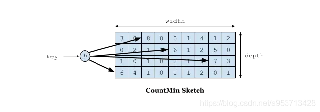

# Caffeine Cache-高性能Java本地缓存组件

前面刚说到Guava Cache，他的优点是封装了get，put操作；提供线程安全的缓存操作；提供过期策略；提供回收策略；缓存监控。当缓存的数据超过最大值时，使用LRU算法替换。这一篇我们将要谈到一个新的本地缓存框架：Caffeine Cache。它也是站在巨人的肩膀上-Guava Cache，借着他的思想优化了算法发展而来。

本篇博文主要介绍Caffine Cache 的使用方式，以及Caffine Cache在SpringBoot中的使用。

## 一. Caffine Cache 在算法上的优点 W-TinyLFU

说到优化，Caffine Cache到底优化了什么呢？我们刚提到过LRU，常见的缓存淘汰算法还有FIFO，LFU：

1. FIFO：先进先出，在这种淘汰算法中，先进入缓存的会先被淘汰，会导致命中率很低。
2. LRU：最近最少使用算法，每次访问数据都会将其放在我们的队尾，如果需要淘汰数据，就只需要淘汰队首即可。仍然有个问题，如果有个数据在 1 分钟访问了 1000次，再后 1 分钟没有访问这个数据，但是有其他的数据访问，就导致了我们这个热点数据被淘汰。
3. LFU：最近最少频率使用，利用额外的空间记录每个数据的使用频率，然后选出频率最低进行淘汰。这样就避免了 LRU 不能处理时间段的问题。

上面三种策略各有利弊，实现的成本也是一个比一个高，同时命中率也是一个比一个好。Guava Cache虽然有这么多的功能，但是本质上还是对LRU的封装，如果有更优良的算法，并且也能提供这么多功能，相比之下就相形见绌了。

**LFU的局限性**：在 LFU 中只要数据访问模式的概率分布随时间保持不变时，其命中率就能变得非常高。比如有部新剧出来了，我们使用 LFU 给他缓存下来，这部新剧在这几天大概访问了几亿次，这个访问频率也在我们的 LFU 中记录了几亿次。但是新剧总会过气的，比如一个月之后这个新剧的前几集其实已经过气了，但是他的访问量的确是太高了，其他的电视剧根本无法淘汰这个新剧，所以在这种模式下是有局限性。

**LRU的优点和局限性**：LRU可以很好的应对突发流量的情况，因为他不需要累计数据频率。但LRU通过历史数据来预测未来是局限的，它会认为最后到来的数据是最可能被再次访问的，从而给与它最高的优先级。

在现有算法的局限性下，会导致缓存数据的命中率或多或少的受损，而命中略又是缓存的重要指标。HighScalability网站刊登了一篇文章，由前Google工程师发明的W-TinyLFU——一种现代的缓存 。Caffine Cache就是基于此算法而研发。Caffeine 因使用 **Window TinyLFU** 回收策略，提供了一个**近乎最佳的命中率**。

> 当数据的访问模式不随时间变化的时候，LFU的策略能够带来最佳的缓存命中率。然而LFU有两个缺点：
>
> 首先，它需要给每个记录项维护频率信息，每次访问都需要更新，这是个巨大的开销；
>
> 其次，如果数据访问模式随时间有变，LFU的频率信息无法随之变化，因此早先频繁访问的记录可能会占据缓存，而后期访问较多的记录则无法被命中。
>
> 因此，大多数的缓存设计都是基于LRU或者其变种来进行的。相比之下，LRU并不需要维护昂贵的缓存记录元信息，同时也能够反应随时间变化的数据访问模式。然而，在许多负载之下，LRU依然需要更多的空间才能做到跟LFU一致的缓存命中率。因此，一个“现代”的缓存，应当能够综合两者的长处。

TinyLFU维护了近期访问记录的频率信息，作为一个过滤器，当新记录来时，只有满足TinyLFU要求的记录才可以被插入缓存。如前所述，作为现代的缓存，它需要解决两个挑战：

一个是如何避免维护频率信息的高开销；

另一个是如何反应随时间变化的访问模式。

首先来看前者，TinyLFU借助了数据流Sketching技术，Count-Min Sketch显然是解决这个问题的有效手段，它可以用小得多的空间存放频率信息，而保证很低的False Positive Rate。但考虑到第二个问题，就要复杂许多了，因为我们知道，任何Sketching数据结构如果要反应时间变化都是一件困难的事情，在Bloom Filter方面，我们可以有Timing Bloom Filter，但对于CMSketch来说，如何做到Timing CMSketch就不那么容易了。TinyLFU采用了一种基于滑动窗口的时间衰减设计机制，借助于一种简易的reset操作：每次添加一条记录到Sketch的时候，都会给一个计数器上加1，当计数器达到一个尺寸W的时候，把所有记录的Sketch数值都除以2，该reset操作可以起到衰减的作用 。

W-TinyLFU主要用来解决一些稀疏的突发访问元素。在一些数目很少但突发访问量很大的场景下，TinyLFU将无法保存这类元素，因为它们无法在给定时间内积累到足够高的频率。因此W-TinyLFU就是结合LFU和LRU，前者用来应对大多数场景，而LRU用来处理突发流量。

在处理频率记录的方案中，你可能会想到用hashMap去存储，每一个key对应一个频率值。那如果数据量特别大的时候，是不是这个hashMap也会特别大呢。由此可以联想到 Bloom Filter，对于每个key，用n个byte每个存储一个标志用来判断key是否在集合中。原理就是使用k个hash函数来将key散列成一个整数。

在W-TinyLFU中使用Count-Min Sketch记录我们的访问频率，而这个也是布隆过滤器的一种变种。如下图所示:



如果需要记录一个值，那我们需要通过多种Hash算法对其进行处理hash，然后在对应的hash算法的记录中+1，为什么需要多种hash算法呢？由于这是一个压缩算法必定会出现冲突，比如我们建立一个byte的数组，通过计算出每个数据的hash的位置。比如张三和李四，他们两有可能hash值都是相同，比如都是1那byte[1]这个位置就会增加相应的频率，张三访问1万次，李四访问1次那byte[1]这个位置就是1万零1，如果取李四的访问评率的时候就会取出是1万零1，但是李四命名只访问了1次啊，为了解决这个问题，所以用了多个hash算法可以理解为long[][]二维数组的一个概念，比如在第一个算法张三和李四冲突了，但是在第二个，第三个中很大的概率不冲突，比如一个算法大概有1%的概率冲突，那四个算法一起冲突的概率是1%的四次方。通过这个模式我们取李四的访问率的时候取所有算法中，李四访问最低频率的次数。所以他的名字叫Count-Min Sketch。

## 二. 使用

Caffeine Cache 的github地址：[点我](https://github.com/ben-manes/caffeine)。

目前的最新版本是：

```xml
<dependency>
    <groupId>com.github.ben-manes.caffeine</groupId>
    <artifactId>caffeine</artifactId>
    <version>2.6.2</version>
</dependency>
```

### 2.1 缓存填充策略

Caffeine Cache提供了三种缓存填充策略：手动、同步加载和异步加载。

#### 2.1.1 手动加载

在每次get key的时候指定一个同步的函数，如果key不存在就调用这个函数生成一个值。

```java
/**
     * 手动加载
     * @param key
     * @return
     */
public Object manulOperator(String key) {
    Cache<String, Object> cache = Caffeine.newBuilder()
        .expireAfterWrite(1, TimeUnit.SECONDS)
        .expireAfterAccess(1, TimeUnit.SECONDS)
        .maximumSize(10)
        .build();
    //如果一个key不存在，那么会进入指定的函数生成value
    Object value = cache.get(key, t -> setValue(key).apply(key));
    cache.put("hello",value);

    //判断是否存在如果不存返回null
    Object ifPresent = cache.getIfPresent(key);
    //移除一个key
    cache.invalidate(key);
    return value;
}

public Function<String, Object> setValue(String key){
    return t -> key + "value";
}
```

#### 2.1.2 同步加载

构造Cache时候，build方法传入一个CacheLoader实现类。实现load方法，通过key加载value。

```java
/**
 * 同步加载
 * @param key
 * @return
 */
public Object syncOperator(String key){
    LoadingCache<String, Object> cache = Caffeine.newBuilder()
        .maximumSize(100)
        .expireAfterWrite(1, TimeUnit.MINUTES)
        .build(k -> setValue(key).apply(key));
    return cache.get(key);
}

public Function<String, Object> setValue(String key){
    return t -> key + "value";
}
```

#### 2.1.3 异步加载

AsyncLoadingCache是继承自LoadingCache类的，异步加载使用Executor去调用方法并返回一个CompletableFuture。异步加载缓存使用了响应式编程模型。

如果要以同步方式调用时，应提供CacheLoader。要以异步表示时，应该提供一个AsyncCacheLoader，并返回一个CompletableFuture。

```java
/**
 * 异步加载
 *
 * @param key
 * @return
 */
public Object asyncOperator(String key){
    AsyncLoadingCache<String, Object> cache = Caffeine.newBuilder()
        .maximumSize(100)
        .expireAfterWrite(1, TimeUnit.MINUTES)
        .buildAsync(k -> setAsyncValue(key).get());

    return cache.get(key);
}

public CompletableFuture<Object> setAsyncValue(String key){
    return CompletableFuture.supplyAsync(() -> {
        return key + "value";
    });
}
```

### 2.2 回收策略

Caffeine提供了3种回收策略：基于大小回收，基于时间回收，基于引用回收。

#### 2.2.1 基于大小回收

基于大小的回收策略有两种方式：一种是基于缓存大小，一种是基于权重。

```java
// 根据缓存的计数进行驱逐
LoadingCache<String, Object> cache = Caffeine.newBuilder()
    .maximumSize(10000)
    .build(key -> function(key));


// 根据缓存的权重来进行驱逐（权重只是用于确定缓存大小，不会用于决定该缓存是否被驱逐）
LoadingCache<String, Object> cache1 = Caffeine.newBuilder()
    .maximumWeight(10000)
    .weigher(key -> function1(key))
    .build(key -> function(key));
```

#### 2.2.2 基于时间的过期方式

```java
// 基于固定的到期策略进行退出
LoadingCache<String, Object> cache = Caffeine.newBuilder()
    .expireAfterAccess(5, TimeUnit.MINUTES)
    .build(key -> function(key));
LoadingCache<String, Object> cache1 = Caffeine.newBuilder()
    .expireAfterWrite(10, TimeUnit.MINUTES)
    .build(key -> function(key));

// 基于不同的到期策略进行退出
LoadingCache<String, Object> cache2 = Caffeine.newBuilder()
    .expireAfter(new Expiry<String, Object>() {
        @Override
        public long expireAfterCreate(String key, Object value, long currentTime) {
            return TimeUnit.SECONDS.toNanos(seconds);
        }

        @Override
        public long expireAfterUpdate(@Nonnull String s, @Nonnull Object o, long l, long l1) {
            return 0;
        }

        @Override
        public long expireAfterRead(@Nonnull String s, @Nonnull Object o, long l, long l1) {
            return 0;
        }
    }).build(key -> function(key));

```

Caffeine提供了三种定时驱逐策略：

- expireAfterAccess(long, TimeUnit):在最后一次访问或者写入后开始计时，在指定的时间后过期。假如一直有请求访问该key，那么这个缓存将一直不会过期。
- expireAfterWrite(long, TimeUnit): 在最后一次写入缓存后开始计时，在指定的时间后过期。
- expireAfter(Expiry): 自定义策略，过期时间由Expiry实现独自计算。

缓存的删除策略使用的是惰性删除和定时删除。这两个删除策略的时间复杂度都是O(1)。

#### 2.2.3 基于引用过期

Java中四种引用类型

| 引用类型                 | 被垃圾回收时间 | 用途                                                         | 生存时间          |
| ------------------------ | -------------- | ------------------------------------------------------------ | ----------------- |
| 强引用 Strong Reference  | 从来不会       | 对象的一般状态                                               | JVM停止运行时终止 |
| 软引用 Soft Reference    | 在内存不足时   | 对象缓存                                                     | 内存不足时终止    |
| 弱引用 Weak Reference    | 在垃圾回收时   | 对象缓存                                                     | gc运行后终止      |
| 虚引用 Phantom Reference | 从来不会       | 可以用虚引用来跟踪对象被垃圾回收器回收的活动，当一个虚引用关联的对象被垃圾收集器回收之前会收到一条系统通知 | JVM停止运行时终止 |

```java
// 当key和value都没有引用时驱逐缓存
LoadingCache<String, Object> cache = Caffeine.newBuilder()
    .weakKeys()
    .weakValues()
    .build(key -> function(key));

// 当垃圾收集器需要释放内存时驱逐
LoadingCache<String, Object> cache1 = Caffeine.newBuilder()
    .softValues()
    .build(key -> function(key));
```

**注意：AsyncLoadingCache不支持弱引用和软引用。**

Caffeine.weakKeys()： 使用弱引用存储key。如果没有其他地方对该key有强引用，那么该缓存就会被垃圾回收器回收。由于垃圾回收器只依赖于身份(identity)相等，因此这会导致整个缓存使用身份 (==) 相等来比较 key，而不是使用 equals()。

Caffeine.weakValues() ：使用弱引用存储value。如果没有其他地方对该value有强引用，那么该缓存就会被垃圾回收器回收。由于垃圾回收器只依赖于身份(identity)相等，因此这会导致整个缓存使用身份 (==) 相等来比较 key，而不是使用 equals()。

Caffeine.softValues() ：使用软引用存储value。当内存满了过后，软引用的对象以将使用最近最少使用(least-recently-used ) 的方式进行垃圾回收。由于使用软引用是需要等到内存满了才进行回收，所以我们通常建议给缓存配置一个使用内存的最大值。 softValues() 将使用身份相等(identity) (==) 而不是equals() 来比较值。

**Caffeine.weakValues()和Caffeine.softValues()不可以一起使用。**

### 2.3 缓存移除事件监听

```java
Cache<String, Object> cache = Caffeine.newBuilder()
    .removalListener((String key, Object value, RemovalCause cause) ->
                     System.out.printf("Key %s was removed (%s)%n", key, cause))
    .build();
```

### 2.4 写入外部存储

```java
LoadingCache<String, Object> cache2 = Caffeine.newBuilder()
    .writer(new CacheWriter<String, Object>() {
        @Override public void write(String key, Object value) {
            // 写入到外部存储
        }
        @Override public void delete(String key, Object value, RemovalCause cause) {
            // 删除外部存储
        }
    })
    .build(key -> function(key));

```

如果你有多级缓存的情况下，这个方法还是很实用。

**注意：CacheWriter不能与弱键或AsyncLoadingCache一起使用。**

### 2.5 统计

与Guava Cache的统计一样。

```java
Cache<String, Object> cache = Caffeine.newBuilder()
    .maximumSize(10_000)
    .recordStats()
    .build();
```

通过使用Caffeine.recordStats(), 可以转化成一个统计的集合. 通过 Cache.stats() 返回一个CacheStats。CacheStats提供以下统计方法：

```java
hitRate(): 返回缓存命中率

evictionCount(): 缓存回收数量

averageLoadPenalty(): 加载新值的平均时间
```


> 本文转载至：[Caffeine Cache-高性能Java本地缓存组件 - rickiyang - 博客园 (cnblogs.com)](https://www.cnblogs.com/rickiyang/p/11074158.html)