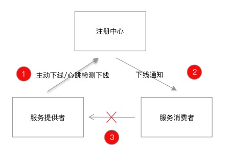

# Java应用的优雅停机

## 一. 优雅停机的概念

优雅停机一直是一个非常严谨的话题，但由于其仅仅存在于重启、下线这样的部署阶段，导致很多人忽视了它的重要性，但没有它，你永远不能得到一个完整的应用生命周期，永远会对系统的健壮性持怀疑态度。

同时，优雅停机又是一个庞大的话题

- 操作系统层面，提供了 kill -9 （SIGKILL）和 kill -15（SIGTERM） 两种停机策略
- 语言层面，Java 应用有 JVM shutdown hook 这样的概念
- 框架层面，Spring Boot 提供了 actuator 的下线 endpoint，提供了 `ContextClosedEvent` 事件
- 容器层面，Docker ：当执行 docker stop 命令时，容器内的进程会收到 SIGTERM 信号，那么 Docker Daemon 会在 10s 后，发出 SIGKILL 信号；K8S 在管理容器生命周期阶段中提供了 prestop 钩子方法。
- 应用架构层面，不同架构存在不同的部署方案。单体式应用中，一般依靠 nginx 这样的负载均衡组件进行手动切流，逐步部署集群；微服务架构中，各个节点之间有复杂的调用关系，上述这种方案就显得不可靠了，需要有自动化的机制。

为避免该话题过度发散，本文的重点将会集中在框架和应用架构层面，探讨以 Dubbo 为代表的微服务架构在优雅停机上的最佳实践。Dubbo 的优雅下线主要依赖于注册中心组件，由其通知消费者摘除下线的节点，如下图所示：



上述的操作旨在让服务消费者避开已经下线的机器，但这样就算实现了优雅停机了吗？似乎还漏掉了一步，在应用停机时，可能还存在执行到了一半的任务，试想这样一个场景：一个 Dubbo 请求刚到达提供者，服务端正在处理请求，收到停机指令后，提供者直接停机，留给消费者的只会是一个没有处理完毕的超时请求。

结合上述的案例，我们总结出 Dubbo 优雅停机需要满足两点基本诉求：

1. 服务消费者不应该请求到已经下线的服务提供者
2. 在途请求需要处理完毕，不能被停机指令中断

**优雅停机的意义：应用的重启、停机等操作，不影响业务的连续性**。

## 二. 操作系统层面的停机策略

操作系统层面，提供了 kill -9 （SIGKILL）和 kill -15（SIGTERM） 两种停机策略。

在 Linux 中，kill 命令用于向进程发送信号，以通知该进程执行某些特定的操作。其中，kill 命令最常用的两个参数是 -9 和 -15，它们分别表示发送 SIGKILL 和 SIGTERM 信号。

> 如果使用 kill pid 则默认等价于 kill -15 pid

- SIGKILL 信号是一个不能被阻塞、处理或忽略的信号，它会立即终止目标进程。使用 kill -9 命令发送 SIGKILL 信号可以强制终止进程，即使进程正在执行某些关键操作也会被立即终止，这可能会导致数据损坏或其他不良影响。因此，一般情况下不建议使用 kill -9 命令，除非必要情况下无法通过其他方式终止进程。

- SIGTERM 信号是一个可以被阻塞、处理或忽略的信号，它也可以通知目标进程终止，但是它相对于 SIGKILL 信号来说更加温和，目标进程可以在接收到 SIGTERM 信号时进行一些清理操作，例如保存数据、关闭文件、释放资源等，然后再终止进程。使用 kill -15 命令发送 SIGTERM 信号通常被认为是一种优雅的方式来终止进程，因为这种方式允许进程在终止之前执行一些必要的清理操作，避免了数据损坏和其他不良影响。

可以先简单理解下这两者的区别：`kill -9 pid` 可以理解为操作系统从内核级别强行杀死某个进程，`kill -15 pid` 则可以理解为发送一个通知，告知应用主动关闭。这么对比还是有点抽象，那我们就从应用的表现来看看，这两个命令杀死应用到底有啥区别。

因此，一般情况下建议首先尝试使用 kill -15 命令发送 SIGTERM 信号来终止进程，只有在进程无法通过 SIGTERM 信号终止时才考虑使用 kill -9 命令发送 SIGKILL 信号。

## 三. Docker 的优雅停机策略

在 Docker 中，执行 `docker stop` 命令时，它会向容器中的主进程发送 `SIGTERM` 信号，而不是向容器中的每个进程都发送信号。容器中的主进程通常是在容器启动时由 Docker 启动的第一个进程。

当接收到 `SIGTERM` 信号后，容器中的主进程可以选择优雅地停止容器中的所有进程，以确保数据的一致性和完整性。主进程可以将 `SIGTERM` 信号传递给容器中的其他进程，以便它们可以进行必要的清理操作，并在完成后正常退出。

如果容器中的进程不响应 `SIGTERM` 信号，Docker 会等待一定的时间（默认为 10 秒），然后向容器中的所有进程发送 `SIGKILL` 信号，以强制结束容器中的进程。如果我们需要修改 `SIGTERM` 信号等待的时间，可以在 `docker run` 命令中使用 `--stop-timeout` 参数来更改默认的停止超时时间，从而更改 `docker stop` 命令发送 `SIGKILL` 信号的等待时间。

`--stop-timeout` 参数接受一个以秒为单位的整数值，表示容器在接收到 `SIGTERM` 信号后的最长等待时间。如果容器在等待时间内没有正常停止，Docker 将会向容器发送 `SIGKILL` 信号，强制终止容器中的进程。

需要注意的是，在 Docker 中，主进程将 `SIGTERM` 信号传递给容器中的其他进程是否自动进行取决于容器内部的实现。Docker 本身并没有提供自动将 `SIGTERM` 信号传递给容器中的其他进程的功能。因此，在容器中实现优雅的停机策略需要确保容器内部的所有进程都能正确地处理 `SIGTERM` 信号，并在接收到信号后正确地执行必要的清理操作。容器中的主进程应该负责协调容器内部的所有进程，以确保容器在关闭时能够正确地完成必要的清理操作，并避免数据丢失和其他问题。

## 四. K8s Pod优雅停机策略

在 Kubernetes 中，Pod 的优雅停机是指在容器关闭之前，让容器有足够的时间来完成正在进行的操作，例如完成正在处理的请求、保存状态等等。这有助于防止数据丢失和请求中断，同时也可以避免不必要的资源浪费。

### 4.1 preStop钩子

Kubernetes 提供了一种优雅停机的机制，可以通过在 Pod 中设置 `preStop` 钩子来实现。`preStop` 钩子是在 Pod 中的容器被终止之前执行的一个命令或脚本，可以用来触发一些清理操作，例如保存状态、关闭连接等等。

在 Pod 中设置 `preStop` 钩子的方式如下：

1. 在 Pod 的 YAML 文件中添加 `preStop` 钩子定义：

```yaml
apiVersion: v1
kind: Pod
metadata:
  name: my-pod
spec:
  containers:
  - name: my-container
    image: my-image
    # 添加 preStop 钩子
    lifecycle:
      preStop:
        exec:
          command: ["/bin/sh", "-c", "my-cleanup-script"]
```

在上述示例中，`preStop` 钩子定义在 Pod 的 `spec` 部分中，`command` 字段指定了要执行的命令或脚本。

1. 保存 YAML 文件并使用 `kubectl apply` 命令创建或更新 Pod：

```bash
$ kubectl apply -f my-pod.yaml
```

当 Kubernetes 接收到要停止 Pod 的请求时，就会执行 `preStop` 钩子中定义的命令或脚本。一旦 `preStop` 钩子执行完成，Kubernetes 就会终止 Pod 中的容器，以便进行下一步操作。这样，您就可以在容器被终止之前完成一些清理操作，以确保不会出现数据丢失或请求中断的情况。

### 4.2 terminationGracePeriodSeconds

如果在 Kubernetes 中的 Pod 中没有指定 `preStop` 钩子，那么当需要停止 Pod 时，Kubernetes 会使用以下默认的停机流程：

1. Kubernetes 向 Pod 发送一个 TERM 信号，要求 Pod 中的所有容器进行优雅停机。
2. 如果在一定时间内（默认是 30 秒）容器没有响应 TERM 信号，Kubernetes 会向 Pod 中的所有容器发送一个 KILL 信号，强制终止容器。
3. 一旦所有的容器都被终止，Kubernetes 就会将 Pod 标记为已终止，并触发相应的事件。

在 Kubernetes 中，可以通过在 Pod 的 `spec` 中设置 `terminationGracePeriodSeconds` 字段来更改默认的优雅停机等待时间，并且在一定时间内（由该字段指定）容器没有响应 `SIGTERM` 信号后，Kubernetes 才会发送 `SIGKILL` 信号强制终止容器。

例如，如果要将默认的优雅停机等待时间更改为 60 秒，可以将 Pod 的 `spec` 设置为：

```yaml
apiVersion: v1
kind: Pod
metadata:
  name: my-pod
spec:
  containers:
  - name: my-container
    image: my-image
    # ...
    terminationGracePeriodSeconds: 60
```

在上述示例中，`terminationGracePeriodSeconds` 字段设置为 60 秒，表示容器在接收到 `SIGTERM` 信号后的最长等待时间为 60 秒。如果容器在等待时间内没有正常停止，Kubernetes 将会向容器发送 `SIGKILL` 信号，强制终止容器中的进程。

需要注意的是，更改优雅停机等待时间可能会影响容器的正常停止。如果容器中的进程需要更长的时间来完成必要的清理操作，那么需要相应地调整优雅停机等待时间，以确保容器在关闭时能够正确地完成必要的清理操作。同时，需要考虑到 Pod 中所有容器的清理操作需要在 `terminationGracePeriodSeconds` 所指定的时间内完成，否则会被强制终止。

在 Kubernetes 中，即使在 Pod 中指定了 `preStop` 钩子，Kubernetes 仍然会发送 `SIGTERM` 信号来通知容器停止运行。在 Pod 接收到 `SIGTERM` 信号后，Kubernetes 会等待 `terminationGracePeriodSeconds` 所指定的时间，以便容器中的进程有机会完成必要的清理操作。

在等待时间内，Kubernetes 会运行 `preStop` 钩子，以便容器可以在停止之前执行任何必要的清理操作，例如保存数据或与其他服务进行协调。如果 `preStop` 钩子运行成功并且容器中的进程在等待时间内完成了必要的清理操作，那么容器会正常停止。否则，Kubernetes 将会向容器发送 `SIGKILL` 信号，强制终止容器中的进程。

## 五. Java语言层面实现优雅停机

JVM shutdown hook 是 Java 虚拟机提供的一个钩子（hook），用于在 JVM 关闭之前执行一些必要的清理操作。在 Java 中，可以通过 `Runtime` 类的 `addShutdownHook` 方法注册一个 shutdown hook，当 JVM 接收到中断信号或者调用 `System.exit` 方法时，就会执行注册的 shutdown hook。

JVM shutdown hook 的具体实现方式如下：

1. 创建一个继承自 `Thread` 类的子类，用于实现 shutdown hook 的逻辑。
2. 在子类中重写 `run` 方法，编写需要在 JVM 关闭前执行的清理操作。
3. 在程序中使用 `Runtime` 类的 `addShutdownHook` 方法注册 shutdown hook：

```java
Runtime.getRuntime().addShutdownHook(new MyShutdownHook());
```

在上述示例中，`MyShutdownHook` 是继承自 `Thread` 的子类，用于实现 shutdown hook 的逻辑。

shutdown hook注意事项：

- JVM shutdown hook 的执行顺序是不确定的。当 JVM 接收到中断信号或者调用 `System.exit` 方法时，就会同时启动所有已注册的 shutdown hook，但是它们的执行顺序是不确定的。因此，在编写 shutdown hook 时，需要考虑到多个 shutdown hook 之间的交互和依赖关系。
- 程序退出时，JVM 会并发执行所有的应用 Shutdown Hook，并且只有所有 Shutdown Hook 都执行完，程序才正常退出。
- 执行 Shutdown Hook 时，应该认为应用内的各种服务、资源都已经处于不可靠状态。因此，编写 Shutdown Hook 时要特别小心，不要有死锁。Shutdown Hook 应该是线程安全的，且不依赖于应用资源，比如，假设你的 Shutdown Hook 依赖另一个服务，这个服务又注册了自己的 Shutdown Hook，已经先行一步清理完自己的资源，这时候你的 Shutdown Hook 就会有问题

## 六. SpringBoot 框架层面的优雅停机

上面解释过了，使用 `kill -15 pid` 的方式可以比较优雅的关闭 SpringBoot 应用，我们可能有以下的疑惑：SpringBoot/Spring 是如何响应这一关闭行为的呢？是先关闭了 tomcat，紧接着退出 JVM，还是相反的次序？它们又是如何互相关联的？

尝试从日志开始着手分析，`AnnotationConfigEmbeddedWebApplicationContext` 打印出了 Closing 的行为，直接去源码中一探究竟，最终在其父类 `AbstractApplicationContext` 中找到了关键的代码：

```java
@Override
public void registerShutdownHook() {
  if (this.shutdownHook == null) {
    this.shutdownHook = new Thread() {
      @Override
      public void run() {
        synchronized (startupShutdownMonitor) {
          doClose();
        }
      }
    };
    Runtime.getRuntime().addShutdownHook(this.shutdownHook);
  }
}

@Override
public void close() {
   synchronized (this.startupShutdownMonitor) {
      doClose();
      if (this.shutdownHook != null) {
         Runtime.getRuntime().removeShutdownHook(this.shutdownHook);
      }
   }
}

protected void doClose() {
   if (this.active.get() && this.closed.compareAndSet(false, true)) {
      LiveBeansView.unregisterApplicationContext(this);
      // 发布应用内的关闭事件
      publishEvent(new ContextClosedEvent(this));
      // Stop all Lifecycle beans, to avoid delays during individual destruction.
      if (this.lifecycleProcessor != null) {
         this.lifecycleProcessor.onClose();
      }
      // spring 的 BeanFactory 可能会缓存单例的 Bean 
      destroyBeans();
      // 关闭应用上下文 &BeanFactory
      closeBeanFactory();
      // 执行子类的关闭逻辑
      onClose();
      this.active.set(false);
}

```

为了方便排版以及便于理解，我去除了源码中的部分异常处理代码，并添加了相关的注释。在容器初始化时，`ApplicationContext` 便已经注册了一个 Shutdown Hook，这个钩子调用了 Close()方法，于是当我们执行 `kill -15 pid` 时，JVM 接收到关闭指令，触发了这个 `Shutdown Hook`，进而由 Close() 方法去处理一些善后手段。具体的善后手段有哪些，则完全依赖于 `ApplicationContext` 的 `doClose()` 逻辑，包括了注释中提及的销毁缓存单例对象，发布 close 事件，关闭应用上下文等等，特别的，当 `ApplicationContext` 的实现类是 `AnnotationConfigEmbeddedWebApplicationContext` 时，还会处理一些 tomcat/jetty 一类内置应用服务器关闭的逻辑。

窥见了 SpringBoot 内部的这些细节，更加应该了解到优雅关闭应用的必要性。JAVA 和 C 都提供了对 Signal 的封装，我们也可以手动捕获操作系统的这些 Signal，在此不做过多介绍，有兴趣的朋友可以自己尝试捕获下。

### 6.1 还有其他优雅关闭应用的方式吗

spring-boot-starter-actuator 模块提供了一个 restful 接口，用于优雅停机。

添加依赖：

```xml
<dependency>
   <groupId>org.springframework.boot</groupId>
   <artifactId>spring-boot-starter-actuator</artifactId>
</dependency>
```

添加配置 

```properties
#启用 shutdown
endpoints.shutdown.enabled=true
#禁用密码验证
endpoints.shutdown.sensitive=false
```

生产中请注意该端口需要设置权限，如配合 spring-security 使用。

执行 `curl -X POST host:port/shutdown` 指令，关闭成功便可以获得如下的返回：

```
{"message":"Shutting down, bye..."}
```

虽然 SpringBoot 提供了这样的方式，但按我目前的了解，没见到有人用这种方式停机，`kill -15 pid` 的方式达到的效果与此相同，将其列于此处只是为了方案的完整性。

### 6.2 如何销毁作为成员变量的线程池

尽管 JVM 关闭时会帮我们回收一定的资源，但一些服务如果大量使用异步回调，定时任务，处理不当很有可能会导致业务出现问题，在这其中，线程池如何关闭是一个比较典型的问题。

```java
@Service
public class SomeService {
    ExecutorService executorService = Executors.newFixedThreadPool(10);
    public void concurrentExecute() {
        executorService.execute(new Runnable() {
            @Override
            public void run() {
                System.out.println("executed...");
            }
        });
    }
}
```

我们需要想办法在应用关闭时（JVM 关闭，容器停止运行），关闭线程池。

初始方案：什么都不做。在一般情况下，这不会有什么大问题，因为 JVM 关闭，会释放之，但显然没有做到本文一直在强调的两个字，没错 —- 优雅。

方法一的弊端在于线程池中提交的任务以及阻塞队列中未执行的任务变得极其不可控，接收到停机指令后是立刻退出？还是等待任务执行完成？抑或是等待一定时间任务还没执行完成则关闭？

```java
@Service
public class SomeService implements DisposableBean{

    ExecutorService executorService = Executors.newFixedThreadPool(10);

    public void concurrentExecute() {
        executorService.execute(new Runnable() {
            @Override
            public void run() {
                System.out.println("executed...");
            }
        });
    }

    @Override
    public void destroy() throws Exception {
        executorService.shutdownNow();
        //executorService.shutdown();
    }
}
```

紧接着问题又来了，是 shutdown 还是 shutdownNow 呢？这两个方法还是经常被误用的，简单对比这两个方法。

ThreadPoolExecutor 在 shutdown 之后会变成 SHUTDOWN 状态，无法接受新的任务，随后等待正在执行的任务执行完成。意味着，shutdown 只是发出一个命令，至于有没有关闭还是得看线程自己。

ThreadPoolExecutor 对于 shutdownNow 的处理则不太一样，方法执行之后变成 STOP 状态，并对执行中的线程调用 Thread.interrupt() 方法（但如果线程未处理中断，则不会有任何事发生），所以并不代表“立刻关闭”。

查看 shutdown 和 shutdownNow 的 java doc，会发现如下的提示：

> shutdown()：Initiates an orderly shutdown in which previously submitted tasks are executed, but no new tasks will be accepted.Invocation has no additional effect if already shut down.This method does not wait for previously submitted tasks to complete execution.Use {@link #awaitTermination awaitTermination} to do that.
>
> shutdownNow()：Attempts to stop all actively executing tasks, halts the processing of waiting tasks, and returns a list of the tasks that were awaiting execution. These tasks are drained (removed) from the task queue upon return from this method.This method does not wait for actively executing tasks to terminate. Use {@link #awaitTermination awaitTermination} to do that.There are no guarantees beyond best-effort attempts to stop processing actively executing tasks. This implementation cancels tasks via {@link Thread#interrupt}, so any task that fails to respond to interrupts may never terminate.

两者都提示我们需要额外执行 awaitTermination 方法，仅仅执行 shutdown/shutdownNow 是不够的。

最终方案：参考 spring 中线程池的回收策略，我们得到了最终的解决方案。

```java
public abstract class ExecutorConfigurationSupport extends CustomizableThreadFactory
      implements DisposableBean{
    @Override
	public void destroy() {
		shutdown();
	}

	/**
	 * Perform a shutdown on the underlying ExecutorService.
	 * @see java.util.concurrent.ExecutorService#shutdown()
	 * @see java.util.concurrent.ExecutorService#shutdownNow()
	 * @see #awaitTerminationIfNecessary()
	 */
	public void shutdown() {
		if (this.waitForTasksToCompleteOnShutdown) {
			this.executor.shutdown();
		}
		else {
			this.executor.shutdownNow();
		}
		awaitTerminationIfNecessary();
	}

	/**
	 * Wait for the executor to terminate, according to the value of the
	 * {@link #setAwaitTerminationSeconds "awaitTerminationSeconds"} property.
	 */
	private void awaitTerminationIfNecessary() {
		if (this.awaitTerminationSeconds > 0) {
			try {
				this.executor.awaitTermination(this.awaitTerminationSeconds, TimeUnit.SECONDS));
			}
			catch (InterruptedException ex) {
				Thread.currentThread().interrupt();
			}
		}
	}
}
```

## 七. Dubbo 的优雅停机策略

为了让读者对 Dubbo 的优雅停机有一个最基础的理解，我们首先研究下 Dubbo 2.5.x 的版本，这个版本实现优雅停机的方案相对简单，容易理解。

### 7.1 入口类：AbstractConfig

```java
public abstract class AbstractConfig implements Serializable {
	static {
        Runtime.getRuntime().addShutdownHook(new Thread(new Runnable() {
            public void run() {
                ProtocolConfig.destroyAll();
            }
        }, "DubboShutdownHook"));
    }
}
```

在 `AbstractConfig` 的静态块中，Dubbo 注册了一个 shutdown hook，用于执行 Dubbo 预设的一些停机逻辑，继续跟进 `ProtocolConfig.destroyAll()` 。

### 7.2 ProtocolConfig

```java
public static void destroyAll() {
    if (!destroyed.compareAndSet(false, true)) {
        return;
    }
    AbstractRegistryFactory.destroyAll(); // ①注册中心注销

    // Wait for registry notification
    try {
        Thread.sleep(ConfigUtils.getServerShutdownTimeout()); // ② sleep 等待
    } catch (InterruptedException e) {
        logger.warn("Interrupted unexpectedly when waiting for registry notification during shutdown process!");
    }

    ExtensionLoader<Protocol> loader = ExtensionLoader.getExtensionLoader(Protocol.class);
    for (String protocolName : loader.getLoadedExtensions()) {
        try {
            Protocol protocol = loader.getLoadedExtension(protocolName);
            if (protocol != null) {
                protocol.destroy(); // ③协议/流程注销
            }
        } catch (Throwable t) {
            logger.warn(t.getMessage(), t);
        }
    }
}
```

Dubbo 中的 `Protocol` 这个词不太能望文生义，它一般被翻译为”协议”，但我更习惯将它理解为“流程”，从 `Protocol` 接口的三个方法反而更加容易理解。

```java
public interface Protocol {
    <T> Exporter<T> export(Invoker<T> invoker) throws RpcException;
    <T> Invoker<T> refer(Class<T> type, URL url) throws RpcException;
    void destroy();
}
```

它定义了暴露、订阅、注销这三个生命周期方法，所以不难理解为什么 Dubbo 会把 shutdown hook 触发后的注销方法定义在 `ProtocolConfig` 中了。

回到 `ProtocolConfig` 的源码中，我把 `ProtocolConfig` 中执行的优雅停机逻辑分成了三部分，其中第 1，2 部分和注册中心（Registry）相关，第 3 部分和协议/流程（Protocol）相关，分成下面的 7.3 和 7.4 两部分来介绍。

### 7.3 注册中心注销逻辑

```java
public abstract class AbstractRegistryFactory implements RegistryFactory {
	public static void destroyAll() {
        LOCK.lock();
        try {
            for (Registry registry : getRegistries()) {
                try {
                    registry.destroy();
                } catch (Throwable e) {
                    LOGGER.error(e.getMessage(), e);
                }
            }
            REGISTRIES.clear();
        } finally {
            // Release the lock
            LOCK.unlock();
        }
    }
}
```

这段代码对应了 7.2 小节 ProtocolConfig 源码的第 1 部分，代表了注册中心的注销逻辑，更深一层的源码不需要 debug 进去了，大致的逻辑就是删除掉注册中心中本节点对应的服务提供者地址。

```java
// Wait for registry notification
try {
    Thread.sleep(ConfigUtils.getServerShutdownTimeout());
} catch (InterruptedException e) {
    logger.warn("Interrupted unexpectedly when waiting for registry notification during shutdown process!");
}
```

这段代码对应了 7.2 小节 ProtocolConfig 源码的第 2 部分，`ConfigUtils.getServerShutdownTimeout()` 默认值是 10s，为什么需要在 shutdown hook 中等待 10s 呢？在注释中可以发现这段代码的端倪，原来是为了给服务消费者一点时间，确保等到注册中心的通知。10s 显然是一个经验值，这里也不妨和大家探讨一下，如何稳妥地设置这个值呢？

- 设置的过短。由于注册中心通知消费者取消订阅某个地址是异步通知过去的，可能消费者还没收到通知，提供者这边就停机了，这就违背了我们的诉求 1：**服务消费者不应该请求到已经下线的服务提供者**。
- 设置的过长。这会导致发布时间变长，带来不必要的等待。

两个情况对比下，起码可以得出一个实践经验：如果拿捏不准等待时间，尽量设置一个宽松的一点的等待时间。

这个值主要取决三点因素：

- 集群规模的大小。如果只有几个服务，每个服务只有几个实例，那么再弱鸡的注册中心也能很快的下发通知。
- 注册中心的选型。以 Naocs 和 Zookeeper 为例，同等规模服务实例下 Nacos 在推送地址方面的能力远超 Zookeeper。
- 网络状况。服务提供者和服务消费者与注册中心的交互逻辑走的 TCP 通信，网络状况也会影响到推送时间。

所以需要根据实际部署场景测量出最合适的值。

### 7.4 协议/流程注销逻辑

```java
ExtensionLoader<Protocol> loader = ExtensionLoader.getExtensionLoader(Protocol.class);
for (String protocolName : loader.getLoadedExtensions()) {
    try {
        Protocol protocol = loader.getLoadedExtension(protocolName);
        if (protocol != null) {
            protocol.destroy();
        }
    } catch (Throwable t) {
        logger.warn(t.getMessage(), t);
    }
}
```

这段代码对应了 7.2 小节 ProtocolConfig 源码的第 3 部分，在运行时，`loader.getLoadedExtension(protocolName)` 这段代码会加载到两个协议 ：`DubboProtocol` 和 `Injvm` 。后者 `Injvm` 实在没啥好讲的，主要来分析一下 `DubboProtocol` 的逻辑。

`DubboProtocol` 实现了我们前面提到的 `Protocol` 接口，它的 destory 方法是我们重点要看的。

```java
public class DubboProtocol extends AbstractProtocol {

    public void destroy() {
        for (String key : new ArrayList<String>(serverMap.keySet())) {
            ExchangeServer server = serverMap.remove(key);
            if (server != null) {
            	server.close(ConfigUtils.getServerShutdownTimeout());
            }
        }

        for (String key : new ArrayList<String>(referenceClientMap.keySet())) {
            ExchangeClient client = referenceClientMap.remove(key);
            if (client != null) {
            	client.close(ConfigUtils.getServerShutdownTimeout());
            }
        }

        for (String key : new ArrayList<String>(ghostClientMap.keySet())) {
            ExchangeClient client = ghostClientMap.remove(key);
            if (client != null) {
                client.close(ConfigUtils.getServerShutdownTimeout());
            }
        }
        stubServiceMethodsMap.clear();
        super.destroy();
    }
}
```

主要分成了两部分注销逻辑：server 和 client，注意这里是先注销了服务提供者后，再注销了服务消费者，这样做是有意为之。在 RPC 调用中，经常是一个远程调用触发一个远程调用，所以在关闭一个节点时，应该先切断上游的流量，所以这里是先注销了服务提供者，这样从一定程度上，降低了后面服务消费者被调用到的可能性（当然，服务消费者也有可能被单独调用到）。由于 server 和 client 的流程类似，所以我只选取了 server 部分来分析具体的注销逻辑。

```java
public void close(final int timeout) {
       startClose();
       if (timeout > 0) {
           final long max = (long) timeout;
           final long start = System.currentTimeMillis();

           if (getUrl().getParameter(Constants.CHANNEL_SEND_READONLYEVENT_KEY, true)) {
               // 如果注册中心有延迟，会立即受到readonly事件，下次不会再调用这台机器，当前已经调用的会处理完
               sendChannelReadOnlyEvent();
           }
           while (HeaderExchangeServer.this.isRunning() // ①
                   && System.currentTimeMillis() - start < max) {
               try {
                   Thread.sleep(10);
               } catch (InterruptedException e) {
                   logger.warn(e.getMessage(), e);
               }
           }
       }
       doClose(); // ②
       server.close(timeout); // ③
   }
   
   private boolean isRunning() {
       Collection<Channel> channels = getChannels();
       for (Channel channel : channels) {
           if (DefaultFuture.hasFuture(channel)) {
               return true;
           }
       }
       return false;
   }

private void doClose() {
       if (!closed.compareAndSet(false, true)) {
           return;
       }
       stopHeartbeatTimer();
       try {
           scheduled.shutdown();
       } catch (Throwable t) {
           logger.warn(t.getMessage(), t);
       }
   }
```

化繁为简，这里只挑选上面代码中打标的两个地方进行分析

1. 判断服务端是否还在处理请求，在超时时间内一直等待到所有任务处理完毕
2. 关闭心跳检测
3. 关闭 NettyServer

特别需要关注第一点，正符合我们在一开始提出的优雅停机的诉求 2：**“在途请求需要处理完毕，不能被停机指令中断”**。

### 7.5 Spring容器下Dubbo优雅停机

上述的方案在不使用 Spring 时的确是无懈可击的，但由于现在大多数开发者选择使用 Spring 构建 Dubbo 应用，上述的方案会存在一些缺陷。

由于 Spring 框架本身也依赖于 shutdown hook 执行优雅停机，并且与 Dubbo 的优雅停机会并发执行，而 Dubbo 的一些 Bean 受 Spring 托管，当 Spring 容器优先关闭时，会导致 Dubbo 的优雅停机流程无法获取相关的 Bean，从而优雅停机失效。

对这一部分感兴趣的小伙伴请查看原文：[一文聊透 Dubbo 优雅停机 - 徐靖峰|个人博客 (cnkirito.moe)](https://www.cnkirito.moe/dubbo-gracefully-shutdown/)

## 八. 总结

本文从操作系统、语言、框架层面分别阐述了一个Java应用优雅停机流程，从进程层面，优先推荐使用 SIGTERM 信号通知进程进入销毁流程，JVM虚拟机进程会监听该事件，并执行注册的ShutdownHook。在框架层面不同的框架都会自行注册自身框架的ShutdownHook，从而保证各种框架的正常销毁退出。

但是在容器或者K8S环境下，SIGTERM 信号发送后会有有限的宽容期，如果超过宽容期容器进程仍未正常退出，容器或者pod就会被SIGKILL强行销毁，所以在容器或者K8S环境下应该合理调整宽容期时长，从而保证应用能够正常停止。


> 本文参考至：
>
> [研究优雅停机时的一点思考 - 徐靖峰|个人博客 (cnkirito.moe)](https://www.cnkirito.moe/gracefully-shutdown/)
>
> [一文聊透 Dubbo 优雅停机 - 徐靖峰|个人博客 (cnkirito.moe)](https://www.cnkirito.moe/dubbo-gracefully-shutdown/)
>
> [Java应用的优雅停机总结_Java_陈德伟_InfoQ写作社区](https://xie.infoq.cn/article/9d6abf22069e917b6abd1ac18)