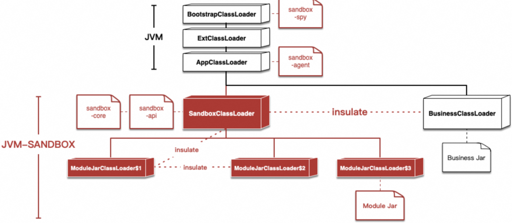
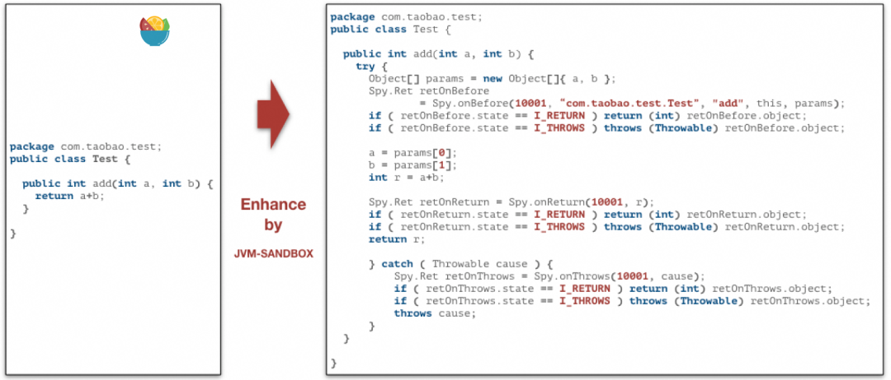
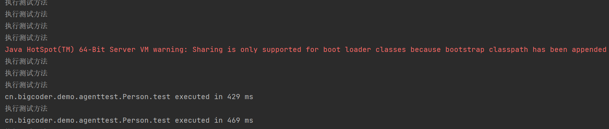
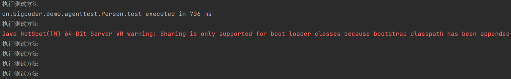
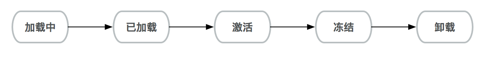
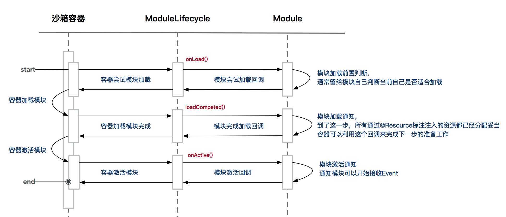

# JVM Sandbox入门详解

## 一. 概述

在日常开发中，经常会接触到面向AOP编程的思想，我们通常会使用Spring AOP来做统一的权限认证、异常捕获返回、日志记录等工作。之所以使用Spring AOP来实现上述功能，**是因为这些场景本质上来说都是与业务场景挂钩的，但是具有一定的抽象程度，并且绝大多数业务逻辑类都已经被Spring容器托管了**。但是这个世界上不是所有的Java应用都接入了Spring框架，接入Spring的应用也不是所有类都会被Spring容器托管，例如很多中间件代码、三方包代码，Java原生代码，都不能被Spring AOP代理到，所以在很多场景下Spring AOP都无法满足AOP编码的需求。

上面是从技术实现出发，说明了Spring AOP的局限性。如果从领域职责出发，像应用指标监控，全链路监控，故障定位，流量回放等与业务无关的场景代码放在业务系统中实现显然并不合适，此时如果有一种更为通用的AOP方式，将通用逻辑与业务逻辑解耦，岂不是美哉。

在 [《JavaAgent详解》](./_34JavaAgent详解.md) 中，我们提到了Java自身提供了JVM Instrumentation等功能，允许使用者以通过一系列API完成对JVM的复杂控制，以及字节码增强。但是如果使用原生的Java Agent能力，从技术实现上来说没有太大问题（毕竟越底层的技术越灵活，能够实现的功能越多），但是实现成本和门槛都比较高，开发者需要小心翼翼的操作目标类的字节码，在想要监控的目标方法前后插入对应的业务逻辑。虽然市面上有很多类似于 [Byte Buddy](https://bytebuddy.net/#/) 字节码增强库，大大简化了字节码增强的复杂度，但是开发成本和技术门槛都相对很高。而由阿里巴巴开源的 [jvm-sandbox](https://github.com/alibaba/jvm-sandbox) 在 Java Instrumentation API 的基础上实现了运行时 AOP 增强的能力，开发者不需要去操作目标类的字节码，即可对目标类进行字节码增强。

是不是看到这里还是不清楚我在讲什么？别急，我举几个典型的 jvm-sandbox 应用场景：

- 流量回放：如何录制线上应用每次接口请求的入参和出参？改动应用代码固然可以，但成本太大，通过jvm-sandbox，可以直接在不修改代码的情况下，直接抓取接口的出入参。
- 安全漏洞热修复：假设某个三方包（例如出名的fastjson）又出现了漏洞，集团内那么多应用，一个个发布新版本修复，漏洞已经造成了大量破坏。通过jvm-sandbox，直接修改替换有漏洞的代码，及时止损。
- 接口故障模拟：想要模拟某个接口超时5s后返回false的情况，jvm-sandbox很轻松就能实现。
- 故障定位：像Arthas类似的功能。
- 接口限流：动态对指定的接口做限流。
- 日志打印
- ...

可以看到，借助jvm-sandbox，你可以实现很多之前在业务代码中做不了的事，大大拓展了可操作的范围。

## 二. 整体架构

本章节不详细讲述JVM SandBox的所有架构设计，只讲其中几个最重要的特性。详细的架构设计可以看原框架代码仓库的Wiki。

### 2.1 类隔离

很多框架通过破坏双亲委派（我更愿意称之为直系亲属委派）来实现类隔离，SandBox也不例外。它通过自定义的SandboxClassLoader破坏了双亲委派的约定，实现了几个隔离特性：

- 和目标应用的类隔离：不用担心加载沙箱会引起原应用的类污染、冲突。
- 模块之间类隔离：做到模块与模块之间、模块和沙箱之间、模块和应用之间互不干扰。



### 2.2 无侵入AOP与事件驱动

在常见的AOP框架实现方案中，有静态编织和动态编织两种。

1. **静态编织**：静态编织发生在字节码生成时根据一定框架的规则提前将AOP字节码插入到目标类和方法中，实现AOP；

2. 动态编织

   ：动态编织则允许在JVM运行过程中完成指定方法的AOP字节码增强.常见的动态编织方案大多采用重命名原有方法，再新建一个同签名的方法来做代理的工作模式来完成AOP的功能(常见的实现方案如CgLib)，但这种方式存在一些应用边界：

   - **侵入性**：对被代理的目标类需要进行侵入式改造。比如：在Spring中必须是托管于Spring容器中的Bean
   - **固化性**：目标代理方法在启动之后即固化，无法重新对一个已有方法进行AOP增强

要解决`无侵入`的特性需要AOP框架具备 **在运行时完成目标方法的增强和替换**。在JDK的规范中运行期重定义一个类必须准循以下原则

1. 不允许新增、修改和删除成员变量
2. 不允许新增和删除方法
3. 不允许修改方法签名

JVM-SANDBOX属于基于Instrumentation的动态编织类的AOP框架，**通过精心构造了字节码增强逻辑，使得沙箱的模块能在不违反JDK约束情况下实现对目标应用方法的`无侵入`运行时AOP拦截**。



从上图中，可以看到一个方法的整个执行周期都被代码“加强”了，能够带来的好处就是你在使用JVM SandBox只需要对于方法的事件进行处理。

```java
// BEFORE
try {

   /*
    * do something...
    */

    // RETURN
    return;

} catch (Throwable cause) {
    // THROWS
}
```

在沙箱的世界观中，任何一个Java方法的调用都可以分解为`BEFORE`、`RETURN`和`THROWS`三个环节，由此在三个环节上引申出对应环节的事件探测和流程控制机制。

基于`BEFORE`、`RETURN`和`THROWS`三个环节事件分离，沙箱的模块可以完成很多类AOP的操作。

1. 可以感知和改变方法调用的入参
2. 可以感知和改变方法调用返回值和抛出的异常
3. 可以改变方法执行的流程
   - 在方法体执行之前直接返回自定义结果对象，原有方法代码将不会被执行
   - 在方法体返回之前重新构造新的结果对象，甚至可以改变为抛出异常
   - 在方法体抛出异常之后重新抛出新的异常，甚至可以改变为正常返回

## 三. 代码实践

我们还是以  [《JavaAgent详解》](./_34JavaAgent详解.md) 中的案例为例，首先定义 `Person` 类：

```java
package cn.bigcoder.demo.agenttest;

import java.util.Random;

public class Person {
   public String test() {
       System.out.println("执行测试方法");
       try {
           Thread.sleep(new Random().nextInt(1000));
       } catch (InterruptedException e) {
           throw new RuntimeException(e);
       }
       return "I'm ok";
  }
}
```

该类中有一个 test 方法，会在执行时随机停顿一段时间，模拟业务代码中的无法预测的执行时间，定义Main方法不断调用 `Person.test` 方法，模拟不间断的业务请求：

```java
package cn.bigcoder.demo.agenttest;

import java.util.Scanner;

/**
 * @author: bigcoder
 **/
public class AgentTest {

    public static void main(String[] args) {
        while (true) {
            Person person = new Person();
            person.test();
        }
    }
}
```

我们通过jvm-sandbox实现 `Person.test` 方法执行耗时的监控打印。

### 3.1 新建sandbox模块工程

首先新建Maven工程，假设用的是MAVEN，这里通过将**parent**指向**sandbox-module-starter**来简化我们的配置工作

```xml
<parent>
    <groupId>com.alibaba.jvm.sandbox</groupId>
    <artifactId>sandbox-module-starter</artifactId>
    <version>1.4.0</version>
</parent>
```

### 3.2 编写模块代码

```java
package cn.bigcoder.demo.sandbox;

import com.alibaba.jvm.sandbox.api.Information;
import com.alibaba.jvm.sandbox.api.Module;
import com.alibaba.jvm.sandbox.api.ModuleLifecycle;
import com.alibaba.jvm.sandbox.api.annotation.Command;
import com.alibaba.jvm.sandbox.api.listener.ext.Advice;
import com.alibaba.jvm.sandbox.api.listener.ext.AdviceListener;
import com.alibaba.jvm.sandbox.api.listener.ext.EventWatchBuilder;
import com.alibaba.jvm.sandbox.api.resource.ModuleEventWatcher;
import org.kohsuke.MetaInfServices;

import javax.annotation.Resource;

/**
 * @author: Jindong.Tian
 * @date: 2023-05-27
 **/
@MetaInfServices(Module.class)
@Information(id = "person-test-monitor")
public class PersonTimeMonitorModule implements Module {
    @Resource
    private ModuleEventWatcher moduleEventWatcher;

    @Command("monitorExecuteTime")
    public void monitorExecuteTime() {

        new EventWatchBuilder(moduleEventWatcher)
                // 增强 cn.bigcoder.demo.agenttest.Person 类
                .onClass("cn.bigcoder.demo.agenttest.Person")
                // 增强 cn.bigcoder.demo.agenttest.Person 类的test方法
                .onBehavior("test")
                .onWatch(new AdviceListener() {
                    @Override
                    protected void before(Advice advice) throws Throwable {
                        // 获取执行开始时间
                        advice.attach(System.currentTimeMillis());
                    }

                    @Override
                    public void afterReturning(Advice advice) throws Throwable {
                        // 在方法调用后计算方法耗时，并打印出来
                        long startTime = (long) advice.attachment();
                        long endTime = System.currentTimeMillis();
                        String className = advice.getBehavior().getDeclaringClass().getName();
                        String methodName = advice.getBehavior().getName();
                        System.out.println(className + "." + methodName + " executed in " + (endTime - startTime) + " ms");
                    }
                });
    }

}

```

### 3.3 Maven构建

```shell
$ mvn clean package
```

### 3.4 下载并安装沙箱

下载并安装最新版本沙箱：

- 下载地址：https://ompc.oss.aliyuncs.com/jvm-sandbox/release/sandbox-stable-bin.zip

- 执行安装

  ```shell
  unzip sandbox-stable-bin.zip
  cd sandbox
  ```

将打好的包复制到用户模块目录下：

```shell
cp ./jvm-sandbox-demo/target/jvm-sandbox-demo-1.0-SNAPSHOT.jar /home/bigcoder/.opt/sandbox
```

### 3.5 启动目标类

启动 AgentTest.main，此时代码一直输出：

```txt
执行测试方法
执行测试方法
执行测试方法
执行测试方法
...
```

### 3.6 启动沙箱，并激活模块

```shell
➜  sandbox jps -l
2241 cn.bigcoder.demo.agenttest.AgentTest
2264 jdk.jcmd/sun.tools.jps.Jps
➜  sandbox ./bin/sandbox.sh -p 2241 -d 'person-test-monitor/monitorExecuteTime' 
```

使用 `jps` 命令查看目标进程ID，然后启动沙箱，`-p` 参数指定目标进程 `pid`，`-d` 参数指定要激活的的模块。

此时，我们可以看到控制台开始打印方法执行耗时了：



### 3.7 卸载沙箱

```shell
➜  sandbox ./bin/sandbox.sh -p 2241 -S
jvm-sandbox[default] shutdown finished.
```

此时，控制台又恢复了往日的平静，不再输出方法耗时：



### 3.8 agent方式增强

在 3.6 中我们是以attch方式增强已运行的JVM进程，有些时候我们需要沙箱工作在应用代码加载之前，或者一次性渲染大量的类、加载大量的模块，此时如果用ATTACH方式加载，可能会引起目标JVM的卡顿或停顿（GC），这就需要用到AGENT的启动方式。

假设SANDBOX被安装在了`/homt/bigcoder/.opt/sandbox`，需要在JVM启动参数中增加上 `-javaagent:/homt/bigcoder/.opt/sandbox/lib/sandbox-agent.jar`

## 四. 模块的生命周期

模块生命周期类型有`模块加载`、`模块卸载`、`模块激活`、`模块冻结`、`模块加载完成`五个状态。



- **模块加载**：创建ClassLoader，完成模块的加载
- **模块卸载**：模块增强的类会重新load，去掉增强的字节码
- **模块激活**：模块被激活后，模块所增强的类将会被激活，所有`com.alibaba.jvm.sandbox.api.listener.EventListener`将开始收到对应的事件
- **模块冻结**：模块被冻结后，模块所持有的所有`com.alibaba.jvm.sandbox.api.listener.EventListener`将被静默，无法收到对应的事件。需要注意的是，模块冻结后虽然不再收到相关事件，但沙箱给对应类织入的增强代码仍然还在。
- **模块加载完成**：模块加载已经完成，这个状态是为了做日志处理，本身不会影响模块变更行为

模块可以通过实现`com.alibaba.jvm.sandbox.api.ModuleLifecycle`接口，对模块生命周期进行控制，接口中的方法：



- **onLoad**：模块开始加载之前调用
- **onUnload**：模块开始卸载之前调用
- **onActive**：模块被激活之前调用，抛出异常将会是阻止模块被激活的唯一方式
- **onFrozen**：模块被冻结之前调用，抛出异常将会是阻止模块被冻结的唯一方式

## 五. 小结

本文从 Spring AOP 的局限性出发，探讨了 jvm-sandbox 使用场景。如果使用 Java Instrumentation API 增强目标方法，理论上来说也能实现目标类增强，但是字节码修改的门槛过高。而 `jvm-sandbox` 提供了运行时AOP增强的能力，虽然底层仍然基于 Java Instrumentation API，但是程序员不再需要关心字节码增强的细节，就能完成对原有方法的逻辑增强。

我们引入了 [《JavaAgent详解》](./_34JavaAgent详解.md) 文章中相同的例子，讲解了如何使用 jvm-sandbox 去增强 `Person.test` 方法，从而统计方法执行耗时。该例只是一个简单的入门案例，如果对jvm-sandbox 感兴趣，可以学习官方沙箱分发包中自带的实用工具的例子`./example/sandbox-debug-module.jar`，代码在沙箱的`sandbox-debug-module`模块：

| 例子                                                         | 例子说明                                                     |
| ------------------------------------------------------------ | ------------------------------------------------------------ |
| [DebugWatchModule.java](https://github.com/alibaba/jvm-sandbox/blob/master/sandbox-debug-module/src/main/java/com/alibaba/jvm/sandbox/module/debug/DebugWatchModule.java) | 模仿GREYS的`watch`命令                                       |
| [DebugTraceModule.java](https://github.com/alibaba/jvm-sandbox/blob/master/sandbox-debug-module/src/main/java/com/alibaba/jvm/sandbox/module/debug/DebugTraceModule.java) | 模仿GREYES的`trace`命令                                      |
| [DebugRalphModule.java](https://github.com/alibaba/jvm-sandbox/blob/master/sandbox-debug-module/src/main/java/com/alibaba/jvm/sandbox/module/debug/DebugRalphModule.java) | 无敌破坏王，故障注入（延时、熔断、并发限流、TPS限流）        |
| [LogExceptionModule.java](https://github.com/alibaba/jvm-sandbox/blob/master/sandbox-debug-module/src/main/java/com/alibaba/jvm/sandbox/module/debug/LogExceptionModule.java) | 记录下你的应用都发生了哪些异常 $HOME/logs/sandbox/debug/exception-monitor.log |
| [LogServletAccessModule.java](https://github.com/alibaba/jvm-sandbox/blob/master/sandbox-debug-module/src/main/java/com/alibaba/jvm/sandbox/module/debug/LogServletAccessModule.java) | 记录下你的应用的HTTP服务请求 $HOME/logs/sandbox/debug/servlet-access.log |

