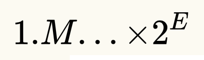
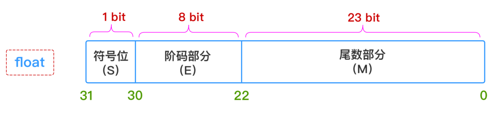
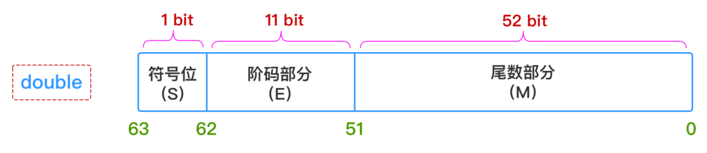
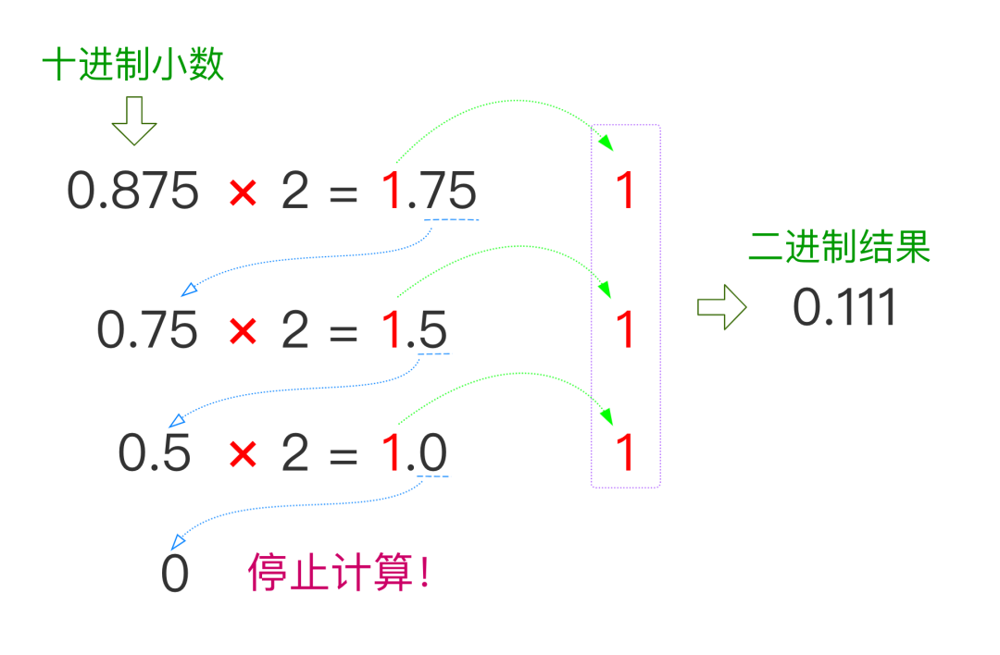
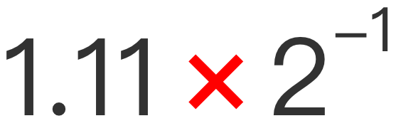
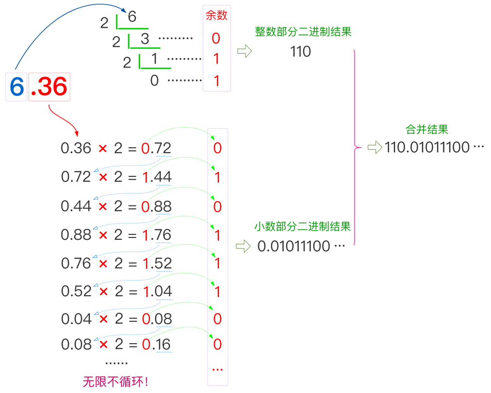
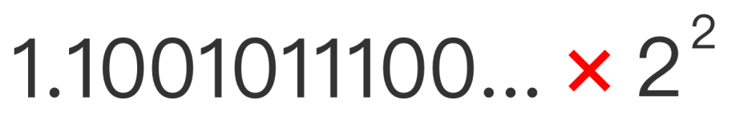

# 计算机中的浮点为什么不精确

> 说明：本文转载至 [真有小伙伴不知道浮点数如何转二进制吗？](https://mp.weixin.qq.com/s?__biz=MzU4ODI1MjA3NQ==&mid=2247485714&idx=1&sn=7bca28f2fa8028bb61de289538d8bf99&chksm=fddedfd6caa956c0d6e1d065714d04fdf4883ec54488697c3e5a3c9d0ba5f9be636405470f34&mpshare=1&scene=23&srcid=0514T25W3AMohNIcAWMGi2gO&sharer_sharetime=1589443621299&sharer_shareid=e81601a95b901aeca142bbe3b957819a#rd)

## 一. 浮点数在计算机中是如何表示的？

学过 **《计算机组成原理》** 或者类似 **《计算机系统》** 这些课程的小伙伴们应该都知道，浮点数在计算机中的存储方式遵循**IEEE 754 浮点数计数标准**，可以表示为：



采用**尾数 + 阶码**的编码方式，更通俗一点说，就是类似于数学课本上所学的**科学计数法**表示方式：**有效数字 + 指数位**！

因此，只要给出：**符号（S）**、**阶码部分（E）**、**尾数部分（M）** 这三个维度的信息，一个浮点数的表示就完全确定下来了，所以`float`和`double`这两种类型的浮点数在计算机中的存储结构就表示成下图所示这个样子：





**1、符号部分（S）**

`0`-正  `1`-负

**2、阶码部分（E）（指数部分）**：

- 对于`float`型浮点数，指数部分`8`位，考虑可正可负，因此可以表示的指数范围为`-127 ~ 128`
- 对于`double`型浮点数，指数部分`11`位，考虑可正可负，因此可以表示的指数范围为`-1023 ~ 1024`

**3、尾数部分（M）**：

浮点数的精度是由尾数的位数来决定的：

- 对于`float`型浮点数，尾数部分`23`位，换算成十进制就是 `2^23=8388608`，所以十进制精度只有`6 ~ 7`位；
- 对于`double`型浮点数，尾数部分`52`位，换算成十进制就是 `2^52 = 4503599627370496`，所以十进制精度只有`15 ~ 16`位

所以，浮点数交给计算机存储的时候，可能会有**精度丢失**问题！！！因此使用时需要格外小心，如果真因为这一块出了bug，定位问题还是非常艰难的，所以预防工作要做好。

## 二. 进制转换计算案例

上面说的是IEEE标准规定的内容，属于理论规约。那一个小数到底要怎么换算成二进制呢？我们得拿**实际例子**来解释。

### 2.1 先来个简单的例子

比如：**把十进制小数0.875转换成二进制，具体怎么操作？**

可以分几大步走：

**1、以小数点为界，拆分**

**2、整数部分转换**

整数转二进制我想大家应该都熟悉，使用：**除2取余法** 即可。而这里的`0.875`整数部分为0，无需操作。

**3、小数部分转换**

小数部分的转换不同于整数部分，采用的是 **“乘2取整法”** ，图示一下就明白了：



**4、合并结果**

`整数部分 + 小数部分`，最终得到二进制结果为`0.111`。

所以该结果按照上一节所述的**尾数 + 阶码**的计算机计数方式，则可以表示为：



所以对应可得：

- **符号位**：`0`
- **阶码（E）部分**：若以`float`为例，应为 `127 +（-1）= 126`，因此二进制表示为：`01111110`
- **尾数部分（M）**：若以`float`为例，应为`23`位，因此尾部补齐后为`11000000000000000000000`。

因此最终的总结果为（以`32`位精度`float`表示）：

```
00111111011000000000000000000000
```

### 2.2 再来个复杂点例子

再比如：**把十进制小数6.36转换成二进制，具体怎么操作？**

但凡能用图示，我就不想写文字，所以用一张图就可以解释得明明白白：



整数部分 + 小数部分，因此最终得到的结果二进制结果为`110.01011100...`。

还是按照上一节所述的**尾数 + 阶码**的计算机计数方式，则可以表示为：



所以对应可得：

- **符号位**：0
- **阶码（E）部分**：若以`float`为例，应为 `127 +（2）= 129`，因此二进制表示为：`10000001`
- **尾数部分（M）**：`1001011100...`，其实它本身无限不循环，但若以`float`型精度来截取`23`位，则可以表示为`10010111000010100011111`

因此最终的总结果为（以`32`位精度`float`表示）：

```
01000000110010111000010100011111
```

所以像这种无限位数的尾数情况，用计算机存储产生截取是必然的，必定会有一定的**精度损失**！所以这也从根本上解释了为什么float或者double这种类型数据使用时的风险性，因此必须要结合实际业务理性考量。

