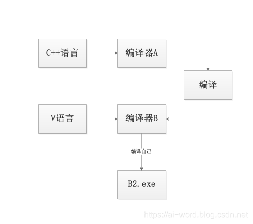
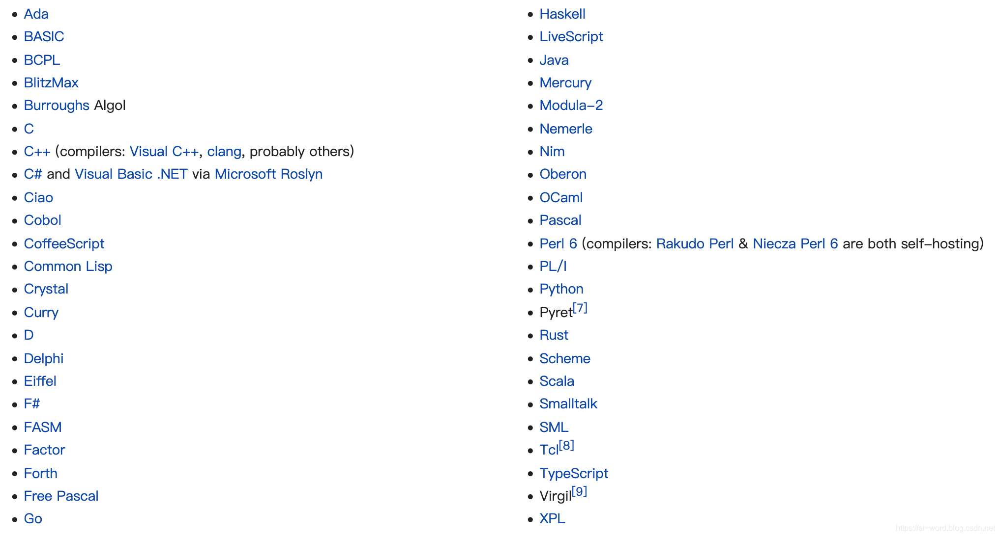

# 编程语言的自举

> 本文转载至：[[语言思考\]编程语言自举的意义_图解AI-CSDN博客_编程语言自举](https://blog.csdn.net/BaiHuaXiu123/article/details/89377250)

## 一. 自举过程

自举（bootstrapping）字面理解就是自己能把自己给举起来，换做编程语言来讲就是，自己编译自己，可以看看（wiki上面的解释）（https://en.wikipedia.org/wiki/Bootstrapping_(compilers)）

那么语言自举过程到底是个怎么样的过程？

那么语言自举过程到底是个怎么样的过程？

下面选取了来自知乎vczh轮子哥的解释：

- 用C++把那个编译器（A）写出来，顺便留下很多测试用例。
- 用V语言把那个编译器写（B）出来，用A.exe来编译B，修改直到所有测试用例都通过为止。
- B.exe来编译B自己得到B2.exe，修改直到B2.exe所有测试用例都通过为止。这是为了保证，就算B本身有很多bug，至少编译自己是没有bug的，从而你就可以走到第四步。
- 当你觉得有信心了，用A.exe把B编译一遍，就得到了B.exe。然后A的代码和A.exe都在也不需要存在了，删掉他们。以后你就不断的用B.exe来编译下一个版本的B就好了。就自举了。

自举的过程大概是这样，都需要一个最初的编译器，而最初的编译器是不会关心最优，只在乎写的是否正确，这样造成的效率也是十分低下的。

## 二. 自举的语言

现在自举的语言有很多比如：

## 三. 自举的好处

- 语言通过自我编译，自我迭代，达到本身语言的真正成熟稳定
- 对编译器后端的优化不仅会优化以后所有编译出来的其它程序的效率，也会优化编译器本身的效率
- 使开发编译器的环境和使用这门语言开发的其它程序一致
- 同时也摆脱了其它语言的依赖和自我迭代