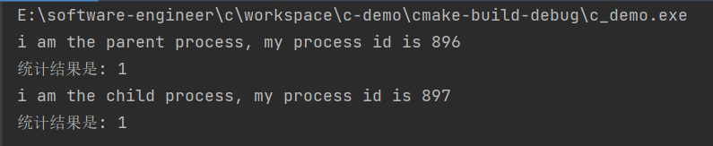
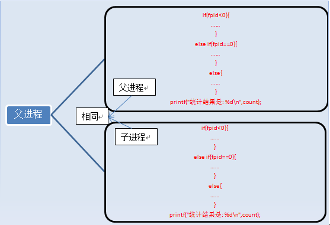
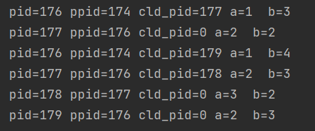
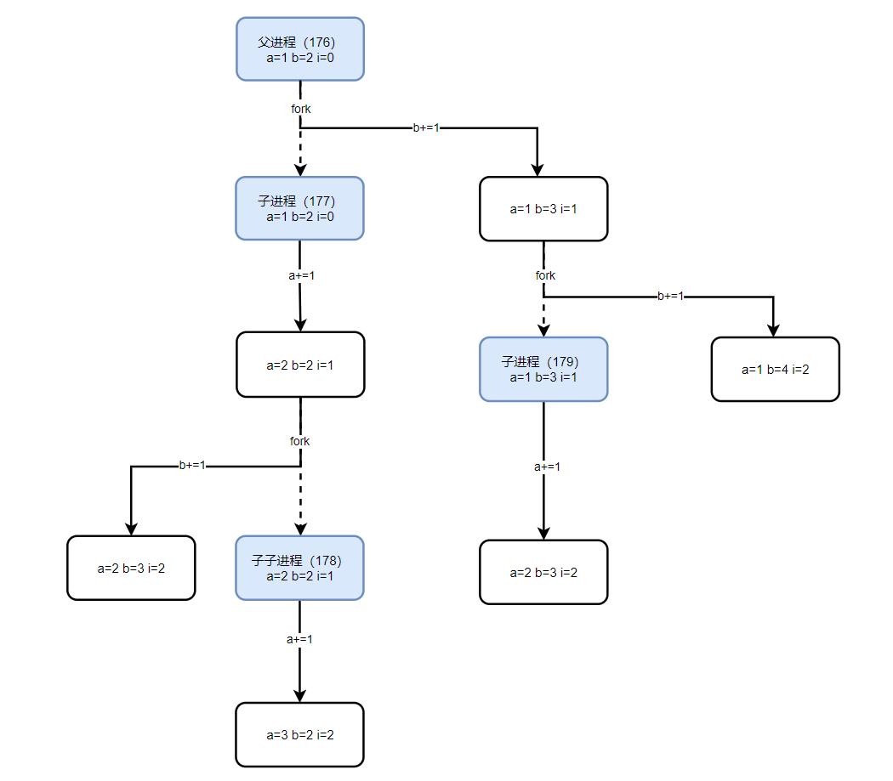

# Linux下的copy-on-write

## 一. 什么是copy-on-write

写入时复制（copy-on-write，简称COW）是一种计算机程序设计领域的优化策略。其核心思想是，如果有多个调用者（callers）同时请求相同资源（如内存或磁盘上的数据存储），他们会共同获取相同的指针指向相同的资源，直到某个调用者试图修改资源的内容时，系统才会真正复制一份专用副本（private copy）给该调用者，而其他调用者所见到的最初的资源仍然保持不变。这过程对其他的调用者都是透明的（transparently）。此作法主要的优点是如果调用者没有修改该资源，就不会有副本（private copy）被建立，因此多个调用者只是读取操作时可以共享同一份资源。

COW在很多场景下都会使用，他们利用COW解决不同的问题：

- Linux通过copy-on-write技术极大地**减少了Fork的开销**。
- 文件系统通过copy-on-write技术一定程度上保证**数据的完整性**。
- jdk通过copy-on-write技术在读多写少的场景下，提供并发能力。

## 一. Linux COW

### 1.1 进程fork

在说明Linux下的copy-on-write机制前，我们首先要知道两个函数：`fork()`和`exec()`。需要注意的是`exec()`并不是一个特定的函数, 它是**一组函数的统称**, 它包括了`execl()`、`execlp()`、`execv()`、`execle()`、`execve()`、`execvp()`。

fork是类Unix操作系统上**创建进程**的主要方法。fork用于**创建子进程**(等同于当前进程的副本)。

- 新的进程要通过老的进程复制自身得到，这就是fork！

如果接触过Linux，我们会知道Linux下**init进程是所有进程的爹**(相当于Java中的Object对象)

- Linux的进程都通过init进程或init的子进程fork(vfork)出来的。

一个进程，包括代码、数据和分配给进程的资源。fork（）函数通过系统调用创建一个与原来进程几乎完全相同的进程，也就是两个进程可以做完全相同的事，但如果初始参数或者传入的变量不同，两个进程也可以做不同的事。

一个进程调用fork（）函数后，系统先给新的进程分配资源，例如存储数据和代码的空间。然后把原来的进程的所有值都复制到新的新进程中，只有少数值与原来的进程的值不同。相当于克隆了一个自己。

我们来看一个例子：

```c
#include <unistd.h>
#include <stdio.h>

int main() {
    pid_t fpid; //fpid表示fork函数返回的值
    int count = 0;
    fpid = fork();
    if (fpid < 0)
        printf("error in fork!");
    else if (fpid == 0) {
        printf("i am the child process, my process id is %d\n", getpid());
        count++;
    } else {
        printf("i am the parent process, my process id is %d\n", getpid());
        count++;
    }
    printf("统计结果是: %d\n", count);
    return 0;
}
```

运行结果是：



在语句fpid=fork()之前，只有一个进程在执行这段代码，但在这条语句之后，就变成两个进程在执行了，这两个进程的几乎完全相同，将要执行的下一条语句都是if(fpid<0)……

为什么两个进程的fpid不同呢，这与fork函数的特性有关。fork调用的一个奇妙之处就是它仅仅被调用一次，却能够返回两次，它可能有三种不同的返回值：

1. 在父进程中，fork返回新创建子进程的进程ID；
2. 在子进程中，fork返回0；
3. 如果出现错误，fork返回一个负值；

在fork函数执行完毕后，如果创建新进程成功，则出现两个进程，一个是子进程，一个是父进程。在子进程中，fork函数返回0，在父进程中，fork返回新创建子进程的进程ID。我们可以通过fork返回的值来判断当前进程是子进程还是父进程。

fork出错可能有两种原因：

1. 当前的进程数已经达到了系统规定的上限，这时errno的值被设置为EAGAIN。
2. 系统内存不足，这时errno的值被设置为ENOMEM。

创建新进程成功后，系统中出现两个基本完全相同的进程，这两个进程执行没有固定的先后顺序，哪个进程先执行要看系统的进程调度策略。

每个进程都有一个独特（互不相同）的进程标识符（process ID），可以通过getpid（）函数获得，还有一个记录父进程pid的变量，可以通过getppid（）函数获得变量的值。

fork执行完毕后，出现两个进程：



有人说两个进程的内容完全一样啊，怎么打印的结果不一样啊，那是因为判断条件的原因，上面列举的只是进程的代码和指令，还有变量啊。
执行完fork后，进程1的变量为count=0，fpid！=0（父进程）。进程2的变量为count=0，fpid=0（子进程），这两个进程的变量都是独立的，存在不同的地址中，不是共用的，这点要注意。可以说，我们就是通过fpid来识别和操作父子进程的。

还有人可能疑惑为什么不是从#include处开始复制代码的，这是因为fork是把进程当前的情况拷贝一份，执行fork时，进程已经执行完了int count=0;fork只拷贝下一个要执行的代码到新的进程。

> 需要注意的是，在fork之后两个进程用的是相同的物理空间(内存区)，子进程的代码段、数据段、堆栈都是指向父进程的物理空间，也就是说，两者的虚拟空间不同，其对应的物理空间是一个。这是出于效率的考虑，在Linux中被称为“写时复制”（copy-on-write）技术，只有当父子进程中有更改相应段的行为发生时，再为子进程相应的段分配物理空间。另外fork之后内核会将子进程排在队列的前面，以让子进程先执行，以免父进程执行导致写时复制，而后子进程执行exec系统调用，因无意义的复制而造成效率的下降。

### 1.2 代码分析

先看一份代码：

```shell
#include <unistd.h>
#include <stdio.h>

int main() {
    pid_t cld_pid;
    int a = 1, b = 2;
    for (int i = 0; i < 2; i++) {
        if ((cld_pid = fork()) == 0) {
            a += 1;
            printf("a=%d  b=%d\n", a, b);
        } else {
            b += 1;
            printf("a=%d  b=%d\n", a, b);
        }
    }
    return 0;
}
```

代码结果：




执行流程：



图中实线箭头代表进程内变量的变化过程，虚线箭头代表进程之间的fork操作，产生子进程。

## 三. 文件系统COW

当我要修改数据块A的内容的时候，我先把A读出来，写到B块里，如果写的过程掉电了，原来A的内容还在，如果是还写到原来的位置上，那么写入的数据究竟写了多少就不确定了，会不会破坏原来的数据也不好说。

很多老的文件系统都不支持COW，比如FAT家族都不支持，但主流的文件系统都多多少少支持一点COW，比如BTRFS，NTFS等。

其实COW对于用户数据来说，并不是特别重要，多数文件系统也不能承诺掉电以后究竟能恢复多少数据（我印象里只有tffs能做到恢复）。COW的好处是对文件系统元数据的保护，元数据包括文件名、文件大小、属性、路径结构等等，这些数据如果损坏，轻则丢失文件，重则分区完蛋。比如在FAT分区上，如果在大规模删除、复制文件的时候突然断电，文件夹结构可能就有破坏的风险，而如果支持COW的话，文件系统能很容易回滚数据到前一个状态（虽然也会丢失文件），保证文件系统自身结构稳定。

COW是一定会降低性能的，因为访问的数据量不同，还可能要扫描元数据的bitmap之类的东西，当然设计合理的话用户基本感觉不到（NTFS最早的版本就被用户抱怨说速度太慢，好像就是这个原因）。

跟COW相关的还有一个叫Allocate-on-flush或者Delayed Allocation，大概可以称为申请时刷新或者延迟分配，好处就是降低碎片，坏处就是有点费内存。

> 本文参考至：
>
> [【Linux 进程】fork函数详解 - 我得去图书馆了 - 博客园 (cnblogs.com)](https://www.cnblogs.com/xuelisheng/p/10071336.html)
>
> [神奇的fork（父子进程中一些神奇的问题） - 简书 (jianshu.com)](https://www.jianshu.com/p/0ec862d282d1)
>
> [COW奶牛！Copy On Write机制了解一下 - 掘金 (juejin.cn)](https://juejin.cn/post/6844903702373859335)

