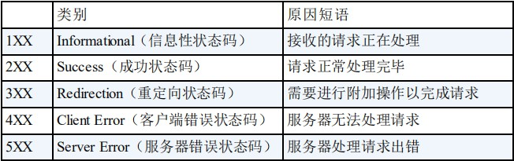

# HTTP常见的状态码



## **2XX** 成功

### 200 OK

表示从客户端发来的请求在服务器端被正常处理了。

在响应报文内，随状态码一起返回的信息会因方法的不同而发生改变。比如，使用 GET 方法时，对应请求资源的实体会作为响应返回；而使用 HEAD 方法时，对应请求资源的实体首部不随报文主作为响应返回（即在响应中只返回首部，不会返回实体的主体部分）。

### 204 No Content

该状态码代表服务器接收的请求已成功处理，但在返回的响应报文中不含实体的主体部分。另外，也不允许返回任何实体的主体。比如，当从浏览器发出请求处理后，返回 204 响应，那么浏览器显示的页面不发生更新。

一般在只需要从客户端往服务器发送信息，而对客户端不需要发送新信息内容的情况下使用。

### 206 Partial Content

该状态码表示客户端进行了范围请求，而服务器成功执行了这部分的GET 请求。响应报文中包含由 Content-Range 指定范围的实体内容。


## **3XX** 重定向

### 301 Moved Permanently

永久性重定向。该状态码表示请求的资源已被分配了新的 URI，以后应使用资源现在所指的 URI。也就是说，如果已经把资源对应的 URI保存为书签了，这时应该按 Location 首部字段提示的 URI 重新保存。

像下方给出的请求 URI，当指定资源路径的最后忘记添加斜杠“/”，就会产生 301 状态码。

```xml
http://example.com/sample
```

### 302 Found

临时性重定向。该状态码表示请求的资源已被分配了新的 URI，希望用户（本次）能使用新的 URI 访问。和 301 Moved Permanently 状态码相似，但 302 状态码代表的资源不是被永久移动，只是临时性质的。换句话说，已移动的资源对应的URI 将来还有可能发生改变。比如，用户把 URI 保存成书签，但不会像 301 状态码出现时那样去更新书签，而是仍旧保留返回 302 状态码的页面对应的 URI。

### 303 See Other

该状态码表示由于请求对应的资源存在着另一个 URI，应使用 GET方法定向获取请求的资源.

303 状态码和 302 Found 状态码有着相同的功能，但 303 状态码明确表示客户端应当采用 GET 方法获取资源，这点与 302 状态码有区别。

**注**：

当 301、302、303 响应状态码返回时，几乎所有的浏览器都会把POST 改成 GET，并删除请求报文内的主体，之后请求会自动再次发送。301、302 标准是禁止将 POST 方法改变成 GET 方法的，但实际使用时大家都会这么做。


## **4XX** 客户端错误

4XX 的响应结果表明客户端是发生错误的原因所在。

### 400 Bad Request

该状态码表示请求报文中存在语法错误。当错误发生时，需修改请求的内容后再次发送请求。另外，浏览器会像 200 OK 一样对待该状态码。

### 401 Unauthorized

该状态码表示发送的请求需要有通过 HTTP 认证（BASIC 认证、DIGEST 认证）的认证信息。另外若之前已进行过 1 次请求，则表示用户认证失败。

返回含有 401 的响应必须包含一个适用于被请求资源的 WWW-Authenticate 首部用以质询（challenge）用户信息。当浏览器初次接收到 401 响应，会弹出认证用的对话窗口。

### 403 Forbidden

该状态码表明对请求资源的访问被服务器拒绝了。服务器端没有必要给出拒绝的详细理由，但如果想作说明的话，可以在实体的主体部分对原因进行描述，这样就能让用户看到了。

未获得文件系统的访问授权，访问权限出现某些问题（从未授权的发送源 IP 地址试图访问）等列举的情况都可能是发生 403 的原因。

### 404 Not Found

该状态码表明服务器上无法找到请求的资源。除此之外，也可以在服务器端拒绝请求且不想说明理由时使用。

### 413

客户端发送的实体主体部分比服务器能够或者希望处理的要大。

### 414

客户端发送的请求所携带的URL超过了服务器能够或者希望处理的长度。


## **5XX** 服务器错误

### 500 Internal Server Error

该状态码表明服务器端在执行请求时发生了错误。也有可能是 Web应用存在的 bug 或某些临时的故障。

### 503 Service Unavailable

该状态码表明服务器暂时处于超负载或正在进行停机维护，现在无法处理请求。如果事先得知解除以上状况需要的时间，最好写入RetryAfter 首部字段再返回给客户端。

