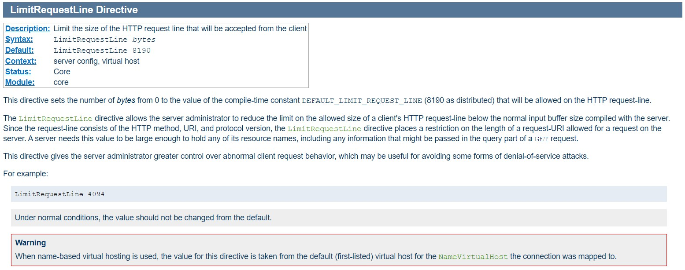
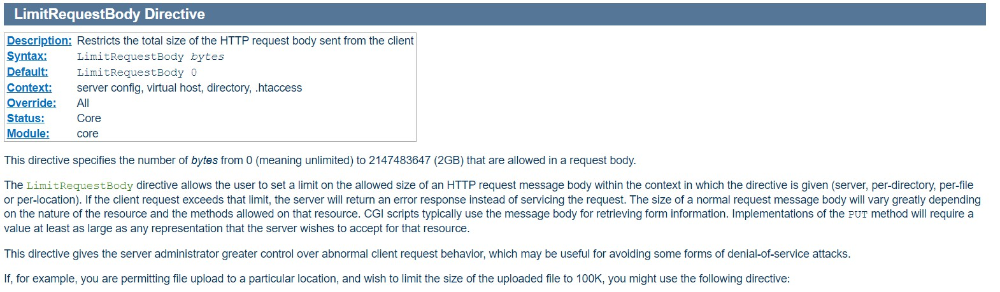
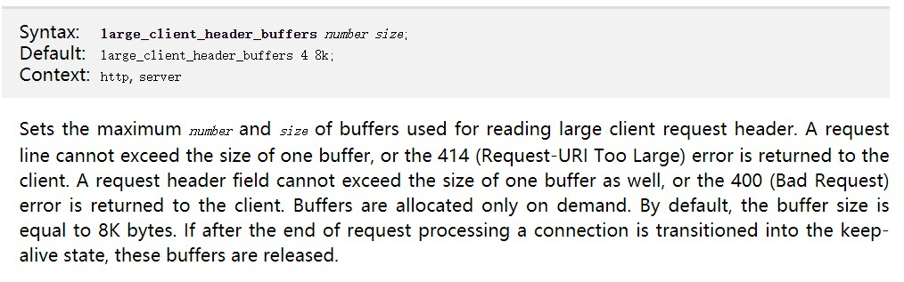
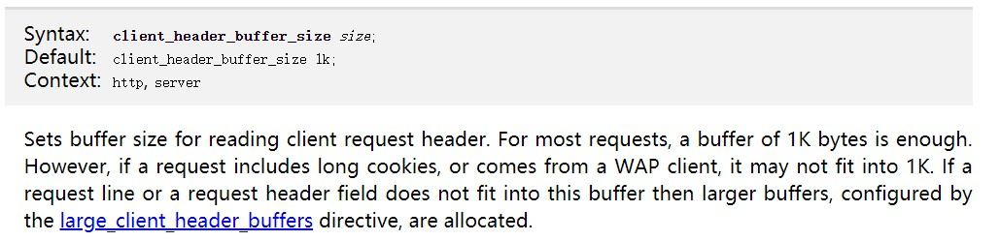
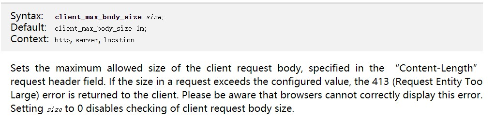

# 关于http请求url长度以及请求消息体长度的研究

这周因为一个日志统计的需求，对http请求url长度以及请求消息体长度的相关标准和现状进行了一些研究。

先说说遇到的问题，因为要收集用户状态的反馈，所以希望将浏览器收集到的用户信息发到服务器上，用GET方式请求一个静态文件，所带的参数便是收集到的信息。为了使收集到的信息有效和准确，所以必须对http协议、浏览器、服务器相关的规范进行了解，合理设置统计参数，不要超出范围。

我首先想到的就是去看HTTP 1.1 协议，看是不是有限制（这协议真是又臭又长.......）。惊奇的发现，原来协议对url是不做长度限制的。原话如下：

> *The HTTP protocol does not place any a priori limit on the length of a URI. Servers MUST be able to handle the URI of any resource they serve, and SHOULD be able to handle URIs of unbounded length if they provide GET-based forms that could generate such URIs. A server SHOULD return 414 (Request-URI Too Long) status if a URI is longer than the server can handle (see section 10.4.15).*
>
> *Note: Servers ought to be cautious about depending on URI lengths* *above 255 bytes, because some older client or proxy* *implementations might not properly support these lengths.*

翻译：

> HTTP协议对URI的长度没有任何先验限制。服务器必须能够处理它们所提供的任何资源的URI，并且应该能够处理长度不受限制的URI(如果它们提供能够生成此类URI的基于get的表单)。如果一个URI比服务器所能处理的长，那么服务器应该返回414(请求-URI太长)状态(参见10.4.15节)。
>
> 注意:服务器应该小心依赖255字节以上的URI长度，因为一些较老的客户端或代理实现可能不支持这些长度。

所以从http标准协议上讲没有对url长度进行控制，header头长度是否有限制有待进一步研究协议。对url以及header长度的限制主要取决于服务器以及客户端的限制。

然后先从服务器端入手：

## Apache

主要看了apache和nginx两种服务器，其他的咱也不熟。

### LimitRequestLine

在apache的官方文档上找到这样一个配置选项 **LimitRequestLine** 

<http://httpd.apache.org/docs/2.0/mod/core.html#LimitRequestLine>

从定义来看，这个选项限制的并不是url的长度，也不是head头的长度，而是是http请求中 request-line（请求行）的长度（相关定义：<http://www.w3.org/Protocols/rfc2616/rfc2616-sec5.html#sec5.1>）。

即：Request-Line = Method + Request-URI + HTTP-Version CRLF 的长度。

但这很大程度上也就限制的GET、HEAD请求的参数长度，因为GET和HEAD请求是不会向服务器发送消息实体（message-body）的。可以说这个限制就是限制了url的长度不能超过该设定的值，如果超过了，服务器会返回错误状态码 414（Request-URI Too Large）。

那么对于整个消息体，apache服务器有限制吗？

### LimitRequestBody

接下来我有看了其他相关的参数，果然有 ：**LimitRequestBody**

（<http://httpd.apache.org/docs/2.0/mod/core.html#limitrequestbody>）

这个参数限制了http请求可以被接受的最大消息大小，默认是无限大的，但是其实这个无限也是有限的，最大不能超过2G。这就是apache服务器对http请求的相关的一些限制。

## Nginx

### large_client_header_buffers

<http://nginx.org/en/docs/http/ngx_http_core_module.html#large_client_header_buffers>

该参数对nginx服务器接受客户端请求的头信息时所分配的最大缓冲区的大小做了限制，也就是nginx服务器一次接受一个客户端请求可就收的最大都信息大小。这个头不仅包含 request-line，还包括通用信息头、请求头域、响应头域的长度总和。这也相当程度的限制了url的长度。

nginx服务器默认的限制是4K或者8K，这是根据服务器的硬件配置有关的，一般为内存一页的大小，目前大部分为4K，即4096字节。

### client_header_buffer_size

<http://nginx.org/en/docs/http/ngx_http_core_module.html#client_header_buffer_size>

该参数对发自客户端的http头信息的大小进行了限制，这个值和large_client_header_buffers同时限制了http请求头的大小，超过其中一个值则服务器会返回错误状态码 414（Request-URI Too Large）。

该参数的默认值为1K。

该参数对发自客户端的http请求的消息实体大小进行了限制，如果超过该值，则会服务器会返回错误状态码 413（Request Entity Too Large）。此参数默认值为1MB，相当于是限制了post方式提交内容的最大限制

### client_max_body_size

<http://nginx.org/en/docs/http/ngx_http_core_module.html#client_max_body_size>

该参数对发自客户端的http请求的消息实体大小进行了限制，如果超过该值，则会服务器会返回错误状态码 413（Request Entity Too Large）。此参数默认值为1MB，相当于是限制了post方式提交内容的最大限制

本文转载至：<http://blog.sina.com.cn/s/blog_62fc65d90100onhm.html>

