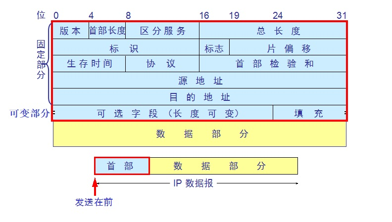

# IP协议

## 一. IP包格式

IP数据包是一种可变长分组，它由首部和数据负载两部分组成。首部长度一般为20-60字节（Byte），其中后40字节是可选的，长度不固定，前20字节格式为固定。数据负载部分的长度一般可变，整个IP数据包的最大长度为65535B。

1、版本号（Version）

长度为4位（bit），IP v4的值为0100，IP v6的值为0110。

2、首部长度

指的是IP包头长度（单位为4个字节），十进制值就是[0,15]，一个IP包前20个字节是必有的，后40个字节根据情况可能有可能没有。如果IP包头是20个字节，则该位应是20/4=5。

3、服务类型（Type of Service  TOS）

长度为8位（bit），其组成：前3位为优先级（Precedence），后4位标志位，最后1位保留未用。优先级主要用于QoS，表示从0（普通级别）到7（网络控制分组）的优先级。标志位可分别表示D（Delay更低的时延）、T（Throughput 更高的吞吐量）、R（Reliability更高的可靠性）、C（Cost 更低费用的路由）。

TOS只表示用户的请求，不具有强制性，实际应用中很少用，路由器通常忽略TOS字段。

4、总长度（Total Length）

指IP包总长度，用16位（bit）表示，即IP包最大长度可以达2^16-1=65535字节。在以太网中允许的最大包长为1500B，当超过网络允许的最大长度时需将过长的数据包分片。

5、标识符（Identifier）

长度为16位，用于数据包在分段重组时标识其序列号。将数据分段后，打包成IP包，IP包因走的路由上不同，会产生不同的到达目地的时间，到达目地的后再根据标识符进行重新组装还原。该字段要与标志、段偏移一起使用的才能达到分段组装的目标。

6、标志（Flags）

长度为3位，三位从左到右分别是MF、DF、未用。MF=1表示后面还有分段的数据包，MF=0表示没有更多分片（即最后一个分片）。DF=1表示路由器不能对该数据包分段，DF=0表示数据包可以被分段。

7、偏移量（Fragment Offset）

也称段偏移，用于标识该数据段在上层初始数据报文中的偏移量。如果某个包含分段的上层报文的IP数据包在传送时丢失，则整个一系列包含分段的上层数据包的IP包都会要求重传。

8、生存时间（TTL）

长度为8位，初始值由操作系统设置，每经过一个路由器转发后其值就减1，减至0后丢弃该包。这种机制可以避免数据包找不到目地时不断被转发，堵塞网络。

9、协议（Protocol）

长度为8位，标识上层所使用的协议。

10、首部校验和（Header Checksum）

长度为16位，首部检验和只对IP数据包首部进行校验，不包含数据部分。数据包每经过一个中间节点都要重新计算首部校验和，对首都进行检验。

11、源IP地址（Source IP）

长度为32位，表示数据发送的主机IP。

12、目的IP地址（Destination IP）

长度为32位，表示数据要接收的主机IP。

13、选项字段（Options）

​    长度为0-40字节（Byte），主要有：安全和处理限制（Security）、记录路径（Record Route）、时间戳（Timestamps）、宽松源站选路（Loose Source Routing）、严格的源站选路（Strict Source Routing）等。