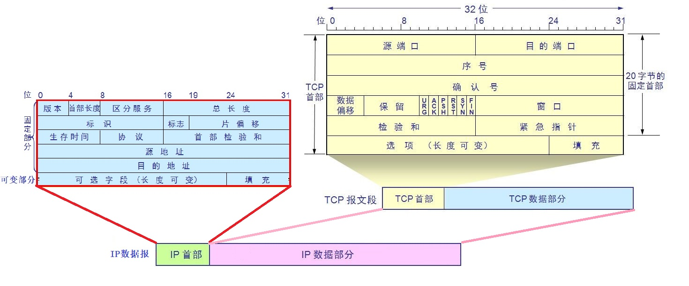

# TCP协议与IP协议的关系

## TCP是面向数据流的，它是如何实现？

TCP协议是面向数据流的，而我们都知道网络的底层都是通过一个个独立的数据报实现的，所以TCP面向数据流的效果，实际上也是将数据流拆分为若干个部分后通过TCP报文发送的。到达目的主机后，按照TCP报文中给定的序号值按顺序组装成一个完整的数据流。

## 为什么TCP报文中，头部只需要保存源端口和目的端口信息？

IP协议中指定的IP地址，只需要将IP数据报传输至目的主机即可。这就是为什么在IP头中只有源IP地址和目的IP地址（[IP协议](./_19IP协议.md)）,而没有端口号的信息。目标主机收到IP数据报后，就会解析IP数据报中数据部分封装的TCP报文，TCP报文拥有源端口号，和目的端口号，根据目的端口号就会找到当前主机正在监听该端口的程序，在通过TCP协议的内部机制，将TCP报文按照顺序组合起来。

## TCP报文的长度由谁决定？

由于TCP报文被封装在IP数据报中，所以单个TCP报文的长度，由IP数据报决定。在IP数据报的头部中有一个总长度字段，它表示着IP数据报的总长度。

参考文章：<https://cloud.tencent.com/developer/article/1501274>

