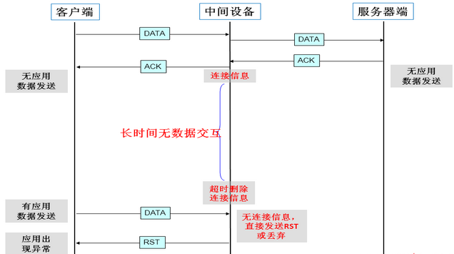
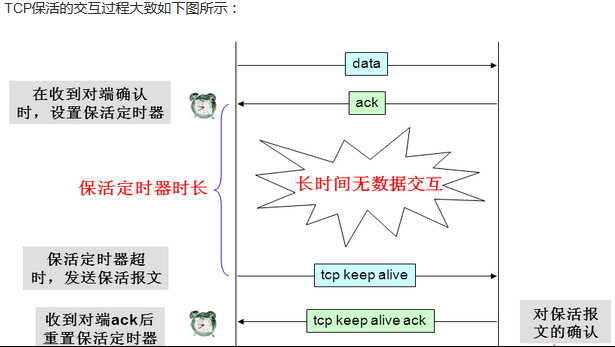

# TCP keep-alive机制

##  一. TCP keep-alive的起源

TCP协议中有长连接和短连接之分。短连接环境下，数据交互完毕后，主动释放连接；

双方建立交互的连接，但是并不是一直存在数据交互，有些连接会在数据交互完毕后，主动释放连接，而有些不会，那么在长时间无数据交互的时间段内，**交互双方都有可能出现掉电、死机、异常重启，还是中间路由网络无故断开、NAT超时等各种意外。**

当这些意外发生之后，这些TCP连接并未来得及正常释放，那么，连接的另一方并不知道对端的情况，它会一直维护这个连接，长时间的积累会导致非常多的半打开连接，造成端系统资源的消耗和浪费，为了解决这个问题，在传输层可以利用TCP的保活报文来实现，这就有了TCP的Keepalive（保活探测）机制。

##  二. TCP keep-alive存在的作用

### 2.1 探测连接的对端是否存活

在应用交互的过程中，可能存在以下几种情况：

1. 客户端或服务器意外断电，死机，崩溃，重启。
2. 中间网络已经中断，而客户端与服务器并不知道。

利用保活探测功能，可以探知这种对端的意外情况，从而保证在意外发生时，可以释放半打开的TCP连接。

### 2.2 防止中间设备因超时删除连接相关的连接表

中间设备如防火墙等，会为经过它的数据报文建立相关的连接信息表，并为其设置一个超时时间的定时器，如果超出预定时间，某连接无任何报文交互的话，中间设备会将该连接信息从表中删除，在删除后，再有应用报文过来时，中间设备将丢弃该报文，从而导致应用出现异常，这个交互的过程大致如下图所示：

这种情况在有防火墙的应用环境下非常常见，这会给某些长时间无数据交互但是又要长时间维持连接的应用（如数据库）带来很大的影响，为了解决这个问题，应用本身或TCP可以通过保活报文来维持中间设备中该连接的信息，（也可以在中间设备上开启长连接属性或调高连接表的释放时间来解决，但是，这个影响可能较大，有机会再针对这个做详细的描述，在此不多说）。

## 三. 常见应用故障场景

某财务应用，在客户端需要填写大量的表单数据，在客户端与服务器端建立TCP连接后，客户端终端使用者将花费几分钟甚至几十分钟填写表单相关信息，终端使用者终于填好表单所需信息后，点击“提交”按钮，结果，这个时候由于中间设备早已经将这个TCP连接从连接表中删除了，其将直接丢弃这个报文或者给客户端发送RST报文，应用故障产生，这将导致客户端终端使用者所有的工作将需要重新来过，给使用者带来极大的不便和损失。　

## 四. TCP保活报文交互过程　　

TCP保活可能带来的问题

1. 中间设备因大量保活连接，导致其连接表满：网关设备由于保活问题，导致其连接表满，无法新建连接（XX局网闸故障案例）或性能下降严重
2. 正常连接被释放：当连接一端在发送保活探测报文时，中间网络正好由于各种异常（如链路中断、中间设备重启等）而无法将该保活探测报文正确转发至对端时，可能会导致探测的一方释放本来正常的连接，但是这种可能情况发生的概率较小，另外，一般也可以增加保活探测报文发生的次数来减小这种情况发生的概率和影响

## 五. HTTP keep-alive

Httpd守护进程，一般都提供了keep-alive timeout时间设置参数。比如nginx的keepalive_timeout，和Apache的KeepAliveTimeout

这个 keepalive_timout时间值意味着：一个http产生的tcp连接在传送完最后一个响应后，还需要hold住 keepalive_timeout秒后，才开始关闭这个连接。

当httpd守护进程发送完一个响应后，理应马上主动关闭相应的tcp连接，设置 keepalive_timeout后，httpd守护进程会想说：”再等等吧，看看浏览器还有没有请求过来”，

这一等，便是 keepalive_timeout时间。如果守护进程在这个等待的时间里，一直没有收到浏览器发过来http请求，则关闭这个http连接。

1. 在没有设置 keepalive_timeout情况下，一个socket资源从建立到真正释放需要经过的时间是:建立tcp连接 + 传送http请求 + php脚本执行 + 传送http响应 + 关闭tcp连接
2. 设置了keepalive_timout时间情况下，一个socket建立到释放需要的时间是多了keepalive_timeout时间。

## 六. 为什么TCP有了保活机制，很多中间在应用层还会设计自己的心跳机制

TCP 的 Keepalive 机制主要是用于检测 TCP 连接的对端是否仍然存活，但它存在一些局限性，这也是很多中间件还需要设置应用层保活的原因：

**TCP Keepalive 的局限性**

1. 触发条件不灵活：TCP Keepalive 机制的触发时间间隔通常是由操作系统内核参数决定的，一般时间较长且不太容易根据具体应用场景进行调整。例如在某些对实时性要求较高的应用中，可能需要更频繁地检测连接状态，而 TCP Keepalive 无法满足这种需求。
2. 检测内容单一：**TCP Keepalive 只是通过发送探测包来检测连接的物理可达性，它无法判断应用层的状态是否正常**。例如，即使 TCP 连接仍然存在，但应用层可能由于各种原因（如程序崩溃、资源耗尽等）已经无法正常工作，TCP Keepalive 无法检测到这种情况。
3. 无法满足特定业务需求：不同的应用场景可能有不同的保活需求。例如，在一些金融交易系统中，需要确保连接的双方在交易过程中始终处于活跃状态，并且能够及时响应对方的请求。TCP Keepalive 机制不能针对这些特定的业务需求进行定制化的检测。

**中间件设置应用层保活的优势**

1. 灵活性高：中间件可以根据具体的应用需求设置更加灵活的保活策略。比如，可以根据业务的繁忙程度动态调整保活检测的时间间隔，在业务高峰期缩短检测间隔以确保连接的可靠性，在业务低谷期延长检测间隔以减少系统开销。
2. 全面检测应用状态：应用层保活可以深入到应用程序的逻辑层面，检测应用程序的各种状态指标，如是否正在处理请求、是否有未处理的任务等。这样可以更准确地判断应用是否正常运行，及时发现并处理应用层的故障。
3. 适应特定业务场景：对于一些特定的业务场景，中间件可以设计专门的保活机制来满足其特殊需求。例如，在分布式系统中，可以通过应用层保活机制实现节点之间的状态同步和故障转移，提高系统的可用性和可靠性。

综上所述，虽然 TCP 有 Keepalive 机制，但由于其局限性，很多中间件还需要设置应用层保活来更好地满足不同应用场景的需求。
