# 使用OpenVPN搭建虚拟专用网

## 一. 初衷

先说说自己搭建VPN的初衷，作为一个社畜在上海栖息之地是一间合租的卧室，房间虽小也抑制不住自己爱折腾的毛病，前不久自己在网上淘了一个M72主机，这个主机挺适合在家里当一个服务器，主要是因为它是I3处理功耗低还是X86架构，比用树莓派当服务器好不少，不仅算力更强软件兼容性也更好


因为日常开发学习过程中不免需要安装一些中间件应用，需要安装的中间件太多，阿里云上可怜的2G内存显然是不允许我这样操作的。没办法我只能将大部分应用部署在家庭内网服务器上，由于我给家庭服务器设置了一个固定的局域网IP，平常在家连接服务器会非常方便，但是一旦遇到外出的情况，家庭内网的服务器就完全访问不到了。

这让我想到了内网穿透，将家庭服务器的端口映射到公网服务器的某一个端口上，只要我访问公网服务器的这个端口，公网服务器就会把数据包转发到内网服务器上来，这让我很是兴奋，并上网寻找解决方案，最终选择了带WEB界面的 [NPS](https://github.com/ehang-io/nps/)，内网穿透的基本效果如下（至于内网穿透如何解决NAT网络模式下无法直接请求内网服务器的问题我们抽时间再谈）：

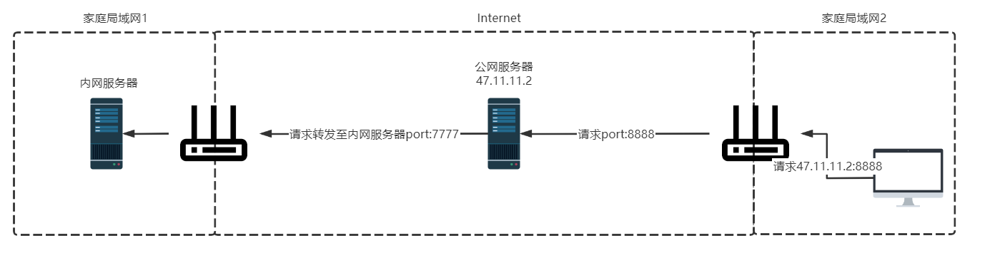

配置好内网穿透后，你的公网服务器可以看做你内网服务器的一个傀儡，用户请求到公网服务器特定端口的请求会根据配置规则全量转发至你内网服务器。走到这里基本解决了出门在外连接内网服务器的问题了。

但是这样做也带了一些问题：

1. 内网穿透相当于将内网服务器特定端口暴露给公网了，这带来一些安全问题，这使得我不得不给每个应用加上相应的访问控制。虽然可以通过云服务商提供的VPC网络IP白名单来进行全局的访问控制，但是这会导致公有服务器正常的WEB服务不可用。实际上这一点倒不是最关键的，毕竟我的应用仅供自己测试使用，安全性并不是首要考虑的。
2. 每安装一个应用我都需要配置NPS已实现更多的端口映射，这对我来说太麻烦了
3. 在家庭网络环境下为了网络性能我会直接使用内网IP作为连接配置，但是在外部网络环境下，我不得不将所有内网IP配置全部切换为公有服务器的IP，这对我来说也很麻烦

内网穿透显然并不能很好满足我的应用场景，最后不得不考虑搭建一个[VPN](https://en.wikipedia.org/wiki/Virtual_private_network)，通过VPN我们可以将一台设备和家庭入口（带公网IP）主机之间创建一个虚拟局域网，这样只要连接上VPN的主机都会分配一个虚拟局域网的IP地址，这样通过这个IP地址我们能够很方便的连接家庭局域网中的设备：

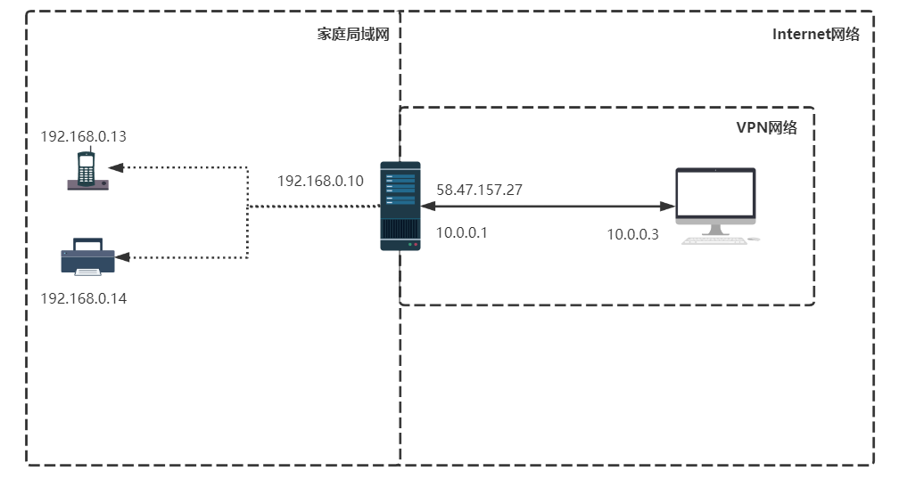

在上面的拓扑图中，`58.47.157.27`安装了VPN服务端，它会虚拟一个`10.0.0.0/24`的虚拟网络，当客户机通过VPN客户端连接到VPN服务器后，服务器会为它分配一个虚拟IP（10.0.0.3），这样VPN客户端和VPN服务端就处于一个虚拟局域网中了。


## 二. 问题


## 三. 环境

VPN服务器：CentOS 8（需要带有公网IP地址，或使用内网穿透）

VPN客户端：Windows 10

## 四. 搭建

### 4.1 生成证书

在生成证书之前我们需要下载`EasyRSA`工具：[Releases · OpenVPN/easy-rsa-old (github.com)](https://github.com/OpenVPN/easy-rsa-old/releases)

我Fork了一份到自己的仓库，防止官方失效：[bigcoder84/easy-rsa-old](https://github.com/bigcoder84/easy-rsa-old)

**第一步：解压`easy-rsa-old-2.3.3.zip`**

```shell
unzip -d ./ easy-rsa-old-2.3.3.zip
cd easy-rsa-old-2.3.3/easy-rsa/2.0/
```

最终会得到下列文件：

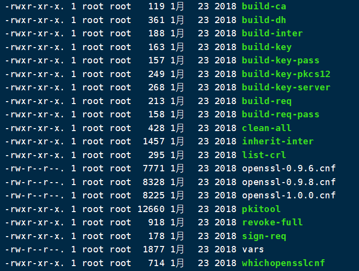

**第二步：配置`vars`文件**

根据情况，修改`vars`文件下列属性，这些属性并没有任何实际意义，大家随便填即可：

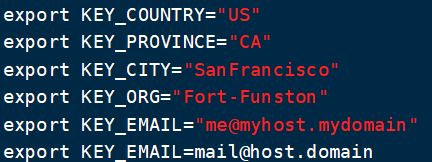

最后两行的`KEY_EMAIL`字段我们需要删除第二行的内容，不然第二行会覆盖上面的内容。

修改完成后执行：

```shell
source vars #导出刚刚设置的环境变量
```

执行后会有下列提示：

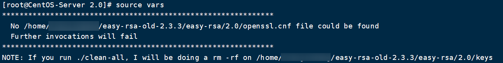

然后再执行：

```shell
./clean-all
```

执行完成后就会在当前目录下生成一个`keys`文件夹，后面生成的证书都会输出到这个文件夹中。

**第四步：生成根证书**

执行下列命令，一路回车即可

```shell
./build-ca
```

> 执行该命令可能会报下列错误：
> 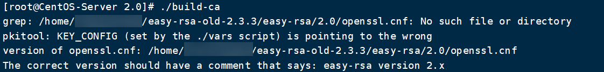
> 这是因为它在当前目录下找不到`openssl.cnf`导致的，我们复制一份`openssl-1.0.0.cnf`即可：
>
> ```shell
> cp openssl-1.0.0.cnf openssl.cnf
> ```

最后会在keys目录下生成下列文件：

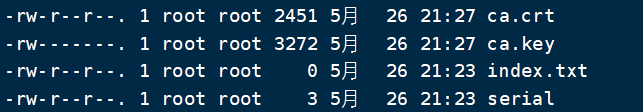

- ca.crt：根证书
- ca.key：根密钥

**第五步：生成服务端证书**

```shell
[root@CentOS-Server 2.0] ./build-key-server server
....
An optional company name []:
Using configuration from /usr/local/easy-rsa-old-master/easy-rsa/2.0/openssl-1.0.0.cnf
Check that the request matches the signature
Signature ok
The Subject's Distinguished Name is as follows
countryName           :PRINTABLE:'cn'
stateOrProvinceName   :PRINTABLE:'BJ'
localityName          :PRINTABLE:'BJ'
organizationName      :PRINTABLE:'abcdocker'
organizationalUnitName:PRINTABLE:'abc'
commonName            :PRINTABLE:'abc'
name                  :PRINTABLE:'abc'
emailAddress          :IA5STRING:'cyh@i4t.com'
Certificate is to be certified until Jan 31 14:01:35 2030 GMT (3650 days)
Sign the certificate? [y/n]:y
 
 
1 out of 1 certificate requests certified, commit? [y/n]y
Write out database with 1 new entries
Data Base Updated
 
#这里的server就是我们server端的证书 
```

一路回车，注意最后两步需要输入`y`，生成完成后会在`keys`目录生成下列文件：

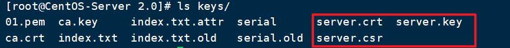

- server.crt：服务端证书
- server.key：服务端密钥

**第六步：生成客户端证书**

```shell
./build-key client
```

同样一路回车，最后两步输入`y`，生成完成后会在`keys`目录下生成下列文件：

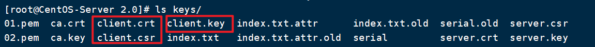

- client.crt：客户端证书
- client.key：客户端密钥

**第七步：生成密钥交换文件**

```shell
[root@CentOS-Server 2.0] ./build-dh 
Generating DH parameters, 2048 bit long safe prime, generator 2
This is going to take a long time
......................................+.............................................+...............................................................................+..............................+.....................+.........................................++*++*++*++*
```

该命令会生成一个名为`dh2048.pem`的文件

### 4.2 配置OpenVPN服务端

**第一步：安装OpenVPN**

```shell
yum install -y openvpn
```

**第二步：在`/etc/openvpn`下创建`keys`目录**

由于我们有很多证书文件，为了方便管理，我们创建一个文件夹将证书文件全部放进去，方便管理

```shell
mkdir /etc/openvpn/keys #yum安装会默认创建/etc/openvpn目录
```

**第三步：将证书拷贝至`/etc/openvpn/keys`目录**

```shell
cp {ca.crt,server.crt,server.key,dh2048.pem} /etc/openvpn/keys/
```

我们需要将`keys`目录下的`ca.crt`、`server.crt`、`server.key`、`dh2048.pem`文件拷贝至`/etc/openvpn/keys`目录。

**第四步：创建配置文件**

将OpenVPN安装时产生的证书模板文件拷贝至`/etc/openvpn/`

```shell
cp /usr/share/doc/openvpn/sample/sample-config-files/server.conf /etc/openvpn/
```

**第五步：修改`server.conf`**

1. 修改证书文件位置：

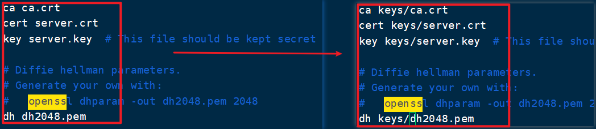

2. 修改虚拟网段地址（可不改）

```shell
server 10.8.0.0 255.255.255.0 -> server 10.0.0.0 255.255.255.0
```

3. 配置转发规则

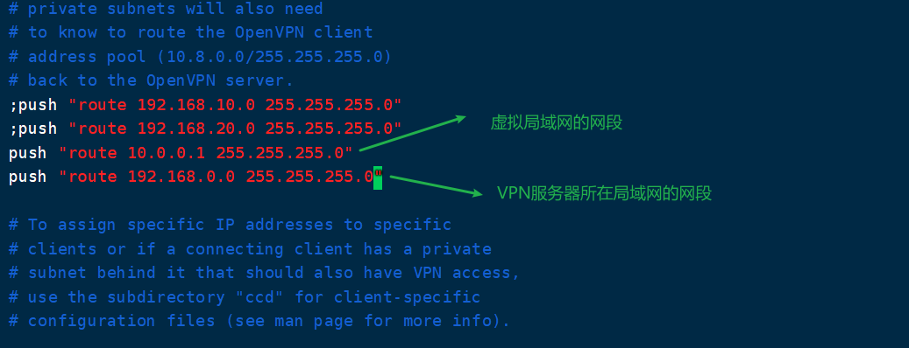

新增两行

4. 修改拒绝服务攻击证书

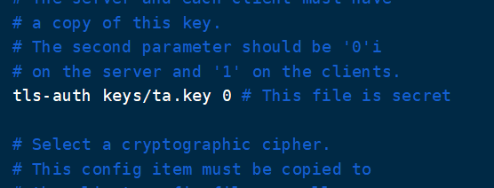

5. 修改加密模式

```shell
cipher AES-256-CBC -> cipher AES-256-GCM
```

**第六步：启用路由转发功能**

```shell
echo "net.ipv4.ip_forward = 1" >> /etc/sysctl.conf
sysctl -p
```

**第七步：创建拒绝服务证书**

```shell
 cd /etc/openvpn/keys/
 openvpn --genkey --secret ta.key
```

**第八部：启动OpenVPN**

```shell
cd /etc/openvpn/
openvpn --daemon --config server.conf
```

执行完成后，我们使用`netstat`来看看启动是否成功;

```shell
netstat -lntup | grep 1194
```


启动成功后，我们通过`ip addr`命令可以看到，VPN服务器生成了一个虚拟网卡，并分配了`10.0.0.0/24`网段的IP地址：

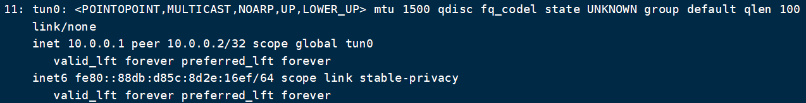

### 4.3 配置OpenVPN客户端

**第一步：准备客户端证书**

- 客户端证书：`client.key`、`client.crt`、`ca.crt`、`/etc/openvpn/keys/ta.key`
- 客户端配置文件：`/usr/share/doc/openvpn/sample/sample-config-files/client.conf`

将上述文件下载到Windows机器上。

**第二步：修改客户端配置文件**

修改刚刚从服务器上复制下来的`client.conf`文件

1. 修改加密模式

```properties
cipher AES-256-CBC -> cipher AES-256-GCM
```

2. 设置OpenVPN服务器地址

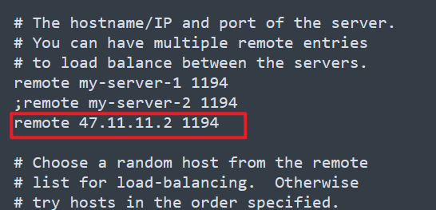

**第三步：修改`client.conf`文件后缀**

将`client.conf`修改为`client.ovpn`


**第四步：安装OpenVPN客户端**

[OpenVPN Client Connect For Windows | OpenVPN](https://openvpn.net/client-connect-vpn-for-windows/)

直接下一步就行，不需要任何额外操作（3.2.3.1851版本）

**第五步：导入`client.ovpn`**

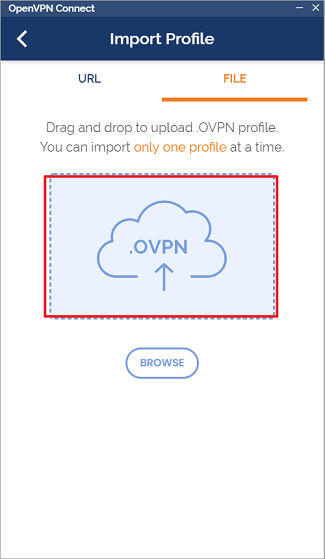

需要注意的是，刚刚导出的文件需要在同一文件夹中，因为`client.ovpn`配置的证书的位置都是当前文件夹，导入`client.ovpn`后会自动导入依赖的证书文件。

导入完成后点击连接，成功连接后就表明VPN已经完成搭建，可以看到OpenVPN Server给当前机器分配了一个`10.0.0.6`的虚拟地址：

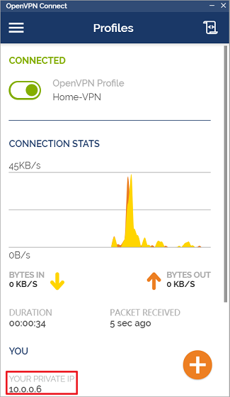

如果连接不上，请查看IP地址和端口是否配置正确，以及OpenVPN Server防火墙（UDP）端口是否打开。

