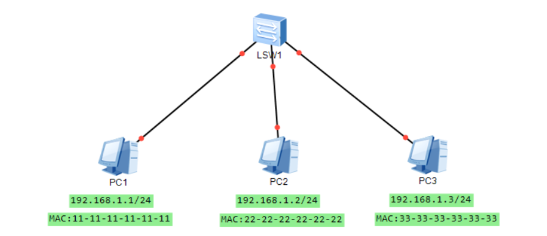
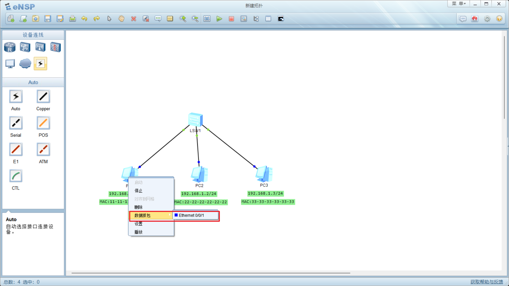
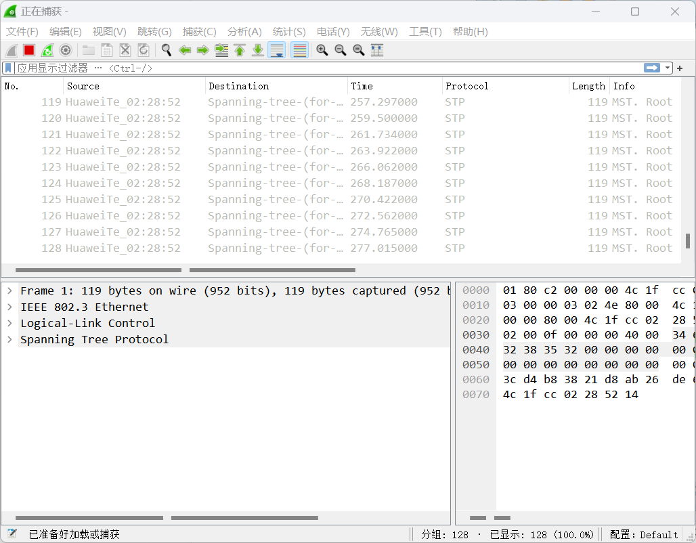
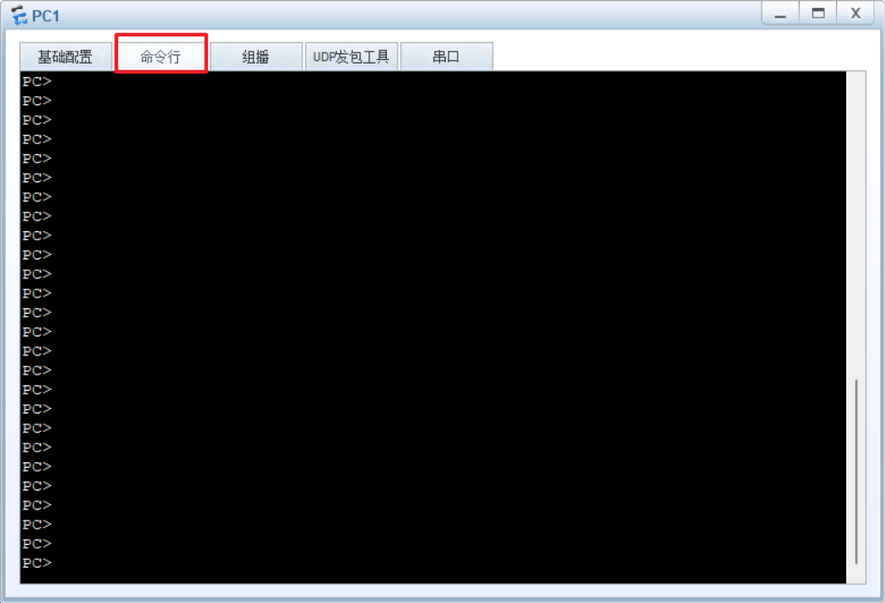
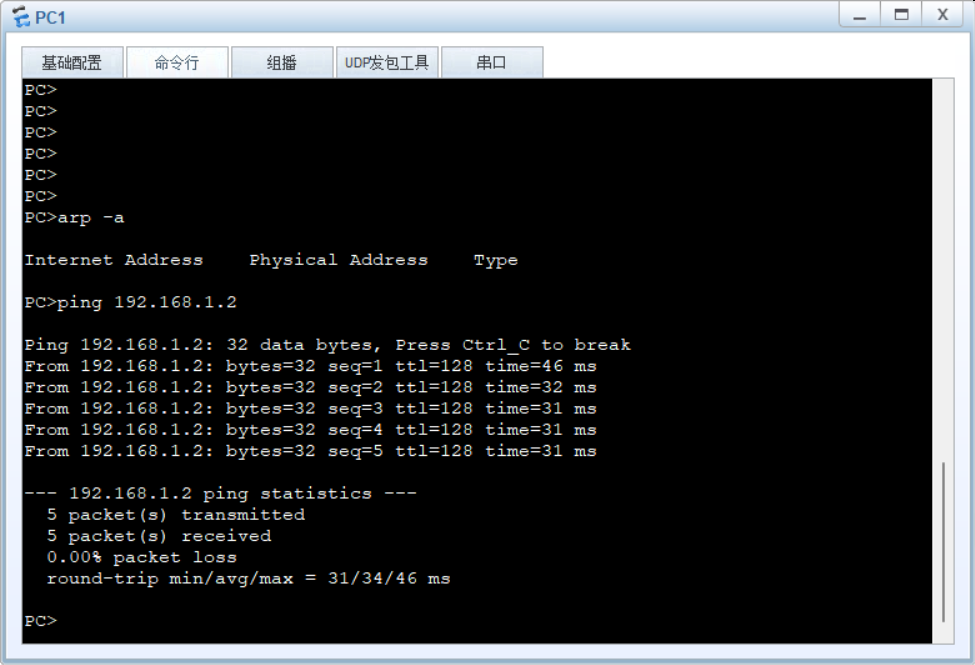
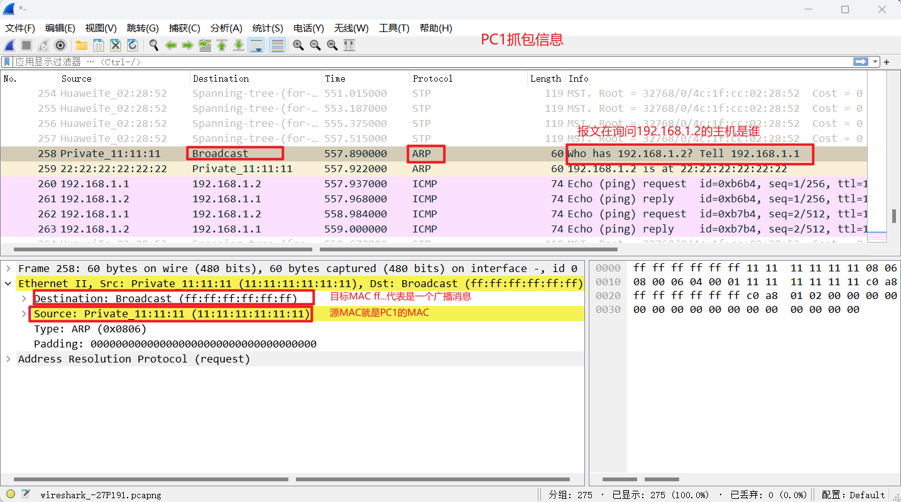
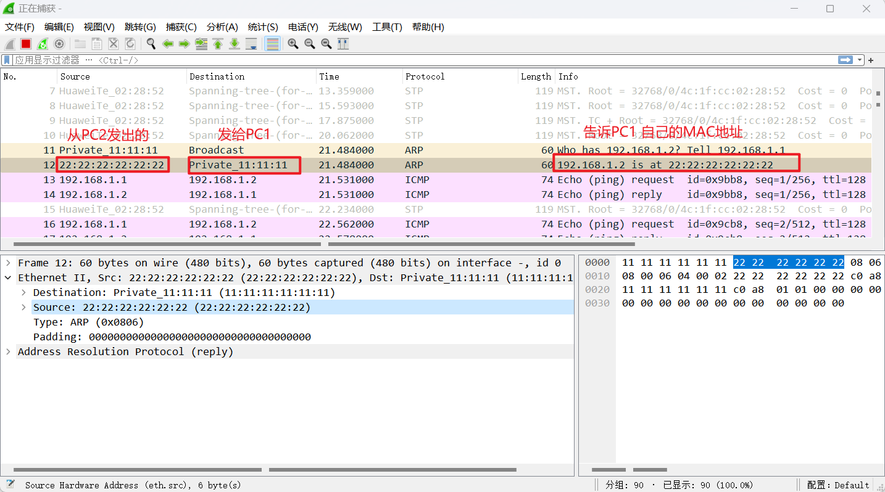
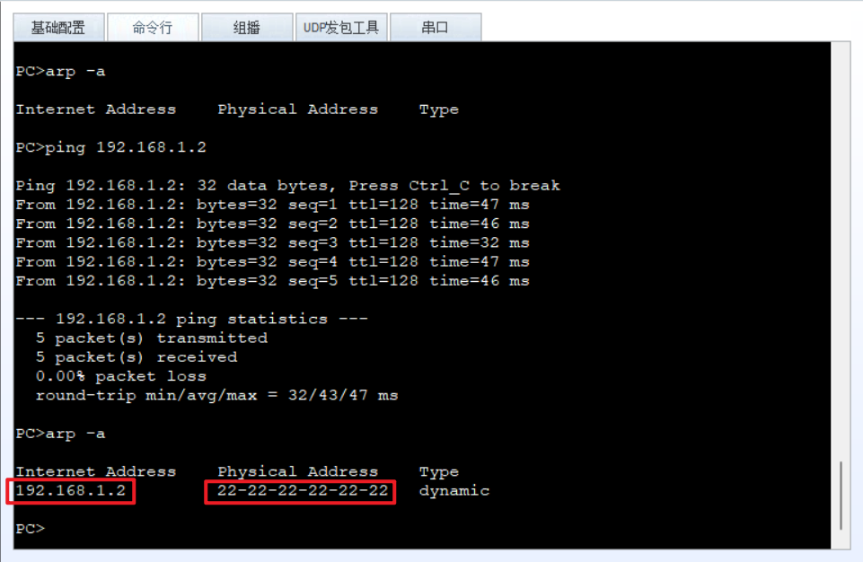

# ARP协议抓包实验

在 [《从物理层到数据链路层》](./_4从物理层到MAC层.md) 我们已经介绍过了，ARP协议是在同一网段中发现IP和MAC地址的对应关系的协议，试想一个宿舍最简单的网络拓扑结构：

宿舍中有三台电脑，分别都接入了 `LSW1` 二层交换机中，我们分别为三个电脑配置了 `192.168.1.0/24` 网段的IP地址。此时如果 `PC1` 想要和 `PC2` 通信，交换机该如何转发呢？

由于`LSW1`是一个二层交换机，它只会解析二层数据包中的信息，二层包格式如下：

二层包中需要知道目的主机的MAC地址，此时 `PC1` 并不知道IP为 `192.168.1.2` 的主机的MAC地址，这时就会通过ARP协议获取IP地址对应的MAC地址。

具体流程如下：

1. `PC1` 发现自己不知道 `192.168.1.2` 的MAC地址，就会发送一个 `ARP` 广播报文，目标MAC会写成 `ff:ff:ff:ff:ff:ff`。
2. 交换机收到 `ARP` 广播包后会转发给除发送端口以外的所有端口，询问其它端口上的设备IP地址是否是 `192.168.1.2`。
3. PC2接收到广播消息后，发现是别的设备询问自己的广播包，就会回复 `PC1` 自己的 MAC地址。

## 实验过程

我们使用eNSP软件创建上述网络拓扑。

然后分别点击三个PC抓包按钮，开启 `Wireshark`：

此时我们可以双击PC1图标，打开命令行窗口：

输入 `arp -a` 查看 `PC1` 的ARP地址表：

此时PC1还不知道 `192.168.1.2` 的MAC地址。

我们继续输入 `ping 192.168.1.2` 尝试与 PC2 通信：

我们查看PC1的抓包信息，发现PC1发送了一个ARP广播报文：

此时查看PC3的抓包信息发现，PC3收到了这个广播消息，但是PC3的IP不是报文中询问的 `192.168.1.2` IP地址，PC3选择丢弃该消息。而PC2收到消息以后会发送一个ARP应答消息给PC1。

这样PC1就知道PC2的MAC地址了：

**需要注意的是连接在同一二层交换机的设备必须在同一个网段上面，因为不同网段的通讯需要用到路由器这些三层设备去解析三层数据包，然后进行转发**。

