# HTTP协议各版本的进化史

从HTTP/1到HTTP/3，今天我们的主题就是带领大家去了解HTTP整个发展历史，以及了解一下个版本HTTP协议在传输性能上做了哪些优化。

http的发展历史可以分为以下几个阶段：

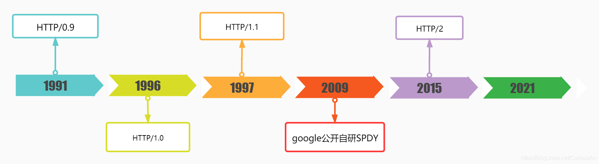

## 一. HTTP/0.9

我们从HTTP/0.9开始，它是HTTP的第一个版本，于1991年发布。它非常简单，只支持GET请求方法，响应为HTML格式的文本，没有请求头和响应头。这个版本的HTTP被设计为一种简单的文件传输协议，它只能传输静态文本文件，没有任何动态内容。

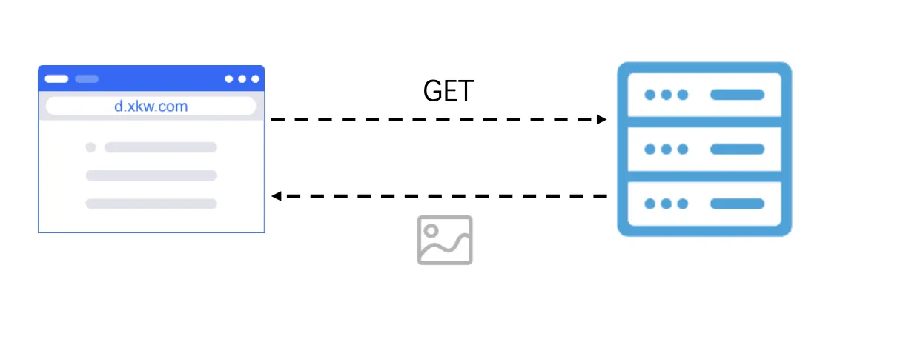

## 二. HTTP/1.0

那时间来到了1996年，HTTP/1.0发布，相对于HTTP/0.9，它引入了很多新的特性。首先，它支持多种请求方法，包括GET、POST、PUT、DELETE等，这使得HTTP变得更加灵活。其次，它引入了请求头和响应头，这些头部信息可以包含很多有用的数据，如内容长度、缓存控制等。

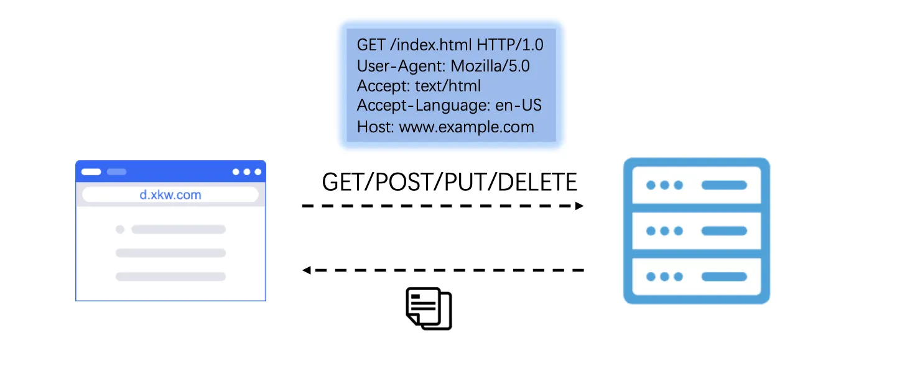

然而，HTTP/1.0仍然存在一些问题。首先，针对每一个请求均需构建全新的连接。鉴于 HTTP 协议乃是架构于 TCP 协议之上的应用层协议，每一次连接的构建都无可避免地要历经 TCP 的三次握手流程，若涉及 HTTPS ，则还需额外完成 SSL/TLS 握手操作。如此一来，这种连接策略在性能方面必然会暴露出缺陷与不足。

为了验证我使用`wireshark`来监听网卡上的 HTTP 报文：

1. 通过`curl`指定 HTTP/1.0 版本

```
curl --http1.0 http://www.baidu.com
```

2. 报文截图

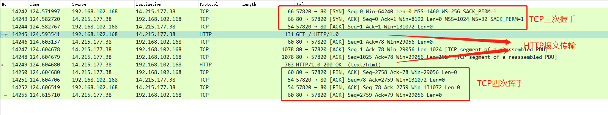

其次，HTTP/1.0没有处理并发请求的机制，这会导致浏览器需要等待前一个请求完成后才能发送下一个请求。这些问题限制了HTTP/1.0的性能和效率。

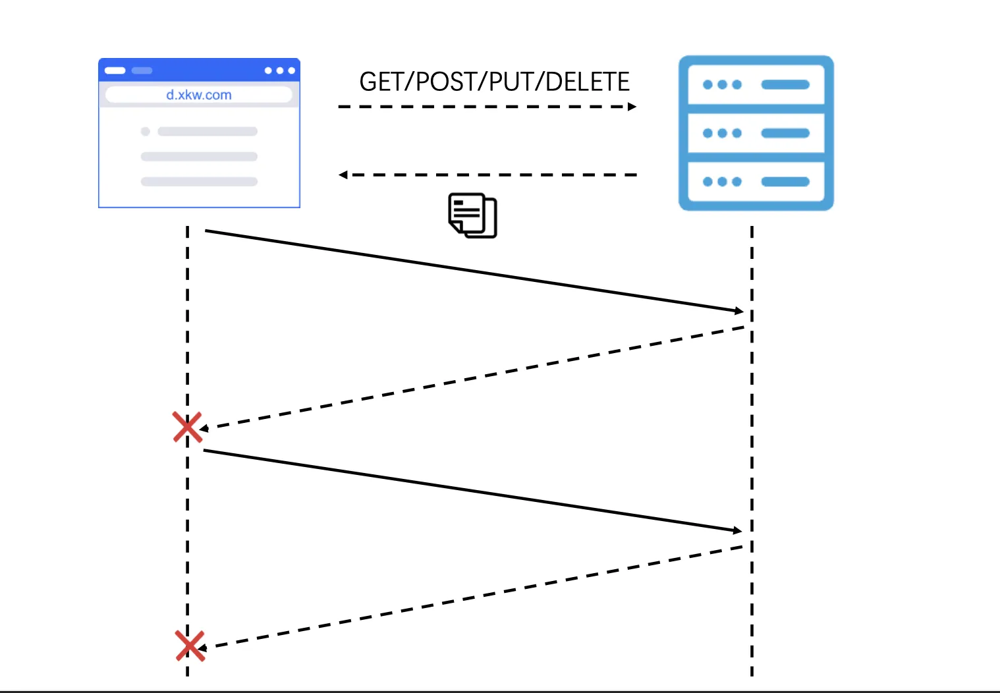


## 三. HTTP/1.1

### 3.1 keep-alive机制

在`HTTP/1.0`时代，由于 TCP 连接创建成本很高，很多服务器和浏览器使用了了一套非标准的`keep-alive`机制，用于复用 TCP 连接，当然最后`HTTP/1.1`将这套东西纳入到了标准中，这个标准就是`Connection`头，用于客户端和服务端协商是否要复用 TCP 连接，在 HTTP/1.1 版本中默认值就是`keep-alive`，即保持连接。

```shell
Connection: keep-alive
```

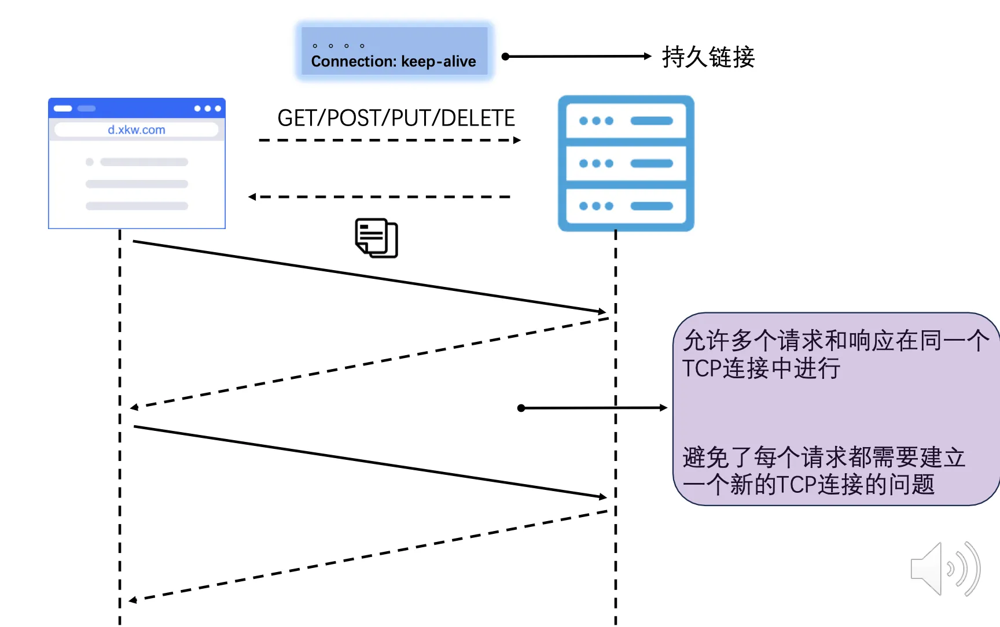

同样的为了验证以上内容，需要抓个包来看看。

1. 通过`curl`连续访问同一地址

```
curl http://www.baidu.com http://www.baidu.com
```

2. 报文截图

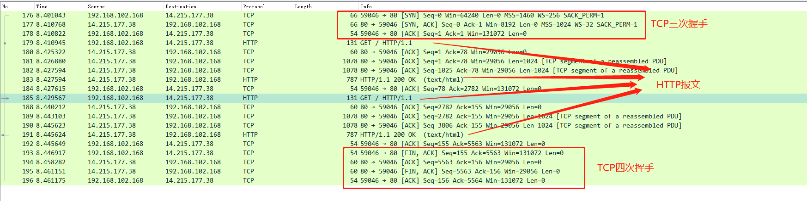

通过报文可以看到在建立了 TCP 连接之后，发生了两次 HTTP 请求之后由客户端发送`FIN`包关闭连接，说明这两次 HTTP 请求是在同一个 TCP 连接上进行的。

第二个重要升级是，支持管道化技术，它可以让浏览器同时发送多个请求，不用等待服务器返回。举例来说，客户端需要请求两个资源。以前的做法是，在同一个 TCP 连接里面，先发送 A 请求，然后等待服务器做出回应，收到后再发出 B 请求。HTTP 流水线机制则允许客户端同时发出 A 请求和 B 请求。

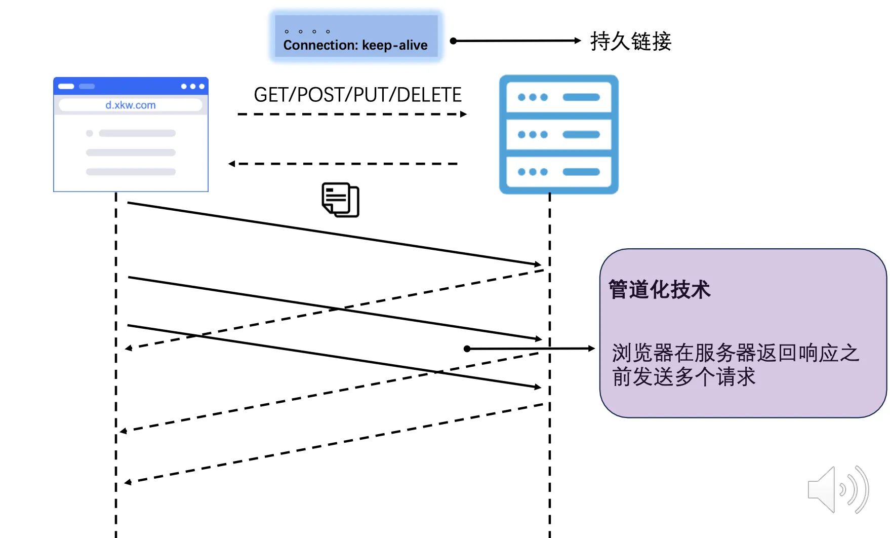

但是**服务器还是按照顺序响应**，先回应 A 请求，完成后再回应 B 请求。

而且要等服务器响应完客户端第一批发送的请求后，客户端才能发出下一批的请求，也就说如果服务器响应的过程发生了阻塞，那么客户端就无法发出下一批的请求，此时就造成了「**队头阻塞**」的问题。

> 需要注意的是：HTTP1.1队头阻塞含义并不是指客户端必须得等上一个请求响应完成后才能发送下一个请求，而是服务端必须按照接受到的请求顺序处理并响应，如果前一个请求的处理过程慢了或者响应报文太长传输速度太慢了，后面的请求处理和响应也就被阻塞了。
>
> - 例如，服务器接收到三个请求：请求 A、请求 B 和请求 C。按照顺序先处理请求 A，但是请求 A 涉及到一个需要长时间计算的操作，那么即使请求 B 和请求 C 是比较简单的操作，它们也必须等待请求 A 处理完成并且响应发送出去之后才能开始被处理和响应。这就像在一个队列中，排在前面的任务没有完成，后面的任务就只能等待，从而导致了队头阻塞的情况。

客户端或服务器发现对方一段时间没有活动，就可以主动关闭连接。不过，规范的做法是，客户端在最后一个请求时，发送 Connection: close，明确要求服务器关闭 TCP 连接。但是这不能保证所有客户端都按照规范去实现，所以连接保持的决定权需要放在服务端。web 服务软件一般都会提供 `keepalive_timeout` 参数，用来指定 HTTP 长连接的超时时间。

比如设置了 HTTP 长连接的超时时间是 60 秒，web 服务软件就会**启动一个定时器**，如果客户端在完后一个 HTTP 请求后，在 60 秒内都没有再发起新的请求，**定时器的时间一到，就会触发回调函数来释放该连接。**

例如，在tomcat中，我们可以 `server.xml` 中配置以下属性：

```xml
<Connector port="8080" protocol="HTTP/1.1"
           connectionTimeout="20000"
           redirectPort="8443"
           maxKeepAliveRequests="150"
           keepAliveTimeout="30000" />
```

- maxKeepAliveRequests：用于控制在一个 keep-alive 连接中允许的最大请求数量。
- keepAliveTimeout：定义了在一个 keep-alive 连接中，相邻两个请求之间的最大空闲时间，单位是毫秒。这里设置为`30000`毫秒（即 30 秒），也就是说，如果在一个 keep-alive 连接中，上一个请求处理完毕后，经过`30`秒还没有新的请求到来，Tomcat 就会关闭该 Keep - Alive 连接。这有助于合理利用服务器资源，避免长时间空闲的 keep-alive 连接占用资源。

### 3.2 存在哪些性能问题

- 延迟难以下降：虽然现在网络的「带宽」相比以前变多了，但是延迟降到一定幅度后，就很难再下降了，说白了就是到达了延迟的下限；
- 并发连接有限：谷歌浏览器最大并发连接数是 6 个，而且每一个连接都要经过 TCP 和 TLS 握手耗时，以及 TCP 慢启动过程给流量带来的影响；
- 队头阻塞问题：在 HTTP/1.1 中，默认采用持久连接（Keep-Alive），即一个 TCP 连接可以用来多次传输 HTTP 请求和响应。当客户端通过同一个 TCP 连接依次发送多个 HTTP 请求时，这些请求会按照发送顺序进入服务器端的处理队列，服务器也需要按照顺序依次进行响应处理。如果其中一个请求因为某些原因（比如需要长时间等待资源、处理逻辑复杂等）处理速度很慢，那么后续的请求即使本身可以快速被处理，也必须等待排在前面的那个慢请求处理完，才能轮到自己被服务器处理，就好像队伍中排在前面的人堵住了后面人的前进道路一样，这就是队头阻塞现象。
- HTTP 头部巨大且重复：由于 HTTP 协议是无状态的，每一个请求都得携带 HTTP 头部，特别是对于有携带 Cookie 的头部，而 Cookie 的大小通常很大；
- 不支持服务器推送消息：因此当客户端需要获取通知时，只能通过定时器不断地拉取消息，这无疑浪费大量了带宽和服务器资源。

### 3.3 工程上常见的优化措施

针对HTTP/1.1存在的一些问题，互联网早期程序员使用了一些优化措施，缓解了HTTP/1.1存在的问题：

- 将多张小图合并成一张大图供浏览器 JavaScript 来切割使用，这样可以将多个请求合并成一个请求，这种图我们称之为雪碧图。但是带来了新的问题，当某张小图片更新了，那么需要重新请求大图片，浪费了大量的网络带宽；

- 将图片的二进制数据通过 Base64 编码后，把编码数据嵌入到 HTML 或 CSS 文件中，以此来减少网络请求次数；
- 将多个体积较小的 JavaScript 文件使用 Webpack 等工具打包成一个体积更大的 JavaScript 文件，以一个请求替代了很多个请求，但是带来的问题，当某个 js 文件变化了，需要重新请求同一个包里的所有 js 文件；
- 将同一个页面的资源分散到不同域名，提升并发连接上限，因为浏览器通常对同一域名的 HTTP 连接最大只能是 6 个；但是此种方式会带来编码成本的上升。

尽管对 HTTP/1.1 协议的优化手段如此之多，但是效果还是不尽人意，因为这些手段都是对 HTTP/1.1 协议的“外部”做优化，**而一些关键的地方是没办法优化的，比如请求-响应模型、头部巨大且重复、并发连接耗时、服务器不能主动推送等，要改变这些必须重新设计 HTTP 协议，于是 HTTP/2 就出来了！**

## 四. HTTP/2

HTTP/2 出来的目的是为了改善 HTTP 的性能。协议升级有一个很重要的地方，就是要**兼容**老版本的协议，否则新协议推广起来就相当困难，所幸 HTTP/2 做到了兼容 HTTP/1.1。

那么，HTTP/2 是怎么做的呢？

第一点，HTTP/2 没有在 URI 里引入新的协议名，仍然用「http://」表示明文协议，用「https://」表示加密协议，于是只需要浏览器和服务器在背后自动升级协议，这样可以让用户意识不到协议的升级，很好的实现了协议的平滑升级。

第二点，只在应用层做了改变，还是基于 TCP 协议传输，应用层方面为了保持功能上的兼容，HTTP/2 把 HTTP 分解成了「语义」和「语法」两个部分，「语义」层不做改动，与 HTTP/1.1 完全一致，比如请求方法、状态码、头字段等规则保留不变。

但是，HTTP/2 在「语法」层面做了很多改造，基本改变了 HTTP 报文的传输格式。

### 4.1 头部压缩

HTTP 协议的报文是由「Header + Body」构成的，对于 Body 部分，HTTP/1.1 协议可以使用头字段 「Content-Encoding」指定 Body 的压缩方式，比如用 gzip 压缩，这样可以节约带宽，但报文中的另外一部分 Header，是没有针对它的优化手段。

HTTP/1.1 报文中 Header 部分存在的问题：

- 含很多固定的字段，比如 Cookie、User Agent、Accept 等，这些字段加起来也高达几百字节甚至上千字节，所以有必要**压缩**；
- 大量的请求和响应的报文里有很多字段值都是重复的，这样会使得大量带宽被这些冗余的数据占用了，所以有必须要**避免重复性**；
- 字段是 ASCII 编码的，虽然易于人类观察，但效率低，所以有必要改成**二进制编码**；

HTTP/2 对 Header 部分做了大改造，把以上的问题都解决了。

HTTP/2 没使用常见的 gzip 压缩方式来压缩头部，而是开发了 **HPACK** 算法，HPACK 算法主要包含三个组成部分：

- 静态字典；
- 动态字典；
- Huffman 编码（压缩算法）；

客户端和服务器两端都会建立和维护「**字典**」，用长度较小的索引号表示重复的字符串，再用 Huffman 编码压缩数据，**可达到 50%~90% 的高压缩率**。

#### 4.1.1 静态表编码

HTTP/2 为高频出现在头部的字符串和字段建立了一张**静态表**，它是写入到 HTTP/2 框架里的，不会变化的，静态表里共有 `61` 组，如下图：

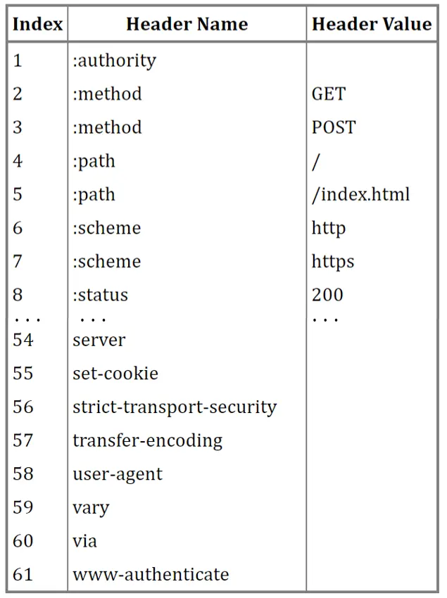

表中的 `Index` 表示索引（Key），`Header Value` 表示索引对应的 Value，`Header Name` 表示字段的名字，比如 Index 为 2 代表 GET，Index 为 8 代表状态码 200。

你可能注意到，表中有的 Index 没有对应的 Header Value，这是因为这些 Value 并不是固定的而是变化的，这些 Value 都会经过 Huffman 编码后，才会发送出去。

这么说有点抽象，我们来看个具体的例子，下面这个 `server` 头部字段，在 HTTP/1.1 的形式如下：

```txt
server: nghttpx\r\n
```

算上冒号空格和末尾的`\r\n`，共占用了 17 字节，**而使用了静态表和 Huffman 编码，可以将它压缩成 8 字节，压缩率大概 47%**。

我抓了个 HTTP/2 协议的网络包，你可以从下图看到，高亮部分就是 `server` 头部字段，只用了 8 个字节来表示 `server` 头部数据。

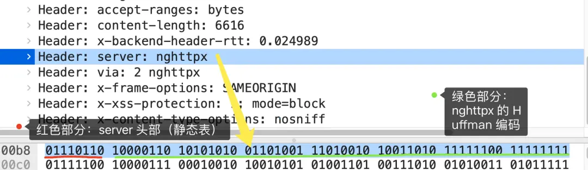1

根据 RFC7541 规范，如果头部字段属于静态表范围，并且 Value 是变化，那么它的 HTTP/2 头部前 2 位固定为 `01`，所以整个头部格式如下图：

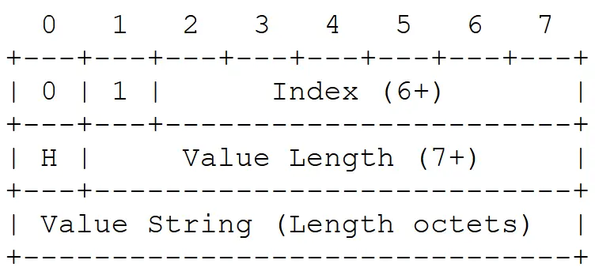

HTTP/2 头部由于基于**二进制编码**，就不需要冒号空格和末尾的\r\n作为分隔符，于是改用表示字符串长度（Value Length）来分割 Index 和 Value。

接下来，根据这个头部格式来分析上面抓包的 `server` 头部的二进制数据。

首先，从静态表中能查到 `server` 头部字段的 Index 为 54，二进制为 110110，再加上固定 01，头部格式第 1 个字节就是 `01110110`，这正是上面抓包标注的红色部分的二进制数据。

然后，第二个字节的首个比特位表示 Value 是否经过 Huffman 编码，剩余的 7 位表示 Value 的长度，比如这次例子的第二个字节为 `10000110`，首位比特位为 1 就代表 Value 字符串是经过 Huffman 编码的，经过 Huffman 编码的 Value 长度为 6。

最后，字符串 `nghttpx` 经过 Huffman 编码后压缩成了 6 个字节，Huffman 编码的原理是将高频出现的信息用「较短」的编码表示，从而缩减字符串长度。

于是，在统计大量的 HTTP 头部后，HTTP/2 根据出现频率将 ASCII 码编码为了 Huffman 编码表，可以在 RFC7541 文档找到这张**静态 Huffman 表**，我就不把表的全部内容列出来了，我只列出字符串 `nghttpx` 中每个字符对应的 Huffman 编码，如下图：

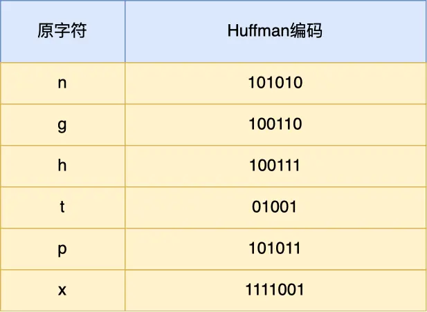

通过查表后，字符串 `nghttpx` 的 Huffman 编码在下图看到，共 6 个字节，每一个字符的 Huffman 编码，我用相同的颜色将他们对应起来了，最后的 7 位是补位的。

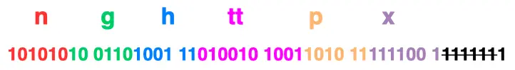

最终，`server` 头部的二进制数据对应的静态头部格式如下：


#### 4.1.2 动态表编码

静态表只包含了 61 种高频出现在头部的字符串，不在静态表范围内的头部字符串就要自行构建**动态表**，它的 Index 从 `62` 起步，会在编码解码的时候随时更新。

比如，第一次发送时头部中的「`User-Agent` 」字段数据有上百个字节，经过 Huffman 编码发送出去后，客户端和服务器双方都会更新自己的动态表，添加一个新的 Index 号 62。**那么在下一次发送的时候，就不用重复发这个字段的数据了，只用发 1 个字节的 Index 号就好了，因为双方都可以根据自己的动态表获取到字段的数据**。

所以，使得动态表生效有一个前提：**必须同一个连接上，重复传输完全相同的 HTTP 头部**。如果消息字段在 1 个连接上只发送了 1 次，或者重复传输时，字段总是略有变化，动态表就无法被充分利用了。

因此，随着在同一 HTTP/2 连接上发送的报文越来越多，客户端和服务器双方的「字典」积累的越来越多，理论上最终每个头部字段都会变成 1 个字节的 Index，这样便避免了大量的冗余数据的传输，大大节约了带宽。

理想很美好，现实很骨感。动态表越大，占用的内存也就越大，如果占用了太多内存，是会影响服务器性能的，因此 Web 服务器都会提供类似 `http2_max_requests` 的配置，用于限制一个连接上能够传输的请求数量，避免动态表无限增大，请求数量到达上限后，就会关闭 HTTP/2 连接来释放内存。

综上，HTTP/2 头部的编码通过「静态表、动态表、Huffman 编码」共同完成的。

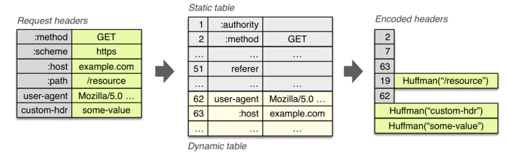

### 4.2 二进制帧

HTTP/2 厉害的地方在于将 HTTP/1 的文本格式改成二进制格式传输数据，极大提高了 HTTP 传输效率，而且二进制数据使用位运算能高效解析。

你可以从下图看到，HTTP/1.1 的响应和 HTTP/2 的区别：

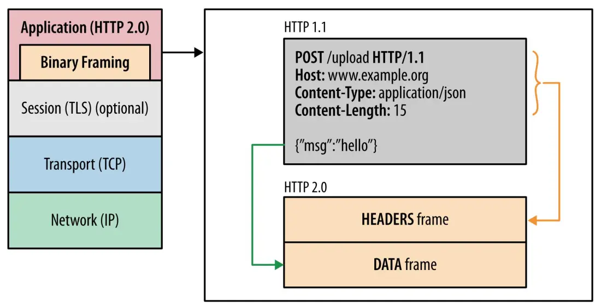

HTTP/2 把响应报文划分成了两类**帧（Frame）**，图中的 HEADERS（首部）和 DATA（消息负载） 是帧的类型，也就是说一条 HTTP 响应，划分成了两类帧来传输，并且采用二进制来编码。

比如状态码 200 ，在 HTTP/1.1 是用 '2''0''0' 三个字符来表示（二进制：00110010 00110000 00110000），共用了 3 个字节，如下图：

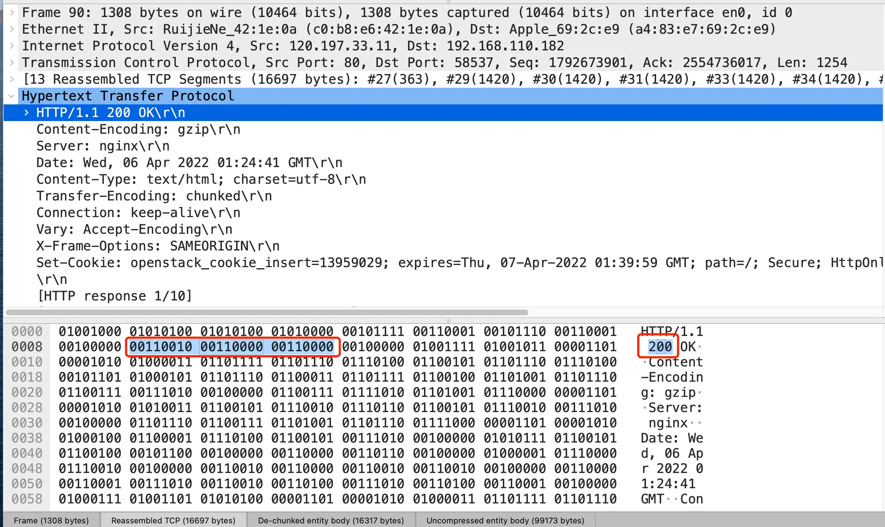

在 HTTP/2 对于状态码 200 的二进制编码是 10001000，只用了 1 字节就能表示，相比于 HTTP/1.1 节省了 2 个字节，如下图：

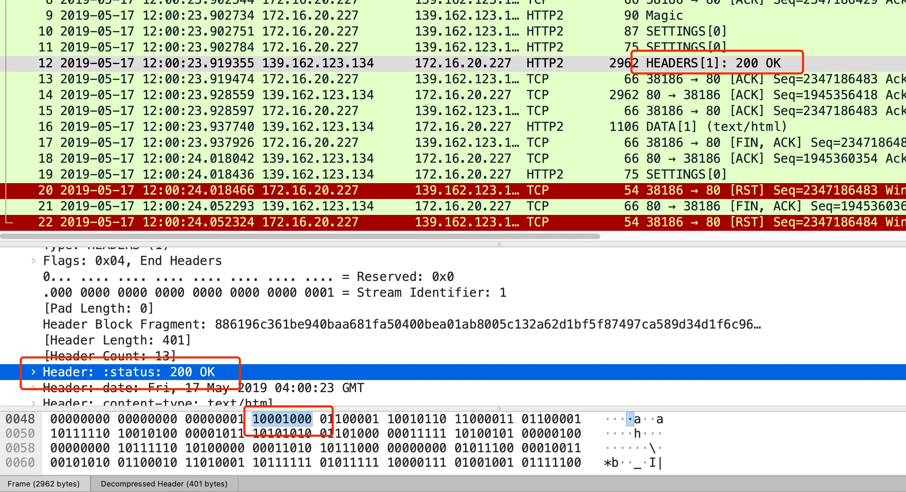

Header: :status: 200 OK 的编码内容为：1000 1000，那么表达的含义是什么呢？

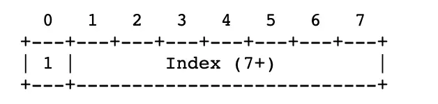

1. 最前面的 1 标识该 Header 是静态表中已经存在的 KV。
2. 我们再回顾一下之前的静态表内容，“:status: 200 OK”其静态表编码是 8，即 1000。

因此，整体加起来就是 1000 1000。

HTTP/2 **二进制帧**的结构如下图：

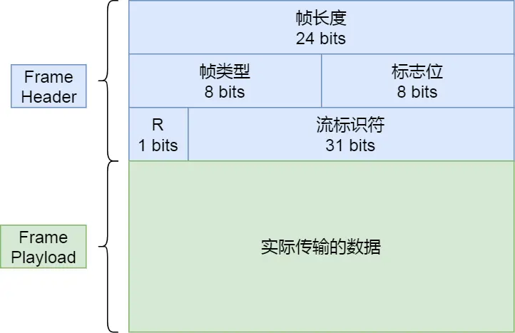


帧头（Frame Header）很小，只有 9 个字节，帧开头的前 3 个字节表示帧数据（Frame Playload）的**长度**。

帧长度后面的一个字节是表示**帧的类型**，HTTP/2 总共定义了 10 种类型的帧，一般分为**数据帧**和**控制帧**两类，如下表格：

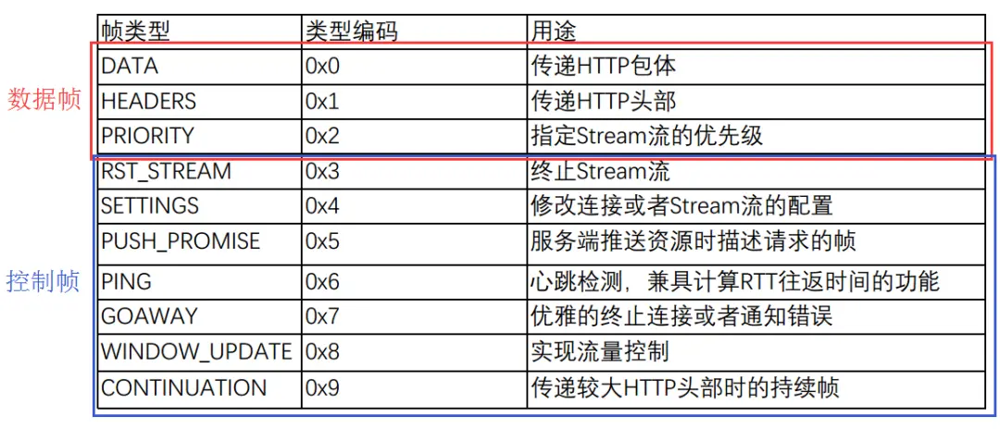

帧类型后面的一个字节是**标志位**，可以保存 8 个标志位，用于携带简单的控制信息，比如：

- **END_HEADERS** 表示头数据结束标志，相当于 HTTP/1 里头后的空行（“\r\n”）；
- **END_Stream** 表示单方向数据发送结束，后续不会再有数据帧。
- **PRIORITY** 表示流的优先级；

帧头的最后 4 个字节是**流标识符**（Stream ID），但最高位被保留不用，只有 31 位可以使用，因此流标识符的最大值是 2^31，大约是 21 亿，它的作用是用来标识该 Frame 属于哪个 Stream，接收方可以根据这个信息从乱序的帧里找到相同 Stream ID 的帧，从而有序组装信息。

最后面就是**帧数据**了，它存放的是通过 **HPACK 算法**压缩过的 HTTP 头部和包体。

### 4.3 并发传输

知道了 HTTP/2 的帧结构后，我们再来看看它是如何实现**并发传输**的。

我们都知道 HTTP/1.1 的实现是基于请求-响应模型的。同一个连接中，HTTP 完成一个事务（请求与响应），才能处理下一个事务，也就是说在发出请求等待响应的过程中，是没办法做其他事情的，如果响应迟迟不来，那么后续的请求是无法发送的，也造成了**队头阻塞**的问题（需要注意的是HTTP/2只解决了HTTP/1.1存在的应用层协议队头阻塞的问题，实际上TCP也存在队头阻塞，HTTP/2由于仍然基于TCP所以无法解决TCP协议层面的队头阻塞问题）。

而 HTTP/2 就很牛逼了，通过 Stream 这个设计，**多个 Stream 复用一条 TCP 连接，达到并发的效果**，解决了 HTTP/1.1 队头阻塞的问题，提高了 HTTP 传输的吞吐量。

为了理解 HTTP/2 的并发是怎样实现的，我们先来理解 HTTP/2 中的 Stream、Message、Frame 这 3 个概念。

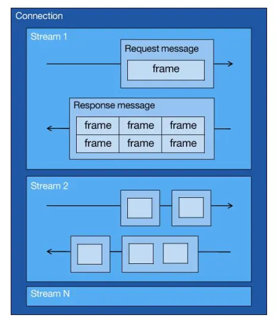

你可以从上图中看到：

- 1 个 TCP 连接包含一个或者多个 Stream，Stream 是 HTTP/2 并发的关键技术；
- Stream 里可以包含 1 个或多个 Message，Message 对应 HTTP/1 中的请求或响应，由 HTTP 头部和包体构成；
- Message 里包含一条或者多个 Frame，Frame 是 HTTP/2 最小单位，以二进制压缩格式存放 HTTP/1 中的内容（头部和包体）；

因此，我们可以得出个结论：多个 Stream 跑在一条 TCP 连接，同一个 HTTP 请求与响应是跑在同一个 Stream 中，HTTP 消息可以由多个 Frame 构成， 一个 Frame 可以由多个 TCP 报文构成。

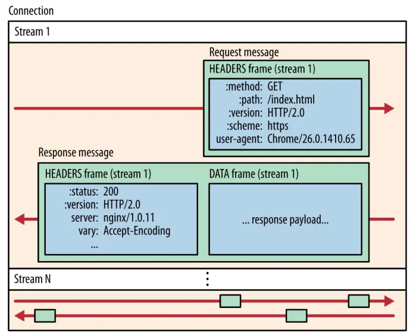

在 HTTP/2 连接上，**不同 Stream 的帧是可以乱序发送的（因此可以并发不同的 Stream ）**，因为每个帧的头部会携带 Stream ID 信息，所以接收端可以通过 Stream ID 有序组装成 HTTP 消息，而**同一 Stream 内部的帧必须是严格有序的**。

比如下图，服务端**并行交错地**发送了两个响应： Stream 1 和 Stream 3，这两个 Stream 都是跑在一个 TCP 连接上，客户端收到后，会根据相同的 Stream ID 有序组装成 HTTP 消息。

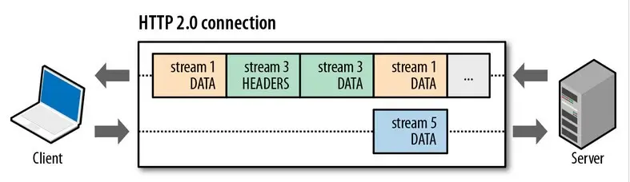

客户端和服务器**双方都可以建立 Stream**，因为服务端可以主动推送资源给客户端， 客户端建立的 Stream 必须是奇数号，而服务器建立的 Stream 必须是偶数号。

比如下图，Stream 1 是客户端向服务端请求的资源，属于客户端建立的 Stream，所以该 Stream 的 ID 是奇数（数字 1）；Stream 2 和 4 都是服务端主动向客户端推送的资源，属于服务端建立的 Stream，所以这两个 Stream 的 ID 是偶数（数字 2 和 4）。

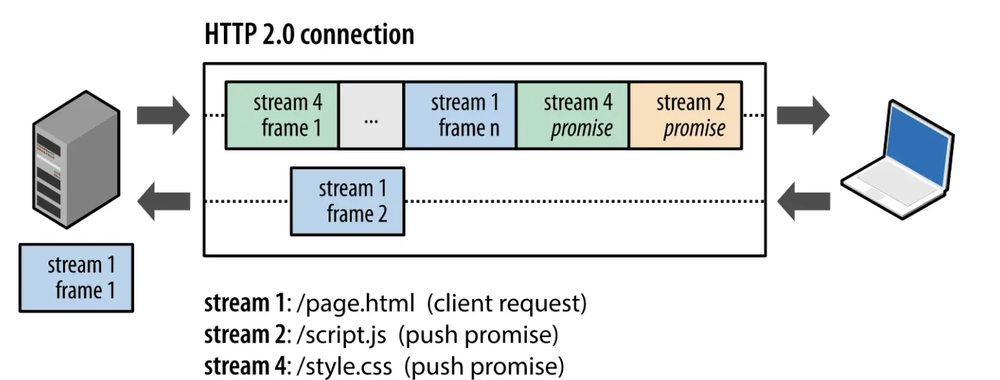

同一个连接中的 Stream ID 是不能复用的，只能顺序递增，所以当 Stream ID 耗尽时，需要发一个控制帧 `GOAWAY`，用来关闭 TCP 连接。

在 Nginx 中，可以通过 `http2_max_concurrent_Streams` 配置来设置 Stream 的上限，默认是 128 个。

HTTP/2 通过 Stream 实现的并发，比 HTTP/1.1 通过 TCP 连接实现并发要牛逼的多，**因为当 HTTP/2 实现 100 个并发 Stream 时，只需要建立一次 TCP 连接，而 HTTP/1.1 需要建立 100 个 TCP 连接，每个 TCP 连接都要经过 TCP 握手、慢启动以及 TLS 握手过程，这些都是很耗时的。**

HTTP/2 还可以对每个 Stream 设置不同**优先级**，帧头中的「标志位」可以设置优先级，比如客户端访问 HTML/CSS 和图片资源时，希望服务器先传递 HTML/CSS，再传图片，那么就可以通过设置 Stream 的优先级来实现，以此提高用户体验。

### 4.4 服务器主动推送资源服务器主动推送资源

HTTP/1.1 不支持服务器主动推送资源给客户端，都是由客户端向服务器发起请求后，才能获取到服务器响应的资源。

比如，客户端通过 HTTP/1.1 请求从服务器那获取到了 HTML 文件，而 HTML 可能还需要依赖 CSS 来渲染页面，这时客户端还要再发起获取 CSS 文件的请求，需要两次消息往返，如下图左边部分：

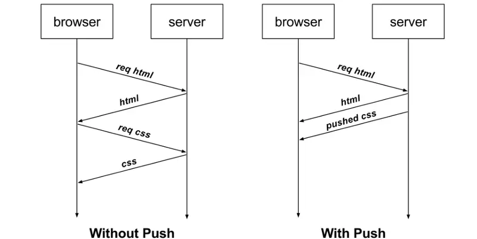

如上图右边部分，在 HTTP/2 中，客户端在访问 HTML 时，服务器可以直接主动推送 CSS 文件，减少了消息传递的次数。

在 Nginx 中，如果你希望客户端访问 /test.html 时，服务器直接推送 /test.css，那么可以这么配置：

```txt
location /test.html { 
  http2_push /test.css; 
}
```

那 HTTP/2 的推送是怎么实现的？

**客户端发起的请求，必须使用的是奇数号 Stream，服务器主动的推送，使用的是偶数号 Stream**。服务器在推送资源时，会通过 `PUSH_PROMISE` 帧传输 HTTP 头部，并通过帧中的 `Promised Stream ID` 字段告知客户端，接下来会在哪个偶数号 Stream 中发送包体。

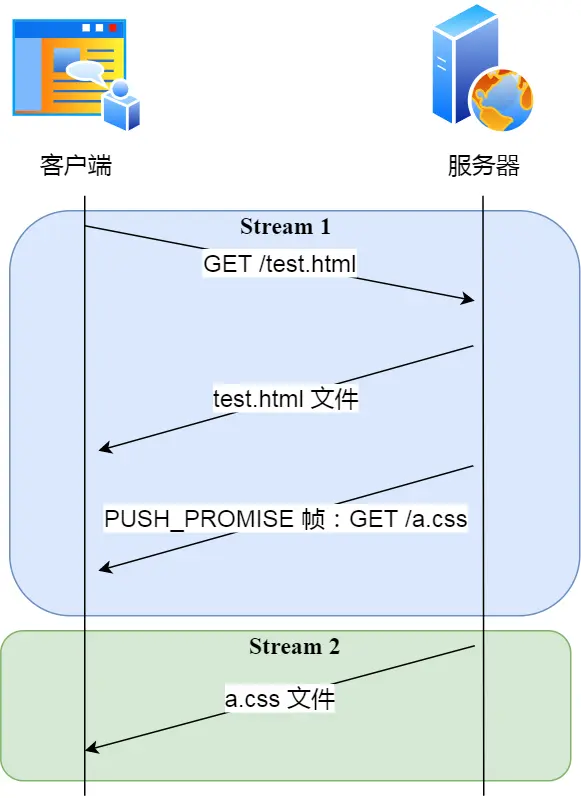


如上图，在 Stream 1 中通知客户端 CSS 资源即将到来，然后在 Stream 2 中发送 CSS 资源，注意 Stream 1 和 2 是可以**并发**的。

### 4.5 HTTP/2 存在哪些问题

HTTP/2 通过头部压缩、二进制编码、多路复用、服务器推送等新特性大幅度提升了 HTTP/1.1 的性能，而美中不足的是 HTTP/2 协议是基于 TCP 实现的，于是存在的缺陷有三个。

#### 4.5.1 传输层对头阻塞

HTTP/2虽然解决了HTTP/1.1存在的应用层对头阻塞问题，但是由于HTTP/2在单个TCP连接上使用了多路复用，受到TCP[拥塞控制](https://zh.wikipedia.org/wiki/拥塞控制)的影响，少量的丢包就可能导致整个TCP连接上的所有流被阻塞。

比如下图中，Stream 2 有一个 TCP 报文丢失了，那么即使收到了 Stream 3 和 Stream 4 的 TCP 报文，应用层也是无法读取读取的，相当于阻塞了 Stream 3 和 Stream 4 请求。

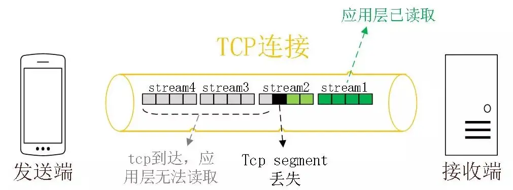

因为 TCP 是字节流协议，TCP 层必须保证收到的字节数据是完整且有序的，如果序列号较低的 TCP 段在网络传输中丢失了，即使序列号较高的 TCP 段已经被接收了，应用层也无法从内核中读取到这部分数据，从 HTTP 视角看，就是请求被阻塞了。

举个例子，如下图：

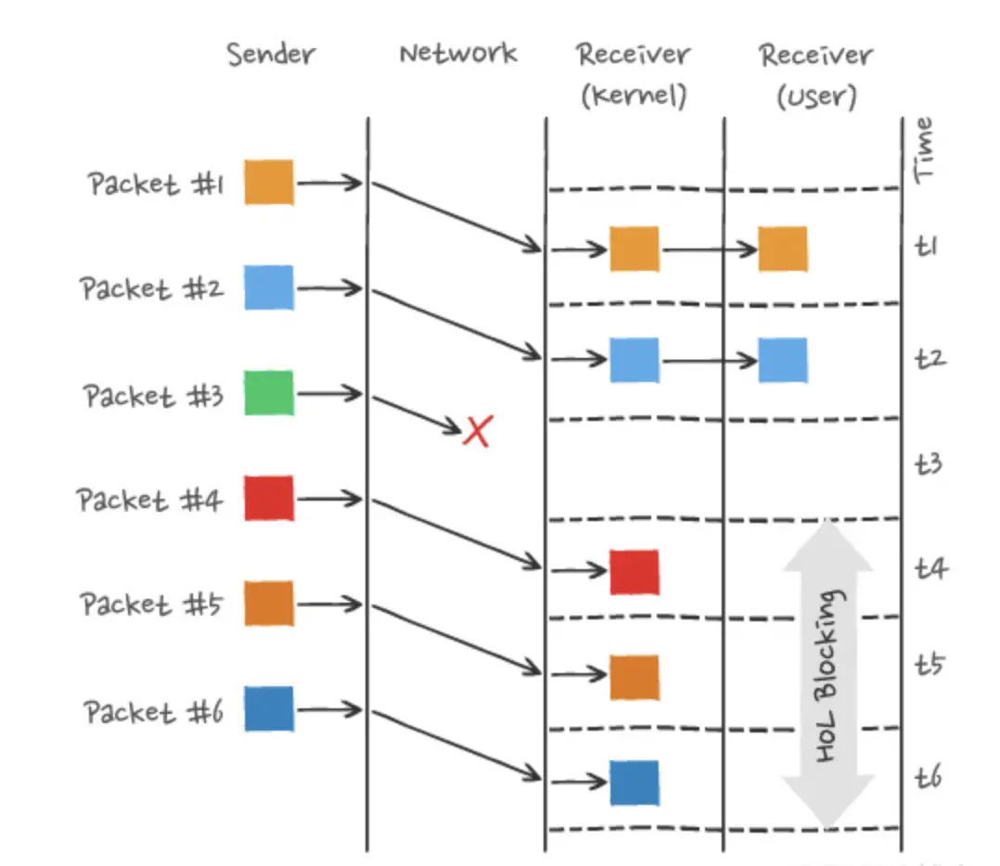

图中发送方发送了很多个 Packet，每个 Packet 都有自己的序号，你可以认为是 TCP 的序列号，其中 Packet 3 在网络中丢失了，即使 Packet 4-6 被接收方收到后，由于内核中的 TCP 数据不是连续的，于是接收方的应用层就无法从内核中读取到，只有等到 Packet 3 重传后，接收方的应用层才可以从内核中读取到数据，这就是 HTTP/2 的队头阻塞问题，是在 TCP 层面发生的。

#### 4.5.2 TCP 与 TLS 的握手时延迟

发起 HTTP 请求时，需要经过 TCP 三次握手和 TLS 四次握手（TLS 1.2）的过程，因此共需要 3 个 RTT 的时延才能发出请求数据。

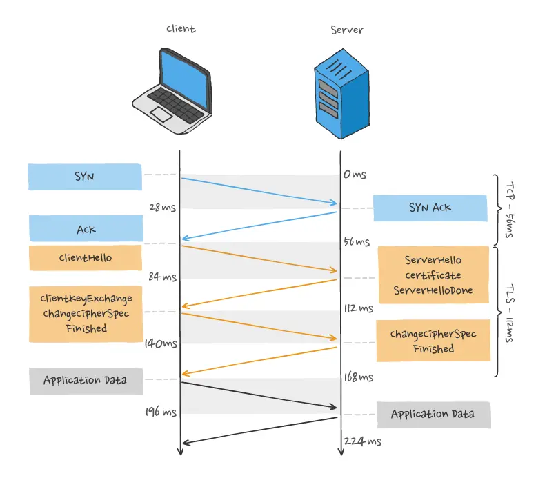

另外，TCP 由于具有「拥塞控制」的特性，所以刚建立连接的 TCP 会有个「慢启动」的过程，它会对 TCP 连接产生“减速”效果。

#### 4.5.3 网络迁移需要重新连接

一个 TCP 连接是由四元组（源 IP 地址，源端口，目标 IP 地址，目标端口）确定的，这意味着如果 IP 地址或者端口变动了，就会导致需要 TCP 与 TLS 重新握手，这不利于移动设备切换网络的场景，比如 4G 网络环境切换成 WiFi。

这些问题都是 TCP 协议固有的问题，无论应用层的 HTTP/2 在怎么设计都无法逃脱。要解决这个问题，就必须把**传输层协议替换成 UDP**，这个大胆的决定，HTTP/3 做了！

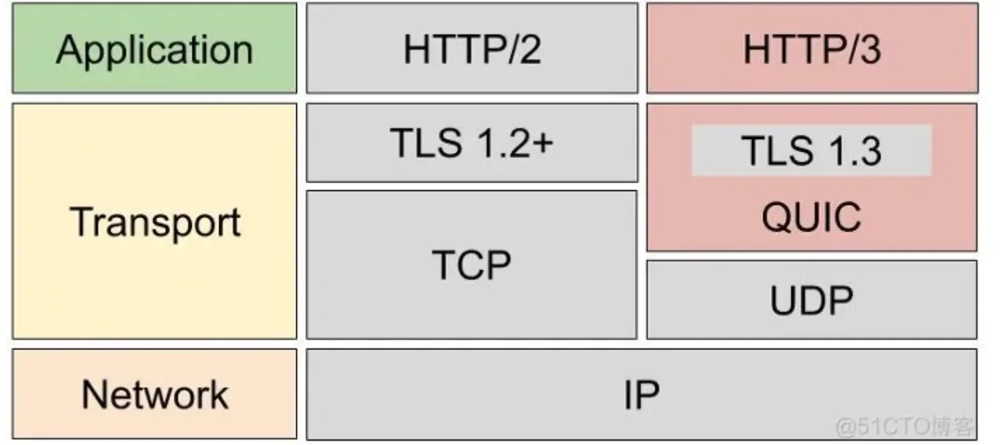

## 五. HTTP/3

2022年6月7日，IETF QUIC和HTTP工作组成员Robin Mars 在Twitter上宣布，历时5年，HTTP/3终于被标准化为 RFC 9114，这是HTTP超文本传输协议的第三个主要版本。

HTTP/3 为了解决 HTTP/2 存在的TCP队头阻塞、TLS握手延迟、网络迁移重连等问题抛弃了 TCP 传输层协议，转而使用基于 UDP 的 QUIC 协议。

### 5.1 QUIC协议的特点

我们深知，UDP 是一个简单、不可靠的传输协议，而且是 UDP 包之间是无序的，也没有依赖关系。

而且，UDP 是不需要连接的，也就不需要握手和挥手的过程，所以天然的就比 TCP 快。

当然，HTTP/3 不仅仅只是简单将传输协议替换成了 UDP，还基于 UDP 协议在「应用层」实现了 **QUIC 协议**，它具有类似 TCP 的连接管理、拥塞窗口、流量控制的网络特性，相当于将不可靠传输的 UDP 协议变成“可靠”的了，所以不用担心数据包丢失的问题。

QUIC 协议的优点有很多，这里举例几个，比如：

- 无队头阻塞；
- 更快的连接建立；
- 连接迁移；

#### 5.1.1 无队头阻塞

QUIC 协议也有类似 HTTP/2 Stream 与多路复用的概念，也是可以在同一条连接上并发传输多个 Stream，Stream 可以认为就是一条 HTTP 请求。

由于 QUIC 使用的传输协议是 UDP，UDP 不关心数据包的顺序，如果数据包丢失，UDP 也不关心。

不过 QUIC 协议会保证数据包的可靠性，每个数据包都有一个序号唯一标识。当某个流中的一个数据包丢失了，即使该流的其他数据包到达了，数据也无法被 HTTP/3 读取，直到 QUIC 重传丢失的报文，数据才会交给 HTTP/3。

而**其他流的数据报文只要被完整接收，HTTP/3 就可以读取到数据。这与 HTTP/2 不同，HTTP/2 只要某个流中的数据包丢失了，其他流也会因此受影响**。

所以，QUIC 连接上的多个 Stream 之间并没有依赖，都是独立的，某个流发生丢包了，只会影响该流，其他流不受影响。

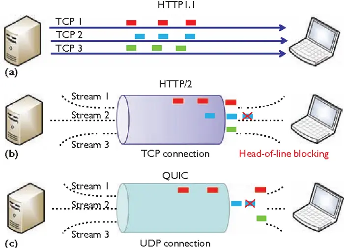

#### 5.1.2 更快的连接建立

对于 HTTP/1 和 HTTP/2 协议，TCP 和 TLS 是分层的，分别属于内核实现的传输层、OpenSSL 库实现的表示层，因此它们难以合并在一起，需要分批次来握手，先 TCP 握手，再 TLS 握手。

HTTP/3 在传输数据前虽然需要 QUIC 协议握手，这个握手过程只需要 1 RTT，握手的目的是为确认双方的「连接 ID」，连接迁移就是基于连接 ID 实现的。

但是 HTTP/3 的 QUIC 协议并不是与 TLS 分层，而是 **QUIC 内部包含了 TLS，它在自己的帧会携带 TLS 里的“记录”，再加上 QUIC 使用的是 TLS 1.3，因此仅需 1 个 RTT 就可以「同时」完成建立连接与密钥协商，甚至在第二次连接的时候，应用数据包可以和 QUIC 握手信息（连接信息 + TLS 信息）一起发送，达到 0-RTT 的效果**。

如下图右边部分，HTTP/3 当会话恢复时，有效负载数据与第一个数据包一起发送，可以做到 0-RTT：

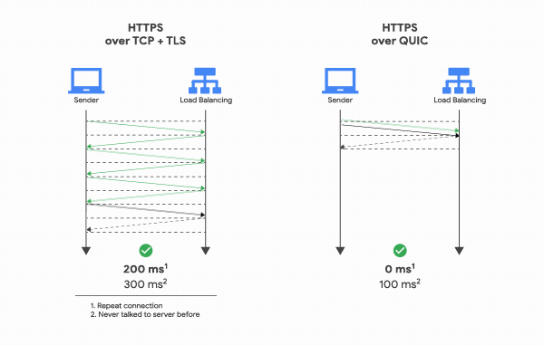

#### 5.1.3 连接迁移

在前面我们提到，基于 TCP 传输协议的 HTTP 协议，由于是通过四元组（源 IP、源端口、目的 IP、目的端口）确定一条 TCP 连接。

那么当移动设备的网络从 4G 切换到 WiFi 时，意味着 IP 地址变化了，那么就必须要断开连接，然后重新建立连接，而建立连接的过程包含 TCP 三次握手和 TLS 四次握手的时延，以及 TCP 慢启动的减速过程，给用户的感觉就是网络突然卡顿了一下，因此连接的迁移成本是很高的。

而 QUIC 协议没有用四元组的方式来“绑定”连接，而是通过**连接 ID** 来标记通信的两个端点，客户端和服务器可以各自选择一组 ID 来标记自己，因此即使移动设备的网络变化后，导致 IP 地址变化了，只要仍保有上下文信息（比如连接 ID、TLS 密钥等），就可以“无缝”地复用原连接，消除重连的成本，没有丝毫卡顿感，达到了**连接迁移**的功能。

### 5.2 HTTP/3 协议

了解完 QUIC 协议的特点后，我们再来看看 HTTP/3 协议在 HTTP 这一层做了什么变化。

HTTP/3 同 HTTP/2 一样采用二进制帧的结构，不同的地方在于 HTTP/2 的二进制帧里需要定义 Stream，而 HTTP/3 自身不需要再定义 Stream，直接使用 QUIC 里的 Stream，于是 HTTP/3 的帧的结构也变简单了。

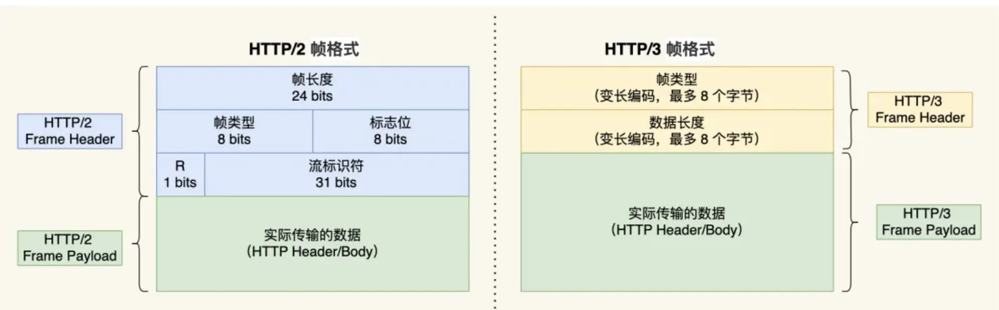

从上图可以看到，HTTP/3 帧头只有两个字段：类型和长度。

根据帧类型的不同，大体上分为数据帧和控制帧两大类，Headers 帧（HTTP 头部）和 DATA 帧（HTTP 包体）属于数据帧。

HTTP/3 在头部压缩算法这一方面也做了升级，升级成了 **QPACK**。与 HTTP/2 中的 HPACK 编码方式相似，HTTP/3 中的 QPACK 也采用了静态表、动态表及 Huffman 编码。

对于静态表的变化，HTTP/2 中的 HPACK 的静态表只有 61 项，而 HTTP/3 中的 QPACK 的静态表扩大到 91 项。

HTTP/2 和 HTTP/3 的 Huffman 编码并没有多大不同，但是动态表编解码方式不同。

所谓的动态表，在首次请求-响应后，双方会将未包含在静态表中的 Header 项更新各自的动态表，接着后续传输时仅用 1 个数字表示，然后对方可以根据这 1 个数字从动态表查到对应的数据，就不必每次都传输长长的数据，大大提升了编码效率。

可以看到，**动态表是具有时序性的，如果首次出现的请求发生了丢包，后续的收到请求，对方就无法解码出 HPACK 头部，因为对方还没建立好动态表，因此后续的请求解码会阻塞到首次请求中丢失的数据包重传过来**。

HTTP/3 的 QPACK 解决了这一问题，那它是如何解决的呢？

QUIC 会有两个特殊的单向流，所谓的单向流只有一端可以发送消息，双向则指两端都可以发送消息，传输 HTTP 消息时用的是双向流，这两个单向流的用法：

- 一个叫 QPACK Encoder Stream，用于将一个字典（Key-Value）传递给对方，比如面对不属于静态表的 HTTP 请求头部，客户端可以通过这个 Stream 发送字典；
- 一个叫 QPACK Decoder Stream，用于响应对方，告诉它刚发的字典已经更新到自己的本地动态表了，后续就可以使用这个字典来编码了。

这两个特殊的单向流是用来**同步双方的动态表**，编码方收到解码方更新确认的通知后，才使用动态表编码 HTTP 头部。

## 六. 总结

HTTP 协议从 0.9 至 3 不断演进，0.9 版本极为简单，仅支持 GET 与 HTML 文本传输。1.0 版新增多种请求方法及头部信息，但连接构建成本高且无并发处理机制。1.1 版引入 keep-alive 与管道化技术，却仍受应用层队头阻塞等性能困扰，虽有工程优化手段却无法根治。HTTP/2 致力于改善性能，兼容 1.1 版，在头部压缩、二进制帧、并发传输与服务器推送等方面有创新，但因基于 TCP 存在传输层队头阻塞、握手延迟及网络迁移重连等问题。HTTP/3 则基于 UDP 的 QUIC 协议，解决了 HTTP/2 的诸多缺陷，具备无队头阻塞、更快连接建立与连接迁移等优势，在帧结构与头部压缩算法上也有所升级，各版本的发展见证了 HTTP 协议为适应网络需求持续革新的历程。


> 本文参考至：
>
> [3.6 HTTP/2 牛逼在哪？ | 小林coding](https://www.xiaolincoding.com/network/2_http/http2.html)
>
> [3.7 HTTP/3 强势来袭 | 小林coding](https://www.xiaolincoding.com/network/2_http/http3.html)
>
> https://github.com/rmarx/holblocking-blogpost/blob/master/README_CN.md
>
> [HTTP协议的进化史：从HTTP/0.9到HTTP/3，你了解吗？ - mdnice 墨滴](https://www.mdnice.com/writing/b27347dbefae454f988e424d28d7521e)
>
> [聊聊HTTP协议的keep-alive | MonkeyWie's Blog](https://monkeywie.cn/2020/01/13/talk-http-keep-alive/)
>
> [Http——Keep-Alive机制 - 曹伟雄 - 博客园](https://www.cnblogs.com/caoweixiong/p/14720254.html)