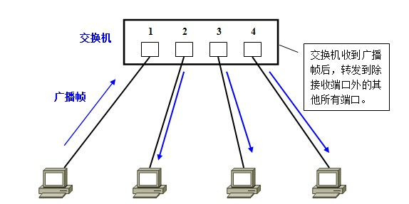
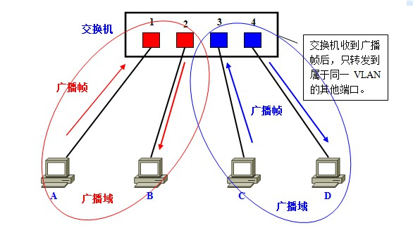

# 交换机与VLAN

上一次，我们在宿舍里组建了一个本地的局域网 LAN，可以愉快地玩游戏了。这是一个非常简单的场景，因为只有一台交换机，电脑数目很少。今天，让我们切换到一个稍微复杂一点的场景，办公室。

## 拓扑结构是怎么形成的？

我们常见到的办公室大多是一排排的桌子，每个桌子都有网口，一排十几个座位就有十几个网口，一个楼层就会有几十个甚至上百个网口。如果算上所有楼层，这个场景自然比你宿舍里的复杂多了。具体哪里复杂呢？我来给你具体讲解。

首先，这个时候，一个交换机肯定不够用，需要多台交换机，交换机之间连接起来，就形成一个稍微复杂的拓扑结构。

我们先来看两台交换机的情形。两台交换机连接着三个局域网，每个局域网上都有多台机器。如果机器 1 只知道机器 4 的 IP 地址，当它想要访问机器 4，把包发出去的时候，它必须要知道机器 4 的 MAC 地址。

**在拓扑图中，我们可以简单的理解机器1和机器2与交换机A通过一个HUB（集线器）连接成LAN1局域网**。

于是机器 1 发起广播，机器 2 收到这个广播，但是这不是找它的，所以没它什么事。交换机 A 一开始是不知道任何拓扑信息的，在它收到这个广播后，采取的策略是，除了广播包来的方向外，它还要转发给其他所有的网口。于是机器 3 也收到广播信息了，但是这和它也没什么关系。

当然，交换机 B 也是能够收到广播信息的，但是这时候它也是不知道任何拓扑信息的，因而也是进行广播的策略，将包转发到局域网三。这个时候，机器 4 和机器 5 都收到了广播信息。机器 4 主动响应说，这是找我的，这是我的 MAC 地址。于是一个 ARP 请求就成功完成了。

在上面的过程中，交换机 A 和交换机 B 都是能够学习到这样的信息：机器 1 是在左边这个网口的。当了解到这些拓扑信息之后，情况就好转起来。当机器 2 要访问机器 1 的时候，机器 2 并不知道机器 1 的 MAC 地址，所以机器 2 会发起一个 ARP 请求。这个广播消息会到达机器 1，也同时会到达交换机 A。这个时候交换机 A 已经知道机器 1 是不可能在右边的网口的，所以这个广播信息就不会广播到局域网二和局域网三。

当机器 3 要访问机器 1 的时候，也需要发起一个广播的 ARP 请求。这个时候交换机 A 和交换机 B 都能够收到这个广播请求。交换机 A 当然知道主机 A 是在左边这个网口的，所以会把广播消息转发到局域网一。同时，交换机 B 收到这个广播消息之后，由于它知道机器 1 是不在右边这个网口的，所以不会将消息广播到局域网三。

## 如何解决常见的环路问题

这样看起来，两台交换机工作得非常好。随着办公室越来越大，交换机数目肯定越来越多。当整个拓扑结构复杂了，这么多网线，绕过来绕过去，不可避免地会出现一些意料不到的情况。其中常见的问题就是**环路问题**。

例如这个图，当两个交换机将两个局域网同时连接起来的时候。你可能会觉得，这样反而有了高可用性。但是却不幸地出现了环路。出现了环路会有什么结果呢？

我们来想象一下机器 1 访问机器 2 的过程。一开始，机器 1 并不知道机器 2 的 MAC 地址，所以它需要发起一个 ARP 的广播。广播到达机器 2，机器 2 会把 MAC 地址返回来，看起来没有这两个交换机什么事情。

但是问题来了，这两个交换机还是都能够收到广播包的。交换机 A 一开始是不知道机器 2 在哪个局域网的，所以它会把广播消息放到局域网二，在局域网二广播的时候，交换机 B 右边这个网口也是能够收到广播消息的。交换机 B 会将这个广播息信息发送到局域网一。局域网一的这个广播消息，又会到达交换机 A 左边的这个接口。交换机 A 这个时候还是不知道机器 2 在哪个局域网，于是将广播包又转发到局域网二。左转左转左转，好像是个圈哦。

可能有人会说，当两台交换机都能够逐渐学习到拓扑结构之后，是不是就可以了？

别想了，压根儿学不会的。机器 1 的广播包到达交换机 A 和交换机 B 的时候，本来两个交换机都学会了机器 1 是在局域网一的，但是当交换机 A 将包广播到局域网二之后，交换机 B 右边的网口收到了来自交换机 A 的广播包。根据学习机制，这彻底损坏了交换机 B 的三观，刚才机器 1 还在左边的网口呢，怎么又出现在右边的网口呢？哦，那肯定是机器 1 换位置了，于是就误会了，交换机 B 就学会了，机器 1 是从右边这个网口来的，把刚才学习的那一条清理掉。同理，交换机 A 右边的网口，也能收到交换机 B 转发过来的广播包，同样也误会了，于是也学会了，机器 1 从右边的网口来，不是从左边的网口来。

而当广播包从左边的局域网一广播的时候，两个交换机再次刷新三观，原来机器 1 是在左边的，过一会儿，又发现不对，是在右边的，过一会，又发现不对，是在左边的。

这还是一个包转来转去，每台机器都会发广播包，交换机转发也会复制广播包，当广播包越来越多的时候，按照上一节讲过一个共享道路的算法，也就是路会越来越堵，最后谁也别想走。所以，必须有一个方法解决环路的问题，怎么破除环路呢？

### STP 协议

在数据结构中，有一个方法叫作最小生成树。有环的我们常称为图。将图中的环破了，就生成了树。在计算机网络中，生成树的算法叫作 STP，全称 Spanning Tree Protocol。

## 如何解决广播问题和安全问题

毕竟机器多了，交换机也多了，就算交换机比 Hub 智能一些，但是还是难免有广播的问题，一大波机器，相关的部门、不相关的部门，广播一大堆，性能就下来了。就像一家公司，创业的时候，一二十个人，坐在一个会议室，有事情大家讨论一下，非常方便。但是如果变成了 50 个人，全在一个会议室里面吵吵，就会乱的不得了。

你们公司有不同的部门，有的部门需要保密的，比如人事部门，肯定要讨论升职加薪的事儿。由于在同一个广播域里面，很多包都会在一个局域网里面飘啊飘，碰到了一个会抓包的程序员，就能抓到这些包，如果没有加密，就能看到这些敏感信息了。还是上面的例子，50 个人在一个会议室里面七嘴八舌的讨论，其中有两个 HR，那他们讨论的问题，肯定被其他人偷偷听走了。

实际上在网络环境中广播随处可见，如果整个网络只有一个广播域，那么一旦发出广播信息，就会传遍整个网络，并且对网络中的主机带来额外的负担。常见的广播通信：

- ARP请求：建立IP地址和MAC地址的映射关系。
- RIP：一种路由协议。
- DHCP：用于自动设定IP地址的协议。

想解决上述性能问题有两种解决方案，一个是**物理隔离**。每个部门设一个单独的会议室，对应到网络方面，就是每个部门有单独的交换机，配置单独的子网，这样部门之间的沟通就需要路由器了。路由器咱们还没讲到，以后再说。这样的问题在于，有的部门人多，有的部门人少。人少的部门慢慢人会变多，人多的部门也可能人越变越少。如果每个部门有单独的交换机，口多了浪费，少了又不够用。

另外一种方式是虚拟隔离，就是用我们常说的 VLAN，或者叫虚拟局域网。使用 VLAN，一个交换机上会连属于多个局域网的机器，那交换机怎么区分哪个机器属于哪个局域网呢？

我们只需要在原来的二层的头上加一个 TAG，里面有一个 VLAN ID，一共 12 位。为什么是 12 位呢？因为 12 位可以划分 4096 个 VLAN。这样是不是还不够啊。现在的情况证明，目前云计算厂商里面绝对不止 4096 个用户。当然每个用户需要一个 VLAN 了啊，怎么办呢，这个我们在后面的章节再说。

如果我们买的交换机是支持 VLAN 的，当这个交换机把二层的头取下来的时候，就能够识别这个 VLAN ID。这样只有相同 VLAN 的包，才会互相转发，不同 VLAN 的包，是看不到的。这样广播问题和安全问题就都能够解决了。

### VLAN的实现机制

在理解了“为什么需要VLAN”之后，接下来让我们来了解一下交换机是如何使用VLAN分割广播域的。

首先，在一台未设置任何VLAN的二层交换机上，任何广播帧都会被转发给除接收端口外的所有其他端口（Flooding）。例如，计算机A发送广播信息后，会被转发给端口2、3、4。

这时，如果在交换机上生成红、蓝两个VLAN；同时设置端口1、2属于红色VLAN、端口3、4属于蓝色VLAN。再从A发出广播帧的话，交换机就只会把它转发给同属于一个VLAN的其他端口——也就是同属于红色VLAN的端口2，不会再转发给属于蓝色VLAN的端口。

同样，C发送广播信息时，只会被转发给其他属于蓝色VLAN的端口，不会被转发给属于红色VLAN的端口。

就这样，VLAN通过限制广播帧转发的范围分割了广播域。上图中为了便于说明，以红、蓝两色识别不同的VLAN，在实际使用中则是用“VLAN ID”来区分的。

有人会问交换机之间怎么连接呢？将两个交换机连接起来的口应该设置成什么 VLAN 呢？对于支持 VLAN 的交换机，有一种口叫作 Trunk 口。它可以转发属于任何 VLAN 的口。交换机之间可以通过这种口相互连接。

### VLAN之间如何通信

那么么，当我们需要在不同的VLAN间通信时又该如何是好呢？

请大家再次回忆一下：VLAN是广播域。而通常两个广播域之间由路由器连接，**广播域之间来往的数据包都是由路由器中继的**。因此，VLAN间的通信也需要路由器提供中继服务，这被称作“VLAN间路由”。

VLAN间路由，可以使用普通的路由器，也可以使用三层交换机。其中的具体内容，等有机会再细说吧。在这里希望大家先记住不同VLAN间互相通信时需要用到路由功能。

**VLAN参考文章(推荐)**：<https://blog.csdn.net/s2603898260/article/details/90489469>

## 总结

1. STP算法：当有多台交换机连接时就可能产生环路，由于交换机在初始状态仍采用广播通信（逐步学习），所以广播环路会形成广播风暴，此时就需要STP算法解决环路问题。
2. VLAN：单个交换机在初始状态下处理多个机器的数据包仍然采用广播的方式（例如：计算机A需要与计算机B通信。在基于以太网的通信中，必须在数据帧中指定目标MAC地址才能正常通信，因此计算机A必须先广播“ARP请求（ARP Request）信息”，来尝试获取计算机B的MAC地址）。如果这个交换机连接的机器数量过多仍会产生网络利用率下降。所以可以采用VLAN的方式组成多个虚拟局域网。
3. 每一个VLAN就是一个局域网，一个局域网就是一个广播域，每个广播域之间的通信就需要依靠路由器完成。

