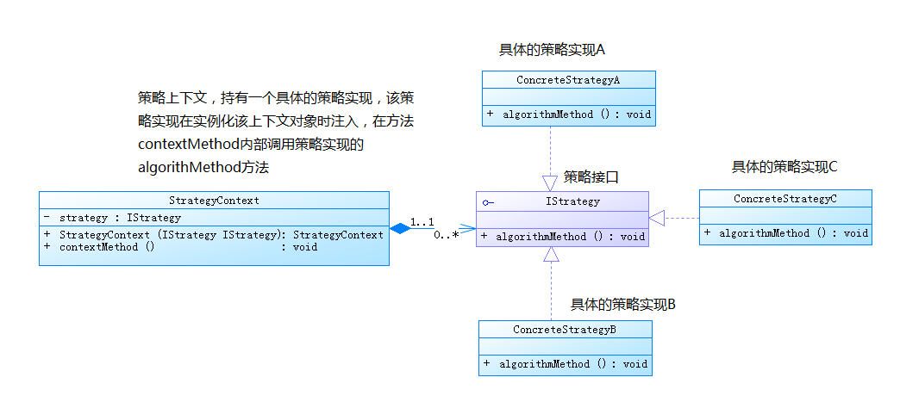
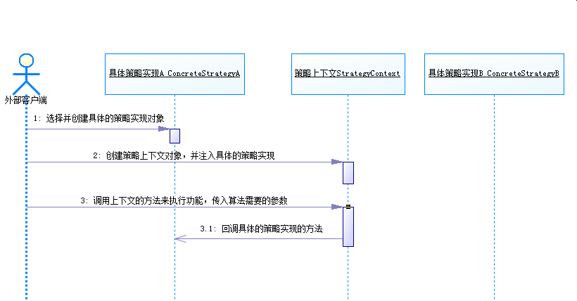

# 策略模式（Strategy Pattern）

现实生活中我们到商场买东西的时候，卖场往往根据不同的客户制定不同的报价策略，比如针对新客户不打折扣，针对老客户打9折，针对VIP客户打8折...

现在我们要做一个报价管理的模块，简要点就是要针对不同的客户，提供不同的折扣报价。

如果是有你来做，你会怎么做？

我们很有可能写出下面的代码：

```java
package strategy.examp02;
 
import java.math.BigDecimal;
 
public class QuoteManager {
 
    public BigDecimal quote(BigDecimal originalPrice,String customType){
        if ("新客户".equals(customType)) {
            System.out.println("抱歉！新客户没有折扣！");
            return originalPrice;
        }else if ("老客户".equals(customType)) {
            System.out.println("恭喜你！老客户打9折！");
            originalPrice = originalPrice.multiply(new BigDecimal(0.9)).setScale(2,BigDecimal.ROUND_HALF_UP);
            return originalPrice;
        }else if("VIP客户".equals(customType)){
            System.out.println("恭喜你！VIP客户打8折！");
            originalPrice = originalPrice.multiply(new BigDecimal(0.8)).setScale(2,BigDecimal.ROUND_HALF_UP);
            return originalPrice;
        }
        //其他人员都是原价
        return originalPrice;
    }
 
}
```

经过测试，上面的代码工作的很好，可是上面的代码是有问题的。上面存在的问题：把不同客户的报价的算法都放在了同一个方法里面，使得该方法很是庞大(现在是只是一个演示，所以看起来还不是很臃肿)。

下面看一下上面的改进，我们把不同客户的报价的算法都单独作为一个方法：

```java
package strategy.examp02;
 
import java.math.BigDecimal;
 
public class QuoteManagerImprove {
 
    public BigDecimal quote(BigDecimal originalPrice, String customType){
        if ("新客户".equals(customType)) {
            return this.quoteNewCustomer(originalPrice);
        }else if ("老客户".equals(customType)) {
            return this.quoteOldCustomer(originalPrice);
        }else if("VIP客户".equals(customType)){
            return this.quoteVIPCustomer(originalPrice);
        }
        //其他人员都是原价
        return originalPrice;
    }
 
    /**
     * 对VIP客户的报价算法
     * @param originalPrice 原价
     * @return 折后价
     */
    private BigDecimal quoteVIPCustomer(BigDecimal originalPrice) {
        System.out.println("恭喜！VIP客户打8折");
        originalPrice = originalPrice.multiply(new BigDecimal(0.8)).setScale(2,BigDecimal.ROUND_HALF_UP);
        return originalPrice;
    }
 
    /**
     * 对老客户的报价算法
     * @param originalPrice 原价
     * @return 折后价
     */
    private BigDecimal quoteOldCustomer(BigDecimal originalPrice) {
        System.out.println("恭喜！老客户打9折");
        originalPrice = originalPrice.multiply(new BigDecimal(0.9)).setScale(2,BigDecimal.ROUND_HALF_UP);
        return originalPrice;
    }
 
    /**
     * 对新客户的报价算法
     * @param originalPrice 原价
     * @return 折后价
     */
    private BigDecimal quoteNewCustomer(BigDecimal originalPrice) {
        System.out.println("抱歉！新客户没有折扣！");
        return originalPrice;
    }
 
}
```

上面的代码比刚开始的时候要好一点，它把每个具体的算法都单独抽出来作为一个方法，当某一个具体的算法有了变动的时候，只需要修改响应的报价算法就可以了。

但是改进后的代码还是有问题的，那有什么问题呢？

- 当我们新增一个客户类型的时候，首先要添加一个该种客户类型的报价算法方法，然后再quote方法中再加一个else if的分支，是不是感觉很是麻烦呢？而且这也违反了设计原则之一的开闭原则（open-closed-principle）.
  - 开闭原则：对于扩展是开放的（Open for extension）。这意味着模块的行为是可以扩展的。当应用的需求改变时，我们可以对模块进行扩展，使其具有满足那些改变的新行为。也就是说，我们可以改变模块的功能。对于修改是关闭的（Closed for modification）。对模块行为进行扩展时，不必改动模块的源代码或者二进制代码。

- 我们经常会面临这样的情况，不同的时期使用不同的报价规则，比如在各个节假日举行的各种促销活动时、商场店庆时往往都有普遍的折扣，但是促销时间一旦过去，报价就要回到正常价格上来。按照上面的代码我们就得修改if else里面的代码很是麻烦。

  那有没有什么办法使得我们的报价管理即可扩展、可维护，又可以方便的响应变化呢？当然有解决方案啦，就是我们下面要讲的策略模式。

## 一. 策略模式的含义

### 定义：

　　策略模式定义了一系列的算法，并将每一个算法封装起来，使每个算法可以相互替代，使算法本身和使用算法的客户端分割开来，相互独立。

### 结构

1. 策略接口角色IStrategy：用来约束一系列具体的策略算法，策略上下文角色ConcreteStrategy使用此策略接口来调用具体的策略所实现的算法。

2. 具体策略实现角色ConcreteStrategy：具体的策略实现，即具体的算法实现。

3. 策略上下文角色StrategyContext：策略上下文，负责和具体的策略实现交互，通常策略上下文对象会持有一个真正的策略实现对象，策略上下文还可以让具体的策略实现从其中获取相关数据，回调策略上下文对象的方法。

### UML类图



### UML序列图



## 二. 运用策略模式对原先代码进行改造

针对我们一开始讲的报价管理的例子：我们可以应用策略模式对其进行改造，不同类型的客户有不同的折扣，我们可以将不同类型的客户的报价规则都封装为一个独立的算法，然后抽象出这些报价算法的公共接口：

**策略接口**：

```java
//报价策略接口
public interface IQuoteStrategy {
    //获取折后价的价格
    BigDecimal getPrice(BigDecimal originalPrice);
}
```

**具体的策略实现**：

```java
//新客户的报价策略实现类
public class NewCustomerQuoteStrategy implements IQuoteStrategy {
    @Override
    public BigDecimal getPrice(BigDecimal originalPrice) {
        System.out.println("抱歉！新客户没有折扣！");
        return originalPrice;
    }
}
```

```java
//老客户的报价策略实现
public class OldCustomerQuoteStrategy implements IQuoteStrategy {
    @Override
    public BigDecimal getPrice(BigDecimal originalPrice) {
        System.out.println("恭喜！老客户享有9折优惠！");
        originalPrice = originalPrice.multiply(new BigDecimal(0.9)).setScale(2,BigDecimal.ROUND_HALF_UP);
        return originalPrice;
    }
}
```

```java
//VIP客户的报价策略实现
public class VIPCustomerQuoteStrategy implements IQuoteStrategy {
    @Override
    public BigDecimal getPrice(BigDecimal originalPrice) {
        System.out.println("恭喜！VIP客户享有8折优惠！");
        originalPrice = originalPrice.multiply(new BigDecimal(0.8)).setScale(2,BigDecimal.ROUND_HALF_UP);
        return originalPrice;
    }
}
```

**策略上下文**：

```java
//报价上下文角色
public class QuoteContext {
    //持有一个具体的报价策略
    private IQuoteStrategy quoteStrategy;
 
    //注入报价策略
    public QuoteContext(IQuoteStrategy quoteStrategy){
        this.quoteStrategy = quoteStrategy;
    }
 
    //回调具体报价策略的方法
    public BigDecimal getPrice(BigDecimal originalPrice){
        return quoteStrategy.getPrice(originalPrice);
    }
}
```

**外部客户端**：

```java
//外部客户端
public class Client {
    public static void main(String[] args) {
        //1.创建老客户的报价策略
        IQuoteStrategy oldQuoteStrategy = new OldCustomerQuoteStrategy();
 
        //2.创建报价上下文对象，并设置具体的报价策略
        QuoteContext quoteContext = new QuoteContext(oldQuoteStrategy);
 
        //3.调用报价上下文的方法
        BigDecimal price = quoteContext.getPrice(new BigDecimal(100));
 
        System.out.println("折扣价为：" +price);
    }
}
```

这个时候，商场营销部新推出了一个客户类型--MVP用户（Most Valuable Person），可以享受折扣7折优惠，那该怎么办呢？

这个很容易，只要新增一个报价策略的实现，然后外部客户端调用的时候，创建这个新增的报价策略实现，并设置到策略上下文就可以了，对原来已经实现的代码没有任何的改动。

## 三. JDK中策略模式的体现

### 3.1 Collections.sort(List list, Comparator<? super T> c) 

在JDK中，Collections是对集合进行操作的工具类，里面的sort方法，传入了一个Comparator用于制定List中元素的排序规则，这就是典型的策略模式。

### 3.2 线程池中也用到了策略模式

```java
public ThreadPoolExecutor(int corePoolSize,
                              int maximumPoolSize,
                              long keepAliveTime,
                              TimeUnit unit,
                              BlockingQueue<Runnable> workQueue,
                              ThreadFactory threadFactory,
                              RejectedExecutionHandler handler)
```

线程池中创建后，如果等待队列满了以后，就必然需要一些拒绝策略来处理队列爆满的情况。而`ThreadPoolExecutor`线程池中的`RejectedExecutionHandler handler`就是用于指定线程池的拒绝策略的。

而官方也在`ThreadPoolExecutor`类中定义了几种常用的拒绝策略：

- AbortPolicy：直接抛出异常。
- CallerRunsPolicy：只用调用者所在线程来运行任务。
- DiscardOldestPolicy：丢弃队列里最近的一个任务，并执行当前任务。
- DiscardPolicy：不处理，丢弃掉。

