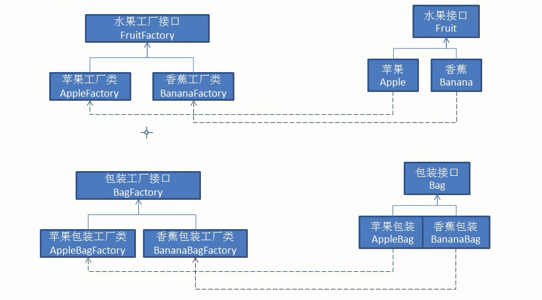
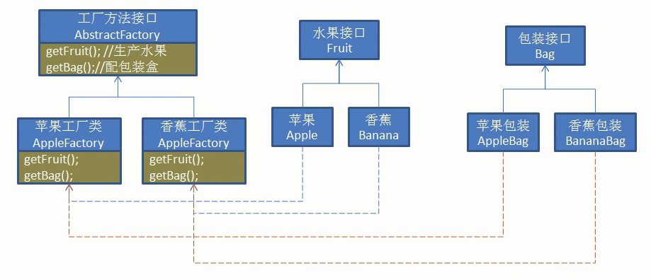
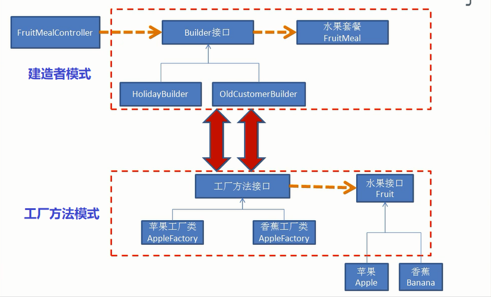

# 工厂模式

在前面的文章中，我们了解了依赖倒置原则，依赖倒置原则说人话就是面向接口编程，那么我们如何实现依赖接口编程呢？

```java
public class FruitDemo {
    public static void main(String[] args) {
        Fruit apple = new Apple();#Fruit是水果接口，Apple实现Fruit接口。
        apple.xxx();
    }
}
```

在上面的代码中，似乎就是面向接口编程了，但是这样做并没有达到解耦的目的，FruitDemo类仍然依赖于Apple类。假如Apple实例的创建方式发生改变，那么我们就需要更改所有依赖Apple类的代码。

## **1. 简单工厂模式**

通过简单工厂模式就能解决上述问题：

```java
public class FruitFactory {
    public static final int TYPE_APPLE = 1;//苹果
    public static final int TYPE_ORANGE = 2;//桔子
    public static final int TYPE_BANANA = 3;//香蕉

    public static Fruit getFruit(int type){
        if(TYPE_APPLE == type){
            return new Apple();
        } else if(TYPE_ORANGE == type){
           return new Orange("Peter",80);
        } else if(TYPE_BANANA == type){
            return new Banana();
        }
        return null;
    }

}
```

```java
public class FruitDemo {
    public static void main(String[] args) {
        Fruit apple = FruitFactory.getFruit(FruitFactory.TYPE_APPLE);
        apple.xxx();
    }
}
```

简单工厂的开发模式相对于传统开发有哪些优势呢？

1. 简单工厂模式对传统对象的创建过程进行了封装，用户无需知道一个类复杂的创建过程（有的类在创建时需要传入很多参数）
2. 当水果类的创建过程需要改变时，工厂的调用者无需对代码进行任何修改。也就是说在上例中FruitDemo类并没有直接依赖于Apple类，而是通过工厂类来创建，如果苹果的创建过程需要改变，我们只需要改变工厂类即可，这在多个类依赖Apple时就能体会到优势。
3. 简单工厂对Fruit接口的实现类进行了集中管理。


## **2. 工厂方法模式**

简单工厂模式相比传统开发有一定的优势，但是实际分析，它并不符合单一职责原则、开放闭合原则。FruitFactory负责众多水果实现类的创建（苹果、桔子、香蕉等），不符合单一职责原则；如果我们需要加入新的水果实现类，那么仍然需要修改FruitFactory类，这不符合对修改关闭的原则。工厂方法模式就是对简单工厂模式的一种改进。

在工厂方法模式中，每一个水果类都对应着一个工厂，水果对应水果工厂，香蕉对应香蕉工厂....。

```java
public interface FruitFactory {
    public Fruit getFruit();//摘水果指令
}
```

```java
public class AppleFactory implements FruitFactory{
    public Fruit getFruit(){
        return new Apple();
    }
}
```

```java
public class BananaFactory implements FruitFactory{
    public Fruit getFruit(){
        return new Banana();
    }
}
```

在工厂方法模式中，满足了单一职责原则以及开发封闭原则，如果有一个新的水果类需要创建，那么只需要创建一个新的工厂创建它即可，这样就做到了对修改关闭，对增加开放。


## **3. 抽象工厂模式**

工厂方法模式看上去已经足够完美了，那么抽象工厂模式用于哪些场景呢？

假如我们现在需要办一个水果店，但是为了销量，我们需要对每种水果做一定的包装，此时以工厂方法模式的方式进行，我们需要创建各自的包装生产工厂（XXXBagFactory）



```java
public class AppleBagFactory implements BagFactory{
    public Bag getBag(){
        return new AppleBag();
    }
}
public class AppleBag implements Bag{
    public void pack(){
        System.out.println(对苹果打包);
    }
}
```

```java
public class BananaBagFactory implements BagFactory{
    public Bag getBag(){
        return new BananaBag();
    }
}
public class BananaBag implements Bag{
    public void pack(){
        System.out.println(对香蕉打包);
    }
}
```

那么此时水果店需要卖出一箱水果他要这样做：

```java
public static void pack(){
        //初始化苹果工厂
        fruitFactory = new AppleFactory();//猎取工厂不对应
        Fruit fruit = fruitFactory.getFruit();
        fruit.draw();

        //初始化苹果包装工厂
        bagFactory = new BananaBagFactory();
        Bag bag = bagFactory.getBag();

        bag.pack();

        //....邮寄业务
    }
```

这样做貌似可以完成需求，但是如果水果品种不断增多，那么难免会出现包装盒获取出错的情况，苹果用香蕉盒包装，这样会严重影响客户体验。那么抽象工厂就能很好的完成这个任务了：



```java
public abstract class AbstractFactory {
    public abstract  Fruit getFruit();
    public abstract Bag getBag();
}
```

```java
public class AppleFactory extends AbstractFactory{

    @Override
    public Fruit getFruit() {
        return new Apple();
    }

    @Override
    public Bag getBag() {
        return new AppleBag();
    }
}
```

```java
public class BananaFactory extends AbstractFactory{

    @Override
    public Fruit getFruit() {
        return new Banana();
    }

    @Override
    public Bag getBag() {
        return new BananaBag();
    }
}
```

抽象工厂模式就是在一个工厂中生产一系列产品，这样就不会导致工厂的混杂。

```java
public class OrderSendClient {
    public static void main(String[] args){
        sendFruit();
    }

    public static void sendFruit(){
        //初始化工厂
        AbstractFactory factory = new AppleFactory();//spring使用注入方式
        //得到水果
        Fruit fruit = factory.getFruit();
        fruit.draw();
        //得到包装
        Bag bag = factory.getBag();
        bag.pack();
        //以下物流运输业务。。。。
    }
}
```


## 4. 建造者模式

现在我们的水果店需要推出节日套餐，每个套餐包含若干价钱的苹果、桔子、香蕉，不同的套餐会有不同价格的优惠，我们如何才能灵活的完成这一任务呢？


首先我们准备苹果、桔子、香蕉，他们包含各自的价格：

```java
public class Apple implements Fruit {
    private int price = 100;
    public Apple(){}
    public Apple(int price){
        this.price = price;
    }
}
```

....

我们将套餐抽象为一个类：

```java
public class FruitMeal {

    private Apple apple;//苹果--价格
    private Banana banana;//香蕉价格
    private Orange orange;    //桔子价格
    private int discount;//折扣价

    private int totalPrice;//套餐总价

    public void setDiscount(int discount) {
        this.discount = discount;
    }

    public void setApple(Apple apple) {
        this.apple = apple;
    }

    public void setBanana(Banana banana) {
        this.banana = banana;
    }

    public void setOrange(Orange orange) {
        this.orange = orange;
    }

    public int cost(){
        return this.totalPrice;
    }

    public void init() {
        if (null != apple){
            totalPrice += apple.price();
        }
        if (null != orange){
            totalPrice += orange.price();
        }
        if (null != banana){
            totalPrice += banana.price();
        }
        if (totalPrice > 0){
            totalPrice -= discount;
        }
    }

    public void showItems() {
        System.out.println("totalPrice：" + totalPrice);
    }
}
```

建造者接口：

```java
public interface Builder {//也是工厂

    void buildApple(int price);//设置苹果
    void buildBanana(int price);//设置香蕉
    void buildOrange(int price);//设置桔子

    FruitMeal getFruitMeal();//返回创建的套餐
}
```

建造者实例：

```java
//假期套餐建造者
public class HolidayBuilder implements Builder {
    private FruitMeal fruitMeal = new FruitMeal();

    @Override
    public void buildApple(int price) {
        Apple apple = new Apple();
        apple.setPrice(price);
        fruitMeal.setApple(apple);
    }

    @Override
    public void buildBanana(int price) {
        Banana fruit = new Banana();
        fruit.setPrice(price);
        fruitMeal.setBanana(fruit);
    }

    @Override
    public void buildOrange(int price) {
        Orange fruit = new Orange();
        fruit.setPrice(price);
        fruitMeal.setOrange(fruit);
    }

    @Override
    public FruitMeal getFruitMeal() {
        fruitMeal.setDiscount(15);//折扣价格对一个套餐来，是固定的
        fruitMeal.init();
        return fruitMeal;
    }
}
```

```java
//老顾客套餐
public class OldCustomerBuilder implements Builder {
    private FruitMeal fruitMeal = new FruitMeal();

    @Override
    public void buildApple(int price) {
        Apple apple = new Apple();
        apple.setPrice(price);
        fruitMeal.setApple(apple);
    }

    @Override
    public void buildBanana(int price) {
        Banana fruit = new Banana();
        fruit.setPrice(price);
        fruitMeal.setBanana(fruit);
    }

    @Override
    public void buildOrange(int price) {
        Orange fruit = new Orange();
        fruit.setPrice(price);
        fruitMeal.setOrange(fruit);
    }

    @Override
    public FruitMeal getFruitMeal() {
        fruitMeal.setDiscount(10);//老顾客优惠10元
        fruitMeal.init();
        return fruitMeal;
    }
}
```


建造者模式中需要一个“导演”类，来达到不同的建造效果：

```java
public class FruitMealController {//收银台---导演类

    public void construct() {
//        Builder builder = new HolidayBuilder();
        Builder builder = new OldCustomerBuilder();//spring注入方法，
        
        //以下代码模板，轻易是不变的
        builder.buildApple(120);//创建苹果设置价格
        builder.buildBanana(80);//创建香蕉设置香蕉价格
        builder.buildOrange(50);//创建桔子设置价格
        
        FruitMeal fruitMeal = builder.getFruitMeal();
        int cost = fruitMeal.cost();
        System.out.println("本套件花费："+cost);
    }
    public static void main(String[] args) {
        new FruitMealController().construct();
    }
}
```

## 5. 建造者模式与工厂方法模式



## 6. 工厂模式总结

工厂模式的目的：

- 解耦：将对象的创建和使用过程分离。
- 工厂负责对象的创建，包括其init方法的调用，黑盒创建过程。
- 面向接口编程：使用者只管使用，只知其接口而不知其实现类。

对比：

- 静态工厂：把所有对象的创建逻辑集中在一个类中。
- 工厂方法：一个工厂负责一个产品类的创建。
- 抽象工厂：将一系列的产品的工厂合并为一个工厂，负责生产这一系列的产品。
- 建造者模式：对象创建非常复杂，按步骤一步一步创建，让创建步骤模板化。