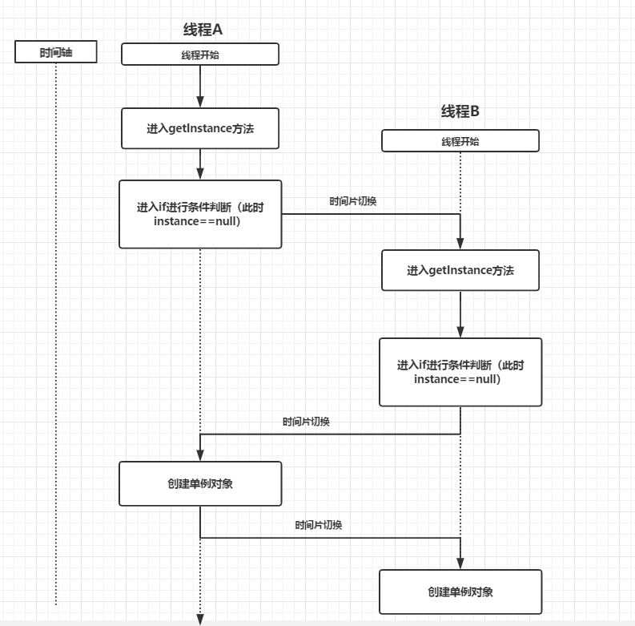

# 单例模式

单例模式，是一种常用的[软件设计](https://baike.baidu.com/item/软件设计/10170122)模式。在它的核心结构中只包含一个被称为单例的特殊类。通过单例模式可以保证系统中，应用该模式的一个类只有一个实例。即一个类只有一个对象实例。<!--more-->

## **1. 饿汉式**

所谓的饿汉式和懒汉式所指的是单例对象的创建时机，饿汉式是在这个单例类被加载进JVM时就创建单例对象；而懒汉式的单例类即便是被加载进JVM后也不会创建单例对象，而是在用户第一获取单例对象时才创建单例对象。

```java
/**
 * 饿汉式
 *
 * 缺点：只要这个类被加载进JVM，那么这个单例对象就会被创建，在很多时候我们需要在第一次使用时创建这个单例对象，从而节省内存开销
 **/
public class Singleton1 {
    private static Singleton1 instance = new Singleton1();

    public static Singleton1 getInstance() {
        return instance;
    }

    private Singleton1() {

    }
}

```


## **2. 懒汉式**

```java
/**
 * 懒汉式
 * 缺点，在并发环境下，线程不安全
 **/
public class Singleton2 {
    private static Singleton2 instance = null;

    private Singleton2() {
    }

    public static Singleton2 getInstance() {
        if (instance == null) {
            instance=new Singleton2();
        }
        return instance;
    }
}
```

这是懒汉式单例最简单的写法，但是在生产过程中不会使用，因为上述代码存在线程安全问题。



在上图中，如果两个线程同时调用`getInstance`方法,由于线程调度问题有可能两个线程都能通过`if( instance==null )`的校验，此时两个线程都能创建一个实例这就破坏了单例规则。

### **3. 线程安全版**

```java
/**
 * 懒汉式(方法同步)
 * 优点：解决了Singleton2中线程不安全的问题
 * 缺点：由于使用synchronized的关键字，所以性能不佳
 **/
public class Singleton3 {
    private static Singleton3 instance = null;

    private Singleton3() {
    }

    public static synchronized Singleton3 getInstance() {
        if (instance == null) {
            instance=new Singleton3();
        }
        return instance;
    }
}
```

但是如果采用上面那种写法，每次调用`getInstance`方法时都会尝试获取锁，会严重影响性能。通常情况下我们会采用双重校验锁的形式完成懒汉式单例：

```java
/**
 * 懒汉式(方法同步)
 * 优点：解决了Singleton2中线程不安全的问题
 * 缺点：由于使用synchronized的关键字，所以性能不佳
 **/
public class Singleton3 {
    private static volatile Singleton3 instance = null;//volatile是防止第一次创建时单例对象时发生指令重排，这样其他线程可能会拿到未初始化的对象

    private Singleton3() {
    }

    public static synchronized Singleton3 getInstance() {
        if (instance == null) {
            synchronized (Singleton3.class){
                if (instance==null) {
                    instance=new Singleton3();
                }
            }
        }
        return instance;
    }
}
```


## **4. 静态内部类形式**

在懒汉式中虽然解决了饿汉式中内存占用问题，但是由于需要保证线程安全需要用`synchronized`关键字修饰，这就导致这种方式的单例模式在性能上达不到最佳，那么我们利用静态内部类的加载机制，可以达到懒汉式的效果，并且不用担心线程安全问题。

```java
/**
 * 静态内部类完成单例模式
 *
 * 优点：既保证了线程安全，又解决了性能问题
 *
 * 在类加载器加载Singleton4时并不会加载LazyHolder内部类，只有在调用getInstance
 * 方法时才会加载LazyHolder类，从而创建单例的Singleton4
 **/
public class Singleton4 {
    private static Singleton4 instance = null;

    private static class LazyHolder {
        private static final Singleton4 singleton4 = new Singleton4();
    }
    private Singleton4() { }

    public static Singleton4 getInstance() {
        return LazyHolder.singleton4;
    }
}

```

