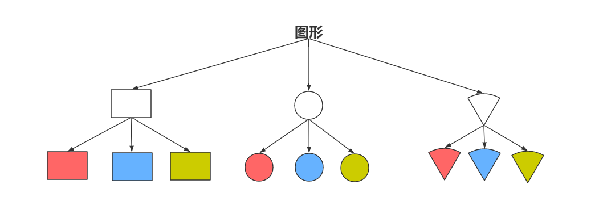
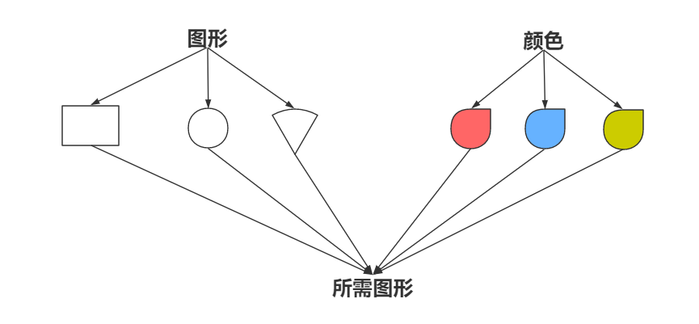

# 桥接模式

设想如果要绘制矩形、圆形、扇形我们至少需要4个形状类，但是如果绘制的图形需要具有不同的颜色，如红色、蓝色、绿色等，此时至少有如下两种设计方案：

方案一：为每一种形状都提供一套各种颜色的版本。



方案二：根据实际需要对形状和颜色进行组合。



对于有两个变化维度（即两个变化的原因）的系统，采用方案二来进行设计系统中类的个数更少，且系统扩展更为方便。设计方案二即是桥接模式的应用。桥接模式将继承关系转换为关联关系，从而降低了类与类之间的耦合，减少了代码编写量。

## 模式定义

理解桥接模式，重点需要理解如何将抽象化(Abstraction)与实现化(Implementation)解耦，使得二者可以独立地变化。

- 抽象化：抽象化就是忽略一些信息，把不同的实体当作同样的实体对待。在面向对象中，将对象的共同性质抽取出来形成类的过程即为抽象化的过程。

- 实现化：针对抽象化给出的具体实现，就是实现化，抽象化与实现化是一对互逆的概念，实现化产生的对象比抽象化更具体，是对抽象化事物的进一步具体化的产物。

- 解耦：解耦就是将抽象化和实现化之间的耦合解脱开，或者说是将它们之间的强关联改换成弱关联，将两个角色之间的继承关系改为关联关系。桥接模式中的所谓脱耦，就是指在一个软件系统的抽象化和实现化之间使用关联关系（组合或者聚合关系）而不是继承关系，从而使两者可以相对独立地变化，这就是桥接模式的用意。

典型的实现类接口代码：

```java
public interface Implementor{
    public void operationImpl();
} 
```

典型的抽象类代码：

```java
public abstract class Abstraction{
    protected Implementor impl;
    
    public void setImpl(Implementor impl)
    {
        this.impl=impl;
    }
    
    public abstract void operation();
} 
```

典型的扩充抽象类代码:

```java
public class RefinedAbstraction extends Abstraction
{
    public void operation()
    {
        //代码
        impl.operationImpl();
        //代码
    }
}
```

## 实例与解析

现需要提供大中小3种型号（粗细度）的画笔，能够绘制5种不同颜色，如果使用蜡笔，我们需要准备3*5=15支蜡笔，也就是说必须准备15个具体的蜡笔类。而如果使用毛笔的话，只需要3种型号的毛笔，外加5个颜料盒，用3+5=8个类就可以实现15支蜡笔的功能。本实例使用桥接模式来模拟毛笔的使用过程。


实例代码：

```java
//抽象类
public abstract class Pen
{
    protected Color color;
    public void setColor(Color color)
    {
        this.color=color;
    }
    public abstract void draw(String name);
} 
```

```java
//扩充抽象类
public class SmallPen extends Pen
{
    public void draw(String name)
    {
        String penType="小号毛笔绘制";
        this.color.bepaint(penType,name);            
    }    
}

//扩充抽象类
public class MiddlePen extends Pen
{
    public void draw(String name)
    {
        String penType="中号毛笔绘制";
        this.color.bepaint(penType,name);            
    }    
}

//扩充抽象类
public class BigPen extends Pen
{
    public void draw(String name)
    {
        String penType="大号毛笔绘制";
        this.color.bepaint(penType,name);            
    }    
}
```

```java
//实现类接口
public interface Color
{
    void bepaint(String penType,String name);
}

//扩充实现类
public class Red implements Color
{
    public void bepaint(String penType,String name)
    {
        System.out.println(penType + "红色的"+ name + ".");
    }
}

//扩充实现类
public class Green implements Color
{
    public void bepaint(String penType,String name)
    {
        System.out.println(penType + "绿色的"+ name + ".");
    }
}

....其他颜色省略
```

```java
public class Client
{
    public static void main(String a[])
    {
        Color color = new Red();
        Pen pen = new BigPen();
        pen.setColor(color);

        pen.draw("鲜花");
    }
}
```


## 模式的优缺点

**优点**

- 分离抽象接口及其实现部分。

- 桥接模式有时类似于多继承方案，但是多继承方案违背了类的单一职责原则（即一个类只有一个变化的原因），复用性比较差，而且多继承结构中类的个数非常庞大，桥接模式是比多继承方案更好的解决方法。

- 桥接模式提高了系统的可扩充性，在两个变化维度中任意扩展一个维度，都不需要修改原有系统。

- 实现细节对客户透明，可以对用户隐藏实现细节。

**缺点**

- 桥接模式的引入会增加系统的理解与设计难度，由于聚合关联关系建立在抽象层，要求开发者针对抽象进行设计与编程。

- 桥接模式要求正确识别出系统中两个独立变化的维度，因此其使用范围具有一定的局限性。


文章参考至 [https://www.cnblogs.com/WindSun/p/10260547.html](https://www.cnblogs.com/WindSun/p/10260547.html)