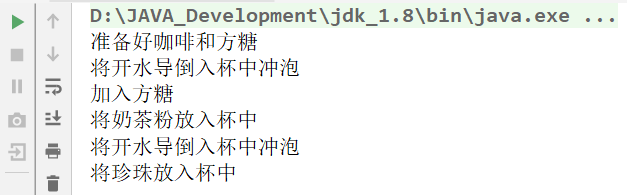

# 模板方法模式

在日常生活中，我们去银行办理业务一般要经过以下4个流程：取号、排队、办理具体业务、对银行工作人员进行评分等，其中取号、排队和对银行工作人员进行评分的业务对每个客户是一样的，可以在父类中实现，但是办理具体业务却因人而异，它可能是存款、取款或者转账等，可以延迟到子类中实现。

​	这样的例子在生活中还有很多，例如，一个人每天会起床、吃饭、做事、睡觉等，其中“做事”的内容每天可能不同。我们把这些规定了流程或格式的实例定义成模板，允许使用者根据自己的需求去更新它，例如，简历模板、论文模板、Word 中模板文件等。

## **模板模式的代码示例**

在下列代码中我们将模拟"奶茶"和“咖啡”的冲泡过程，我们冲泡饮品的过程可以简化为一个公有的模板：

- 第一步：将原料放入杯中
- 第二步：导入开水进行冲泡
- 第三步：放入辅料

### **定义饮料模板类：**

```java
public abstract class BeverageTemplate {

    /**
    * 饮料冲泡的具体流程
    **/
    public final void createBeverage() {
        step1();
        step2();
        step3();
    }

    /**
     * 将原料放入杯中（由于不同的饮料需要放入的原料不一样，所以这个步骤我们放在子类中执行）
     */
    public abstract void step1();


    public void step2() {
        System.out.println("将开水导倒入杯中冲泡");
    }

    /**
     * 加入辅料（由于不同的饮料需要放入的辅料不一样，所以这个步骤我们放在子类中执行）
     */
    public abstract void step3();
}

```

**需要注意的是，我们将createBeverage这个方法称为“模板”方法，因为它内部调用了很多还未实现的方法**。

### **定义奶茶类：**

```java
public class Cofee extends  BeverageTemplate {
    @Override
    public void step1() {
        System.out.println("准备好咖啡和方糖");
    }

    @Override
    public void step3() {
        System.out.println("加入方糖");
    }
}
```

### **定义咖啡类：**

```java
public class MilkTea extends BeverageTemplate {
    @Override
    public void step1() {
        System.out.println("将奶茶粉放入杯中");
    }

    @Override
    public void step3() {
        System.out.println("将珍珠放入杯中");
    }
}
```

### **测试：**

```java
public class TemplatePatternTest {
    public static void main(String[] args) {
        //我们冲泡一杯咖啡
        new Cofee().createBeverage();

        //冲泡一杯奶茶
        new MilkTea().createBeverage();
    }
}
```




## **总结**

**模板模式的意图：**定义一个操作中的算法的骨架，而将一些步骤延迟到子类中。模板方法使得子类可以不改变一个算法的结构即可重定义该算法的某些特定步骤。

**主要解决：**一些方法通用，却在每一个子类都重新写了这一方法。

