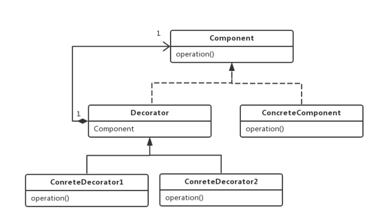
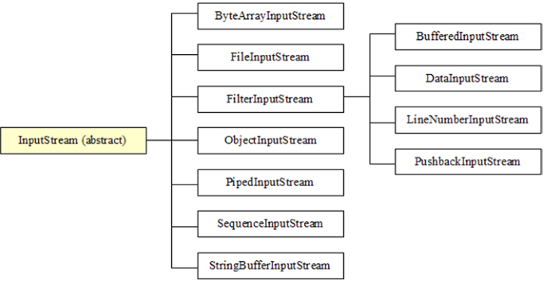

# 装饰器模式

装饰器模式（Decorator Pattern）允许向一个现有的对象添加新的功能，是一种用于代替继承的技术，无需通过继承增加子类就能扩展对象的新功能。使用对象的关联关系代替继承关系，更加灵活，同时避免类型体系的快速膨胀。

## 装饰器模式组件

- 组件(Component)：组件接口定义了全部组件类和装饰器实现的行为；
- 组件实现类(ConcreteComponent)：实现Component接口，组件实现类就是被装饰器装饰的原始对象，新功能或者附加功能都是通过装饰器添加到该类的对象上的；
- 装饰器抽象类(Decorator)：实现Component接口的抽象类，在其中封装了一个Component 对象，也就是被装饰的对象；
- 具体装饰器类(ConcreteDecorator)：该实现类要向被装饰的对象添加某些功能；



## 装饰器模式案例

假定我们有一个苹果的包装盒，但是客户对包装有不同的需求，有的客户需要对包装盒加固，有的客户需要在包装盒上贴上防伪标识，有的客户需要加急功能。不同的用户需要这三种功能的不同组合，我们此时就可以使用装饰器模式。

```java
public interface Bag {
    void pack();
}
```

```java
public class BagDecorator implements Bag {
    private Bag bag;  //维持一个对抽象构件对象的引用

    public BagDecorator(Bag bag)  //注入一个抽象构件类型的对象
    {
        this.bag = bag;
    }

    public void pack() {
        bag.pack();
    }
}
```

```java
public class CheckedBagDecorator extends BagDecorator {
    public CheckedBagDecorator(Bag bag) {
        super(bag);
    }

    public void pack() {
        super.pack();  //调用原有业务方法
        checked();  //打印防伪标识
    }

    //增加防伪标识
    public void checked() {
        System.out.println("------");
        System.out.println("打印上防伪标识");
    }
}
```

```java
public class ReinforceBagDecorator extends BagDecorator {
    public ReinforceBagDecorator(Bag bag) {
        super(bag);
    }

    public void pack() {
        super.pack();  //调用原有业务方法
        reinforce();
    }

    //加固包装
    public void reinforce() {
        System.out.println("------");
        System.out.println("加固了包装");
    }
}
```

````java
public class SpeedDecorator extends BagDecorator {
    public SpeedDecorator(Bag bag) {
        super(bag);
    }

    public void pack() {
        super.pack();  //调用原有业务方法
        speedy();
    }

    //快件加急
    public void speedy() {
        System.out.println("------");
        System.out.println("打上加急标识");
    }
}
````

测试类：

```java
public class DecoratorClient {
    public static void main(String[] args){
        Bag bag = new AppleBag();//创建苹果包装
        bag = new CheckedBagDecorator(bag);//防伪功能
        bag = new ReinforceBagDecorator(bag);//加固功能
        bag = new SpeedDecorator(bag);//加急功能
        
        bag.pack();//打包操作
    }
}
```


## Java中装饰器模式实例

在Java中输入输出流是典型的装饰器模式。



以InputStream为例，它是一个抽象类:

```java
public abstract class InputStream implements Closeable {
    ...
    ...
}
```

并定义有抽象方法:

```java
public abstract int read() throws IOException;
```

该抽象方法由具体的子类去实现，通过InputStream的族谱图可以看到，直接继承了InputStream，并且提供某一特定功能的子类有：

- ByteArrayInputStream
- FileInputStream
- ObjectInputStream
- PipedInputStream
- SequenceInputStream
- StringBufferInputStream

这些子类都具有特定的功能，比如说，FileInputStream代表一个文件输入流并提供读取文件内容的功能，ObjectInputStream提供了对象反序列化的功能。

InputStream这个抽象类有一个子类与上述其它子类非常不同，这个子类就是**FilterInputStream**，可参见上图中的InputStream族谱图。它就是装饰器模式中的Decorator（装饰器抽象类）。

翻开FilterInputStream的代码，我们可以看到，它内部又维护了一个InputStream的成员对象，并且它的所有方法，都是调用这个成员对象的同名方法。换句话说，FilterInputStream它什么事都不做。就是把调用委托给内部的InputStream成员对象。如下所示:

```java
public class FilterInputStream extends InputStream {
    protected volatile InputStream in;
    
    protected FilterInputStream(InputStream in) {
        this.in = in;
    }
    
    public int read() throws IOException {
        return in.read();
    }
    
    public int read(byte b[]) throws IOException {
        return read(b, 0, b.length);
    }
    
    public int read(byte b[], int off, int len) throws IOException {
        return in.read(b, off, len);
    }
    
    public long skip(long n) throws IOException {
        return in.skip(n);
    }
    
    public int available() throws IOException {
        return in.available();
    }
    
    public void close() throws IOException {
        in.close();
    }
    
    public synchronized void mark(int readlimit) {
        in.mark(readlimit);
    }

    public synchronized void reset() throws IOException {
        in.reset();
    }
    
    public boolean markSupported() {
        return in.markSupported();
    }
```

FilterInputStream的又有其子类，这些子类就是我们所说的装饰器，分别是：

- BufferedInputStream
- DataInputStream
- LineNumberInputStream
- PushbackInputStream

虽然从上面代码看FilterInputStream并没有做什么有卵用的事，但是它的子类可不同了，以BufferedInputStream为例，这个类提供了提前读取数据的功能，也就是缓冲的功能。可以看看它的read方法：

```java
public synchronized int read() throws IOException {
    if (pos >= count) {
        fill();
        if (pos >= count)
            return -1;
    }
    return getBufIfOpen()[pos++] & 0xff;
}
```

可以看到，当pos>=count时，意即需要提前缓冲一些数据的时候到了，那么就会调用fill()将缓冲区加满，以便后续读取。由于本文只讨论IO流的装饰器模式，所以关于具体实现细节将不会展开讨论，比如本文不会讨论fill()方法是如何实现的，在这里可以先将它当做一个黑盒子。

从这里可以开始感受到，BufferedInputStream就是一个装饰者，它能为一个原本没有缓冲功能的InputStream添加上缓冲的功能。

比如我们常用的FileInputStream，它并没有缓冲功能，我们每次调用read，都会向操作系统发起调用索要数据。假如我们通过BufferedInputStream来**装饰**它，那么每次调用read，会预先向操作系统多拿一些数据，这样就不知不觉中提高了程序的性能。如以下代码所示：

```java
BufferedInputStream bis = new BufferedInputStream(new FileInputStream(new File("/home/user/abc.txt")));
```

同理，对于其它的FilterInputStream的子类，其作用也是一样的，那就是装饰一个InputStream，为它添加它原本不具有的功能。OutputStream以及家属对于装饰器模式的体现，也以此类推。

JDK中的io流的设计是设计模式中装饰器模式的一个经典示范，如果细心发现，JDK中还有许多其它设计模式的体现，比如说监听者模式等等。


