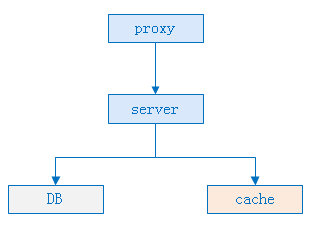
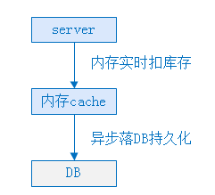
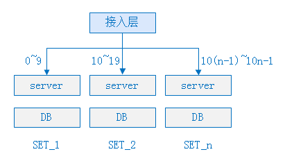
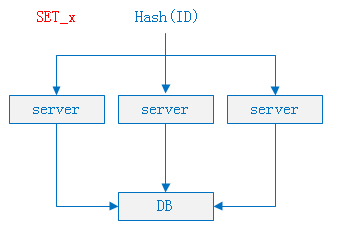
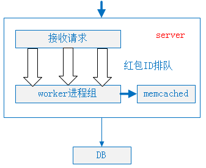

# 超大并发量红包系统设计

> [微信高并发资金交易系统设计方案-----百亿红包背后的技术支撑 | Hexo (melonshell.github.io)](https://melonshell.github.io/2020/01/23/tech2_wx_red_packet/)

## 一. 背景介绍

2017年1月28日正月初一，微信公布了用户在除夕当天收发微信红包的数量为142亿个，而其收发峰值已达到76万每秒。百亿级别的红包，如何保障并发性能与资金安全？面对挑战，微信红包在分析了业界"秒杀"系统解决方案的基础上，采用了SET化、请求排队串行化、双维度分库表等设计，形成了独特的高并发、资金安全系统解决方案。实践证明，该方案表现稳定，且实现了除夕夜系统零故障运行。

本文将为读者介绍百亿级别红包背后的系统高并发设计方案，包括微信红包的两大业务特点、微信红包系统的技术难点、解决高并发问题通常使用的方案，以及微信红包系统的高并发解决方案。

## 二. 微信红包的两大业务特点

微信红包，特别是群红包，业务形态上类似于普通商品的"秒杀"活动。
用户在微信群发一个红包，等同于普通商品"秒杀"活动的商品上架，微信群里的所有用户抢红包动作，等同于"秒杀"活动中的查询库存，用户抢到红包后拆红包的动作，则对应"秒杀"活动中用户的"秒杀"动作。

微信红包在业务形态上和普通商品"秒杀"活动相比，还有自身特点：

- 微信红包业务比普通商品"秒杀"活动有更海量的并发请求；
  微信红包用户在微信群发一个红包，等同于在网上发布一次商品"秒杀"活动，假设同时有10万个群的用户同时发红包，那就相当于同一时间有10万个"秒杀"活动发布。10万个微信群的用户同时抢红包，将产生海量并发请求。

- 微信红包业务要求更严格的安全级别；
  微信红包业务本质上是资金交易，微信红包是微信支付的一个商户，提供资金流转服务，用户发红包相当于在微信红包这个商户上使用微信支付购买了一笔"钱"，且收货地址是微信群。当用户支付成功后，红包"发货"到微信群里，群里的用户拆开红包后，微信红包提供了将"钱"转入拆红包用户微信零钱的服务。

  资金交易业务比普通商品"秒杀"有更高的安全级别要求，普通的商品"秒杀"由商户提供，库存是商户预设，"秒杀"允许存在超卖和少卖的情况，但对于微信红包，用户发100元的红包绝对不可以拆出101元，以及只被领取99元时，剩下的1元在24小时过期后要精准退还给发红包用户。

## 三. 微信红包的技术难点

首先介绍下典型的"秒杀"系统架构设计：

秒杀系统由接入层、逻辑服务层、存储层和缓存构成。Proxy处理请求接入，Server主要承载业务逻辑，Cache用户缓存库存数量，DB则用于数据持久化。

一个秒杀活动对应DB中的一条库存记录，当用户进行商品秒杀时，系统的主要逻辑在于DB中库存操作上，一般来说，对DB操作的流程有以下三步：

- 锁库存
- 插入秒杀记录
- 更新库存

其中，锁库存是为了避免并发请求时出现超卖情况，同时要求这三步操作需要在一个事务中完成。秒杀系统的设计难点就在事务操作上，商品库存在DB中记为一行，大量用户同时秒杀同一商品时，第一个到达DB的请求锁住了这行库存记录，在第一个事务完成提交前，这个锁一直被第一个请求占用，后面的所有请求需要排队等待，同时参与秒杀的用户越多，并发进DB的请求越多，请求排队越严重。因此，并发请求抢锁是典型的商品秒杀系统的设计难点。

微信红包业务相比普通商品秒杀活动，具有海量并发、高安全级别特点，在微信红包系统的设计上，除了并发请求抢锁之外，还有以下两个难点：

- 事务级操作量大。普遍情况下会同时有数以万计的微信群在发红包，这个业务特点反映到微信红包系统设计上，就是数以万计的并发请求抢锁同时进行，这使得DB的压力比普通单个商品库存被锁要大很多倍。
- 事务性要求严格。微信红包本质上是一个资金交易系统，相比普通商品秒杀有更高的事务级别要求。

## 四. 解决高并发常用方案

普通商品秒杀系统，解决高并发问题的方案，大致有以下几种：

### 4.1 使用内存替代实时的DB事务操作

将实时扣库存的行为上移到内存Cache中，内存Cache操作成功直接给Server返回成功，然后异步落DB持久化。

该方案优点是用内存操作替代磁盘操作，提高了并发性能，但是缺点也很明显，在内存操作成功DB持久化失败，或者内存Cache故障的情况下，DB持久化会丢数据，不适合微信红包这种资金交易系统。

### 4.2 使用乐观锁替代悲观锁

悲观锁，指关系数据库并发控制的方法，它可以阻止一个事务以影响其他用户的方式修改数据。如果一个事务执行的操作对某行数据加了锁，那只有当这个事务将锁释放，其他事务才能够执行与该锁冲突的操作，对应于上文分析中的并发请求抢锁行为。

乐观锁，假设多用户并发的事务在处理时不会相互影响，各事务能够在不产生锁的情况下处理各自影响的那部分数据。在提交数据更新之前，每个事务会先检查在该事务读取数据后，有没有其他事务修改了数据，如果其他事务有修改，正在提交的事务会进行回滚。

商品秒杀系统中，乐观锁的具体应用方法是在DB的库存记录中维护一个版本号，在更新库存的操作进行前，先去DB获取当前版本号，在更新库存的事务提交时，检查该版本号是否已被其他事务修改，如果版本号没有被修改，则提交事务，且版本号加1；如果版本号已经被其他事务修改，则回滚事务，并给上层报错。

这个方案解决了并发请求抢锁的问题，可以提高DB的并发处理能力，但是如果应用于微信红包系统，则会存在下面三个问题：

- 如果拆红包采用乐观锁，那么在并发抢到相同版本号的拆红包请求中，只有一个能拆红包成功，其他的请求将事务回滚并返回失败，给用户报错，用户体验完全不可接受；
- 如果采用乐观锁，将会导致第一时间同时拆红包的用户有一部分直接返回失败，反而那些"手慢"的用户，有可能因为并发减小后拆红包成功，这会带来用户体验上的负面影响；
- 如果采用乐观锁的方式，会带来大量的无效更新请求、事务回滚，给DB造成不必要的额外压力；

基于以上原因，微信红包系统不能采用乐观锁的方式解决并发抢锁问题。

## 五. 微信红包高并发解决方案

### 5.1 系统垂直SET化，分而治之

微信红包用户发一个红包时，微信红包系统生成一个ID作为这个红包的唯一标识，接下来这个红包的发、抢、拆、查等操作都和此ID关联。红包系统根据这个ID，按一定的规则(如按ID尾号取模)，垂直上下切分，切分后一个垂直链条上的逻辑server服务器，DB统一称为一个SET。各个SET间相互独立，相互解耦，且同一个红包ID的所有请求均路由到同一个SET内处理，高度内聚。通过这样的方式，系统将所有红包请求分散为多部分，互不影响，分而治之：

此方案解决了同时存在海量事务级操作的问题，化海量为小量。

### 5.2 逻辑server层将请求排队，解决DB并发问题

红包系统是资金交易系统，DB操作的事务性无法避免，所以会存在并发抢锁问题，但是如果到达DB的事务操作(拆红包行为)不是并发的，而是串行，则不会存在并发抢锁的问题。

按照这个思路，为了是拆红包的事务操作串行地进入DB，只需将请求在server层以FIFO的方式排队，就可以达到此效果，从而问题就集中到server的FIFO队列设计上，具体实现如下：

**同一个红包ID的所有请求路由到同一台server**；

上面SET化方案已经介绍，同个红包ID的所有请求，按红包ID路由到同个SET中，不过在同个SET中，会存在多台server，服务器同时连接同一个DB(基于容灾、性能考虑，均衡压力)。为了使同一个红包ID的所有请求路由到同一台server服务器，在SET化的设计之外微信红包系统添加了一层基于红包ID hash值的路由：

**设计单机请求排队方案**

将路由到同一台server上的所有请求被进程接收后，按红包ID排队，串行地进入worker进程执行，从而达到排队效果：

**增加memcached控制并发**

为防止server中的请求队列过载导致队列被降级，从而所有请求涌进DB，系统增加了与server服务器同机部署的memcached，用于控制拆同一个红包的请求并发数。

具体来说，利用memcached的CAS原子增操作，控制同时进入DB执行拆红包事务的请求数，超过预先设定数值则直接拒绝服务，用于DB负载升高时的降级体验。

### 5.3 双维度库表设计，保障系统性能稳定

红包系统的分库表规则，初期是根据红包ID的hash值分为多库多表，随着红包数据量逐渐增大，单边数据量逐渐增加，而DB性能与单表数据量有一定相关性，当单表数据量达到一定程度时，DB性能会大幅度下降。采用冷热分离，将历史冷数据与当前热数据分开存储，可以解决这个问题。

处理微信红包数据的冷热分离时，系统在以红包ID维度分库表的基础上，增加了以循环天分表的维度，形成了双维度分库表的特色。具体来说，就是分库表规则像 `db_xx.t_y_dd` 设计，其中xx/y是红包ID的hash值后三位，dd的取值范围在1~31，代表一个月天数最多31天。

通过这种双维度分库表方式，解决了DB单表数据量膨胀导致性能下降的问题，保障了系统的稳定性，同时由于热冷分离，又使得数据搬迁变得简单而优雅。综上所述，微信红包系统在解决高并发问题上的设计，主要采用了SET分治、请求排队、双维度分库表等方案，使得单DB的并发性能提升了8倍左右，取得了很好的效果。