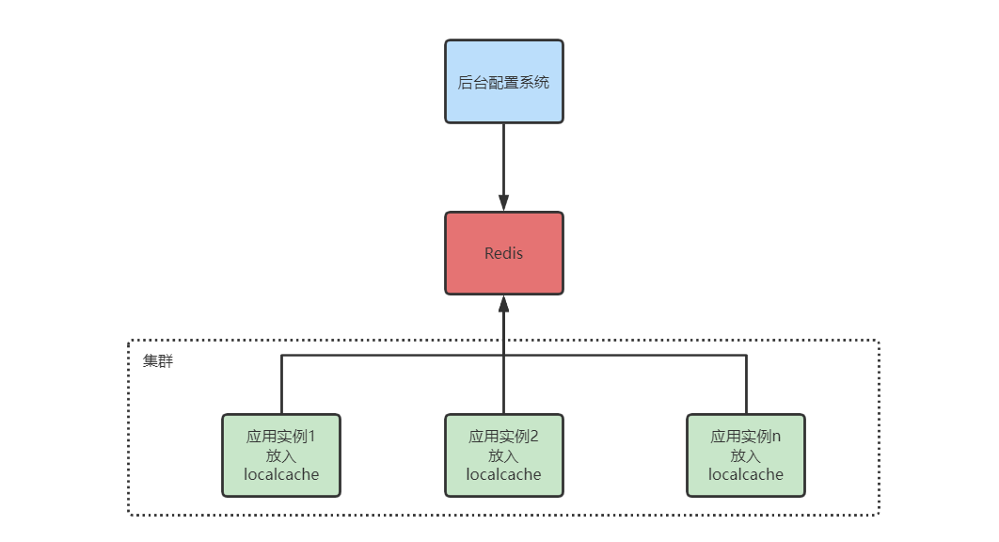
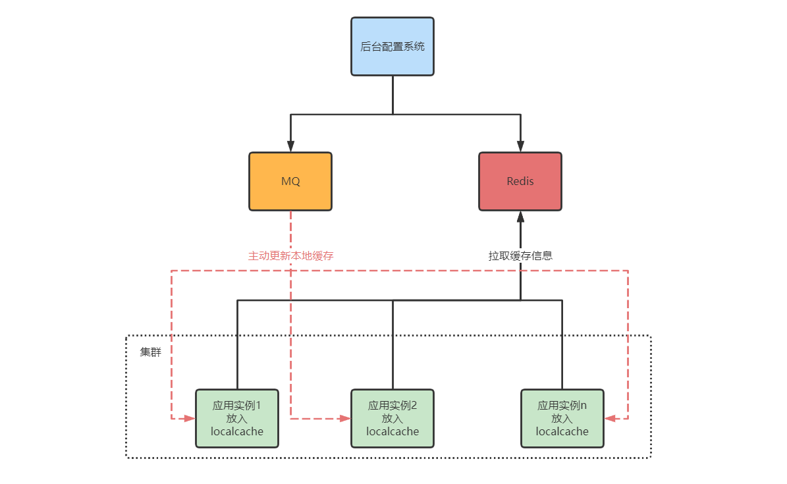

# 超大规模流量热点key读问题解决思路

在程序中使用缓存技术，不仅能够提升系统整体的响应速度，还能在一定程度上有效降低关系数据库的负载压力。尽管对 Redis 进行 Cluster后可以理论上认为容量是可以无限延伸的，并且数据的读/写操作经过了水平化处理，不同的key均会落到不同的缓存节点上，以此避免所有的用户流量都集中落到同一个缓存节点上。但是对于限时抢购场景下的热卖商品来说，由于单价比平时更给力、更具吸引力，那么自然会比平时吸引更大的流量进来，这时**同一个key必然会落到同一个缓存节点上，因此分布式缓存在这种情况下一定会出现单点瓶颈**。

笔者举一个贴近生活的例子，某明星出轨的消息很容易引爆流量，有可能随着事件的发酵会在接下来的一周内稳坐各大新闻版面头条。单从技术细节上来分析，假设这条消息存储在分布式缓存中，但由于消息是缓存在固定的 Slot 上的，尽管缓存系统单点支撑 10w/s 的 QPS 没有任何压力，但是在短短几分钟内，光是用户留言就达到了上百万条，更别说是阅读这条消息时所产生的流量，因此分布式缓存的单点容量容易瞬间被撑爆，导致资源连接耗尽。为了解决分布式缓存存在的单点瓶颈，我们通常可以通过以下两种方案去解决：

- 多级缓存方案
- Redis Cluster模式一主多从读/写分离方案

## 一. 多级缓存方案

结合二八定律来看，限时抢购场景下的读操作比例一定会远远大过于写操作，毕竟热卖商品库存是相对有限的。当分布式缓存因热点问题导致出现单点瓶颈时，本地缓存就可以派得上用场了，笔者在生产环境中正是结合本地缓存+分布式缓存组合实现的多级缓存方案来共同应对限时抢购场景下同一热卖商品的高并发读难题：

对于分布式缓存而言，在数据的分布和用户的访问请求都是相对均匀的情况下，我们确实可以通过扩容集群节点就能够无限延伸分布式缓存的整体容量，但是当出现热点问题，流量访问相对集中时，再通过水平扩容缓存节点则无法有效应对，而本地缓存却非常适合这样的业务场景。由于本地缓存分布在各个WebServer节点中，接入层的负载均衡策略可以确保用户的访问请求相对均匀，这样一来，WebServer的节点越多，系统整体的QPS就越强，那么自然也就不存在所谓的热点问题了。在此大家需要注意，由于本地缓存会共享同一个JVM 进程内的Heap 空间，为了避免本地缓存占用过多的内存资源从而导致程序在运行的过程中抛出 `java.lang.OutOfMemoryError` 异常，所以笔者不建议把所有的商品信息都缓存在本地缓存中。例如，访问热度不高的商品可以直接访问分布式缓存，而本地缓存中存储更多的是访问热度较高的热卖商品。对于商品数据，我们需要根据其类型有针对性地配置本地缓存的更新策略。例如，由于商品的图片、视频等资源都缓存在CDN中，因此本地缓存中理论上只需要缓存以下两类数据：

- 商品详情数据
- 商品详情数据

像商品详情这类变化频率较低的数据，一般在限时抢购活动开始之前就可以全量推送到所有参与限时抢购 WebServer 节点的本地缓存中，直至活动结束。当然，由于我们不可能保证商品详情数据自始至终都不会发生变化，所以针对这类数据可以设置较长的缓存过期时间。

但是像商品库存这类数据却变化得非常频繁，自然也就需要将缓存的过期时间设置得相对短一些，一般几秒后就可以从分布式缓存中获取最新的库存数据。当大家看到这里时是否会产生一个疑问，本地缓存中存储的商品库存与实际商品库存之间可能会因为时差而造成数据的不一致，这样是否会导致超卖？对于读场景而言，其实完全可以接受在一定程度上出现数据脏读，因为这只会导致一些原本已经没有库存的少量下单请求误以为还有库存而已，等到最终扣减库存时再提示用户所购买的商品已经售罄即可（实际上，接入层 Nginx 中也可以再缓存一份下游商品详情接口的数据，不过其过期时间务必要小于本地缓存所设置的过期时间，尽可能将流量挡在系统上游）。

### 1.1 更新策略

在实施多级缓存方案时，本地缓存更新策略的选择也是非常重要的，通常来说，本地缓存的更新策略可以分为如下两类：

- 被动更新
- 主动更新

被动更新策略，简单来说，就是在单位时间内如果缓存项发生过期，则重新执行回源操作。在此大家需要注意，在执行回源操作期间，务必确保单机只能够允许一个线程在执行操作。

如果想缩短本地缓存与分布式缓存之间数据不一致的窗口期，本书还提供另一种本地缓存更新策略，那就是基于消息队列的主动更新策略。在我们通过后台配置管理系统或者商品服务修改了分布式缓存中的商品数据后，再把消息异步写入到消息队列中，这样一来，所有订阅了目标Topic的消费者就都可以消费最新的商品数据并更新本地缓存项。但实施此方案会相对复杂一些，而且由于引入了消息队列，还需要增加额外的工作成本和系统宕机风险。

### 1.2 缓存穿透的思考

由于SKU非常多，因此任何一个电商平台几乎都不会把所有的商品数据全量存储在本地缓存中，只会对热点数据做优化。当我们使用多级缓存方案解决分布式缓存存在的单点问题时，就会面临一个问题，那就是如何配置热点key？笔者建议将热点key存放在配置中心内，便于管理。不过，在大促活动开始前，开发人员需要从运营同学那里提前获悉所有热卖商品的热点key，否则一切都是徒劳的。

当大促活动开始后，如果已经成功配置好了本地缓存，那么分布式缓存的单点负载将会处于一个相对比较平稳的水位。在此大家需要注意，任何事情都不会一帆风顺，暴风雨的来临总是悄无声息的。热卖商品尽管可以在活动开始前就提前分析出来，并由运营人员交给开发人员进行配置，但是那些提前发现不了并突然成为热点的数据，以及被热点数据瞬间附带起来的流量似乎就成了漏网之鱼。对于这种在运行时突然形成的热点

往往会令架构师们束手无策，所以我们需要认真思考如何防止本地缓存发生穿透，避免系统产生雪崩效应。

目前，一些大型的互联网电商企业内部往往都搭建有适用于自身业务特点的热点自动发现平台。简单来说，就是将交易系统产生的相关数据，以及在上游系统中埋点上报的相关数据异步写入到日志系统中，然后通过热点自动发现平台对收集到的日志数据做调用次数统计和热点分析，如果确诊为热点数据，就立即通知交易系统做好热点保护，防患于未然。尽管热点自动发现平台能够很好地在运行期自动探测热点，以及实施热点保护，但如果处于流量高峰期，由于存在滞后性问题，可能还未来得及对交易系统做好保护就已经发生缓存穿透了。接下来，笔者就为大家分享实际开发过程中针对本地缓存穿透的相关解决方案。

## 二. Redis Cluster 模式下的读写分离方案

解决本地缓存穿透最好的方式，就是不解决。或许，这句话可能并不是很好理解，如果不解决，那岂不是要眼睁睁看着系统发生雪崩嘛？其实不是这样的，所谓的不解决，并不是说真的不解决，而是换一种方式，无须关心运行期突然形成的热点数据，只要分布式缓存不会因为热点问题导致出现单点瓶颈，那么就可以通过水平扩容来无限延伸系统容量。或许大家会认为这与前文所述的内容存在矛盾，就是因为分布式缓存存在单点瓶颈，才衍生出了结合本地缓存的多级缓存方案，这又如何理解呢？不急，听笔者徐徐道来。

Redis 在 Cluster 模式下，提供有 Master/Slave 机制来保证HA（high availability），但 Slave 节点默认并不开放 read-only 操作，仅作为一个纯粹的 Standby 节点，因此当我们对 Slave节点发起请求时会自动重定向到对应的Master 节点上，这多多少少会存在一些资源浪费。实际上，电商平台有许多业务场景都需要通过读/写分离来提升性能，因此接下来笔者就为大家演示如何通过客户端来实现Cluster模式下的读/写分离功能。

目前市面上开源的诸多 Redis客户端，最常用的当属 Jedis，遗憾的是，Jedis 并不支持 Cluster 模式下的读/写分离功能，因此如果想要实现这套功能，则只能自行对其进行扩展。除 Jedis 外，在实际的开发过程中，笔者还推荐另一款实用的 Redis 客户端Lettuce。作为目前Spring Boot 2.x缺省的Redis客户端，Lettuce在易用性、可靠性等方面的表现是毋庸置疑的，它上层提供sync 和 async 两种模式，其底层采用的是基于 NIO 模型的 Netty 框架，所带来的好处就是，运维同学后续对服务节点进行扩/缩容时，不必再手动调整连接池 maxTotal 属性的值，因此从理论上来说，服务的横扩数量不再受限于底层的连接资源。当然最重要的是，Lettuce在 Cluster 模式下为开发人员提供了一套开箱即用的读/写分离方案，只需通过简单的设置即可，具体API不在本文讨论范畴。